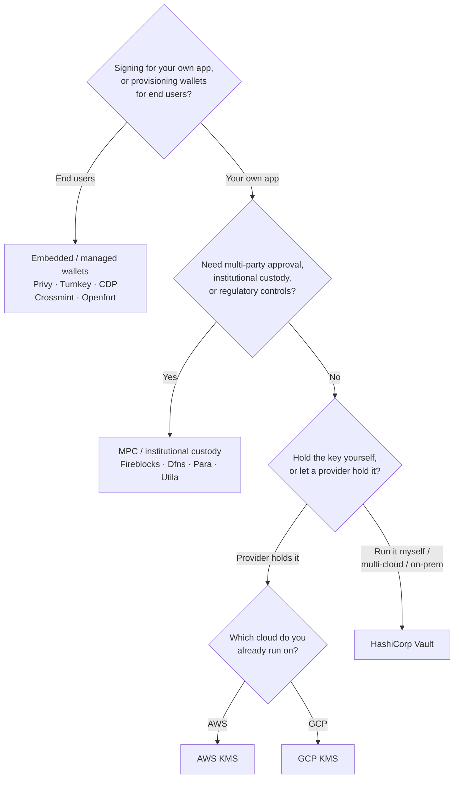

Keychain предоставляет единый интерфейс `SolanaSigner` для всех бэкендов,
поэтому выбор носит операционный, а не архитектурный характер — его можно
изменить позже через конфигурацию. Именно поэтому **начните с ваших требований,
а не с продукта.** Два вопроса решают большинство задач: _где хранится приватный
ключ и кому разрешено авторизовать подпись с его помощью?_

Не существует единственного лучшего бэкенда. Каждый из них лучше подходит для
определённого набора ограничений — облако, которое вы уже используете, желание
самостоятельно управлять ключевой инфраструктурой, а также требования к хранению
ключей и контролю подтверждений. Приведённая ниже схема сопоставляет эти
ограничения с конкретным бэкендом.

<Callout type="info">
  Это руководство охватывает подпись на стороне сервера (бэкенд). Когда конечные
  пользователи подписывают собственные транзакции в браузере, используйте
  кошелёк через Wallet Standard — см. [Подпись в
  продакшене](/docs/core/transactions/signing-in-production).
</Callout>

## Схема принятия решений

<Callout type="info">
  Для локальной разработки и тестов всё это не нужно — используйте бэкенд
  **Memory** для прототипирования, а затем переключитесь на один из
  перечисленных выше производственных бэкендов через конфигурацию.
</Callout>

## Разбор вопросов

<Steps>

<Step>

### Вы подписываете транзакции для собственного приложения или для ваших конечных пользователей?

Если вы предоставляете кошельки, которыми **конечные пользователи** владеют и
управляют (потребительские приложения, потоки онбординга), используйте бэкенд
**встроенного / управляемого кошелька** — Privy, Turnkey, CDP, Crossmint или
Openfort. Они управляют кошельками отдельных пользователей и аутентификацией от
вашего имени.

Если вы подписываете транзакции от имени **собственного приложения** —
плательщика комиссий, казначейства, бэкенд-автоматизации — продолжайте ниже.

</Step>

<Step>

### Требуется ли вам многостороннее согласование, институциональное хранение или регуляторный контроль?

Если подписи должны проходить через политику согласования, лимиты расходов или
комплаенс-процессы перед их созданием — либо вам необходим регулируемый
кастодиан для хранения ключей — используйте бэкенд **MPC / институционального
хранения**: Fireblocks, Dfns, Para или Utila. Они разделяют ключ или берут его
под хранение и совместно подписывают транзакции в соответствии с вашей
политикой.

Если вам нужен только ключ, подписывающий по запросу, продолжайте ниже.

</Step>

<Step>

### Вы хотите хранить ключ самостоятельно или доверить его провайдеру?

Если ключ должен храниться у облачного провайдера в аппаратно защищённой
инфраструктуре, а политика IAM определяет, кто может подписывать, используйте
KMS этого облака:

- **Работаете на AWS** → AWS KMS
- **Работаете на GCP** → GCP KMS

Если вы хотите самостоятельно управлять ключевой инфраструктурой — или
используете мультиоблачную среду либо on-prem — используйте **HashiCorp Vault**.
Вы самостоятельно запускаете и аудируете его; ключ остаётся внутри движка
Transit и подписывает по запросу.

</Step>

</Steps>

## Модели хранения

Бэкенды делятся на пять моделей хранения. Приведённая выше схема приведёт вас к
одной из них.

- **Самостоятельное хранение (в процессе)** — ваше приложение хранит приватный
  ключ напрямую. Удобно для разработки, но не подходит для продакшена. Бэкенд:
  **Memory**.
- **Самостоятельное управление ключами** — вы управляете ключевой
  инфраструктурой; ключ остаётся внутри неё и подписывает по запросу. Бэкенд:
  **HashiCorp Vault**.
- **Cloud KMS / HSM** — облачный провайдер хранит ключ в аппаратно защищённой
  инфраструктуре; ключ никогда не покидает сервис, а политика IAM определяет,
  кто может подписывать. Бэкенды: **AWS KMS**, **GCP KMS**.
- **MPC и институциональное хранение** — ключ разделён или передан под хранение
  провайдеру, который совместно подписывает транзакции согласно вашей политике
  (согласования, лимиты). Бэкенды: **Fireblocks**, **Dfns**, **Para**,
  **Utila**.
- **Встроенные и управляемые кошельки** — провайдер управляет кошельками от
  вашего имени, как правило для подключения конечных пользователей. Бэкенды:
  **Privy**, **Turnkey**, **CDP**, **Crossmint**, **Openfort**.

## Сравнение бэкендов

| Бэкенд          | Модель хранения                       | Лучше всего подходит для                                             | Примечания                                                  |
| --------------- | ------------------------------------- | -------------------------------------------------------------------- | ----------------------------------------------------------- |
| Memory          | Самостоятельное хранение (в процессе) | Локальная разработка, тесты, CI                                      | Сырой ключ в процессе — не использовать в продакшене        |
| HashiCorp Vault | Самостоятельное управление ключами    | Команды, использующие собственную инфраструктуру ключей              | Transit engine; вы сами управляете и проводите аудит        |
| AWS KMS         | Облачный KMS / HSM                    | Бэкенды, работающие на AWS                                           | Ключ никогда не покидает KMS; IAM управляет подписью        |
| GCP KMS         | Облачный KMS / HSM                    | Бэкенды, работающие на GCP                                           | Ключ никогда не покидает KMS; IAM управляет подписью        |
| Fireblocks      | MPC / институциональное хранение      | Казначейства, биржи, регулируемое хранение                           | Движок политик и процессы согласования                      |
| Dfns            | MPC-инфраструктура кошельков          | Программные кошельки с контролем политик                             | Подпись Ed25519                                             |
| Para            | MPC-кошельки                          | Приложения с кошельками на базе MPC                                  | API-ключ + ID кошелька                                      |
| Utila           | MPC-хранение + со-подписант           | Существующие кошельки Solana под управлением Utila                   | `signMessage` не поддерживается; транзакцию транслируете вы |
| Privy           | Встроенные кошельки                   | Потребительские приложения для подключения пользователей к кошелькам | Встроенные кошельки под управлением приложения              |
| Turnkey         | Некастодиальное управление ключами    | Программная подпись с контролем политик                              | Некастодиальное управление ключами                          |
| CDP             | Управляемый кошелёк (Coinbase)        | Приложения на платформе Coinbase Developer Platform                  | `signMessage` принимает только UTF-8                        |
| Crossmint       | Управляемые кошельки                  | Маркетплейсы и приложения с управляемыми кошельками                  | Кошельки `smart` и `mpc`; `signMessage` не поддерживается   |
| Openfort        | Встроенные бэкенд-кошельки            | Серверные кошельки                                                   | Ключи хранятся в TEE                                        |

## Корпоративные сценарии

Одному приложению нередко требуется сразу несколько из перечисленных
возможностей. Поскольку интерфейс идентичен, вы можете использовать разные
бэкенды для разных ролей, не изменяя места вызова.

- **Операции с казначейством** — разделите операционный «горячий» подписант и
  «холодный» казначейский. Подкрепите казначейство MPC-хранилищем или облачным
  HSM и требуйте политики подтверждения перед подписанием крупных транзакций.
- **Рабочие процессы согласования** — бэкенды MPC и хранилища (например,
  Fireblocks) обеспечивают многостороннее согласование перед формированием
  подписи.
- **Соответствие требованиям и аудит** — облачные KMS (AWS/GCP) и Vault ведут
  журналы аудита подписания; институциональные кастодианы добавляют применение
  политик и отчётность.
- **Регулируемые среды** — храните ключевой материал в HSM, KMS или у
  институционального кастодиана, чтобы исходные ключи никогда не попадали в ваше
  приложение.

Ознакомьтесь с
[рекомендациями для production-среды](/docs/tools/keychain/production-best-practices)
по безопасной эксплуатации этих бэкендов.

<Cards>
  <Card
    title="Руководство по Rust"
    href="/docs/tools/keychain/getting-started/rust"
  >
    Настройка каждого бэкенда на Rust.
  </Card>
  <Card
    title="Руководство по TypeScript"
    href="/docs/tools/keychain/getting-started/typescript"
  >
    Настройка каждого бэкенда на TypeScript.
  </Card>
</Cards>
