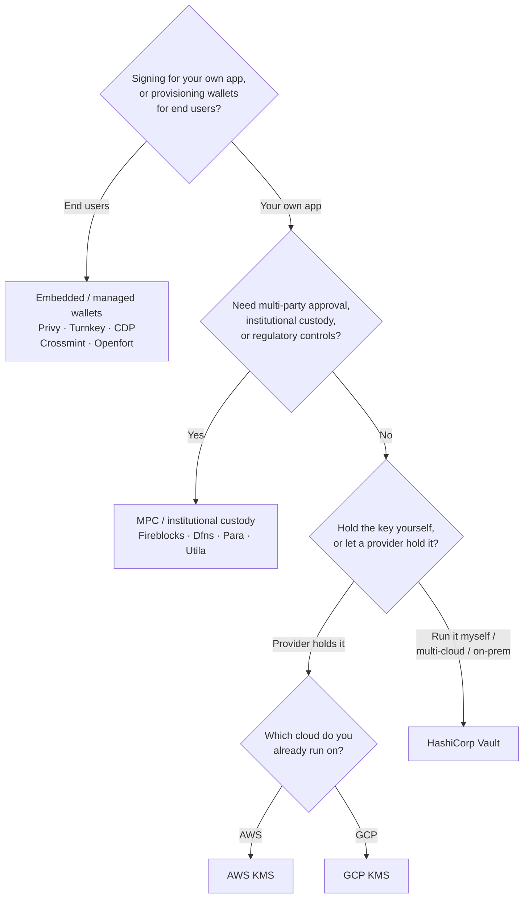

Keychain предоставляет единый интерфейс `SolanaSigner` для всех бэкендов,
поэтому выбор носит операционный, а не архитектурный характер — вы можете
изменить его позже через конфигурацию. Именно поэтому **начните с ваших
требований, а не с продукта.** Два вопроса решают большинство задач: _где
хранится приватный ключ и кто имеет право авторизовать подпись с его помощью?_

Не существует единого лучшего бэкенда. Каждый из них лучше подходит для
определённого набора ограничений — облако, которое вы уже используете, желание
управлять ключевой инфраструктурой, а также требования к хранению ключей и
контролю подтверждений. Приведённая ниже схема сопоставляет эти ограничения с
конкретным бэкендом.

<Callout type="info">
  Это руководство охватывает подпись на стороне сервера (бэкенд). Если ваши
  конечные пользователи подписывают собственные транзакции в браузере,
  используйте кошелёк через Wallet Standard — см. [Подпись в
  продакшене](/docs/core/transactions/signing-in-production).
</Callout>

## Схема принятия решения

<Callout type="info">
  Для локальной разработки и тестов всё это не нужно — используйте бэкенд
  **Memory** для прототипирования, а затем переключитесь на один из
  производственных бэкендов выше через конфигурацию.
</Callout>

## Разбор вопросов

<Steps>

<Step>

### Вы подписываете транзакции для своего приложения или для конечных пользователей?

Если вы создаёте кошельки, которыми **конечные пользователи** владеют и
управляют самостоятельно (потребительские приложения, процессы онбординга),
используйте бэкенд **встроенного / управляемого кошелька** — Privy, Turnkey,
CDP, Crossmint или Openfort. Они управляют кошельками и аутентификацией
пользователей от вашего имени.

Если вы подписываете транзакции **от имени своего приложения** — в роли
плательщика комиссий, казначейства или бэкенда автоматизации — продолжайте ниже.

</Step>

<Step>

### Требуется ли вам многостороннее согласование, институциональное хранение ключей или регуляторный контроль?

Если подписи должны проходить через политику согласования, лимиты расходов или
процессы комплаенса перед их созданием — либо вам необходим регулируемый
кастодиан для хранения ключей — используйте бэкенд на основе **MPC /
институционального хранения**: Fireblocks, Dfns, Para или Utila. Эти решения
разделяют или хранят ключ и совместно подписывают транзакции в соответствии с
вашей политикой.

Если вам нужен лишь ключ, подписывающий по запросу, — продолжайте ниже.

</Step>

<Step>

### Вы хотите хранить ключ самостоятельно или доверить его провайдеру?

Если ключ должен храниться у облачного провайдера в аппаратно защищённой
инфраструктуре, а политика IAM определяет, кто может подписывать, — используйте
KMS соответствующего облака:

- **Работаете на AWS** → AWS KMS
- **Работаете на GCP** → GCP KMS

Если вы хотите самостоятельно управлять ключевой инфраструктурой — или работаете
в мультиоблачной среде либо on-prem — используйте **HashiCorp Vault**. Вы сами
эксплуатируете и аудируете его; ключ остаётся внутри движка Transit и
подписывает по запросу.

</Step>

</Steps>

## Модели хранения ключей

Бэкенды объединяются в пять моделей хранения ключей. Описанный выше сценарий
приведёт вас к одной из них.

- **Самостоятельное хранение (в процессе)** — приложение хранит приватный ключ
  напрямую. Удобно для разработки, но не подходит для продакшена. Бэкенд:
  **Memory**.
- **Самостоятельное управление ключами** — вы сами эксплуатируете ключевую
  инфраструктуру; ключ остаётся внутри неё и подписывает по запросу. Бэкенд:
  **HashiCorp Vault**.
- **Облачный KMS / HSM** — облачный провайдер хранит ключ в аппаратно защищённой
  инфраструктуре; ключ никогда не покидает сервис, а политика IAM контролирует,
  кто может подписывать. Бэкенды: **AWS KMS**, **GCP KMS**.
- **MPC и институциональное хранение** — ключ разделён или хранится у
  провайдера, который совместно подписывает транзакции согласно вашей политике
  (согласования, лимиты). Бэкенды: **Fireblocks**, **Dfns**, **Para**,
  **Utila**.
- **Встроенные и управляемые кошельки** — провайдер управляет кошельками от
  вашего имени, зачастую для подключения конечных пользователей. Бэкенды:
  **Privy**, **Turnkey**, **CDP**, **Crossmint**, **Openfort**.

## Сравнение бэкендов

| Бэкенд          | Модель хранения ключей                | Лучше всего подходит для                                             | Примечания                                                     |
| --------------- | ------------------------------------- | -------------------------------------------------------------------- | -------------------------------------------------------------- |
| Memory          | Самостоятельное хранение (в процессе) | Локальная разработка, тесты, CI                                      | Открытый ключ в процессе — не использовать в продакшене        |
| HashiCorp Vault | Самостоятельное управление ключами    | Команды, использующие собственную инфраструктуру ключей              | Transit engine; вы управляете и проводите аудит самостоятельно |
| AWS KMS         | Облачный KMS / HSM                    | Бэкенды, работающие на AWS                                           | Ключ никогда не покидает KMS; IAM контролирует подписание      |
| GCP KMS         | Облачный KMS / HSM                    | Бэкенды, работающие на GCP                                           | Ключ никогда не покидает KMS; IAM контролирует подписание      |
| Fireblocks      | MPC / институциональное хранение      | Казначейства, биржи, регулируемое хранение                           | Движок политик и процессы согласования                         |
| Dfns            | MPC-инфраструктура кошельков          | Программируемые кошельки с контролем политик                         | Подписание Ed25519                                             |
| Para            | MPC-кошельки                          | Приложения, использующие кошельки на базе MPC                        | API-ключ + ID кошелька                                         |
| Utila           | MPC-хранение + со-подписант           | Существующие кошельки Solana под управлением Utila                   | `signMessage` не поддерживается; вы транслируете транзакцию    |
| Privy           | Встроенные кошельки                   | Потребительские приложения для подключения пользователей к кошелькам | Встроенные кошельки под управлением приложения                 |
| Turnkey         | Некастодиальное управление ключами    | Программируемое подписание с контролем политик                       | Некастодиальное управление ключами                             |
| CDP             | Управляемый кошелёк (Coinbase)        | Приложения на платформе Coinbase Developer Platform                  | `signMessage` принимает только UTF-8                           |
| Crossmint       | Управляемые кошельки                  | Маркетплейсы и приложения с управляемыми кошельками                  | Кошельки `smart` и `mpc`; `signMessage` не поддерживается      |
| Openfort        | Встроенные бэкенд-кошельки            | Серверные кошельки                                                   | Ключи хранятся в TEE                                           |

## Корпоративные сценарии

Одному приложению зачастую требуется несколько из этих возможностей
одновременно. Поскольку интерфейс идентичен, можно использовать разные бэкенды
для каждой роли, не изменяя точки вызова.

- **Казначейские операции** — разделите операционный «горячий» подписант и
  «холодный» казначейский подписант. Обеспечьте казначейство через MPC-хранилище
  или облачный HSM и настройте политики подтверждения для подписей с высокой
  стоимостью.
- **Процессы согласования** — бэкенды MPC и хранилищ (например, Fireblocks)
  требуют многостороннего подтверждения перед формированием подписи.
- **Соответствие требованиям и аудит** — облачные KMS (AWS/GCP) и Vault ведут
  журналы аудита подписей; институциональные кастодианы добавляют контроль
  политик и отчётность.
- **Регулируемые среды** — храните ключевой материал в HSM, KMS или
  институциональном кастодиане, чтобы исходные ключи никогда не попадали в ваше
  приложение.

Ознакомьтесь с разделом
[Лучшие практики для production](/docs/tools/keychain/production-best-practices)
для безопасной эксплуатации этих бэкендов.

<Cards>
  <Card
    title="Руководство по Rust"
    href="/docs/tools/keychain/getting-started/rust"
  >
    Настройка каждого бэкенда на Rust.
  </Card>
  <Card
    title="Руководство по TypeScript"
    href="/docs/tools/keychain/getting-started/typescript"
  >
    Настройка каждого бэкенда на TypeScript.
  </Card>
</Cards>
