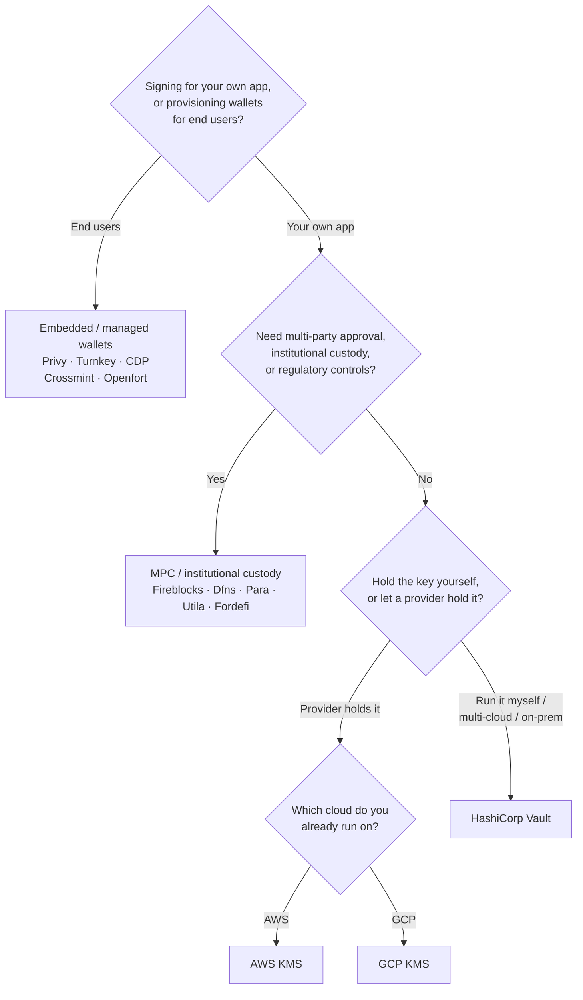

Keychain предоставляет единый базовый интерфейс `SolanaSigner` для всех бэкендов, поэтому
для большинства бэкендов выбор носит операционный, а не архитектурный характер: позже его можно изменить
через конфигурацию. Исключение — форма транзакции. Crossmint
и Fordefi в нативном авторежиме подписывают и рассылают транзакции на стороне сервера, а Fordefi в нативном
ручном режиме перезаписывает транзакцию перед подписью, поэтому переход на любой
из них или с него меняет способ вызова подписанта. Исходя из этого, **отталкивайтесь от
своих требований, а не от продукта.** Большую часть решения определяют два вопроса: _где
хранится закрытый ключ и кто имеет право авторизовать подпись с его помощью?_

Все бэкенды, кроме Ledger, доступны на всех четырёх языках (Rust, TypeScript,
Python и Go). Ledger поддерживается только в Rust и подключается опционально через функцию `ledger`.

Единственного лучшего бэкенда не существует. Каждый из них лучше подходит для определённого набора
ограничений: облако, которое вы уже используете, готовность самостоятельно эксплуатировать ключевую
инфраструктуру, а также требования к хранению ключей и контролю подтверждений.
Схема ниже сопоставляет эти ограничения с бэкендом.

<Callout type="info">
  Это руководство посвящено подписи на стороне бэкенда (сервера). Если ваши конечные пользователи подписывают
  собственные транзакции в браузере, используйте кошелёк через Wallet Standard.
  См. [Подпись в
  продакшене](/docs/core/transactions/signing-in-production).
</Callout>

## Схема принятия решений

```mermaid title="Choosing a Keychain backend"
flowchart TD
    Start{Signing for your own app,<br/>or provisioning wallets<br/>for end users?}
    Start -->|End users| Managed[Embedded / managed wallets<br/>Privy · Turnkey · CDP<br/>Crossmint · Openfort]
    Start -->|Your own app| Q2{Need multi-party approval,<br/>institutional custody,<br/>or regulatory controls?}
    Q2 -->|Yes| MPC[MPC / institutional custody<br/>Fireblocks · Dfns · Para · Utila · Fordefi]
    Q2 -->|No| Q3{Hold the key yourself,<br/>or let a provider hold it?}
    Q3 -->|Provider holds it| Q4{Which cloud do you<br/>already run on?}
    Q4 -->|AWS| AWS[AWS KMS]
    Q4 -->|GCP| GCP[GCP KMS]
    Q3 -->|Run it myself /<br/>multi-cloud / on-prem| Vault[HashiCorp Vault]
```

<Callout type="info">
  Для локальной разработки и тестов всё это не нужно: используйте бэкенд **Memory**
  для прототипирования, а затем перейдите на один из продакшен-бэкендов выше через
  конфигурацию.
</Callout>

## Разбор вопросов

<Steps>

<Step>

### Вы подписываете транзакции для собственного приложения или для конечных пользователей?

Если вы создаёте кошельки, которыми владеют и управляют **конечные пользователи** (потребительские приложения,
сценарии онбординга), используйте бэкенд **встроенного / управляемого кошелька**: Privy, Turnkey,
CDP, Crossmint или Openfort. Они берут на себя управление кошельками пользователей и аутентификацию
от вашего имени.

Если вы подписываете транзакции **от имени собственного приложения** (плательщик комиссий, казначейство, автоматизация на бэкенде),
читайте дальше.

</Step>

<Step>

### Нужны ли вам мультисторонние подтверждения, институциональное хранение или регуляторный контроль?

Если подписи должны проходить политику подтверждения, лимит расходов или процесс комплаенса
до того, как будут созданы, либо ключи должен хранить регулируемый кастодиан,
используйте бэкенд **MPC / институционального хранения**: Fireblocks, Dfns, Para,
Utila или Fordefi. Они разделяют ключ или берут его на хранение и сопровождают подпись в соответствии
с вашей политикой.

Если вам нужен лишь ключ, который подписывает по запросу, читайте дальше.

</Step>

<Step>

### Хотите хранить ключ самостоятельно или доверить это провайдеру?

Если ключ должен храниться у облачного провайдера в аппаратно защищённой инфраструктуре, а
ваша политика IAM определяет, кто может подписывать, используйте KMS этого облака:

- **Работаете в AWS** → AWS KMS
- **Работаете в GCP** → GCP KMS

Если вы хотите самостоятельно эксплуатировать ключевую инфраструктуру либо используете несколько облаков или
local-развёртывание (on-prem), выберите **HashiCorp Vault**. Вы запускаете его и проводите аудит; ключ остаётся внутри
движка Transit и подписывает по запросу.

</Step>

</Steps>

## Модели хранения

Бэкенды делятся на шесть моделей хранения ключей. Схема выше приведёт вас к одной
из них.

- **Самостоятельное хранение (в процессе)**: ваше приложение хранит необработанный закрытый ключ.
  Удобно для разработки, но непригодно для продакшена. Бэкенд:
  **Memory**.
- **Самостоятельное хранение (аппаратный кошелёк)**: ключ никогда не покидает устройство Ledger, а
  человек подтверждает каждую подпись на его экране. Подходит для интерактивной
  подписи оператором, но не для сервисов, работающих без присмотра. Только Rust, подключается опционально и не охвачено
  аудитом. Бэкенд: **Ledger**.
- **Самостоятельно развёрнутое управление ключами**: вы эксплуатируете ключевую инфраструктуру; ключ
  остаётся внутри неё и подписывает по запросу. Бэкенд: **HashiCorp Vault**.
- **Облачный KMS / HSM**: облачный провайдер хранит ключ в аппаратно защищённой
  инфраструктуре; ключ никогда не покидает сервис, а ваша политика IAM определяет,
  кто может подписывать. Бэкенды: **AWS KMS**, **GCP KMS**.
- **MPC и институциональное хранение**: ключ разделяется или хранится у
  провайдера, который сопровождает подпись в соответствии с вашей политикой (подтверждения, лимиты).
  Бэкенды: **Fireblocks**, **Dfns**, **Para**, **Utila**, **Fordefi**.
- **Встроенные и управляемые кошельки**: провайдер управляет кошельками от вашего имени,
  часто для онбординга конечных пользователей. Бэкенды: **Privy**, **Turnkey**, **CDP**,
  **Crossmint**, **Openfort**.

## Сравнение бэкендов

| Бэкенд         | Модель хранения                  | Лучше всего подходит для                                     | Примечания                                                                                                              |
| --------------- | ------------------------------ | -------------------------------------------- | ------------------------------------------------------------------------------------------------------------------ |
| Memory          | Самостоятельное хранение (в процессе)      | Локальная разработка, тесты, CI                 | Необработанный ключ в процессе; не использовать в продакшене                                                                       |
| Ledger          | Самостоятельное хранение (аппаратный кошелёк) | Интерактивная подпись оператором из инструментов на Rust | Только Rust, опциональная функция `ledger`, без аудита; каждая подпись подтверждается на устройстве                                 |
| HashiCorp Vault | Самостоятельное управление ключами     | Команды, использующие собственную инфраструктуру ключей   | Transit engine; вы сами управляете и проводите аудит                                                                           |
| AWS KMS         | Облачный KMS / HSM                | Бэкенды, работающие на AWS                      | Ключ никогда не покидает KMS; IAM управляет подписью                                                                         |
| GCP KMS         | Облачный KMS / HSM                | Бэкенды, работающие на GCP                      | Ключ никогда не покидает KMS; IAM управляет подписью                                                                         |
| Fireblocks      | MPC / институциональное хранение    | Казначейства, биржи, регулируемое хранение     | Движок политик и процессы согласования                                                                               |
| Dfns            | MPC-инфраструктура кошельков      | Программные кошельки с контролем политик    | Подпись Ed25519                                                                                                    |
| Para            | MPC-кошельки                    | Приложения с кошельками на базе MPC            | API-ключ + ID кошелька                                                                                                |
| Utila           | MPC-хранение + со-подписант        | Существующие кошельки Solana под управлением Utila        | `signMessage` не поддерживается; транзакцию транслируете вы                                                                    |
| Fordefi         | MPC / институциональное хранение    | Институциональное хранение ключей с управлением политиками   | Чёрный ящик: отправляете вы. Нативный авторежим: Fordefi перезаписывает и отправляет. Нативный ручной режим: Fordefi перезаписывает, результат отправляете вы |
| Privy           | Встроенные кошельки               | Потребительские приложения для подключения пользователей к кошелькам    | Встроенные кошельки под управлением приложения                                                                                       |
| Turnkey         | Некастодиальное управление ключами   | Программная подпись с контролем политик           | Некастодиальное управление ключами                                                                                       |
| CDP             | Управляемый кошелёк (Coinbase)      | Приложения на платформе Coinbase Developer Platform      | `signMessage` принимает только UTF-8                                                                          |
| Crossmint       | Управляемые кошельки                | Маркетплейсы и приложения с управляемыми кошельками         | Только отправка: рассылает на стороне сервера, может перезаписывать для спонсирования газа; `signMessage` не поддерживается                   |
| Openfort        | Встроенные бэкенд-кошельки       | Серверные кошельки                          | Ключи хранятся в TEE                                                                                                    |

## Форма возможностей

Помимо хранения ключей, у каждого бэкенда есть одна форма транзакции, и она определяет, как вы
вызываете подписанта:

- **Подпись**: провайдер подписывает созданные вами байты, а рассылаете их вы. Большинство
  бэкендов, включая Ledger и режим «чёрного ящика» Fordefi.
- **Перезапись и подпись**: провайдер перезаписывает транзакцию, затем подписывает её
  без рассылки. Продолжайте работу с возвращённой транзакцией. Нативный
  ручной режим Fordefi.
- **Подпись и рассылка**: провайдер подписывает и рассылает транзакцию на стороне сервера, поэтому
  сбой не означает, что ничего не было записано в сеть. Crossmint и Fordefi в нативном авторежиме.

Таблица возможностей подписантов в README каждого языка описывает форму каждого
бэкенда;
[модель безопасности](https://github.com/solana-foundation/solana-keychain/blob/main/docs/SECURITY_MODEL.md)
объясняет, какие гарантии даёт каждая форма.

## Корпоративные сценарии

Одному приложению часто требуется сразу несколько таких вариантов. Поскольку
интерфейс общий, вы можете использовать разные бэкенды для разных ролей, не меняя
места вызова, при условии что бэкенды имеют одну и ту же форму возможностей.

- **Операции с казначейством** — разделите операционный «горячий» подписант и
  «холодный» казначейский. Подкрепите казначейство MPC-хранилищем или облачным
  HSM и требуйте политики подтверждения перед подписанием крупных транзакций.
- **Рабочие процессы согласования** — бэкенды MPC и хранилища (например,
  Fireblocks) обеспечивают многостороннее согласование перед формированием
  подписи.
- **Соответствие требованиям и аудит** — облачные KMS (AWS/GCP) и Vault ведут
  журналы аудита подписания; институциональные кастодианы добавляют применение
  политик и отчётность.
- **Регулируемые среды** — храните ключевой материал в HSM, KMS или у
  институционального кастодиана, чтобы исходные ключи никогда не попадали в ваше
  приложение.

Ознакомьтесь с
[рекомендациями для production-среды](/docs/tools/keychain/production-best-practices)
по безопасной эксплуатации этих бэкендов.

<Cards>
  <Card title="Руководство по Rust" href="/docs/tools/keychain/getting-started/rust">
    Настройка каждого бэкенда на Rust.
  </Card>
  <Card
    title="Руководство по TypeScript"
    href="/docs/tools/keychain/getting-started/typescript"
  >
    Настройка каждого бэкенда на TypeScript.
  </Card>
</Cards>
