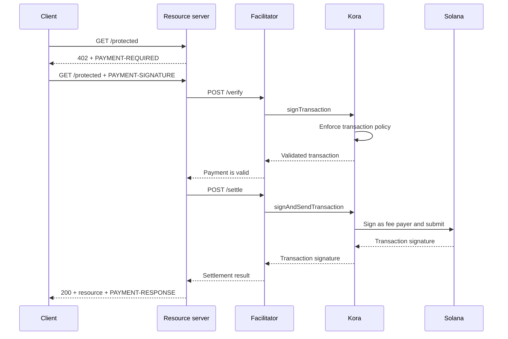

Kora может обеспечить уровень подписания транзакций Solana, управления политиками и спонсирования комиссий за [фасилитатором x402 V2](/docs/tools/x402-facilitator). Фасилитатор реализует HTTP API x402; Kora валидирует, подписывает и отправляет принятые им платёжные транзакции.

Это руководство запускает эталонный фасилитатор Kora в Solana Devnet. Данная среда предназначена для тестирования интеграции, а не для производственного развёртывания.

## Архитектура



Четыре роли приложения остаются раздельными:

- **Клиент** выбирает требование к оплате и подписывает авторизацию платежа.
- **Сервер ресурсов** устанавливает цену маршрута и выполняет его только после успешной верификации и расчёта.
- **Фасилитатор** предоставляет эндпоинты x402: `/supported`, `/verify` и `/settle`.
- **Kora** подписывает только те транзакции, которые разрешены её политикой, и может спонсировать сетевые комиссии Solana.

Kora не заменяет протокол x402. Она является границей подписания и применения политик, используемой данной реализацией фасилитатора.

## Запуск эталонного фасилитатора

Вам понадобятся Git и [Docker с Compose](https://docs.docker.com/compose/). Склонируйте последний стабильный релиз Kora и перейдите в демо-директорию x402:

```bash
git clone --branch v2.0.5 --depth 1 https://github.com/solana-foundation/kora.git
cd kora/examples/x402/demo
cp .env.example .env
```

Укажите `KORA_PRIVATE_KEY` в файле `.env`, задав одноразовый keypair Devnet. Конфигурация подписанта демо принимает секрет в формате base58, keypair в виде массива байт или путь к JSON-файлу keypair. Пополните публичный адрес SOL в Devnet, чтобы он мог спонсировать комиссии за транзакции.

<Callout type="caution" title="Используйте одноразовый подписант Devnet">
  Docker-демо загружает подписант Kora из переменной окружения. Не используйте производственный ключ подписания в этом демо и не добавляйте файл `.env` в коммит.
</Callout>

Запустите Kora и фасилитатор:

```bash
docker compose up --build
```

Первая сборка может занять несколько минут. Когда оба проверки работоспособности пройдут успешно, проверьте анонсируемые возможности фасилитатора из другого терминала:

```bash
curl http://127.0.0.1:3000/supported
```

Ответ должен содержать x402 версии `2`, схему `exact` и сетевой идентификатор Devnet CAIP-2:

```json
{
  "kinds": [
    {
      "x402Version": 2,
      "scheme": "exact",
      "network": "solana:EtWTRABZaYq6iMfeYKouRu166VU2xqa1",
      "extra": {
        "feePayer": "<KORA_SIGNER_ADDRESS>"
      }
    }
  ]
}
```

По умолчанию Kora слушает на `127.0.0.1:8080`, а фасилитатор — на `127.0.0.1:3000`. Остановите демо с помощью `Ctrl+C`.

## Подключение сервера ресурсов

Настройте сервер ресурсов x402 на использование локального фасилитатора и публичного адреса подписанта Kora в качестве получателя:

```bash
FACILITATOR_URL=http://127.0.0.1:3000
SOLANA_PAY_TO=<KORA_SIGNER_ADDRESS>
```

Затем следуйте инструкции [x402 на Solana](/docs/payments/agentic-payments/x402), чтобы добавить промежуточный слой x402 V2 в маршрут Express. Неоплаченный запрос получает `PAYMENT-REQUIRED`, повторный запрос содержит `PAYMENT-SIGNATURE`, а успешный ответ — `PAYMENT-RESPONSE`.

Не копируйте примеры, использующие `X-PAYMENT`, `X-PAYMENT-RESPONSE` или имя сети `solana-devnet`. Эти поля относятся к x402 V1.

Репозиторий Kora также содержит защищённый API и клиент с поддержкой платежей в той же директории `examples/x402/demo`. Используйте эти приложения, когда нужно протестировать полный локальный сценарий.

## Настройка политики Kora

Эталонный файл `kora/kora.toml` намеренно ограничен. Его политика валидации управляет:

- какие программы Solana разрешены для подписания;
- какие минты SPL-токенов могут использоваться;
- максимальным количеством спонсируемых lamport и подписей;
- какие операции плательщика комиссий запрещены; и
- какие расширения Token-2022 отклоняются.

Демо включает только те RPC-методы Kora, которые необходимы его фасилитатору: `signTransaction`, `signAndSendTransaction`, `getBlockhash`, `getPayerSigner`, `getConfig` и `getVersion`.

Рассматривайте политику как границу безопасности для ключа плательщика комиссий. Для производственного сервиса:

1. Добавьте в белый список только те программы, минты токенов и формы транзакций, которые производит ваша схема x402.
2. Запретите переводы, изменения прав, закрытие аккаунта и другие инструкции, которые могут переместить средства от подписанта Kora.
3. Установите лимиты транзакций и использования, ограничивающие потери при компрометации учётных данных фасилитатора.
4. Используйте управляемый бэкенд подписанта вместо приватного ключа, хранящегося в переменной окружения.

## Защита соединения фасилитатора с Kora

Демо включает аутентификацию по API-ключу Kora. Фасилитатор отправляет значение `KORA_API_KEY`, которое должно совпадать с `[kora.auth].api_key` в `kora.toml`.

Для производственной среды также:

- размещайте Kora в частной сети и завершайте TLS на доверенной границе;
- храните учётные данные API в менеджере секретов и регулярно их ротируйте;
- рассмотрите HMAC-аутентификацию запросов Kora для защиты от подделки и повторных атак;
- разделяйте ключи плательщика комиссий и получателя платежей, если этого требует ваша модель учёта; и
- настройте оповещения об отказах политики, сбоях расчётов, потреблении комиссий и балансе подписанта.

## Усиление защиты расчётов по платежам

Kora валидирует транзакцию Solana, однако фасилитатор и сервер ресурсов по-прежнему несут ответственность за корректность протокола x402. Перед предоставлением ресурса обеспечьте соблюдение:

- выбранной версии x402, схемы, сети, актива, суммы и получателя;
- времени жизни авторизации и точной структуры инструкций Solana;
- атомарной защиты от повторного использования и идемпотентного расчёта;
- подтверждения на уровне коммита, требуемом продуктом; и
- надёжного сопоставления между покупкой, результатом расчёта и выполнением.

Не возвращайте оплаченный контент лишь потому, что Kora приняла транзакцию для подписания. Выполняйте запрос только после того, как фасилитатор вернёт успешный результат расчёта.

## Связанные ресурсы

- [Репозиторий Kora и демо x402](https://github.com/solana-foundation/kora/tree/main/examples/x402/demo)
- [Конфигурация оператора Kora](/docs/tools/kora/operators/configuration)
- [Бэкенды подписанта Kora](/docs/tools/kora/operators/signers)
- [Аудиты безопасности Kora](/docs/tools/kora/security-audits)
- [Спецификация x402 V2](https://github.com/x402-foundation/x402/blob/main/specs/x402-specification-v2.md)
- [Обзор агентных платежей](/docs/payments/agentic-payments)
