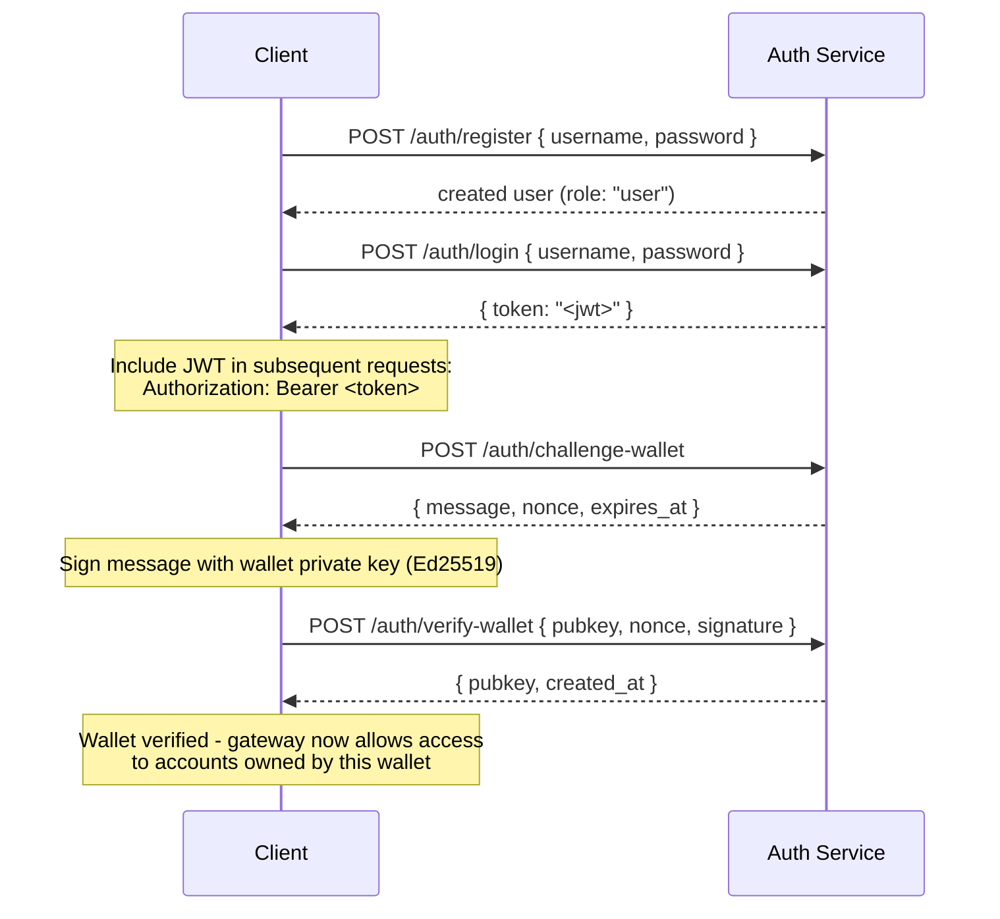

## Обзор

Private Channels включает опциональный Auth Service, который ограничивает доступ к шлюзу с помощью JWT-аутентификации и управления доступом на основе ролей (RBAC). Когда аутентификация отключена, шлюз принимает все подключения. Когда она включена, клиенты должны предоставлять действительный JWT в каждом запросе.

Эта страница охватывает обе аудитории:

- **Разработчики** — регистрация, вход, верификация кошелька и выполнение аутентифицированных запросов
- **Операторы** — включение Auth Service, настройка `JWT_SECRET` и назначение роли `operator`

## Включение аутентификации

Аутентификация включается путём установки `JWT_SECRET` (непустое значение) как на шлюзе, так и в Auth Service. Auth Service также требует `AUTH_DATABASE_URL`.

Если `JWT_SECRET` не задан, шлюз работает в открытом режиме — токен не требуется.

> **Docker Compose:** Auth Service является профилем Docker Compose и **по умолчанию не запускается**. Чтобы включить его, передайте `--profile auth` в команду `docker compose`, а также `--env-file .env`, чтобы секреты, такие как `JWT_SECRET` и `POSTGRES_PASSWORD`, были корректно подставлены (Compose отключает автоматическую загрузку `.env`, как только передан любой флаг `--env-file`):
>
> ```bash
> docker compose -f docker-compose.devnet.yml --env-file versions.env --env-file .env.devnet --env-file .env --profile auth up -d
> ```

## API Auth Service

Все эндпоинты находятся под префиксом `/auth`. Auth Service прослушивает порт `AUTH_PORT` (по умолчанию `8903`).

### `POST /auth/register`

Создать новый аккаунт. Все пользователи регистрируются с ролью `user`.

```json
{ "username": "alice", "password": "hunter2" }
```

- Имя пользователя: 5–32 символа, буквенно-цифровые, а также `_` и `-`
- Пароль: 6–128 символов
- Возвращает созданного пользователя; пароль никогда не возвращается

### `POST /auth/login`

Пройдите аутентификацию и получите подписанный JWT, действительный в течение 24 часов.

```json
{ "username": "alice", "password": "hunter2" }
```

Возвращает `{ "token": "<jwt>" }`. Как неверное имя пользователя, так и неверный пароль возвращают `401`, чтобы исключить перебор имён пользователей.

### `POST /auth/challenge-wallet`

Запросить подписываемый вызов (challenge) для подтверждения владения кошельком Solana. Требует действительного JWT.

Возвращает сообщение, nonce и время истечения. Challenge действителен в течение 10 минут.

```json
{
  "message": "PrivateChannel wallet verification\nuser: <uuid>\nnonce: <uuid>\nexpires: <unix>",
  "nonce": "<uuid>",
  "expires_at": "<iso8601>"
}
```

### `POST /auth/verify-wallet`

Отправить подписанный challenge для регистрации кошелька как верифицированного. Требует действительного JWT.

```json
{
  "pubkey": "<base58 pubkey>",
  "nonce": "<uuid from challenge>",
  "signature": "<base58 Ed25519 signature>"
}
```

Сервис восстанавливает сообщение challenge, проверяет подпись Ed25519 и сохраняет кошелёк. Каждый nonce может быть использован только один раз; повторные запросы отклоняются.

Возвращает `{ "pubkey": "<base58>", "created_at": "<iso8601>" }`.

### `GET /auth/wallets`

Получить список всех верифицированных кошельков аутентифицированного пользователя. Требует действительного JWT.

### `DELETE /auth/wallets/{pubkey}`

Удалить верифицированный кошелёк из аккаунта аутентифицированного пользователя. Требует действительного JWT.

### `GET /health`

Проверка работоспособности. Возвращает `200 ok`. Аутентификация не требуется.

## Структура JWT

Токены используют алгоритм HS256 и истекают через 24 часа после выдачи.

| Поле  | Значение                           |
| ------ | ------------------------------- |
| `sub`  | UUID пользователя                       |
| `role` | `"user"` или `"operator"`        |
| `iss`  | `"private-channel-auth"`        |
| `aud`  | `"private-channel-gateway"`     |
| `exp`  | Unix-метка времени (24 ч с момента выдачи) |

> `iss` и `aud` присутствуют в payload JWT, однако валидируются конфигурацией JWT шлюза, а не десериализуются в структуру claims приложения. На уровне приложения доступны только поля `sub`, `role` и `exp`.

Передайте токен в заголовке `Authorization`:

```
Authorization: Bearer <JWT_TOKEN>
```

## Роли

### user

Роль по умолчанию при регистрации.

- Доступ ограничен верифицированными кошельками самого пользователя
- Заблокировано: `getBlock`, `getTransaction`, `simulateTransaction`
- Доступно: вызов `Deposit` в Escrow Program, инициирование выводов через `WithdrawFunds`

### operator

Привилегированная роль. Назначается только вручную; самостоятельно повысить роль с `user` до `operator` невозможно.

**Назначьте роль** через Admin CLI (`private-channel-auth-admin`):

```bash
private-channel-auth-admin set-role --username alice --role operator
```

или напрямую через SQL:

<Callout type="warning">
  Это привилегированная операция с базой данных. Ограничьте доступ к базе данных Auth Service соответствующим образом и ведите аудит всех изменений ролей.
</Callout>

```sql
UPDATE private_channel_auth.users SET role = 'operator' WHERE username = 'alice';
```

**Зарегистрировать кошелёк без прохождения процедуры самостоятельной верификации (Admin CLI, `private-channel-auth-admin`):**

```bash
private-channel-auth-admin attach-wallet --username alice --pubkey <base58-pubkey>
```

Эта команда напрямую вставляет верифицированный кошелёк в таблицу `verified_wallets`, минуя процедуру challenge/verify. Применяется уникальное ограничение на `(user_id, pubkey)`. Сама по себе команда **не** назначает роль `operator`; для этого используйте `set-role` или SQL-обновление выше. Команда предназначена для привязки кошелька к аккаунту (например, к сервисному аккаунту) без прохождения интерактивной процедуры challenge/verify.

**Возможности:**

- Обходит все проверки владения кошельком
- Полный доступ ко всем RPC-методам шлюза, включая `getBlock`, `getTransaction`, `simulateTransaction`
- Обязательно для: `ReleaseFunds`, `ResetSmtRoot`

## Полный поток аутентификации



## Выполнение аутентифицированных запросов

```typescript
const response = await fetch("http://localhost:8899/", {
  method: "POST",
  headers: {
    "Content-Type": "application/json",
    Authorization: `Bearer ${jwtToken}`
  },
  body: JSON.stringify({
    jsonrpc: "2.0",
    id: 1,
    method: "getBalance",
    params: [walletAddress]
  })
});
const data = await response.json();
```

## Эндпоинты шлюза

Следующие эндпоинты не требуют аутентификации:

| Эндпоинт  | Метод | Описание                               | Успех                  | Ошибка                     |
| --------- | ------ | ----------------------------------------- | ------------------------ | --------------------------- |
| `/health` | GET    | Проверка работоспособности                            | `200 {"status":"ok"}`    | -                           |
| `/ready`  | GET    | Глубокая проверка готовности; опрашивает узлы записи и чтения | `200 {"status":"ready"}` | `503 {"status":"degraded"}` |

Справочник по `JWT_SECRET` и переменным окружения шлюза см. в [справочнике по конфигурации](/docs/tools/private-channels/operators/configuration).

## Матрица доступа к RPC-методам

Следующие методы распознаются шлюзом. Если `JWT_SECRET` задан, доступ зависит от роли в JWT:

| Метод                        | Маршрут      | Без JWT | `user`           | `operator` |
| ----------------------------- | ---------- | ------ | ---------------- | ---------- |
| `sendTransaction`             | Узел записи | ✓      | ✓                | ✓          |
| `getLatestBlockhash`          | Узел чтения  | ✓      | ✓                | ✓          |
| `getSlot`                     | Узел чтения  | ✓      | ✓                | ✓          |
| `getRecentBlockhash`          | Узел чтения  | ✓      | ✓                | ✓          |
| `getSignatureStatuses`        | Узел чтения  | ✓      | ✓                | ✓          |
| `getTransactionCount`         | Узел чтения  | ✓      | ✓                | ✓          |
| `getFirstAvailableBlock`      | Узел чтения  | ✓      | ✓                | ✓          |
| `getBlocks`                   | Узел чтения  | ✓      | ✓                | ✓          |
| `getEpochInfo`                | Узел чтения  | ✓      | ✓                | ✓          |
| `getEpochSchedule`            | Узел чтения  | ✓      | ✓                | ✓          |
| `getRecentPerformanceSamples` | Узел чтения  | ✓      | ✓                | ✓          |
| `getBlockTime`                | Узел чтения  | ✓      | ✓                | ✓          |
| `getVoteAccounts`             | Узел чтения  | ✓      | ✓                | ✓          |
| `getSupply`                   | Узел чтения  | ✓      | ✓                | ✓          |
| `getSlotLeaders`              | Узел чтения  | ✓      | ✓                | ✓          |
| `isBlockhashValid`            | Узел чтения  | ✓      | ✓                | ✓          |
| `getAccountInfo`              | Узел чтения  | 401    | ownership-gated¹ | ✓          |
| `getTokenAccountBalance`      | Узел чтения  | 401    | ownership-gated¹ | ✓          |
| `getSignaturesForAddress`     | Узел чтения  | 401    | ownership-gated¹ | ✓          |
| `getBlock`                    | Узел чтения  | 401    | 403              | ✓          |
| `getTransaction`              | Узел чтения  | 401    | 403              | ✓          |
| `simulateTransaction`         | Узел чтения  | 401    | 403              | ✓          |

¹ **Ownership-gated**: для SPL token account (поле owner равно `TokenkegQ...` или `TokenzQ...`, данные не менее 165 байт) шлюз проверяет, совпадает ли поле `owner` или `delegate` с одним из верифицированных кошельков аутентифицированного пользователя. Для любого другого типа аккаунта (кошелёк System Program или неизвестный PDA) вместо этого проверяется, является ли запрашиваемый pubkey одним из верифицированных кошельков пользователя, поскольку у таких аккаунтов нет полей owner/delegate для проверки. Если любая из проверок не пройдена, возвращается 403.
