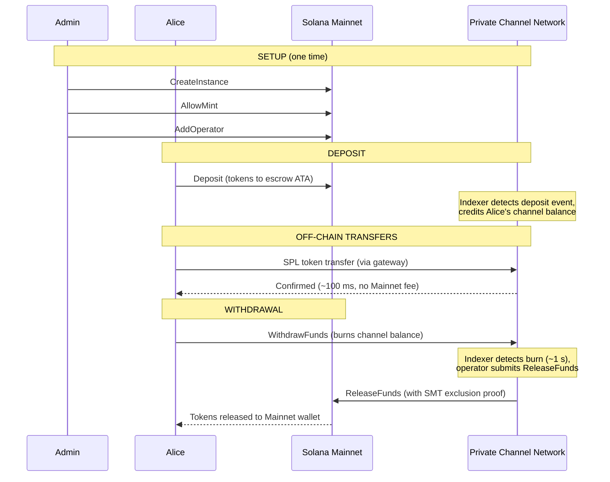
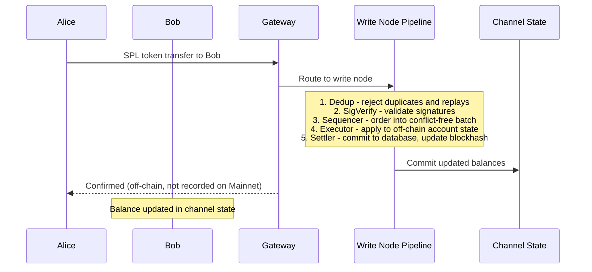
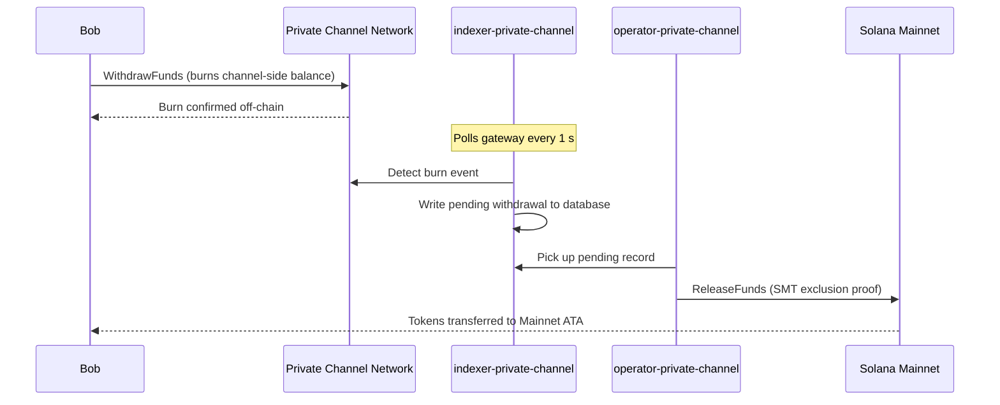

## Что такое приватный канал?

Приватный канал — это внецепочечная платёжная сеть, привязанная к Solana. Пользователи вносят SPL-токены в программу эскроу на блокчейне, после чего совершают транзакции вне сети через шлюз с высокой скоростью и нулевой стоимостью каждого перевода. Расчёт с Solana Mainnet происходит через доказательство Sparse Merkle Tree, гарантируя, что средства всегда доступны для погашения и двойная трата невозможна.

В отличие от нативного платёжного потока Solana, переводы внутри канала не отображаются в блокчейне до момента вывода средств пользователем. Сеть канала работает на собственном конвейере обработки транзакций (dedup -> sig verify -> sequencer -> executor -> settler), который обрабатывает транзакции независимо от времени блока Solana.

## Участники

### Администратор инстанции

Администратор развёртывает PDA `Instance` через `CreateInstance` и управляет тем, какие минты SPL-токенов принимаются (`AllowMint` / `BlockMint`). Администратор предоставляет и отзывает права операторов через `AddOperator` / `RemoveOperator`, а также может передавать права администратора через `SetNewAdmin`. На каждую инстанцию приходится один администратор. Передача прав администратора необратима за один шаг: текущий администратор не может вернуть себе роль без содействия нового администратора.

### Операторы

Операторы назначаются администратором. Они владеют PDA `Operator` и являются единственными аккаунтами, которым разрешено вызывать `ReleaseFunds` (для расчёта выводов на Mainnet) и `ResetSmtRoot` (для ротации Sparse Merkle Tree). Операторы обходят все проверки владельца в шлюзе и имеют доступ ко всем методам JSON-RPC, включая `getBlock`, `getTransaction` и `simulateTransaction`. JWT-роль: `"operator"`. Операторы должны быть добавлены непосредственно в базу данных; самостоятельное повышение прав не предусмотрено. Подробности о развёртывании и настройке см. в [руководстве по операторам](/docs/tools/private-channels/operators).

### Пользователи

Пользователи самостоятельно регистрируются через Auth Service. JWT-роль: `"user"`. Пользователи могут вызывать `Deposit` напрямую в программе эскроу и инициировать выводы через инструкцию `WithdrawFunds` на стороне канала в программе вывода. Доступ к шлюзу ограничен их собственными верифицированными кошельками; они не могут вызывать `getBlock`, `getTransaction` или `simulateTransaction`.

## Жизненный цикл канала

1. **Создание инстанции** — администратор вызывает `CreateInstance`, создавая PDA `Instance` и настраивая разрешённые минты.
2. **Депозит** — пользователи вносят SPL-токены в эскроу через инструкцию `Deposit`. Токены перемещаются на associated token account инстанции.
3. **Внецепочечные переводы** — пользователи отправляют переводы через шлюз. Переводы упорядочиваются и исполняются в сети канала без взаимодействия с Mainnet.
4. **Инициация вывода** — пользователь вызывает `WithdrawFunds` в программе вывода (на стороне канала), чтобы сжечь свой баланс и сигнализировать о выводе.
5. **Расчёт на Mainnet** — оператор предоставляет действительное доказательство исключения SMT и вызывает `ReleaseFunds` в программе эскроу (Mainnet), высвобождая токены на кошелёк пользователя.
6. **Ротация дерева** — когда SMT приближается к максимальной ёмкости (65 536 листьев), оператор вызывает `ResetSmtRoot` для ротации дерева и начала нового epoch.

### Перевод

### Вывод средств

## Когда использовать приватные каналы

Используйте приватные каналы, когда вашему приложению требуется:

- **Внецепочечная пропускная способность** — объём ваших переводов может насытить TPS Solana, или вам необходимо подтверждение быстрее секунды
- **Конфиденциальность** — личности контрагентов и суммы переводов не должны отображаться в блокчейне
- **Нулевая комиссия за перевод** — при высокой частоте переводов, когда стоимость каждой транзакции в SOL становится неприемлемой

Используйте нативные SPL-переводы в следующих случаях:

- **Требуется компонуемость на блокчейне** (DeFi, свопы, кредитование; другие программы должны иметь возможность наблюдать за переводом или реагировать на него)
- **Одноэтапный расчёт** приемлем и конфиденциальность не является требованием
- **Отсутствует инфраструктура шлюза** или её развёртывание операционно нецелесообразно
