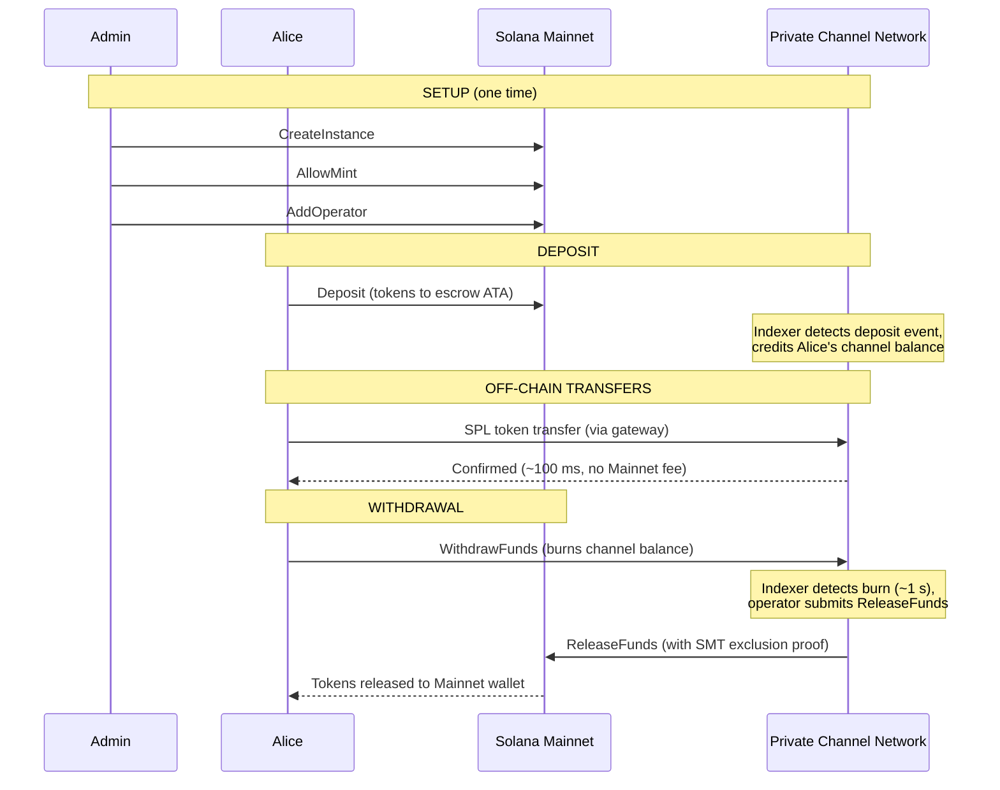
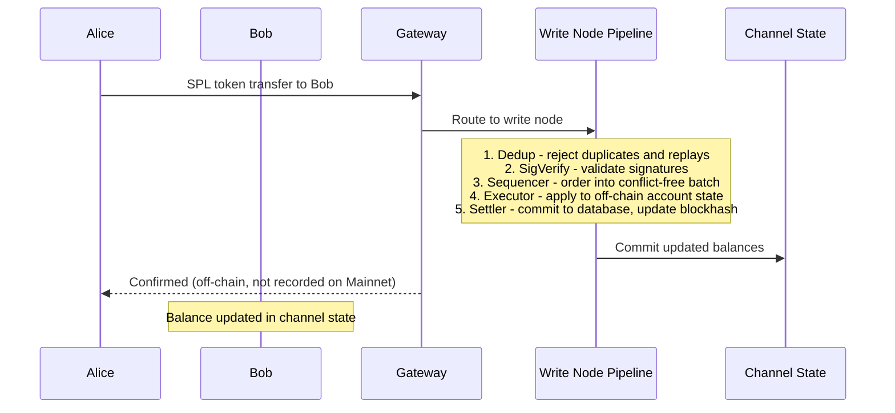
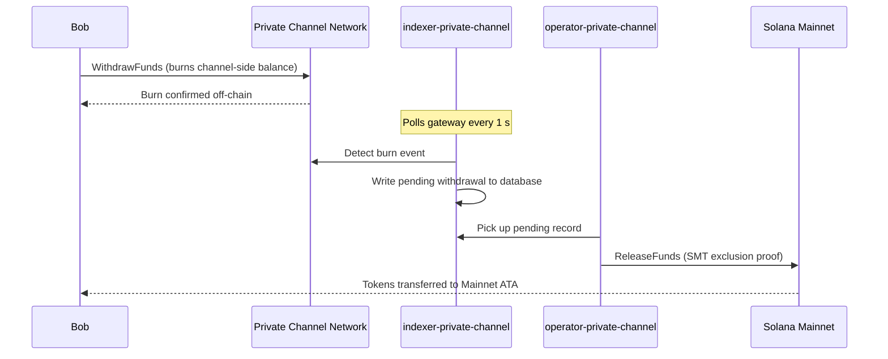

## Что такое приватный канал?

Приватный канал — это внецепочечная платёжная сеть, привязанная к Solana. Пользователи вносят SPL-токены в эскроу-программу на блокчейне, после чего совершают транзакции вне цепочки через шлюз с высокой скоростью и без комиссии за каждый перевод. Расчёт с Solana Mainnet осуществляется через доказательство Sparse Merkle Tree, что гарантирует возможность вывода средств в любой момент и исключает двойное расходование.

В отличие от нативного платёжного потока Solana, переводы внутри канала не отображаются в цепочке до тех пор, пока пользователь не выведет средства. Сеть канала работает на собственном конвейере обработки транзакций (dedup -> sig verify -> sequencer -> executor -> settler), который обрабатывает транзакции независимо от времени блока Solana.

## Участники

### Администратор инстанса

Администратор развёртывает PDA `Instance` через `CreateInstance` и управляет тем, какие минты SPL-токенов принимаются (`AllowMint` / `BlockMint`). Администратор назначает и отзывает операторов через `AddOperator` / `RemoveOperator`, а также может передать права администратора через `SetNewAdmin`. На каждый инстанс приходится один администратор. Передача прав администратора необратима и выполняется за один шаг: текущий администратор не может вернуть роль без участия нового администратора.

### Операторы

Операторы назначаются администратором. Они владеют PDA `Operator` и являются единственными аккаунтами, которым разрешено вызывать `ReleaseFunds` (для проведения расчётов по выводу средств на Mainnet) и `ResetSmtRoot` (для ротации Sparse Merkle Tree). Операторы обходят все проверки владения в шлюзе и имеют доступ ко всем методам JSON-RPC, включая `getBlock`, `getTransaction` и `simulateTransaction`. Роль JWT: `"operator"`. Операторы должны быть добавлены непосредственно в базу данных; самостоятельное повышение прав не предусмотрено. См. [руководство по операторам](/docs/tools/private-channels/operators) для получения сведений о развёртывании и настройке.

### Пользователи

Пользователи самостоятельно регистрируются через Auth Service. Роль JWT: `"user"`. Пользователи могут вызывать `Deposit` напрямую в Escrow Program и инициировать вывод средств через инструкцию `WithdrawFunds` на стороне канала в Withdraw Program. Доступ к шлюзу ограничен их собственными верифицированными кошельками; они не могут вызывать `getBlock`, `getTransaction` или `simulateTransaction`.

## Жизненный цикл канала

1. **Создание инстанса** — администратор вызывает `CreateInstance`, создавая PDA `Instance` и настраивая допустимые минты.
2. **Депозит** — пользователи вносят SPL-токены в эскроу через инструкцию `Deposit`. Токены перемещаются на associated token account инстанса.
3. **Внецепочечные переводы** — пользователи отправляют переводы через шлюз. Переводы упорядочиваются и исполняются в сети канала без взаимодействия с Mainnet.
4. **Инициация вывода** — пользователь вызывает `WithdrawFunds` в Withdraw Program (на стороне канала), чтобы сжечь свой баланс и инициировать вывод средств.
5. **Расчёт на Mainnet** — оператор предоставляет действительное доказательство исключения SMT и вызывает `ReleaseFunds` в Escrow Program (Mainnet), освобождая токены в кошелёк пользователя.
6. **Ротация дерева** — когда SMT приближается к максимальной ёмкости (65 536 листьев), оператор вызывает `ResetSmtRoot` для ротации дерева и начала нового epoch.

### Перевод

### Вывод средств

## Когда использовать приватные каналы

Используйте приватные каналы, если вашему приложению необходимо:

- **Внецепочечная пропускная способность** — объём переводов может исчерпать TPS Solana, или требуется подтверждение быстрее одной секунды
- **Конфиденциальность** — личности контрагентов и суммы переводов не должны отображаться в цепочке
- **Отсутствие комиссии за перевод** — частые переводы, при которых стоимость каждой транзакции в SOL неприемлемо высока

Используйте нативные SPL-переводы в следующих случаях:

- **Необходима компонуемость на блокчейне** (DeFi, свопы, кредитование; другие программы должны иметь возможность отслеживать перевод или реагировать на него)
- **Расчёт в рамках одного перевода** допустим, и конфиденциальность не является требованием
- **Инфраструктура шлюза** недоступна или нецелесообразна с операционной точки зрения
