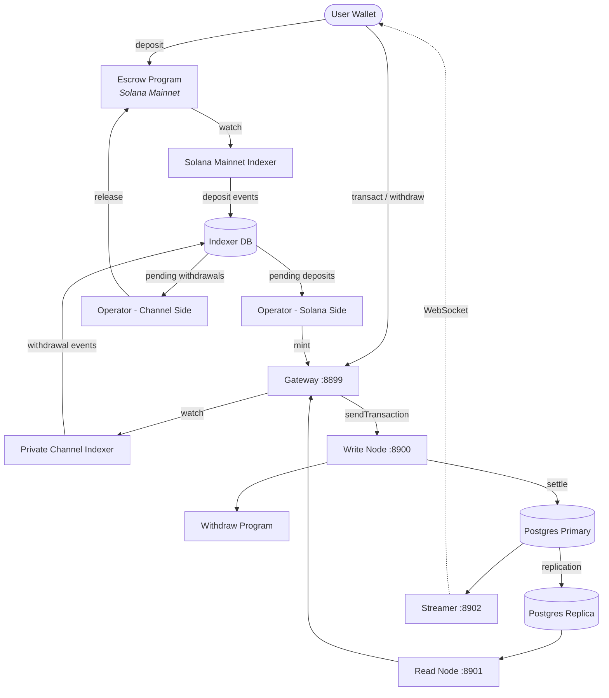

<Callout type="warning">
  Private Channels не прошёл аудит безопасности и не рекомендуется для
  использования в production с реальными средствами без тщательной проверки безопасности.
</Callout>

<Callout type="info">
  **Развёртываете экземпляр?** Перейдите к [руководству
  оператора](/docs/tools/private-channels/operators). **Интегрируетесь с
  существующим экземпляром?** Перейдите к
  [Quickstart](/docs/tools/private-channels/quickstart/installation). Эта страница
  является справочником по архитектуре для обеих аудиторий.
</Callout>

## Архитектура

Private Channels состоит из четырёх компонентов: двух on-chain программ Solana
(Escrow и Withdraw) и двух off-chain сервисов (Gateway и Auth Service).
Вместе они образуют протокол state channel, где средства хранятся в Mainnet, а
переводы осуществляются off-chain.

### Программа Escrow

Программа Escrow — это on-chain программа Solana, которая хранит задепонированные SPL-токены. Она является якорем доверия системы: все средства в конечном счёте находятся в escrow до тех пор, пока оператор не предоставит действительное доказательство исключения Sparse Merkle Tree для их освобождения.

- Program ID: `9tgHa1DcnaSSUtmMsst8ovKTe1Gfxzezn27KnH9xXYeU`
- Этот ID компилируется в бинарный файл программы через `declare_id!()`. Off-chain
  сервисы читают тот же ID во время компиляции из сгенерированного клиентского крейта, а не
  из переменной окружения.
- Управляет PDA-аккаунтами `Instance`, `AllowedMint` и `Operator`
- Инструкции: `CreateInstance`, `AllowMint`, `BlockMint`, `AddOperator`,
  `RemoveOperator`, `SetNewAdmin`, `Deposit`, `ReleaseFunds`, `ResetSmtRoot`

### Программа Withdraw

Программа Withdraw работает в сети приватного канала, а не в Solana Mainnet.
Пользователи вызывают `WithdrawFunds` для сжигания своего баланса токенов на стороне канала. Это сжигание
не освобождает средства автоматически; оно сигнализирует оператору о том, что
ожидается вывод средств. Затем оператор вызывает `ReleaseFunds` в программе Escrow
с действительным SMT-доказательством для завершения расчёта.

- Program ID: `J231K9UEpS4y4KAPwGc4gsMNCjKFRMYcQBcjVW7vBhVi`
- Этот ID компилируется в бинарный файл программы. Off-chain сервисы читают тот же
  ID во время компиляции из сгенерированного клиентского крейта, а не из переменной
  окружения.

### Gateway

Gateway — это совместимый с Solana JSON-RPC прокси, который направляет клиентские запросы к
write-ноде сети канала (для отправки транзакций) и read-ноде (для
запросов). Он настраивается через переменные окружения: `GATEWAY_PORT`,
`GATEWAY_WRITE_URL`, `GATEWAY_READ_URL`.

Эндпоинты проверки работоспособности (аутентификация не требуется):

- `GET /health` — проверка живости; возвращает `200 {"status":"ok"}`
- `GET /ready` — глубокая проверка готовности, опрашивает write- и read-ноды; возвращает
  `200 {"status":"ready"}` или `503 {"status":"degraded"}`

#### Маршрутизация RPC-методов и управление доступом

Gateway направляет `sendTransaction` на write-ноду, а все остальные методы —
на read-ноду. Запросы размером более 64 КБ отклоняются с HTTP 413. Когда
аутентификация включена, доступ к методам контролируется JWT-ролью. См.
**[Аутентификация и роли](/docs/tools/private-channels/concepts/auth)** для получения
полной матрицы методов.

### Auth Service

Auth Service — необязательный компонент, выпускающий HS256 JWT (срок действия 24 часа)
для контроля доступа к gateway. Он активируется при наличии переменной окружения `JWT_SECRET`.
Без неё gateway принимает все подключения.

Поля JWT: `sub` (UUID пользователя), `role` (`"user"` или `"operator"`), `iss`
(`"private-channel-auth"`), `aud` (`"private-channel-gateway"`), `exp` (Unix-временная
метка). `iss` и `aud` проверяются конфигурацией JWT gateway,
а не десериализуются в структуру claims приложения: на уровне приложения
доступны только `sub`, `role` и `exp`.

Роли:

- `user` — доступ ограничен собственными верифицированными кошельками; не может вызывать `getBlock`,
  `getTransaction` или `simulateTransaction`
- `operator` — обходит все проверки владения; полный доступ к RPC-методам; должен быть
  зарегистрирован в базе данных (самостоятельное повышение привилегий невозможно)

### Streamer

Streamer — это WebSocket-сервер, который отправляет обновления состояния канала
подключённым клиентам в режиме реального времени, устраняя необходимость опрашивать RPC. Он опрашивает
PostgreSQL на предмет изменений состояния. Он входит в базовый стек Docker Compose, а не
в стек devnet, который разворачивается в этом руководстве; см.
[справочник по конфигурации](/docs/tools/private-channels/operators/configuration#service-port-reference).

- Порт: `8902`, настраивается через `STREAMER_PORT`
- Подключение: `ws://localhost:8902`
- Эндпоинт проверки работоспособности: `GET /health` — возвращает `503`, если какой-либо внутренний цикл опроса
  зависает более чем на 30 секунд

<Callout type="warning">
  Схема событий WebSocket пока не задокументирована публично. Обратитесь к
  [`core/src/bin/streamer.rs`](https://github.com/solana-foundation/solana-private-channels/blob/main/core/src/bin/streamer.rs)
  для получения деталей реализации до появления официальной документации.
</Callout>



## Конвейер транзакций

```text
Transaction -> [1:Dedup] -> [2:SigVerify] -> [3:Sequencer] -> [4:Executor] -> [5:Settler] -> Database
```

Транзакции, отправленные в Gateway, проходят через пятиэтапный конвейер до
фиксации их состояния:

1. **Dedup** — фильтрует дублирующиеся транзакции до их попадания в конвейер
2. **SigVerify** — проверяет подписи транзакций по открытому ключу подписанта
3. **Sequencer** — детерминированно упорядочивает корректные транзакции для формирования
   канонической истории
4. **Executor** — выполняет транзакции на уровне аккаунтов канала
   (BOB Cache + AccountsDB), обновляя балансы off-chain
5. **Settler** — фиксирует накопленные результаты транзакций в PostgreSQL и
   обновляет кэш Redis; генерирует новые blockhash для следующего цикла блоков.
   Расчёт с Mainnet (вызов `ReleaseFunds`) выполняется отдельно сервисом
   `operator-private-channel`

## Ключевые возможности

### Конфиденциальность

Переводы между участниками канала не записываются в Solana Mainnet. На chain
отображаются только депозиты (вход в канал) и финальные выводы (выход из канала).
Идентификаторы контрагентов и суммы переводов не видны сторонним наблюдателям
во время работы канала.

### Производительность

Off-chain конвейер исключает время блока Solana из критического пути.
Переводы подтверждаются, когда их обрабатывает секвенсор, а не когда подтверждается блок Solana.
Это обеспечивает финализацию за доли секунды и пропускную способность, превосходящую
нативный TPS Solana для переводов на уровне приложения.

### Расчёт

Каждый вывод средств защищён on-chain доказательством Sparse Merkle Tree. Корень SMT
хранится в `Instance.withdrawal_transactions_root` в программе Escrow.
При вызове `ReleaseFunds` программа сначала проверяет доказательство исключения для
ранее не встречавшегося nonce относительно текущего on-chain корня, затем проверяет отдельное
доказательство включения для этого nonce относительно нового корня, предоставленного вызывающим. Только после
прохождения обеих проверок сохраняется новый корень, что делает двойное расходование невозможным даже
при компрометации ключа оператора.

## Модель безопасности

**Ключ администратора** — управляет созданием экземпляров (`CreateInstance`) и
предоставлением прав оператора (`AddOperator` / `RemoveOperator`). Компрометация ключа администратора
позволяет произвольно назначать операторов. `SetNewAdmin` передаёт права администратора
безвозвратно за одну транзакцию; защищайте ключ администратора соответствующим образом.

**Ключи операторов** — могут вызывать `ReleaseFunds` и `ResetSmtRoot`. Они не могут
освобождать средства без действительного доказательства исключения SMT относительно текущего on-chain
корня. On-chain проверка `verify_smt_exclusion_proof` является последним рубежом защиты
от несанкционированных выводов: одного только скомпрометированного ключа оператора
недостаточно для опустошения escrow.

**Корень SMT** — хранится on-chain в `Instance.withdrawal_transactions_root`.
Обновляется атомарно при каждом вызове `ReleaseFunds`. Поскольку каждое доказательство должно
ссылаться на ранее не встречавшийся nonce, двойное расходование одного и того же баланса канала
невозможно даже при компрометации ключа оператора.

**Ротация дерева** — `Instance.current_tree_index` отслеживает epoch деревьев. При
вызове `ResetSmtRoot` индекс дерева увеличивается, а все nonce из предыдущего epoch дерева
аннулируются, обеспечивая чистый лист для новых циклов расчёта.

## Безопасность операционных ключей

<Callout type="warning">
  Off-chain сервисы используют собственный набор ключей подписанта, не связанный с
  on-chain правами администратора/оператора, описанными в модели безопасности выше.
  `ADMIN_PRIVATE_KEY` обязателен для каждого сервиса оператора и оплачивает
  комиссии за транзакции; отдельный необязательный `OPERATOR_PRIVATE_KEY` предоставляет
  on-chain подпись оператора для `ReleaseFunds` и `ResetSmtRoot`, и при отсутствии
  использует значение `ADMIN_PRIVATE_KEY`. Никогда не помещайте протокольный
  ключ администратора экземпляра (используемый для `CreateInstance` / `AddOperator` / `SetNewAdmin`)
  ни в одну из этих переменных и не используйте его во время работы; храните этот ключ в холодном хранилище в офлайне.
</Callout>

`ReleaseFunds` и `ResetSmtRoot` требуют двух on-chain подписей: плательщика комиссии
(из `ADMIN_PRIVATE_KEY`) и владельца Operator PDA (из
`OPERATOR_PRIVATE_KEY`, или `ADMIN_PRIVATE_KEY`, если тот не задан). В пошаговом руководстве по devnet
в этом гайде сгенерированный keypair оператора помещается в
`ADMIN_PRIVATE_KEY`, а `OPERATOR_PRIVATE_KEY` остаётся незаданным, поэтому один и тот же keypair
выполняет обе роли подписанта. Обращайтесь с ключом, оказавшимся в `ADMIN_PRIVATE_KEY`, с теми же мерами
предосторожности, что и с приватным ключом горячего кошелька:

- Храните его только в файле `.env`, добавленном в gitignore, никогда — в `.env.devnet` или
  каких-либо зафиксированных конфигах
- Для production-развёртываний рассмотрите использование менеджера секретов (AWS Secrets Manager,
  HashiCorp Vault) вместо переменной окружения в открытом виде
- Протокольный keypair администратора экземпляра (используемый для вызова `AddOperator` /
  `SetNewAdmin`) следует хранить в холодном хранилище; он нужен только во время настройки экземпляра
  и предоставления прав оператора, но не во время работы

`SetNewAdmin` передаёт права администратора **безвозвратно в рамках одной транзакции**:
текущий администратор не имеет пути к восстановлению без содействия нового администратора.
Не вызывайте эту инструкцию, не проверив целевой адрес.

## Дальнейшие шаги

<Cards>
  <Card
    title="Quickstart"
    href="/docs/tools/private-channels/quickstart/installation"
  >
    Настройте окружение и сгенерируйте TypeScript-клиенты.
  </Card>
  <Card title="Каналы" href="/docs/tools/private-channels/concepts/channels">
    Узнайте об участниках и жизненном цикле канала.
  </Card>
  <Card
    title="Sparse Merkle Tree"
    href="/docs/tools/private-channels/concepts/smt"
  >
    Узнайте, как доказательства вывода средств верифицируются on-chain.
  </Card>
  <Card
    title="Инструкции"
    href="/docs/tools/private-channels/instructions/deposit"
  >
    Полный справочник инструкций для всех программ.
  </Card>
</Cards>
