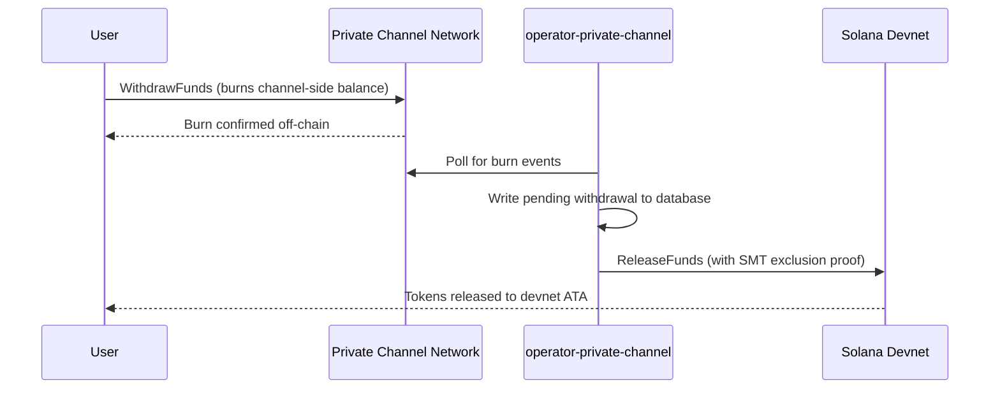

## Обзор

Вывод средств из Private Channels — это двухэтапный процесс. Сначала пользователь сжигает
баланс токенов на стороне канала, вызывая `WithdrawFunds` в программе Withdraw
Program. Затем оператор вызывает `ReleaseFunds` в программе Escrow Program (devnet,
в данном руководстве) с действительным доказательством исключения Sparse Merkle Tree для освобождения
средств. Доказательство SMT гарантирует, что каждый нонс вывода может быть использован только один раз,
предотвращая двойное расходование.



## Шаг 1: Инициирование вывода на канале

Вызовите `WithdrawFunds` в программе Withdraw Program, чтобы сжечь баланс на стороне канала.
Используйте вариант `Async`, который автоматически выводит PDA `tokenAccount` и является
рекомендуемой формой для использования в production:

```typescript
import { getWithdrawFundsInstructionAsync } from "../private-channel-withdraw-program/clients/typescript/src/generated";
import {
  createSolanaRpc,
  address,
  pipe,
  createTransactionMessage,
  setTransactionMessageFeePayerSigner,
  setTransactionMessageLifetimeUsingBlockhash,
  appendTransactionMessageInstruction,
  signAndSendTransactionMessageWithSigners,
  assertIsTransactionMessageWithSingleSendingSigner,
  getBase58Decoder
} from "@solana/kit";

// Point to the gateway, not a public Solana RPC
const privateChannelRpc = createSolanaRpc("http://localhost:8899");

const withdrawIx = await getWithdrawFundsInstructionAsync({
  user: userSigner,
  mint: address(mintAddress),
  amount: 1_000_000n, // 1 USDC (6 decimals)
  destination: null // null = release to signer's devnet wallet
});

const { value: latestBlockhash } = await privateChannelRpc
  .getLatestBlockhash({ commitment: "confirmed" })
  .send();

// Sent to the Private Channels gateway (not Solana RPC directly), which
// expects the legacy transaction format - do not switch this to version 0.
const transactionMessage = pipe(
  createTransactionMessage({ version: "legacy" }),
  (m) => setTransactionMessageFeePayerSigner(userSigner, m),
  (m) => setTransactionMessageLifetimeUsingBlockhash(latestBlockhash, m),
  (m) => appendTransactionMessageInstruction(withdrawIx, m)
);

assertIsTransactionMessageWithSingleSendingSigner(transactionMessage);

const signatureBytes =
  await signAndSendTransactionMessageWithSigners(transactionMessage);
const signature = getBase58Decoder().decode(signatureBytes);
console.log("Withdrawal initiated:", signature);
```

- Идентификатор программы Withdraw Program: `J231K9UEpS4y4KAPwGc4gsMNCjKFRMYcQBcjVW7vBhVi`
- Отправьте эту транзакцию на шлюз (`http://localhost:8899`), а не на
  публичный RPC Solana
- Если указан `destination`, освобождённые средства поступят на этот кошелёк вместо
  кошелька подписанта

## Чего ожидать

После вызова `WithdrawFunds` никаких дополнительных действий не требуется. Операторские
сервисы выполняют расчёт автоматически:

1. `indexer-private-channel` опрашивает канал каждую 1 секунду на наличие событий сжигания
   и записывает запись об ожидающем выводе при их обнаружении
2. `operator-private-channel` опрашивает базу данных каждую 1 секунду на наличие ожидающих
   записей и отправляет `ReleaseFunds` в программу Escrow Program в Solana devnet
   с требуемым доказательством исключения SMT; он проверяет подтверждение в devnet до
   5 раз с интервалом 400 мс перед повторной попыткой

Средства, как правило, появляются в вашем кошельке devnet в течение нескольких секунд при нормальных
условиях.

## Как оператор выполняет расчёт (справочная информация)

После сжигания на стороне канала подготовленный оператор должен вызвать `ReleaseFunds` в
программе Escrow Program с действительным доказательством исключения SMT; оператор не может освободить
средства без доказательства того, что нонс вывода ранее не использовался. Этот шаг
выполняется автоматически сервисом `operator-private-channel`; вам не нужно вызывать
его самостоятельно.

Оператор предоставляет:

- `amount`: должно совпадать со сожжённой суммой
- `user`: кошелёк получателя в devnet
- `new_withdrawal_root`: обновлённый корень SMT после данного вывода
- `transaction_nonce`: уникальный нонс для этого листа
- `sibling_proofs`: 512 байт (16 x 32-байтовых хэша смежных узлов для доказательства дерева)

## Проверка

После подтверждения вызова оператора проверьте баланс токенов в devnet:

```bash
spl-token balance <MINT_ADDRESS> --owner <YOUR_WALLET>
```

Или через RPC:

```typescript
import { createSolanaRpc, address } from "@solana/kit";
import { findAssociatedTokenPda } from "@solana-program/token";

const TOKEN_PROGRAM_ADDRESS = address(
  "TokenkegQfeZyiNwAJbNbGKPFXCWuBvf9Ss623VQ5DA"
);

// Query devnet directly; ReleaseFunds settles here, not through the gateway
const rpc = createSolanaRpc("https://api.devnet.solana.com");

const [yourDevnetAta] = await findAssociatedTokenPda({
  mint: address(mintAddress),
  owner: address(userSigner.address),
  tokenProgram: TOKEN_PROGRAM_ADDRESS
});

const balance = await rpc.getTokenAccountBalance(yourDevnetAta).send();
console.log(balance.value.uiAmountString);
```

## Быстрый старт завершён

Вы прошли полный цикл Private Channels в devnet: внесли SPL-токены в эскроу,
отправили внецепочечный перевод через шлюз и вывели средства
обратно в ваш кошелёк devnet.

<Cards>
  <Card
    title="Жизненный цикл канала"
    href="/docs/tools/private-channels/concepts/channels"
  >
    Подробно изучите участников и полный процесс от депозита до вывода средств.
  </Card>
  <Card
    title="Аутентификация и роли"
    href="/docs/tools/private-channels/concepts/auth"
  >
    Добавьте JWT-аутентификацию в вашу интеграцию.
  </Card>
  <Card
    title="Справочник по ReleaseFunds"
    href="/docs/tools/private-channels/instructions/release-funds"
  >
    Полный справочник по инструкции ReleaseFunds для инструментария оператора.
  </Card>
  <Card
    title="Sparse Merkle Tree"
    href="/docs/tools/private-channels/concepts/smt"
  >
    Узнайте, как доказательства вывода предотвращают двойное расходование.
  </Card>
</Cards>
