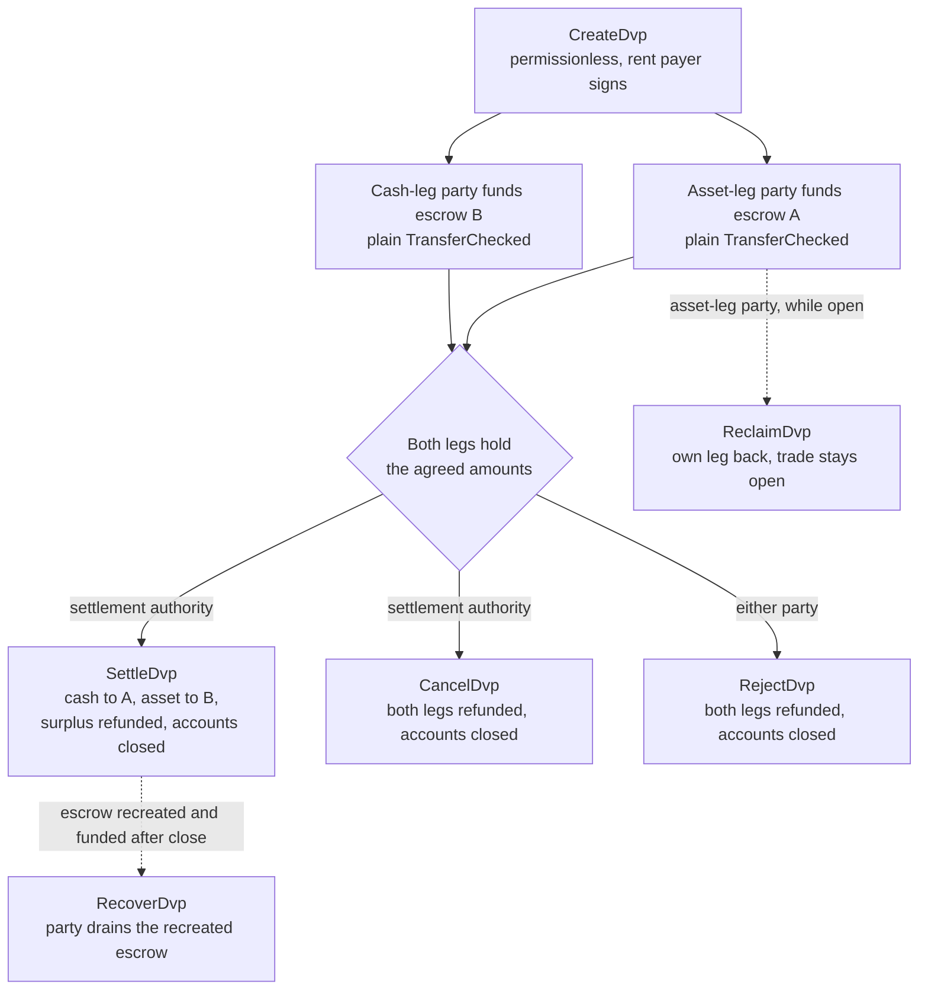
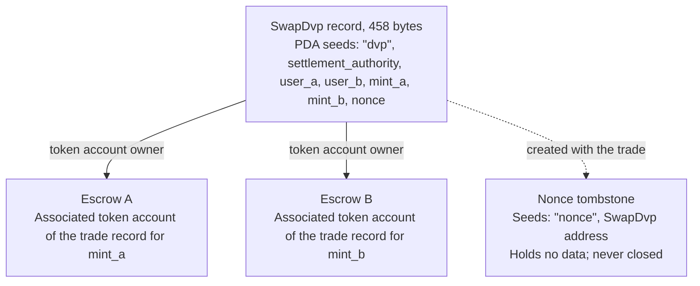

DvP programı, Solana'da ödemeye karşı teslimat (delivery versus payment) için standart programdır;
Solana Foundation tarafından sürdürülür ve Cantina tarafından denetlenmiştir. İki taraf bir işlem üzerinde
anlaşır, her biri kendi bacağını sıradan bir token transferiyle bir escrow hesabına gönderir ve bir takas
yetkilisi her iki bacağı tek bir transaction'da takas eder; böylece ya ikisi birden hareket eder ya da
hiçbiri. Takas yetkilisi, işlemde adı geçen üçüncü bir adrestir; örneğin işlemi düzenleyen platform ya da
aracı. Taraflardan hiçbiri program yazmaz veya dağıtmaz; standart bir token transferi (`TransferChecked`)
gönderebilen bir cüzdan ya da saklayıcı, DvP'ye özgü herhangi bir entegrasyon olmadan bir bacağı
fonlayabilir. Takas gerçekleşene kadar taraflardan her biri kendi bacağını geri alabilir veya işlemi geri
sarabilir.

<Callout type="warn" title="Harekete geçmeden önce kaydı okuyun">

İşlem kaydı oluşturmak izinsizdir (permissionless); dolayısıyla bir kayıt, anlaşmanın kanıtı değildir.
Her taraf fonlamadan önce, takas yetkilisi ise takas etmeden önce saklanan koşulları okur (bkz.
[doğrulama](#verification-before-funding-and-settlement)).

</Callout>

## Nasıl çalışır

Her işlem için program sahipliğinde bir kayıt ve her bacak için bir tane olmak üzere iki escrow hesabı
oluşturulur. Varlık bacağı tarafı (`user_a`) ile nakit bacağı tarafı (`user_b`), token'ları ilgili
bacağın escrow hesabına aktararak kendi bacaklarını fonlar. Takas edebilen tek imzacı takas yetkilisidir.
Takas, her bacağın kararlaştırılan miktarını karşı tarafa aktarır, fazlalığı bacağın sahibi olan tarafa
iade eder ve kaydı ile her iki escrow'u kapatır. Atomiklik Solana [transaction'larından](/docs/core/transactions) gelir:
her iki transfer de tek bir transaction içindedir; dolayısıyla ya ikisi de geçerli olur ya da hiçbiri.

Her iade, geri alma ve fazlalık iadesi tarafın kendi associated token account'una gider: `mint_a` için
`user_a`'nın hesabına, `mint_b` için `user_b`'nin hesabına. Bir saklayıcı ya da hazine sistemi bir bacağı
kendi hesabından fonlayabilir, ancak iade edilen her şey saklayıcıya değil, tarafın hesabına gelir. Her
işlem ayrıca kalıcı bir işaretleyici hesap bırakır (bkz. [Durum](#state)).

## Rehberler

Adım sayfaları, her talimat için TypeScript ve Rust örnekleriyle bir işlemi oluşturulmasından takasına
kadar ele alır.

<Cards>
  <Card title="İşlem oluşturun" href="/docs/defi/dvp-program/create-a-trade">
    İstemcileri kurun ve işlemin koşullarını CreateDvp ile kaydedin
  </Card>
  <Card title="Bacakları fonlayın" href="/docs/defi/dvp-program/fund-the-legs">
    Saklanan koşulları doğrulayın, ardından her bacağı basit bir transferle fonlayın
  </Card>
  <Card title="İşlemi takas edin" href="/docs/defi/dvp-program/settle-the-trade">
    Takas yetkilisi olarak her iki bacağı tek bir transaction'da takas edin
  </Card>
  <Card title="İşlemi geri sarın" href="/docs/defi/dvp-program/unwind-a-trade">
    Bir bacağı geri talep edin, işlemi iptal edin veya reddedin ve geç yatırılan tutarları kurtarın
  </Card>
</Cards>

Bir [devnet demosu](https://solana.com/delivery-vs-payment/demo) bir işlemi baştan sona çalıştırır: işlemi oluşturur, her iki escrow'u
standart token transferleriyle fonlar ve her iki bacağı tek bir transaction'da takas eder.

## Program ile delegasyon arasında seçim yapma

[Delegasyon kullanan Ödemeye Karşı Teslimat (DvP)](/docs/tokenization/dvp), aynı değişimi program olmadan
gerçekleştirir: her taraf pozisyonunu bir takas aracısına devreder ve aracı her iki bacağı tek bir
transaction'da hareket ettirir.

- **Program** delegasyon gerektirmez; bu nedenle token account başına tek delege sınırı geçerli değildir
  ve takas yetkilisi gelirleri başka yere yönlendiremez. Her işlem, yükseltilebilir bir programa ve onun
  yükseltme yetkilisine bağlıdır.
- **Delegasyon deseni** program bağımlılığı içermez ve Scaled UI Amount taşıyan mint'lerle çalışır.
  Program bu mint'leri reddeder; bu da Mosaic'in `tokenized-security` şablonundan oluşturulan tüm
  mint'leri dışarıda bırakır (bkz.
  [mint yapılandırma kısıtlamaları](#mint-configuration-constraints)).

## Roller

Program simetriktir. Arayüzünde iki taraf, `mint_a`'yı teslim eden `user_a` ve `mint_b`'yi teslim eden
`user_b`'dir. README ve oluşturulan istemciler `mint_a`'ya varlık bacağı, `mint_b`'ye nakit bacağı der;
bu sayfalar da bu kurala uyar, ancak programda nakit bacağının bir nakit aracı olmasını gerektiren hiçbir
şey yoktur. İki varlık ya da iki stablecoin de aynı şekilde takas edilir.

| Rol                 | Kim                               | İmzaladığı                                              | Notlar                                                                                                                                                                                                     |
| -------------------- | --------------------------------- | -------------------------------------------------- | --------------------------------------------------------------------------------------------------------------------------------------------------------------------------------------------------------- |
| Varlık bacağı tarafı      | `user_a`, `mint_a`'yı teslim eder       | Kendi fonlama transferi; Reclaim, Reject, Recover | Bir keypair cüzdanı veya multisig kasası gibi PDA tabanlı bir akıllı cüzdan. Bir SPL Token multisig hesabı veya bir program account taraf olamaz: Create, `PartyNotSignerCapable` hatasıyla başarısız olur                   |
| Nakit bacağı tarafı       | `user_b`, `mint_b`'yi teslim eder       | Kendi fonlama transferi; Reclaim, Reject, Recover | Aynı gereklilik                                                                                                                                                                                          |
| Takas yetkilisi | Oluşturma sırasında belirtilen üçüncü bir adres | Settle, Cancel                                     | Takas edebilen tek imzacı. Oluşturma sırasında sabitlenen gelirleri başka yere yönlendiremez. Takas ettiğinde veya iptal ettiğinde kapatılan hesapların rent'ini alır                                         |
| Rent ödeyen           | `CreateDvp`'yi kim imzalarsa         | Create                                             | Kayıt, nonce tombstone ve her iki escrow için rent'i (bir hesabı açık tutan SOL depozitosu) fonlar. Rent alıcısı olarak kaydedilmez: kapatılan hesapların rent'i işlemi kapatan kişiye gider |

## Program ID

```text
dvp34bdbcEm4f4FCUjGV4mDAkDshaQR4LkK8fdcsyZq
```

| Cluster      | Program                                       | Yükseltme yetkilisi                              | Son dağıtılan slot |
| ------------ | --------------------------------------------- | ---------------------------------------------- | ------------------ |
| mainnet-beta | `dvp34bdbcEm4f4FCUjGV4mDAkDshaQR4LkK8fdcsyZq` | `DXtFpbPjcn2hxPnw79x1Pfoj35vXh5AsWBkS37YnXMVv` | 452.058.374        |
| devnet       | `dvp34bdbcEm4f4FCUjGV4mDAkDshaQR4LkK8fdcsyZq` | `5EX1zFeJWj4rGYZv432WnYw8CbaSUeTdxPx4r573UgYU` | 479.376.863        |

Program her iki cluster'da da yükseltilebilir. Yukarıdaki değerler, `solana program show` komutunun 2
Ekim 2026 tarihinde bildirdiği değerlerdir; güncel değerler için aynı komutu çalıştırın. Devnet
derlemesi, adım sayfalarının yazıldığı commit'ten (bkz. [Kurulum](/docs/defi/dvp-program/create-a-trade#install)) daha eskidir; talimat ve
hata kümesi aynıdır.

## Yaşam döngüsü



Bir işlem, `CreateDvp` ile açılır ve Settle, Cancel veya Reject'ten biri onu kapatana kadar açık kalır.
Fonlamanın kendine ait bir talimatı yoktur: bir bacak, escrow hesabı en az kararlaştırılan miktarı
tuttuğunda fonlanmış sayılır. Reclaim bacak bazındadır ve işlemi açık bırakır; böylece bir bacakla
ilgili sorun, diğer tarafı tüm işlemi iptal etmeye zorlamaz.

## Durum

Her işlemin, programa ait 458 baytlık tek bir `SwapDvp` hesabı vardır. Adresi; takas yetkilisinden, iki
taraftan, iki mint'ten ve bir nonce'tan türetilir (`["dvp", settlement_authority, user_a, user_b,
mint_a, mint_b, nonce]` seed'leri). Miktarlar ve zamanlar hesabın içinde saklanır ve adresi etkilemez;
bu yüzden tahmin edilmek yerine okunmaları gerekir. `["nonce", swap_dvp]` adresindeki nonce tombstone
adlı küçük bir işaretleyici hesap, işlemle birlikte oluşturulur ve hiçbir zaman kapatılmaz; bu nedenle
taraflar, mint'ler, yetkili ve nonce'un her kombinasyonu yalnızca bir işlem için kullanılabilir.



| Alan                                  | Tür          | Anlamı                                                                                                 |
| -------------------------------------- | ------------- | ------------------------------------------------------------------------------------------------------- |
| `bump`                                 | `u8`          | PDA bump                                                                                                |
| `user_a`, `user_b`                     | `Pubkey`      | İki taraf                                                                                         |
| `mint_a`, `mint_b`                     | `Pubkey`      | Varlık bacağı ve nakit bacağı mint'leri                                                                        |
| `settlement_authority`                 | `Pubkey`      | Takas edebilen veya iptal edebilen tek imzacı                                                               |
| `token_program_a`, `token_program_b`   | `Pubkey`      | Her mint'in sahibi olan Token Program; bir işlemde SPL Token ve Token-2022 bacakları karıştırılabilir                    |
| `amount_a`, `amount_b`                 | `u64`         | Her bacağın kararlaştırılan miktarı, mint'in en küçük biriminde (temel birimler)                                 |
| `expiry_timestamp`                     | `i64`         | Bu ağ zamanından (onchain saat) sonra Settle reddedilir. Reclaim, Cancel ve Reject yine de çalışır |
| `nonce`                                | `u64`         | Diğer seed'leri paylaşan işlemleri birbirinden ayırır. Tek kullanımlıktır                                             |
| `ref_string`                           | `[u8; 64]`    | Opak bir istemci referansı, sıfırlarla doldurulmuş; program bunu hiçbir zaman okumaz                                     |
| `user_a_settlement_destination`        | `Pubkey`      | Settle sırasında nakit bacağını alır; varsayılan olarak `user_a`                                                   |
| `user_b_settlement_destination`        | `Pubkey`      | Settle sırasında varlık bacağını alır; varsayılan olarak `user_b`                                                  |
| `mint_a_authority`, `mint_b_authority` | `Pubkey`      | Oluşturma sırasında kaydedilen mint yetkilileri; biri değişmişse Settle başarısız olur                           |
| `earliest_settlement_timestamp`        | `Option<i64>` | Ayarlanmışsa, Settle bu ağ zamanından önce reddedilir                                                     |

Alan listesi, [İşlem oluşturun](/docs/defi/dvp-program/create-a-trade#install) bölümünde adı geçen commit'teki
programın IDL'inden alınmıştır.

## Talimatlar

| Talimat  | İmzacı               | Etki                                                                                                                                                              |
| ------------ | -------------------- | ------------------------------------------------------------------------------------------------------------------------------------------------------------------- |
| `CreateDvp`  | Herhangi bir ödeyen            | `SwapDvp` kaydını, nonce tombstone'unu ve her iki escrow hesabını oluşturur. Hiç token hareket ettirmez                                                                        |
| `ReclaimDvp` | `user_a` veya `user_b` | İmzalayanın kendi bacağını escrow'dan iade eder. İşlem açık kalır ve bacak yeniden fonlanabilir                                                                      |
| `SettleDvp`  | Takas yetkilisi | `amount_a` tutarını `user_b`'nin hedefine, `amount_b` tutarını `user_a`'nın hedefine aktarır, fazlalığı bacağın tarafına iade eder, kaydı ve her iki escrow'u kapatır |
| `CancelDvp`  | Takas yetkilisi | Escrow A'da ne varsa `user_a`'ya, escrow B'dekini `user_b`'ye iade eder; kaydı ve her iki escrow'u kapatır                                                            |
| `RejectDvp`  | `user_a` veya `user_b` | Cancel ile aynı etki; bir taraf imzalar                                                                                                                            |
| `RecoverDvp` | `user_a` veya `user_b` | İşlem kapandıktan sonra: yeniden oluşturulmuş bir escrow'u imzalayanın kendi token account'una boşaltır ve kapatır. Settle, Cancel veya Reject'ten sonra gelen bir depozitoyu kapsar  |

Her iade, escrow'u kim fonlamış olursa olsun, ilgili bacağın mint'i için tarafın kendi associated token
account'una gider.

Her talimatın hesapları ve argümanları o adımın sayfasında yer alır.

## Hatalar

| Kod | Hata                            | Ne zaman                                                                                                   |
| ---- | -------------------------------- | ------------------------------------------------------------------------------------------------------ |
| 0    | `SignerNotParty`                 | Reclaim, Reject veya Recover, `user_a` ya da `user_b` olmayan bir adres tarafından imzalanmış                      |
| 1    | `DvpExpired`                     | `expiry_timestamp` sonrasında Settle                                                                        |
| 2    | `SettlementAuthorityMismatch`    | Settle veya Cancel, takas yetkilisi dışındaki bir adres tarafından imzalanmış                              |
| 3    | `SettlementTooEarly`             | `earliest_settlement_timestamp` öncesinde Settle                                                          |
| 4    | `LegNotFunded`                   | Bir escrow kararlaştırılan miktarından azını tutarken Settle                                               |
| 5    | `ExpiryNotInFuture`              | Bitiş zamanı mevcut ağ zamanına eşit veya ondan önce olacak şekilde Create                                            |
| 6    | `EarliestAfterExpiry`            | En erken takas zamanı bitiş zamanından sonra olacak şekilde Create                                               |
| 7    | `SelfDvp`                        | `user_a`, `user_b`'ye eşit olacak şekilde Create                                                                 |
| 8    | `SameMint`                       | `mint_a`, `mint_b`'ye eşit olacak şekilde Create                                                                 |
| 9    | `ZeroAmount`                     | Bacaklardan herhangi birinde sıfır miktarla Create                                                                |
| 10   | `BlockedMintExtension`           | TransferFee, InterestBearing, ScaledUiAmount veya NonTransferable taşıyan bir mint ile Create veya Settle |
| 11   | `SettlementAuthorityIsParty`     | Takas yetkilisi taraflardan birine eşit olacak şekilde Create                                                  |
| 12   | `SettlementAuthorityExecutable`  | Çalıştırılabilir (executable) bir takas yetkilisiyle Create                                                         |
| 13   | `NonceAlreadyUsed`               | Zaten bir tombstone'u olan bir `(seeds, nonce)` değerini yeniden kullanan Create                                         |
| 14   | `ExpiryTooFarInFuture`           | Bitiş zamanı bir yıldan daha ileride olacak şekilde Create                                                         |
| 15   | `RefStringTooLong`               | 64 bayttan uzun bir referansla Create                                                           |
| 16   | `DvpStillOpen`                   | İşlem hâlâ açıkken Recover; Reclaim kullanın                                                     |
| 17   | `DvpNeverCreated`                | Tombstone'u olmayan seed'lerle Recover                                                              |
| 18   | `EscrowPreloadedWithLamports`    | Yerel olmayan bir escrow, rent-exempt asgari tutarının üzerinde lamport tuttuğunda Create                           |
| 19   | `SettlementDestinationIsSwapDvp` | Takas hedefi alım satım kaydına eşit olacak şekilde Create                                         |
| 20   | `SwapDvpPreloadedWithLamports`   | Kayıt adresi, rent rezervinin üzerinde lamport tuttuğunda Create                                   |
| 21   | `RecipientAtaMismatch`           | Alıcı veya iade token account'u artık beklenen cüzdana ve mint'e ait değil                  |
| 22   | `PartyNotSignerCapable`          | Sistem sahipli, yürütülemez bir hesap olmayan bir tarafla Create                                 |
| 23   | `MintAuthorityChanged`           | Bir ayağın mint authority'si oluşturma sırasında kaydedilen değerden farklı olduğunda Settle                         |

## Olaylar ve indeksleme

Program zincir üstü (onchain) olay yaymaz. Bir indexer veya mutabakat sistemi,
`SwapDvp` hesap durumunu ve iki escrow'un token bakiyelerini okur; bir alım satımı
zincir dışı siparişiyle eşleştirmek için `ref_string` kullanır. Kayıt takas
sırasında kapatıldığından, koşullara sonradan ihtiyaç duyan bir sistem bunları
okuduğu anda saklar veya alım satımı oluşturan işlemden yeniden oluşturur.

## Desteklenen token'lar

Bir alım satım, bir SPL Token ayağını bir Token-2022 ayağıyla eşleştirebilir; her
ayak kendi token programını taşır. Wrapped SOL ayakları desteklenir.

| Bir ayağın mint'indeki Token-2022 uzantısı                                                     | Program davranışı                                                  |
| ---------------------------------------------------------------------------------------- | ----------------------------------------------------------------- |
| TransferFee, InterestBearing, ScaledUiAmount, NonTransferable                            | Create ve Settle sırasında `BlockedMintExtension` ile reddedilir         |
| PermanentDelegate, Pausable, DefaultAccountState, bir freeze authority, MintCloseAuthority | Kabul edilir; her yetkili, escrow'daki token'lar üzerinde işlem yapabilir           |
| ConfidentialTransfer                                                                     | Kabul edilir; o ayaktaki tutarlar herkese açıktır                          |
| TransferHook                                                                             | Desteklenir, ayak başına en fazla 32 ek hesap                        |
| Hedef veya iade hesabında MemoTransfer                                          | Kabul edilir; program, transferden önce gerekli memo'yu yayar |

Transfer ücreti, alıcı tarafı kararlaştırılan tutarın altında bırakır. Interest
Bearing ve Scaled UI Amount ham tutarları değiştirmez, ancak oranları veya
çarpanları bir alım satımın oluşturulması ile takası arasında değişebilir; bu da
kararlaştırılan tutarların nasıl görüntüleneceğini değiştirir. NonTransferable her
iki ayağı da kilitler.

Kabul edilen yetkililer, alım satımın ömrü boyunca escrow'daki token'ları
taşıyabilir, dondurabilir veya durdurabilir (aşağıya bakın). Escrow gizli
transferleri alacak şekilde yapılandırılamaz; bu nedenle gizli bir ayakta escrow'a
alınan ve takas edilen tutarlar herkese açıktır.

Hook'lu bir mint için istemci, hook'un ek hesaplarını çözümler ve bunları Settle,
Cancel, Reject, Reclaim ve Recover'a ekler. Ayak başına 32'lik sınır, hook
programını ve doğrulama hesabını da sayar. Hook yetkilisi hook'un hesap listesini
bu sınırın ötesine genişletirse, yetkili bunu geri alana kadar o ayaktaki her
transfer, Reclaim, Cancel, Reject ve Recover dahil, başarısız olur. Her iki ayak da
hook taşıyorsa, işlem hesap sınırı ayak başına sınırdan önce devreye girebilir.

Bir hedef veya iade hesabı memo gerektirdiğinde, program transferden önce Memo
programını çağırır; escrow'dan token çıkaran her talimatın bir `memo_program`
hesabı almasının nedeni budur.

### Mint yapılandırma kısıtlamaları

**Scaled UI Amount.** Solana Foundation'ın ihraç araç seti olan
[Mosaic](https://github.com/solana-foundation/mosaic)'teki `tokenized-security` şablonu her zaman Scaled UI Amount
ekler; bu nedenle program, bu şablondan oluşturulmuş bir mint'i ayak olarak kabul
etmez. Bu program için tasarlanmış bir mint, uzantı olmadan oluşturulabilir (bkz.
[Token Extensions](/docs/tokens/extensions)); [delegasyon kullanan DvP](/docs/tokenization/dvp) devredilmiş yetki
üzerinden takas eder ve bu kontrolü uygulamaz.

**Varsayılan olarak dondurulmuş mint'ler.** Her alım satımın escrow'u, o alım
satım için yeni oluşturulan bir program-derived address'e ait bir associated token
account'tur. Default Account State değeri frozen olarak ayarlanmış bir mint'te
escrow dondurulmuş olarak oluşturulur ve çözülene kadar içine yapılan fonlama
transferi başarısız olur. [Token ACL](/docs/tokenization/token-acl) altında bu, ihraççının veya transfer
acentesinin fonlamadan önce alım satımın escrow'unu kabul etmesi anlamına gelir: ya
alım satım kaydının adresini (escrow'un sahibi) izin listesine ekleyerek, böylece
mint'in Token ACL yapılandırması izinsiz çözmeyi etkinleştirmişse herkes escrow'u
çözebilir; ya da freeze authority'nin escrow'u doğrudan çözmesini sağlayarak.
Dondurulmuş bir escrow ayrıca o ayaktaki Settle, Reclaim, Cancel, Reject ve
Recover işlemlerini de engeller; dolayısıyla freeze authority ve hook'lu bir
mint'te hook yetkilisi, alım satımın ömrü boyunca güvenilen bir taraftır.
Dondurulmuş escrow yolu burada açıklanmıştır ve devnet kod örneklerinde
uygulanmamıştır.

## Sınırlar

- Eşleştirme, fiyat keşfi veya emir defteri yoktur. Taraflar koşulları defter
  dışında kararlaştırır ve biri bunları kaydeder.
- Netleştirme yoktur ve yalnızca ikili çalışır: bir kayıt, iki taraf arasındaki bir
alım satımdır.
- Kısmi dolum yoktur. Settle her ayağın kararlaştırılan tutarını tam olarak taşır
  ve fazlalığı ayağın tarafına iade eder.
- Defter dışı ayak yoktur. Her iki ayak da Solana üzerindeki token account'lardır;
  mevcut raylar üzerindeki bir nakit ayağı ayrıca takas edilir ve mutabakata
  bağlanır.
- Uygunluk kontrolü, izin listesi veya KYC yoktur. Hak sahibi uygunluğunu mint'in
  kendi kontrolleri uygular.
- Otomatik takas yoktur. Takas yetkilisinin imzalaması gerekir.
- Olay yoktur ve işlem ücretleri ile rent dışında protokol ücreti yoktur.

Program, iki taraf arasındaki anapara riskini ortadan kaldırır: her ikisi de
hareket etmedikçe hiçbir ayak hareket etmez. Ancak her iki token üzerindeki
ihraççı kredi veya itfa riskini, bir mint'in freeze, pause veya permanent delegate
yetkisinin escrow'daki token'lar üzerinde işlem yapabilmesini (bkz.
[desteklenen token'lar](#supported-tokens)) ya da takas yetkilisinin imzalamak için hazır
bulunmasına bağımlılığı ortadan kaldırmaz.

## Fonlama ve takas öncesi doğrulama

`CreateDvp` izinsizdir: yalnızca ödeyen imzalar; taraflar ve takas yetkilisi
imzalamaz. Dolayısıyla herkes, herhangi bir tarafı ve herhangi bir koşulu belirten
bir kayıt oluşturabilir. Fonlamadan önce ve takastan önce yeniden `SwapDvp`
hesabını okuyun ve şunları doğrulayın:

1. Hesap DvP programına aittir ve tam olarak 458 bayttır. Programa ait olmayan bir
   hesap, gerçek bir kayıt gibi çözümlenen baytlarla doldurulabilir.
2. `user_a`, `user_b`, `mint_a`, `mint_b` ve `settlement_authority` kararlaştırılan
   alım satımla eşleşir.
3. `amount_a`, `amount_b`, `expiry_timestamp` ve
   `earliest_settlement_timestamp` kararlaştırılan koşullarla eşleşir.
4. Her iki takas hedefi de kararlaştırılan adreslerdir. Sahte bir kayıt gelirleri
   başka yere yönlendirebilir.

[Ayakları fonlama](/docs/defi/dvp-program/fund-the-legs#verify-the-terms) bölümü, üretilen istemcilerin kontrollü okuyucularını
listeler ve kontrolü kodla gösterir.

Settle işlemi [`finalized`](/docs/rpc#configuring-state-commitment) düzeyine ulaştığında alım satımı takas
edilmiş sayın. Bu bir ağ taahhüt düzeyidir; aynı zamanda hukuki amaçlar bakımından
takas kesinliğini de işaretleyip işaretlemediği, tarafların sözleşmelerine ve
uygulanan rejimlere bağlıdır.

## Sürümleme

`SwapDvp` hesabında sürüm alanı yoktur. Düzeni 458 bayta (`SwapDvp::LEN`)
sabitlenmiştir ve kontrollü okuyucular başka uzunluktaki hesapları reddeder. IDL'nin
kendi sürümü vardır: 2 Ekim 2026 itibarıyla `0.1.0`.

Program her iki kümede de yükseltilebilir (bkz. [Program ID](#program-id)). Bir alım
satım kaydı yalnızca takas edilene, iptal edilene veya reddedilene kadar var
olduğundan, bir yükseltmenin açık alım satımlara nasıl davrandığını depoda kontrol
edin ve istemcileri dağıtılan sürümün IDL'sinden yeniden üretin.

## Depo ve denetim

Kaynak kod, IDL, üretilen istemciler ve testler MIT lisansı altında
[`solana-foundation/dvp`](https://github.com/solana-foundation/dvp) deposundadır. Program, `no_std` bir Pinocchio
programıdır; istemciler IDL'den Codama ile üretilir. Güvenlik açığı bildirimleri,
`SECURITY.md` uyarınca deponun güvenlik danışma bağlantısı üzerinden yapılır.

Program [Cantina](https://cantina.xyz/portfolio/fe870bb4-d96d-4902-8aec-9dfcfa2d6a79) tarafından denetlenmiştir.

## İlgili

- [Delegasyon kullanan Delivery vs Payment (DvP)](/docs/tokenization/dvp): programsız delegasyon
  kalıbı
- [Token ACL](/docs/tokenization/token-acl): kapılı bir mint'in escrow hesaplarıyla etkileşimi
