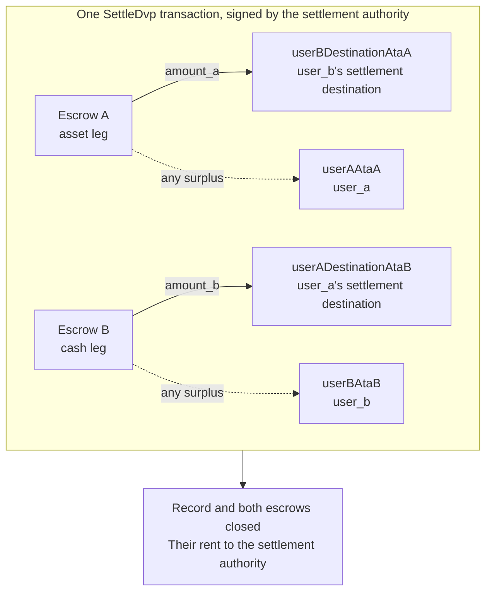

`SettleDvp`, alım satım kaydında belirtilen takas yetkilisi tarafından imzalanır. Tek
bir işlemde `amount_a` tutarındaki varlık bacağını nakit bacağı tarafının
hedefine, `amount_b` tutarındaki nakit bacağını ise varlık bacağı tarafının
hedefine taşır, her iki escrow'daki fazlalığı ilgili bacağın tarafına iade eder
ve kaydı ile her iki escrow'u kapatır. Bu transferlerden herhangi biri
tamamlanamazsa talimat başarısız olur ve hiçbir şey hareket etmez.

Bu sayfa, [alım satım oluşturma](/docs/defi/dvp-program/create-a-trade)
ve [bacakları fonlama](/docs/defi/dvp-program/fund-the-legs) sayfalarının devamıdır; client, imzalayanlar,
`trade` ve tarafların token account'ları buradan devam eder.

## İmzalamadan önce yeniden doğrulayın

Takas yetkilisi her iki bacağı taşıyan işlemi imzalar; bu nedenle imzalamadan önce
her tarafın yaptığı okumanın aynısını yapar: sahip, boyut, taraflar, mint'ler,
tutarlar, son kullanma süresi ve her iki hedef (bkz.
[bacakları fonlama](/docs/defi/dvp-program/fund-the-legs#verify-the-terms)). Program ise
takas sırasında her mint'in hâlâ oluşturma anında kaydedilen token program'a
ait olduğunu, engellenmiş bir extension taşımadığını ve alım satım oluşturulduğu
andaki mint authority ile aynı mint authority'ye sahip olduğunu yeniden kontrol
eder. Dolayısıyla engellenmiş bir extension ile, farklı bir token program ile
veya farklı bir mint authority ile yeniden oluşturulmuş bir mint takas
edilemez.

## Alıcı hesaplarını oluşturun

Settle, programın oluşturmadığı dört token account'a yazar:

| Hesap                | Aldığı                     | Sahip                           |
| ---------------------- | ---------------------------- | ------------------------------- |
| `userADestinationAtaB` | Nakit bacağı (`amount_b`)    | `user_a_settlement_destination` |
| `userBDestinationAtaA` | Varlık bacağı (`amount_a`)   | `user_b_settlement_destination` |
| `userAAtaA`            | Varlık bacağındaki fazlalık | `user_a`                        |
| `userBAtaB`            | Nakit bacağındaki fazlalık  | `user_b`                        |

Fazlalık hesapları yalnızca bir escrow kararlaştırılan tutardan fazlasını
tuttuğunda kullanılır; ancak ilgili mint'e sahip herkes escrow'a birkaç temel
birim göndererek fazlalık oluşturabilir. İade hesabı mevcut değilse Settle
tamamen başarısız olur; bu yüzden dördünü de aynı işlemde idempotent biçimde
oluşturun.

<Tabs items={["TypeScript", "Rust"]}>
  <Tab value="TypeScript">
    ```ts
    import {
      findAssociatedTokenPda,
      getCreateAssociatedTokenIdempotentInstruction,
    } from "@solana-program/token-2022";

    const destinationA = t.userASettlementDestination; // defaults to userA
    const destinationB = t.userBSettlementDestination; // defaults to userB

    const [userADestinationAtaB] = await findAssociatedTokenPda({
      mint: mintB,
      owner: destinationA,
      tokenProgram: tokenProgramB,
    });
    const [userBDestinationAtaA] = await findAssociatedTokenPda({
      mint: mintA,
      owner: destinationB,
      tokenProgram: tokenProgramA,
    });
    // userAAtaA and userBAtaB are from fund the legs.

    const createRecipientAccounts = [
      { ata: userADestinationAtaB, owner: destinationA, mint: mintB, tokenProgram: tokenProgramB },
      { ata: userBDestinationAtaA, owner: destinationB, mint: mintA, tokenProgram: tokenProgramA },
      { ata: userAAtaA, owner: userA, mint: mintA, tokenProgram: tokenProgramA },
      { ata: userBAtaB, owner: userB, mint: mintB, tokenProgram: tokenProgramB },
    ].map(({ ata, owner, mint, tokenProgram }) =>
      getCreateAssociatedTokenIdempotentInstruction({
        payer: authoritySigner,
        ata,
        owner,
        mint,
        tokenProgram,
      }),
    );
    ```

  </Tab>

  <Tab value="Rust">
    ```rust
    use spl_associated_token_account_client::address::get_associated_token_address_with_program_id;
    use spl_associated_token_account_client::instruction::create_associated_token_account_idempotent;

    let authority: Pubkey = pubkey!("SETTLEMENT_AUTHORITY_ADDRESS_HERE");
    let destination_a = trade.user_a_settlement_destination; // defaults to user_a
    let destination_b = trade.user_b_settlement_destination; // defaults to user_b

    let user_a_destination_ata_b =
        get_associated_token_address_with_program_id(&destination_a, &mint_b, &token_program_b);
    let user_b_destination_ata_a =
        get_associated_token_address_with_program_id(&destination_b, &mint_a, &token_program_a);
    let user_a_ata_a = get_associated_token_address_with_program_id(&user_a, &mint_a, &token_program_a);
    let user_b_ata_b = get_associated_token_address_with_program_id(&user_b, &mint_b, &token_program_b);

    let create_recipient_accounts = [
        create_associated_token_account_idempotent(&authority, &destination_a, &mint_b, &token_program_b),
        create_associated_token_account_idempotent(&authority, &destination_b, &mint_a, &token_program_a),
        create_associated_token_account_idempotent(&authority, &user_a, &mint_a, &token_program_a),
        create_associated_token_account_idempotent(&authority, &user_b, &mint_b, &token_program_b),
    ];
    ```

  </Tab>
</Tabs>

## Settle

`legAExtrasCount`, sabit listeden sonra eklenen hesapların kaçının varlık
bacağının transfer hook'una ait olduğunu programa bildirir; geri kalanlar nakit
bacağına aittir. Transfer hook'u olmayan mint'ler için sıfır geçin ve hiçbir şey
eklemeyin. Memo program account, talimat için zorunludur ve yalnızca memo
gerektiren hedefler için kullanılır.

<Tabs items={["TypeScript", "Rust"]}>
  <Tab value="TypeScript">
    ```ts
    import { MEMO_PROGRAM_ADDRESS } from "@solana-program/memo";
    import { getSettleDvpInstruction } from "./dvp";

    const settleInstruction = getSettleDvpInstruction({
      settlementAuthority: authoritySigner,
      swapDvp,
      mintA,
      mintB,
      dvpAtaA: escrowA,
      dvpAtaB: escrowB,
      userADestinationAtaB,
      userBDestinationAtaA,
      userAAtaA,
      userBAtaB,
      tokenProgramA,
      tokenProgramB,
      memoProgram: MEMO_PROGRAM_ADDRESS,
      legAExtrasCount: 0,
    });

    const { context: settleContext } = await client.sendTransaction([
      ...createRecipientAccounts,
      settleInstruction,
    ]);
    const settleSignature = settleContext.signature;
    console.log("Submitted:", settleSignature);

    // sendTransaction returns at the client's commitment (confirmed by default).
    // Wait for finalized before recording the trade as settled.
    let finalized = false;
    for (let attempt = 0; attempt < 30 && !finalized; attempt++) {
      const {
        value: [status],
      } = await client.rpc.getSignatureStatuses([settleSignature]).send();
      if (status?.err) {
        throw new Error("Settle transaction failed");
      }
      finalized = status?.confirmationStatus === "finalized";
      if (!finalized) {
        await new Promise((resolve) => setTimeout(resolve, 2_000));
      }
    }
    if (!finalized) {
      // A closed record means it settled; an open one is safe to settle again.
      throw new Error("Settle not finalized after 60s; read the trade record");
    }
    console.log("Settled:", settleSignature);
    ```

  </Tab>

  <Tab value="Rust">
    ```rust
    use dvp_swap_program_client::instructions::SettleDvpBuilder;

    const MEMO_PROGRAM_ID: Pubkey = pubkey!("MemoSq4gqABAXKb96qnH8TysNcWxMyWCqXgDLGmfcHr");

    let settle_ix = SettleDvpBuilder::new()
        .settlement_authority(authority)
        .swap_dvp(swap_dvp)
        .mint_a(mint_a)
        .mint_b(mint_b)
        .dvp_ata_a(escrow_a)
        .dvp_ata_b(escrow_b)
        .user_a_destination_ata_b(user_a_destination_ata_b)
        .user_b_destination_ata_a(user_b_destination_ata_a)
        .user_a_ata_a(user_a_ata_a)
        .user_b_ata_b(user_b_ata_b)
        .token_program_a(token_program_a)
        .token_program_b(token_program_b)
        .memo_program(MEMO_PROGRAM_ID)
        .leg_a_extras_count(0)
        .instruction();
    ```

  </Tab>
</Tabs>



### Transfer hook'ları

Oluşturulan IDL yalnızca sabit hesapları listeler; bu nedenle oluşturulan
builder'lar hook hesaplarından haberdar değildir. Her hook mint'inin ek hesap
meta'larını, o token'ın doğrudan transferinde yaptığınız gibi çözümleyin, ardından
bunları talimata ekleyin: önce varlık bacağının hesapları, sonra nakit bacağının
hesapları gelecek şekilde, `legAExtrasCount` değerini ilk gruptaki sayıya
ayarlayarak. TypeScript'te çözümlenen meta'ları talimatın `accounts` dizisine
spread edin; Rust'ta builder üzerinde `add_remaining_accounts` kullanın. Üst sınır,
hook program ve doğrulama hesabı dahil olmak üzere bacak başına 32 hesaptır; her
iki bacak da hook taşıyorsa işlemin hesap sınırı daha önce devreye girebilir.
Program, iletilen her hesaptan signer bayrağını kaldırır; dolayısıyla bir hook bu
yol üzerinden takas yetkilisinin imzasını elde edemez.

## Sonucu kaydedin

Settle işlemi `finalized` durumuna ulaştığında alım satımı takas edilmiş kabul
edin. Kayıt ve her iki escrow takastan sonra artık mevcut değildir; bu nedenle
koşullara daha sonra ihtiyaç duyan bir sistem bunları takas öncesi okumadan veya
oluşturma işleminden saklar. Kapatılan hesapların rent tutarı takas yetkilisine
geçmiştir.

## Settle hataları

`LegNotFunded`, bir escrow'un kararlaştırılan tutardan azını tuttuğu anlamına
gelir; `DvpExpired` ve `SettlementTooEarly` zaman aralığının kaçırıldığını
gösterir; `MintAuthorityChanged` ve `BlockedMintExtension` bir mint'in oluşturma
sonrasında değiştiği anlamına gelir; `RecipientAtaMismatch` ise bir hedef veya
iade token account'unun eksik olduğunu ya da artık beklenen sahip ve mint'e ait
olmadığını gösterir; bu genellikle yukarıdaki hesap oluşturma adımının
atlanmasından kaynaklanır. Her durumda hiçbir şey hareket etmemiştir ve taraflar,
mint'in yetkililerine bağlı olarak işlemi geri alabilir (bkz.
[alım satımı geri alma](/docs/defi/dvp-program/unwind-a-trade)).

## Sonraki adımlar

- [Alım satımı geri alma](/docs/defi/dvp-program/unwind-a-trade): bir alım satım takas edilmediğinde
  fonlanmış bacakların geri alınması
