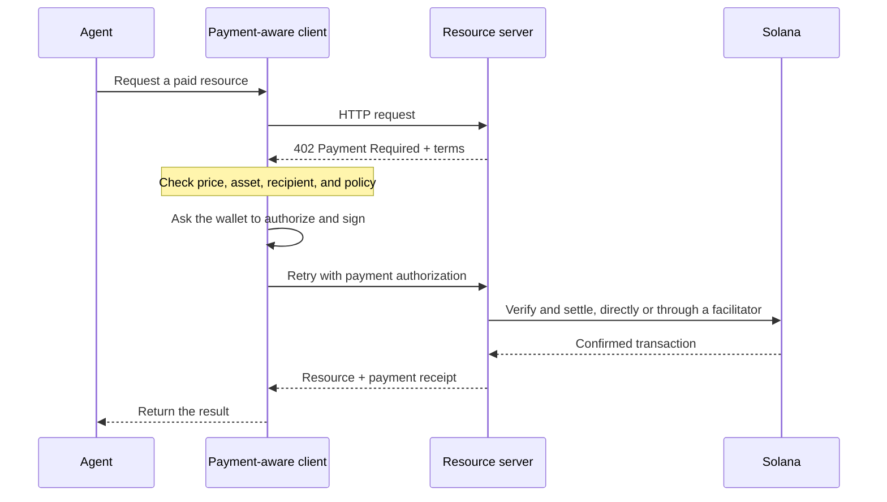

Agentic ödemeler, yazılımın aynı HTTP iş akışı içinde bir fiyatı keşfetmesine, bir ödemeyi yetkilendirmesine ve bir kaynağı almasına olanak tanır. Bir ajan, önce bir faturalandırma hesabı oluşturmak veya bir API anahtarı kopyalamak zorunda kalmadan bir veri sorgusu, model çıkarımı veya araç çağrısı için ödeme yapabilir.

<Cards>
  <Card title="MPP" href="/docs/payments/agentic-payments/mpp">
    Tek seferlik ücretler ve ölçümlü ödeme oturumları için HTTP kimlik doğrulamasını kullanın.
  </Card>
  <Card title="x402" href="/docs/payments/agentic-payments/x402">
    Bir HTTP kaynağına x402 V2 ödeme gereksinimlerini, imzalarını ve uzlaşmasını ekleyin.
  </Card>
</Cards>

## Ortak ödeme akışı

MPP ve x402 farklı başlıklar ve veri modelleri kullanır, ancak temel HTTP akışları benzerdir:

## MPP ve x402

Her iki protokol de Solana üzerinde stablecoin ödemelerini uzlaştırabilir. Seçiminizi yalnızca ortak `402` durum koduna göre değil, hizmetinizin ihtiyaç duyduğu ödeme modeline ve birlikte çalışabilirliğe göre yapın.

|                         | MPP                                                               | x402                                                                     |
| ----------------------- | ----------------------------------------------------------------- | ------------------------------------------------------------------------ |
| Meydan okuma (Challenge)               | `WWW-Authenticate: Payment`                                       | `PAYMENT-REQUIRED`                                                       |
| İstemci yetkilendirmesi    | `Authorization: Payment`                                          | `PAYMENT-SIGNATURE`                                                      |
| Makbuz                 | `Payment-Receipt`                                                 | `PAYMENT-RESPONSE`                                                       |
| Solana ödeme modelleri   | Tek seferlik `charge` ve üst sınırı olan, ölçümlü `session` niyetleri           | `exact` ve `upto` gibi şemalar; destek ağa ve istemciye göre değişir |
| Uzlaşma mimarisi | Sunucu doğrulaması veya isteğe bağlı bir relay ya da ağ geçidi                | Yerel doğrulama yapan kaynak sunucusu veya bir facilitator                 |
| İyi bir başlangıç noktası     | HTTP kimlik doğrulama semantiğine veya tekrarlı ölçümlemeye ihtiyaç duyan API'ler | İstek başına ödemeli kaynaklar ve mevcut x402 istemcileri                      |

MPP, **Machine Payments Protocol** anlamına gelir. Bunu **Model Context Protocol (MCP)** ile karıştırmayın. MCP, araçları ve kaynakları ajanlara sunar; MPP veya x402 ise bir ajan bu araçlardan birini çağırdığında ödeme talep edebilir.

<Callout type="info">
  Bir hizmet birden fazla protokol sunabilir. İstemci, desteklediği bir ödeme seçeneğini seçer, ardından tüm iletişim boyunca eşleşen challenge, yetkilendirme ve makbuz başlıklarını kullanır.
</Callout>
