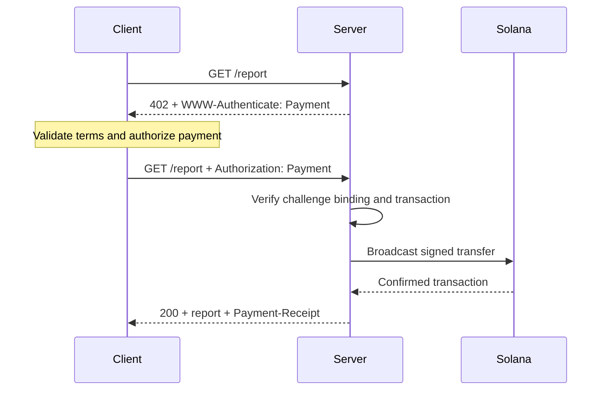
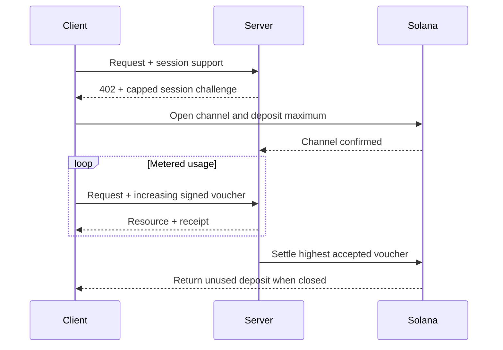

[Machine Payments Protocol (MPP)](https://mpp.dev/), HTTP kimlik doğrulama semantiğini ödemelere uygular. Sunucu, ödenmemiş bir isteğe challenge ile yanıt verir, istemci bir ödeme kimlik bilgisi (credential) döndürür ve sunucu ödemeyi kabul ettikten sonra bir makbuz döndürür.

MPP üç konuyu birbirinden ayırır:

- Bir **intent (niyet)**, tek seferlik bir `charge` veya ölçümlü bir `session` gibi ticari etkileşimi tanımlar.
- Bir **ödeme yöntemi**, değerin nasıl taşındığını tanımlar. Solana yöntemi, ücretler için yerel SOL'u ve SPL token'larını destekler.
- Bir HTTP **taşıma katmanı** challenge'ları, kimlik bilgilerini, makbuzları ve hataları taşır.

MPP, bir dizi Internet-Draft olarak yayımlanmaktadır. [Güncel spesifikasyonları](https://paymentauth.org/) esas kaynak olarak kabul edin ve taslaklar üzerinde çalışmalar sürdüğü için ayrıntıların değişebileceğini unutmayın.

## HTTP alışverişi

MPP, protokole özgü ödeme başlıkları yerine standart HTTP kimlik doğrulama alanlarını kullanır:

| Mesaj                 | HTTP gösterimi                                         |
| ----------------------- | ----------------------------------------------------------- |
| Ödeme challenge'ı       | `WWW-Authenticate: Payment ...` ile `402 Payment Required` |
| Ödeme kimlik bilgisi      | `Authorization: Payment ...` ile yeniden denenen istek           |
| Başarılı makbuz      | `Payment-Receipt: ...` ile kaynak yanıtı               |
| Geçersiz ödeme ayrıntıları | `application/problem+json` kullanan Problem Details gövdesi       |



Bir challenge; sunucu tarafından oluşturulan bir kimlik, realm, yöntem, intent, kodlanmış ödeme isteği ve son kullanma zamanı içerir. Kimlik bilgisi challenge'ı yansıtır ve yönteme özgü ödeme kanıtını ekler. Sunucu her iki parçayı da doğrulamalıdır; farklı bir challenge'a ait geçerli bir transfer kaynağın kilidini açmamalıdır.

## Tek seferlik Solana ücretleri

Solana `charge` intent'i iki kimlik bilgisi türünü destekler:

- **Pull modu** imzalı bir işlem kullanır. İstemci transferi imzalar ve işlemi sunucuya gönderir. Sunucu işlemi doğrular, isteğe bağlı olarak bir ücret ödeyen (fee-payer) imzası ekler, işlemi ağa yayınlar, onaylar ve işlem imzasını makbuzunda döndürür.
- **Push modu** bir işlem imzası kullanır. İstemci önce işlemi ağa yayınlar, ardından onaylanmış imzayı sunucuya gönderir. Sunucu, kaynağı döndürmeden önce işlemi getirir ve doğrular.

Pull modu, sunucu tarafından karşılanan işlem ücretlerini ve sunucu tarafında yeniden deneme mantığını mümkün kılar. Push modu, bir cüzdanın istemcinin kendi işlemini göndermesini gerektirdiği durumlarda kullanışlıdır, ancak sunucu ücret sponsorluğunu kullanamaz.

Normatif alanlar ve doğrulama kuralları için [Solana charge spesifikasyonuna](https://paymentauth.org/draft-solana-charge-00.html) bakın.

## Bir Express API'sine MPP ücreti ekleme

Solana Pay Kit, MPP ve x402 için güncel bir TypeScript entegrasyonu sunar. Express ile birlikte yükleyin:

```bash
pnpm add @solana/pay-kit @solana/kit@^6.9.0 express
pnpm add --save-dev @types/express tsx
```

Bu en küçük örnek, barındırılan Surfpool sandbox'ını ve paketin herkese açık demo alıcısını kullanır. Yalnızca yerel geliştirme içindir:

```ts filename=server.ts
import express from "express";
import { createPayKit, usd } from "@solana/pay-kit";

const pay = await createPayKit({
  accept: ["mpp"],
  rpcUrl: "https://402.surfnet.dev:8899"
});

const app = express();

app.get("/report", pay.express(usd("0.01")), (_req, res) => {
  res.json({ report: "Paid report" });
});

app.listen(4567, () => {
  console.log("Paid API listening on http://127.0.0.1:4567");
});
```

Çalıştırın ve ödenmemiş bir isteği ödeme farkındalığı olan bir istekle karşılaştırın:

```bash
pnpm tsx server.ts
curl -i http://127.0.0.1:4567/report
pay --sandbox curl http://127.0.0.1:4567/report
```

Rota işleyicisi (route handler) yalnızca middleware ödemeyi kabul ettikten sonra çalışır.

<Callout type="warn" title="Üretimde tüm sandbox varsayılanlarını değiştirin">
  Açık bir ağ, tüccar alıcısı, özel RPC, kararlı challenge bağlama gizli anahtarı, üretim imzalayıcısı ve kalıcı bir yeniden oynatma (replay) deposu yapılandırın. Gerçek ödemeleri asla bir paket demo imzalayıcısına yönlendirmeyin.
</Callout>

## Ölçümlü oturumlar

Bir istemci çok sayıda küçük ve birbiriyle ilişkili ödeme yapacağında Solana MPP `session` kullanın. Bir oturum, maksimum depozitoyla zincir üstü (onchain) bir ödeme kanalı açar, ardından kullanım arttıkça kümülatif imzalı voucher'lar kullanır. Sunucu voucher'ları zincir dışında (offchain) doğrulayabilir ve kabul edilen en yüksek tutarı daha sonra uzlaştırabilir.

Bu, token ölçümlü çıkarım (inference), bayt ölçümlü indirmeler, canlı veriler ve tekrarlanan araç çağrıları için kullanışlıdır. Her olay için ayrı bir zincir üstü ödeme göndermekle aynı şey değildir.



Bir oturuma **oturum ödemesi**, **ödeme kanalı** veya **üst sınırlı tekrarlanan yetkilendirme** deyin. Yalnızca hizmet ve ödeme sözleşmesi gerçekten bir kullanım akışını ölçüyorsa buna akış halinde ödeme (streamed payment) deyin.

## Üretim doğrulaması

Her Solana ücreti için sunucu en azından şunları doğrulamalıdır:

- Challenge'ın özgün olduğu, süresinin dolmadığı, bu isteğe bağlı olduğu ve bu realm için amaçlandığı.
- İşlemin beklenen ağı, varlığı veya mint'i, alıcıyı, tutarı ve Token Program'ı kullandığı.
- Herhangi bir ücret ödeyen (fee-payer) veya associated token account talimatlarına açıkça izin verildiği ve bunların sunucu imzalayıcısını boşaltamayacağı.
- İşlemin gereken onay (commitment) düzeyinde başarılı olduğu.
- İşlem imzasının daha önce tüketilmediği.
- Yeniden oynatma (replay) kontrolü ve tüketme işleminin tüm sunucu örnekleri arasında atomik olduğu.

Oturumlar için ayrıca kanal durumunu, kabul edilen kümülatif tutarı ve uzlaşma filigranını (settlement watermark) paylaşımlı bir depoda kalıcı olarak saklayın. Sunucu kullanılamaz hale gelirse istemcilerin kullanılmayan fonları nasıl geri alacağını belgelendirin.

## İlgili kaynaklar

- [MPP spesifikasyonları](https://paymentauth.org/)
- [MPP protokol dokümantasyonu](https://mpp.dev/protocol)
- [Solana Pay Kit](https://github.com/solana-foundation/pay-kit)
- [Ajan tabanlı ödemelere genel bakış](/docs/payments/agentic-payments)
- [Üretime hazırlık](/docs/tools/production-readiness)
