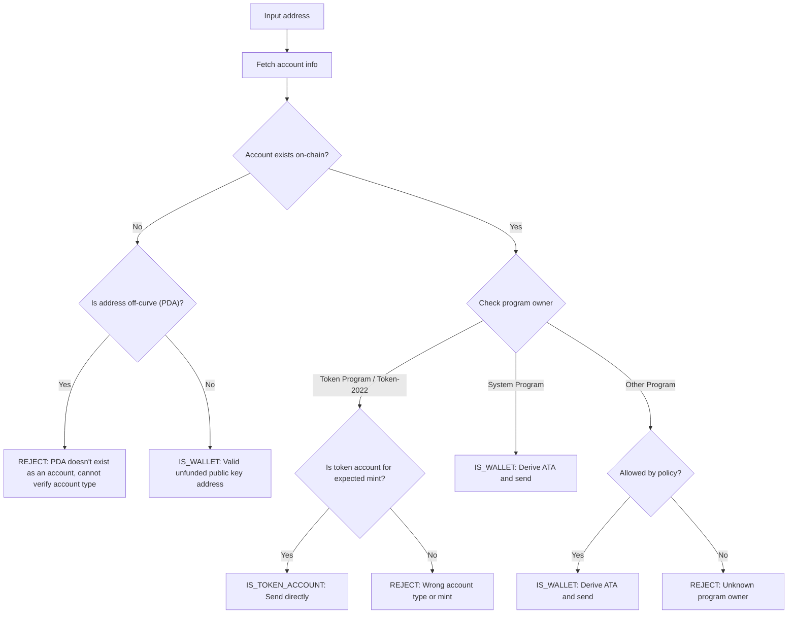

Yanlış adrese token göndermek, fonların kalıcı olarak kaybedilmesine neden
olabilir. Adres doğrulama, yalnızca tokenları düzgün bir şekilde alabilecek ve
erişebilecek adreslere göndermenizi sağlar.

<Callout>
  Temel ödeme kavramları için [Solana'da Ödemeler Nasıl
  Çalışır](/docs/payments/how-payments-work) bölümüne bakın.
</Callout>

## Solana adreslerini anlama

Solana hesaplarının iki tür adresi vardır: eğri üzerinde ve eğri dışında.

### Eğri üzerinde adresler

Standart adresler, Ed25519 anahtar çiftlerinden gelen genel anahtarlardır. Bu
adresler:

- İşlemleri imzalayabilen karşılık gelen bir özel anahtara sahiptir
- Cüzdan adresi olarak kullanılır

### Eğri dışında adresler (PDA'lar)

[Program Derived Addresses](/docs/core/pda), bir program kimliğinden ve
seed'lerden deterministik olarak türetilir. Bu adresler:

- Karşılık gelen bir özel anahtara sahip **değildir**
- Yalnızca adresin türetildiği program tarafından imzalanabilir

## Ödemelerde hesap türleri

Ağdan bir [hesap](/docs/core/accounts) almak için adresi kullanın, program
sahibini ve hesap türünü kontrol ederek adresin nasıl işleneceğini belirleyin.

<Callout>
  Bir adresin eğri üzerinde mi yoksa eğri dışında mı olduğunu bilmek, size ne
  tür bir hesap olduğunu, hangi programın sahibi olduğunu veya o adreste bir
  hesabın var olup olmadığını söylemez. Bu ayrıntıları belirlemek için hesabı
  ağdan almanız gerekir.
</Callout>

### System Program hesapları (cüzdanlar)

System Program'a ait hesaplar standart cüzdanlardır. Bir cüzdana SPL token
göndermek için, onun
[Associated Token Account (ATA)](/docs/tokens/basics/create-token-account#whats-an-associated-token-account)
adresini türetip kullanırsınız.

ATA adresini türettikten sonra, token hesabının zincir üzerinde var olup
olmadığını kontrol edin. ATA mevcut değilse, transfer ile aynı işlemde alıcının
token hesabını oluşturmak için bir talimat ekleyebilirsiniz. Ancak bu, yeni
token hesabı için rent ödemeyi gerektirir. Alıcı ATA'nın sahibi olduğundan, rent
için ödenen SOL gönderen tarafından geri alınamaz.

<Callout type="warn">
  Güvenlik önlemleri olmadan, ATA oluşturma maliyetini karşılamak istismar
  edilebilir. Kötü niyetli bir kullanıcı transfer talep edebilir, ATA'sını sizin
  masrafınızla oluşturabilir, rent SOL'unu geri almak için ATA'yı kapatabilir ve
  bunu tekrarlayabilir.
</Callout>

### Token hesapları

[Token hesapları](/docs/tokens/basics/create-token-account) Token Program veya
Token-2022 Program tarafından sahiplenilir ve token bakiyelerini tutar.
Aldığınız adres bir token programına aitse, göndermeden önce hesabın bir token
hesabı olduğunu (mint hesabı değil) ve beklenen token mint hesabıyla eşleştiğini
doğrulamalısınız.

<Callout type="info">
  Token Programları, bir transferdeki her iki token hesabının da aynı mint'in
  tokenlarını tuttuğunu otomatik olarak doğrular. Doğrulama başarısız olursa,
  işlem reddedilir ve hiçbir fon kaybedilmez.
</Callout>

### Mint hesapları

[Mint hesapları](/docs/tokens/basics/create-mint) belirli bir tokenın arzını ve
meta verilerini takip eder. Mint hesapları da Token Programları tarafından
sahiplenilir ancak token transferleri için geçerli alıcılar **değildir**. Bir
mint adresine token gönderme girişimi başarısız bir işlemle sonuçlanır, ancak
hiçbir fon kaybedilmez.

### Diğer hesaplar

Diğer programlara ait hesaplar bir politika kararı gerektirir. Bazı hesaplar
(örneğin çoklu imza cüzdanları) geçerli token hesabı sahipleri olabilirken,
diğerleri reddedilmelidir.

## Doğrulama akışı

Aşağıdaki diyagram, bir adresi doğrulamak için referans karar ağacını gösterir:



<Steps>
<Step>

### Hesabı getir

Ağdan hesap ayrıntılarını getirmek için adresi kullanın.

</Step>
<Step>

### Hesap mevcut değil

Bu adreste hiçbir hesap yoksa, adresin eğri üzerinde mi yoksa eğri dışında mı
olduğunu kontrol edin:

- **Eğri dışı (PDA)**: Erişilemeyen bir ATA'ya gönderim yapmaktan kaçınmak için
  adresi ihtiyatlı bir şekilde reddedin. Mevcut bir hesap olmadan, yalnızca
  adresten bu PDA'yı hangi programın türettiğini veya adresin bir ATA için olup
  olmadığını belirleyemezsiniz. Bu adres için bir ATA türeterek token göndermek,
  fonların erişilemeyen bir token hesabında kilitlenmesine neden olabilir.

- **Eğri üzerinde**: Bu, henüz fonlanmamış geçerli bir cüzdan adresidir (genel
  anahtar). ATA'yı türetin, var olup olmadığını kontrol edin ve ona token
  gönderin. ATA mevcut değilse, oluşturulmasını fonlayıp fonlamayacağınıza dair
  bir politika kararı vermelisiniz.

</Step>
<Step>

### Hesap mevcut

Bir hesap mevcutsa, hangi programın sahibi olduğunu kontrol edin:

- **System Program**: Bu standart bir cüzdandır. ATA'yı türetin, var olup
  olmadığını kontrol edin ve ona token gönderin. ATA mevcut değilse,
  oluşturulmasını fonlayıp fonlamayacağınıza dair bir politika kararı
  vermelisiniz.

- **Token Program / Token-2022**: Hesabın bir token hesabı olduğunu (mint hesabı
  olmadığını) ve göndermeyi planladığınız token'ı (mint) tuttuğunu doğrulayın.
  Geçerliyse, token'ları doğrudan bu adrese gönderin. Eğer bir mint hesabıysa
  veya farklı bir mint için token hesabıysa, adresi reddedin.

- **Diğer program**: Bu bir politika kararı gerektirir. Çoklu imza cüzdanları
  gibi bazı programlar, token hesaplarının kabul edilebilir sahipleri olabilir.
  Politikanız izin veriyorsa, ATA'yı türetin ve gönderin. Aksi takdirde, adresi
  reddedin.

</Step>
</Steps>

## Demo

Aşağıdaki örnek yalnızca adres doğrulama mantığını göstermektedir. Bu, açıklama
amaçlı referans kodudur.

<Callout>
  Demo, bir ATA'nın nasıl türetileceğini veya token göndermek için bir işlemin
  nasıl oluşturulacağını göstermemektedir. Örnek kod için [token
  hesabı](/docs/tokens/basics/create-token-account#how-to-create-an-associated-token-account)
  ve [token transferi](/docs/tokens/basics/transfer-tokens) belgelerine bakın.
</Callout>

Aşağıdaki demo üç olası sonuç kullanır:

| Sonuç              | Anlamı                | Eylem                                    |
| ------------------ | --------------------- | ---------------------------------------- |
| `IS_WALLET`        | Geçerli cüzdan adresi | Associated token account türet ve gönder |
| `IS_TOKEN_ACCOUNT` | Geçerli token hesabı  | Token'ları doğrudan bu adrese gönder     |
| `REJECT`           | Geçersiz adres        | Gönderme                                 |

<CodeTabs flags="r">

```ts !! title="Demo"
// !collapse(1:35) collapsed

import {
  type Address,
  type Rpc,
  type GetAccountInfoApi,
  createSolanaRpc,
  fetchJsonParsedAccount,
  isOffCurveAddress,
  generateKeyPairSigner,
  getProgramDerivedAddress
} from "@solana/kit";

// =============================================================================
// Constants
// =============================================================================

const defaultRpc = createSolanaRpc("https://api.mainnet-beta.solana.com");

const SYSTEM_PROGRAM = "11111111111111111111111111111111" as Address;
const TOKEN_PROGRAM = "TokenkegQfeZyiNwAJbNbGKPFXCWuBvf9Ss623VQ5DA" as Address;
const TOKEN_2022_PROGRAM =
  "TokenzQdBNbLqP5VEhdkAS6EPFLC1PHnBqCXEpPxuEb" as Address;

// =============================================================================
// Validation Function
// =============================================================================

/**
 * Possible validation results for an input address.
 */
export type ValidationResult =
  | { type: "IS_TOKEN_ACCOUNT" }
  | { type: "IS_WALLET" }
  | { type: "REJECT"; reason: string };

/**
 * Validates an input address and classifies it as a wallet, token account, or invalid.
 *
 * @param inputAddress - The address to validate
 * @param rpc - Optional RPC client (defaults to mainnet)
 * @returns Classification result:
 *   - IS_WALLET: Valid wallet address
 *   - IS_TOKEN_ACCOUNT: Valid token account
 *   - REJECT: Invalid address for transfers
 */
export async function validateAddress(
  inputAddress: Address,
  rpc: Rpc<GetAccountInfoApi> = defaultRpc
): Promise<ValidationResult> {
  const account = await fetchJsonParsedAccount(rpc, inputAddress);
  // Log the account data for demo
  console.log("\nAccount:", account);

  // Account doesn't exist on-chain
  if (!account.exists) {
    // Off-curve = PDA that doesn't exist as an account
    // Reject conservatively to avoid sending to an address that may be inaccessible.
    if (isOffCurveAddress(inputAddress)) {
      return { type: "REJECT", reason: "PDA doesn't exist as an account" };
    }
    // On-curve = valid keypair address, treat as unfunded wallet
    return { type: "IS_WALLET" };
  }

  // Account exists, check program owner
  const owner = account.programAddress;

  // System Program = wallet
  if (owner === SYSTEM_PROGRAM) {
    return { type: "IS_WALLET" };
  }

  // Token Program or Token-2022, check if token account
  if (owner === TOKEN_PROGRAM || owner === TOKEN_2022_PROGRAM) {
    const accountType = (
      account.data as { parsedAccountMeta?: { type?: string } }
    ).parsedAccountMeta?.type;

    if (accountType === "account") {
      return { type: "IS_TOKEN_ACCOUNT" };
    }
    // Reject if not a token account (mint account)
    return {
      type: "REJECT",
      reason: "Not a token account"
    };
  }

  // Unknown program owner
  return { type: "REJECT", reason: "Unknown program owner" };
}

// =============================================================================
// Examples
// =============================================================================
// !collapse(1:1000) collapsed

// Wallets
const EXISTING_WALLET =
  "H8sMJSCQxfKiFTCfDR3DUMLPwcRbM61LGFJ8N4dK3WjS" as Address;
const NEW_WALLET = (await generateKeyPairSigner()).address;

// Token accounts
const USDC_TOKEN_ACCOUNT =
  "3emsAVdmGKERbHjmGfQ6oZ1e35dkf5iYcS6U4CPKFVaa" as Address;
const PYUSD_TOKEN_ACCOUNT =
  "47od2TPRvqJipfPVWZdyenLEngPw8hC36nDxiLyvGsEP" as Address;

// Token mints (should be rejected)
const USDC_MINT = "EPjFWdd5AufqSSqeM2qN1xzybapC8G4wEGGkZwyTDt1v" as Address;
const PYUSD_MINT = "2b1kV6DkPAnxd5ixfnxCpjxmKwqjjaYmCZfHsFu24GXo" as Address;

// PDA that doesn't exist (should be rejected)
const [NON_EXISTENT_PDA] = await getProgramDerivedAddress({
  programAddress: (await generateKeyPairSigner()).address,
  seeds: ["seed"]
});

// Program account (should be rejected)
const PROGRAM_ACCOUNT =
  "p1exdMJcjVao65QdewkaZRUnU6VPSXhus9n2GzWfh98" as Address;

async function runExample(label: string, address: Address) {
  console.log(`\n${"─".repeat(60)}`);
  console.log(`Example: ${label}`);
  console.log(`Input: ${address}`);
  console.log(`${"─".repeat(60)}`);

  const result = await validateAddress(address);
  console.log("\nResult:", result);
}

console.log("\n" + "═".repeat(60));
console.log("  IS_WALLET Examples");
console.log("═".repeat(60));

await runExample("Existing funded wallet", EXISTING_WALLET);
await runExample("New wallet (unfunded)", NEW_WALLET);

console.log("\n" + "═".repeat(60));
console.log("  IS_TOKEN_ACCOUNT Examples");
console.log("═".repeat(60));

await runExample("USDC token account (Token Program)", USDC_TOKEN_ACCOUNT);
await runExample("PYUSD token account (Token-2022)", PYUSD_TOKEN_ACCOUNT);

console.log("\n" + "═".repeat(60));
console.log("  REJECT Examples");
console.log("═".repeat(60));

await runExample("USDC mint address", USDC_MINT);
await runExample("PYUSD mint address", PYUSD_MINT);
await runExample("Non-existent PDA", NON_EXISTENT_PDA);
await runExample("Program account", PROGRAM_ACCOUNT);

console.log("\n" + "═".repeat(60));
console.log("  Done!");
console.log("═".repeat(60) + "\n");
```

</CodeTabs>
