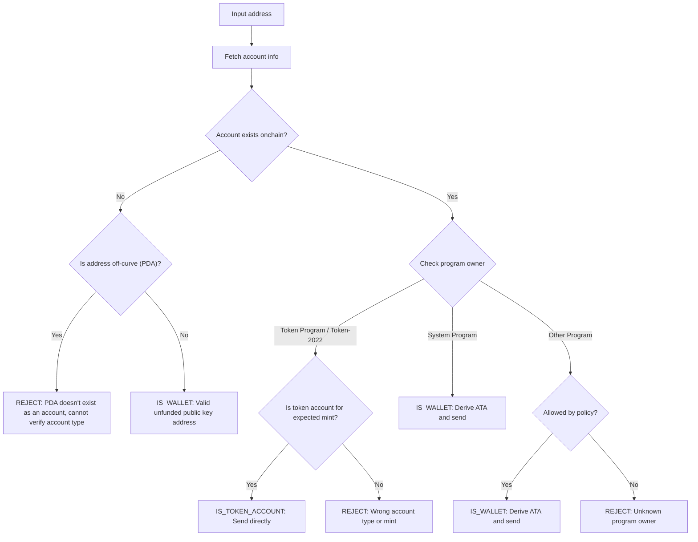

Yanlış adrese fon göndermek kalıcı kayba yol açabilir. Adres doğrulama, yalnızca
fonları düzgün şekilde alıp erişebilecek adreslere göndermenizi sağlar.

Doğrulama, ne gönderdiğinize bağlıdır:

- **SPL token'ları** kısmen kendi kendini korur. Token Program, hesapları
  beklenen mint ile eşleşmeyen bir transferi reddeder; bu nedenle yanlış
  yönlendirilmiş bir token transferi fon kaybı olmadan başarısız olur. Bu
  sayfanın büyük bölümü SPL token gönderimleri ile ilgilidir.
- **Yerel SOL** için böyle bir koruma yoktur. System Program transferi herhangi
  bir hesaba başarıyla gerçekleşir; bu nedenle yanlış bir alıcı SOL'u kalıcı
  olarak kilitler. Bkz. [Yerel SOL Gönderimi](#sending-native-sol).

<Callout>
  Temel ödeme kavramları için bkz. [Solana'da Ödemeler Nasıl
  Çalışır](/docs/payments/how-payments-work).
</Callout>

## Solana Adreslerini Anlamak

Solana hesaplarının iki tür adresi vardır: eğri üzerinde (on-curve) ve eğri
dışında (off-curve).

### Eğri Üzerindeki Adresler (On-Curve)

Standart adresler, Ed25519 keypair'lerinden elde edilen açık anahtarlardır. Bu
adresler:

- İşlemleri imzalayabilen karşılık gelen bir özel anahtara sahiptir
- Cüzdan adresi olarak kullanılır

### Eğri Dışı Adresler (PDA'lar)

[Program Derived Address](/docs/core/pda)'ler, bir program kimliği ve
tohumlardan deterministik olarak türetilir. Bu adresler:

- Karşılık gelen bir özel anahtara sahip **değildir**
- Yalnızca adresin türetildiği program tarafından imzalanabilir

## Ödemelerde Hesap Türleri

Ağdan bir [hesap](/docs/core/accounts) çekmek için adresi kullanın; adresi nasıl
işleyeceğinizi belirlemek için program sahibini ve hesap türünü kontrol edin.

<Callout>
  Bir adresin eğri üzerinde mi yoksa eğri dışında mı olduğunu bilmek, hesabın
  türünü, hangi programın sahibi olduğunu veya o adreste bir hesabın var olup
  olmadığını söylemez. Bu ayrıntıları belirlemek için hesabı ağdan çekmeniz
  gerekir.
</Callout>

### System Program Hesapları (Cüzdanlar)

System Program tarafından sahip olunan hesaplar standart cüzdanlardır. Bir
cüzdana SPL token göndermek için, onun
[Associated Token Account (ATA)](/docs/tokens/basics/create-token-account#what-is-an-associated-token-account)'ını
türetip kullanmanız gerekir.

ATA adresini türettikten sonra, token account'ın zincir üzerinde var olup
olmadığını kontrol edin. ATA mevcut değilse, transfer işlemiyle aynı işlem
içinde alıcının token account'ını oluşturmak için bir talimat ekleyebilirsiniz.
Ancak bu, yeni token account için rent ödenmesini gerektirir. Alıcı ATA'ya sahip
olduğundan, rent için ödenen SOL gönderici tarafından geri alınamaz.

<Callout type="warn">
  Güvenlik önlemleri olmadan, ATA oluşturma maliyetinin karşılanması istismar
  edilebilir. Kötü niyetli bir kullanıcı transfer talep edebilir, ATA'sını sizin
  hesabınıza oluşturabilir, rent SOL'unu geri almak için ATA'yı kapatabilir ve
  bunu tekrarlayabilir.
</Callout>

### Token Hesapları

[Token account'lar](/docs/tokens/basics/create-token-account), Token Program
veya Token-2022 Program tarafından sahiplenilir ve token bakiyelerini tutar.
Aldığınız adres bir token programına aitse, token göndermeden önce hesabın bir
token account olduğunu (mint account değil) ve beklenen token mint account ile
eşleştiğini doğrulamalısınız.

<Callout type="info">
  Token Program'lar, bir transferdeki her iki token account'ın da aynı mint'e
  ait token tuttuğunu otomatik olarak doğrular. Doğrulama başarısız olursa işlem
  reddedilir ve hiçbir varlık kaybolmaz.
</Callout>

### Mint Hesapları

[Mint account'lar](/docs/tokens/basics/create-mint), belirli bir tokenın arzını
ve meta verilerini takip eder. Mint account'lar da Token Program'lar tarafından
sahiplenilir, ancak token transferleri için **geçerli alıcılar değildir**. Bir
mint adresine token göndermeye çalışmak başarısız bir işlemle sonuçlanır, ancak
hiçbir varlık kaybolmaz.

### Diğer Hesaplar

Diğer programlara ait hesaplar için bir politika kararı gerekmektedir. Bazı
hesaplar (örn. multisig cüzdanlar) geçerli token account sahipleri olabilirken,
diğerleri reddedilmelidir.

## Yerel SOL Gönderimi

Yukarıdaki sınıflandırma, SPL tokenlarının nereye gönderebileceğini belirler.
Yerel SOL daha kısıtlıdır: tek güvenli alıcı, bir **System Program cüzdanı** (ya
da bir System Program cüzdanına dönüşen, fonlanmamış eğri üzeri bir adres)
olmalıdır.

Bir System Program transferi, mintler, token accountlar, programlar ve PDA'lar
dahil olmak üzere herhangi bir hesaba lamport ekler. Lamportlar yalnızca hesabın
sahibi olan program tarafından çıkarılabilir; bu nedenle SOL'un yanlış bir
alıcıya gönderilmesi, fonların kalıcı olarak kaybedilmesine yol açabilir.

Bir SPL token transferinin aksine, alıcı beklenmedik bir adres olduğunda işlem
**başarısız olmaz**.

Yerel SOL gönderilirken yalnızca `IS_WALLET` sonucu kabul edilebilirdir.
`IS_TOKEN_ACCOUNT` ise **kabul edilemez**: bir token account, SPL tokenları
barındırır ve oraya gönderilen SOL, gönderenin kontrolü dışına çıkar.

<Callout type="warn">
  Bu, SOL'un kaybolmasının yaygın bir yoludur: bir kullanıcı, token'ın mint
  adresini (veya bir program adresini) SOL çekme işlemine yapıştırır. Transfer
  başarıyla tamamlanır ve SOL kurtarılamaz. Bir SOL transferini imzalamadan önce
  her zaman alıcıyı sınıflandırın.
</Callout>

## Doğrulama Akışı

Aşağıdaki diyagram, bir adresi doğrulamak için referans karar ağacını
göstermektedir:


```mermaid title="Address Verification Flow"
flowchart TD
    A["Input address"]
    B["Fetch account info"]

    A --> B
    B --> C{"Account exists onchain?"}

    %% --- Non-existent account path ---
    C -- "No" --> D{"Is address off-curve (PDA)?"}
    D -- "Yes" --> R1["REJECT: PDA doesn't exist as an account, cannot verify account type"]
    D -- "No" --> W1["IS_WALLET: Valid unfunded public key address"]

    %% --- Existing account path ---
    C -- "Yes" --> F{"Check program owner"}

    F -- "Token Program / Token-2022" --> G{"Is token account for expected mint?"}
    G -- "Yes" --> T1["IS_TOKEN_ACCOUNT: Send directly"]
    G -- "No" --> R2["REJECT: Wrong account type or mint"]

    F -- "System Program" --> W2["IS_WALLET: Derive ATA and send"]

    F -- "Other Program" --> K{"Allowed by policy?"}
    K -- "Yes" --> W3["IS_WALLET: Derive ATA and send"]
    K -- "No" --> R3["REJECT: Unknown program owner"]
```

<Steps>
<Step>

### Hesabı Getir

Ağdan hesap ayrıntılarını getirmek için adresi kullanın.

</Step>
<Step>

### Hesap Mevcut Değil

Bu adreste herhangi bir hesap yoksa, adresin eğri üzerinde mi yoksa eğri dışında
mı olduğunu kontrol edin:

- **Eğri dışı (PDA)**: Erişilemeyen bir ATA'ya gönderim yapmaktan kaçınmak için
  adresi ihtiyatlı bir şekilde reddedin. Mevcut bir hesap olmadan, yalnızca
  adresten bu PDA'nın hangi program tarafından türetildiğini veya adresin bir
  ATA için olup olmadığını belirleyemezsiniz. Token göndermek amacıyla bu adres
  için bir ATA türetmek, fonların erişilemeyen bir token account içinde
  kilitlenmesine yol açabilir.

- **Eğri üzerinde**: Bu, henüz fonlanmamış geçerli bir cüzdan adresidir (public
  key). ATA'yı türetin, var olup olmadığını kontrol edin ve token'ları gönderin.
  ATA mevcut değilse oluşturulmasını finanse edip etmeyeceğinize dair bir
  politika kararı vermeniz gerekir.

</Step>
<Step>

### Hesap mevcut

Bir hesap mevcutsa, hangi programın sahibi olduğunu kontrol edin:

- **System Program**: Bu standart bir cüzdandır. ATA'yı türetin, var olup
  olmadığını kontrol edin ve token'ları gönderin. ATA mevcut değilse
  oluşturulmasını finanse edip etmeyeceğinize dair bir politika kararı vermeniz
  gerekir.

- **Token Program / Token-2022**: Hesabın bir token account olduğunu (mint
  account değil) ve göndermek istediğiniz token'ı (mint) barındırdığını
  doğrulayın. Geçerliyse, token'ları doğrudan bu adrese gönderin. Eğer bu bir
  mint account veya farklı bir mint'e ait bir token account ise adresi reddedin.

- **Diğer Programlar**: Bu bir politika kararı gerektirir. Multisig cüzdanlar
  gibi bazı programlar, token account'larının kabul edilebilir sahipleri
  olabilir. Politikanız izin veriyorsa ATA'yı türetin ve gönderin. Aksi takdirde
  adresi reddedin.

</Step>
</Steps>

## Demo

Aşağıdaki örnek yalnızca adres doğrulama mantığını göstermektedir. Bu, yalnızca
açıklama amacıyla hazırlanmış referans kodudur.

<Callout>
  Demo, bir ATA türetmeyi veya token göndermek için bir işlem oluşturmayı
  göstermemektedir. Örnek kod için [token
  account](/docs/tokens/basics/create-token-account#how-to-create-an-associated-token-account)
  ve [token transfer](/docs/tokens/basics/transfer-tokens) belgelerine başvurun.
</Callout>

Aşağıdaki demo üç olası sonucu kullanmaktadır:

| Sonuç              | Anlam                 | İşlem                                      |
| ------------------ | --------------------- | ------------------------------------------ |
| `IS_WALLET`        | Geçerli cüzdan adresi | associated token account'a türet ve gönder |
| `IS_TOKEN_ACCOUNT` | Geçerli token account | Token'ları doğrudan bu adrese gönder       |
| `REJECT`           | Geçersiz adres        | Gönderme                                   |

Ardından her sonucu, `canReceiveNativeSol` (yalnızca cüzdanlar) ve
`canReceiveSplToken` (cüzdanlar veya token account'lar) ile varlık başına kabul
edilebilirlik olarak eşler. Bir token account, `IS_TOKEN_ACCOUNT` döndürür; bu
nedenle SPL token'larını alabilir ancak yerel SOL'u **alamaz** — bu ayrım,
SOL'un kilitlenmesini önler.

<CodeTabs flags="r">

```ts !! title="Demo"
// !collapse(1:35) collapsed

import {
  type Address,
  type Rpc,
  type GetAccountInfoApi,
  createSolanaRpc,
  fetchJsonParsedAccount,
  isOffCurveAddress,
  generateKeyPairSigner,
  getProgramDerivedAddress
} from "@solana/kit";

// =============================================================================
// Constants
// =============================================================================

const defaultRpc = createSolanaRpc("https://api.mainnet-beta.solana.com");

const SYSTEM_PROGRAM = "11111111111111111111111111111111" as Address;
const TOKEN_PROGRAM = "TokenkegQfeZyiNwAJbNbGKPFXCWuBvf9Ss623VQ5DA" as Address;
const TOKEN_2022_PROGRAM =
  "TokenzQdBNbLqP5VEhdkAS6EPFLC1PHnBqCXEpPxuEb" as Address;

// =============================================================================
// Validation Function
// =============================================================================

/**
 * Possible validation results for an input address.
 */
export type ValidationResult =
  | { type: "IS_TOKEN_ACCOUNT" }
  | { type: "IS_WALLET" }
  | { type: "REJECT"; reason: string };

/**
 * Validates an input address and classifies it as a wallet, token account, or invalid.
 *
 * @param inputAddress - The address to validate
 * @param rpc - Optional RPC client (defaults to mainnet)
 * @returns Classification result:
 *   - IS_WALLET: Valid wallet address
 *   - IS_TOKEN_ACCOUNT: Valid token account
 *   - REJECT: Invalid address for transfers
 */
export async function validateAddress(
  inputAddress: Address,
  rpc: Rpc<GetAccountInfoApi> = defaultRpc
): Promise<ValidationResult> {
  const account = await fetchJsonParsedAccount(rpc, inputAddress);
  // Log the account data for demo
  console.log("\nAccount:", account);

  // Account doesn't exist onchain
  if (!account.exists) {
    // Off-curve = PDA that doesn't exist as an account
    // Reject conservatively to avoid sending to an address that may be inaccessible.
    if (isOffCurveAddress(inputAddress)) {
      return { type: "REJECT", reason: "PDA doesn't exist as an account" };
    }
    // On-curve = valid keypair address, treat as unfunded wallet
    return { type: "IS_WALLET" };
  }

  // Account exists, check program owner
  const owner = account.programAddress;

  // System Program = wallet
  if (owner === SYSTEM_PROGRAM) {
    return { type: "IS_WALLET" };
  }

  // Token Program or Token-2022, check if token account
  if (owner === TOKEN_PROGRAM || owner === TOKEN_2022_PROGRAM) {
    const accountType = (
      account.data as { parsedAccountMeta?: { type?: string } }
    ).parsedAccountMeta?.type;

    if (accountType === "account") {
      return { type: "IS_TOKEN_ACCOUNT" };
    }
    // Reject if not a token account (mint account)
    return {
      type: "REJECT",
      reason: "Not a token account"
    };
  }

  // Unknown program owner
  return { type: "REJECT", reason: "Unknown program owner" };
}

/**
 * Native SOL is only safe to send to a wallet. Any other account locks it.
 */
function canReceiveNativeSol(result: ValidationResult): boolean {
  return result.type === "IS_WALLET";
}

/**
 * SPL tokens can go to a wallet (via its ATA) or directly to a token account.
 */
function canReceiveSplToken(result: ValidationResult): boolean {
  return result.type === "IS_WALLET" || result.type === "IS_TOKEN_ACCOUNT";
}

// =============================================================================
// Examples
// =============================================================================
// !collapse(1:1000) collapsed

// Wallets
const EXISTING_WALLET =
  "H8sMJSCQxfKiFTCfDR3DUMLPwcRbM61LGFJ8N4dK3WjS" as Address;
const NEW_WALLET = (await generateKeyPairSigner()).address;

// Token accounts
const USDC_TOKEN_ACCOUNT =
  "3emsAVdmGKERbHjmGfQ6oZ1e35dkf5iYcS6U4CPKFVaa" as Address;
const PYUSD_TOKEN_ACCOUNT =
  "47od2TPRvqJipfPVWZdyenLEngPw8hC36nDxiLyvGsEP" as Address;

// Token mints (should be rejected)
const USDC_MINT = "EPjFWdd5AufqSSqeM2qN1xzybapC8G4wEGGkZwyTDt1v" as Address;
const PYUSD_MINT = "2b1kV6DkPAnxd5ixfnxCpjxmKwqjjaYmCZfHsFu24GXo" as Address;

// PDA that doesn't exist (should be rejected)
const [NON_EXISTENT_PDA] = await getProgramDerivedAddress({
  programAddress: (await generateKeyPairSigner()).address,
  seeds: ["seed"]
});

// Program account (should be rejected)
const PROGRAM_ACCOUNT =
  "p1exdMJcjVao65QdewkaZRUnU6VPSXhus9n2GzWfh98" as Address;

async function runExample(label: string, address: Address) {
  console.log(`\n${"─".repeat(60)}`);
  console.log(`Example: ${label}`);
  console.log(`Input: ${address}`);
  console.log(`${"─".repeat(60)}`);

  const result = await validateAddress(address);
  console.log("\nResult:", result);
  console.log(
    `Can receive SOL?   ${canReceiveNativeSol(result) ? "YES" : "NO"}`
  );
  console.log(
    `Can receive token? ${canReceiveSplToken(result) ? "YES" : "NO"}`
  );
}

console.log("\n" + "═".repeat(60));
console.log("  IS_WALLET Examples");
console.log("═".repeat(60));

await runExample("Existing funded wallet", EXISTING_WALLET);
await runExample("New wallet (unfunded)", NEW_WALLET);

console.log("\n" + "═".repeat(60));
console.log("  IS_TOKEN_ACCOUNT Examples");
console.log("═".repeat(60));

await runExample("USDC token account (Token Program)", USDC_TOKEN_ACCOUNT);
await runExample("PYUSD token account (Token-2022)", PYUSD_TOKEN_ACCOUNT);

console.log("\n" + "═".repeat(60));
console.log("  REJECT Examples");
console.log("═".repeat(60));

await runExample("USDC mint address", USDC_MINT);
await runExample("PYUSD mint address", PYUSD_MINT);
await runExample("Non-existent PDA", NON_EXISTENT_PDA);
await runExample("Program account", PROGRAM_ACCOUNT);

console.log("\n" + "═".repeat(60));
console.log("  Done!");
console.log("═".repeat(60) + "\n");
```

</CodeTabs>
