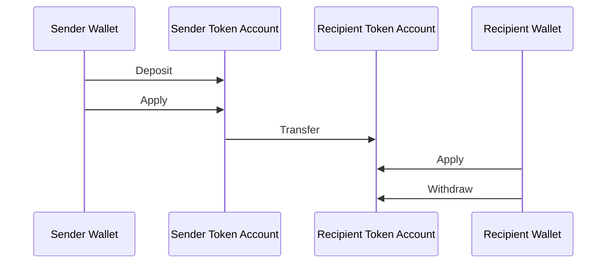
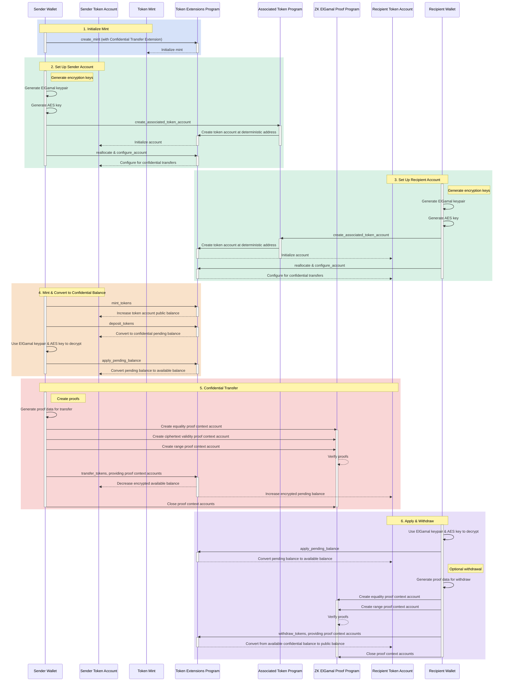

## Gizli Transferler Nedir?

Gizli transferler, token account'lar arasında transfer miktarını açıklamadan
token transferi yapmanızı sağlar. Bu, gizliliği koruyan işlemler için
kullanışlıdır. Yalnızca transfer miktarları ve token bakiyeleri gizlidir. token
account adresleri ise herkese açık kalmaya devam eder.

- [Protokole Genel Bakış](https://www.solana-program.com/docs/confidential-balances/overview) -
  Temel kriptografik protokole ilişkin ayrıntılar
- [Hızlı Başlangıç Kılavuzu](https://www.solana-program.com/docs/confidential-balances#setup) -
  Kurulum ve temel CLI komutları
- [Gizli Bakiyeler Yemek Kitabı](https://github.com/solana-developers/Confidential-Balances-Sample) -
  Gizli Transfer uzantısının nasıl kullanılacağına dair kod parçacıkları

### Nasıl çalışır?

Gizli Transfer uzantısı, Token Extensions Program'a
[talimatlar](https://github.com/solana-program/token-2022/blob/efd0c957fefbd79882d77df5fb2dac88c001249c/program/src/extension/confidential_transfer/instruction.rs#L29)
ekleyerek transfer miktarını açıklamadan hesaplar arasında token transferi
yapmanıza olanak tanır.

Gizli token transferlerinin temel akışı şu şekildedir:

1. Gizli transfer uzantısıyla bir mint account oluşturun.
2. Gönderici ve alıcı için gizli transfer uzantısıyla token account'lar
   oluşturun.
3. Gönderici hesabına token'ları mint edin.
4. Göndericinin genel bakiyesini **gizli bekleyen bakiyeye** **yatırın**.
5. Göndericinin bekleyen bakiyesini **gizli kullanılabilir bakiyeye**
   **uygulayın**.
6. Gönderici token account'tan alıcı token account'a token'ları gizli olarak
   **transfer edin**.
7. Alıcının bekleyen bakiyesini **gizli kullanılabilir bakiyeye** **uygulayın**.
8. Alıcının gizli kullanılabilir bakiyesini **genel bakiyeye** **çekin**.

Gizli transfer akışındaki adımlar hakkında daha fazla ayrıntı için ilgili
sayfalara bakın:

<Cards>
  <Card
    title="Mint Account Oluştur"
    href="/docs/tokens/extensions/confidential-transfer/create-mint"
  >
    Gizli Transfer uzantısıyla mint account nasıl oluşturulur
  </Card>
  <Card
    title="Token Account Oluştur"
    href="/docs/tokens/extensions/confidential-transfer/create-token-account"
  >
    Gizli Transfer uzantısıyla token account nasıl yapılandırılır
  </Card>
  <Card
    title="Token Yatır"
    href="/docs/tokens/extensions/confidential-transfer/deposit-tokens"
  >
    Token'lar gizli bekleyen bakiyeye nasıl yatırılır
  </Card>
  <Card
    title="Bekleyen Bakiyeyi Uygula"
    href="/docs/tokens/extensions/confidential-transfer/apply-pending-balance"
  >
    Bekleyen bakiye kullanılabilir gizli bakiyeye nasıl uygulanır
  </Card>
  <Card
    title="Token Çek"
    href="/docs/tokens/extensions/confidential-transfer/withdraw-tokens"
  >
    Token'lar gizli kullanılabilir bakiyeden nasıl çekilir
  </Card>
  <Card
    title="Token Transfer Et"
    href="/docs/tokens/extensions/confidential-transfer/transfer-tokens"
  >
    Token'lar token account'lar arasında gizli olarak nasıl transfer edilir
  </Card>
  <Card
    title="Entegrasyon Kılavuzu"
    href="/docs/tokens/extensions/confidential-transfer/integration-guide"
  >
    Cüzdanlar, gezginler ve borsalar gizli transfer token'larını nasıl
    destekleyebilir
  </Card>
  <Card
    title="İhraçcı Kılavuzu"
    href="/docs/tokens/extensions/confidential-transfer/issuer-guide"
  >
    Gizli transfer token'ı nasıl ihraç edilir ve yönetilir (onay politikası,
    denetçiler, ücretler, mint ve burn)
  </Card>
</Cards>

Aşağıdaki diyagram, gizli token transferlerinin temel akışının ayrıntılı bir
sırasını göstermektedir:

## Gizli Transfer Talimatları

Gizli Transfer uzantısının tam talimat listesi
[instructions](https://github.com/solana-program/token-2022/blob/efd0c957fefbd79882d77df5fb2dac88c001249c/program/src/extension/confidential_transfer/instruction.rs#L29)
aşağıdaki gibidir:

| Talimat                             | Açıklama                                                                                                                                                       |
| ----------------------------------- | -------------------------------------------------------------------------------------------------------------------------------------------------------------- |
| _rs`InitializeMint`_                | Gizli transferler için mint account'u yapılandırır. Bu talimat, _rs`TokenInstruction::InitializeMint`_ talimatıyla aynı işleme dahil edilmelidir.              |
| _rs`UpdateMint`_                    | Bir mint için gizli transfer ayarlarını günceller.                                                                                                             |
| _rs`ConfigureAccount`_              | Gizli transferler için bir token account'u yapılandırır.                                                                                                       |
| _rs`ApproveAccount`_                | Mint yeni token account'lar için onay gerektiriyorsa, bir token account'u gizli transferler için onaylar.                                                      |
| _rs`EmptyAccount`_                  | Bir token account'ı kapatmaya izin vermek için bekleyen ve mevcut gizli bakiyeleri boşaltır.                                                                   |
| _rs`Deposit`_                       | Genel token bakiyesini bekleyen gizli bakiyeye dönüştürür.                                                                                                     |
| _rs`Withdraw`_                      | Mevcut gizli bakiyeyi tekrar genel bakiyeye dönüştürür.                                                                                                        |
| _rs`Transfer`_                      | Token'ları token account'lar arasında gizli olarak transfer eder.                                                                                              |
| _rs`ApplyPendingBalance`_           | Yatırma işlemleri veya transferlerin ardından bekleyen bakiyeyi mevcut bakiyeye dönüştürür.                                                                    |
| _rs`EnableConfidentialCredits`_     | Bir token account'ın gizli token transferleri almasına izin verir.                                                                                             |
| _rs`DisableConfidentialCredits`_    | Genel transferlere izin verirken gelen gizli transferleri engeller.                                                                                            |
| _rs`EnableNonConfidentialCredits`_  | Bir token account'ın genel token transferleri almasına izin verir.                                                                                             |
| _rs`DisableNonConfidentialCredits`_ | Hesabın yalnızca gizli transferler almasını sağlamak için normal transferleri engeller.                                                                        |
| _rs`TransferWithFee`_               | Token'ları token account'lar arasında ücret alarak gizli olarak transfer eder.                                                                                 |
| _rs`ConfigureAccountWithRegistry`_  | Token account'ları gizli transferler için yapılandırmanın alternatif bir yolu; _rs`VerifyPubkeyValidity`_ kanıtı yerine _rs`ElGamalRegistry`_ hesabı kullanır. |
