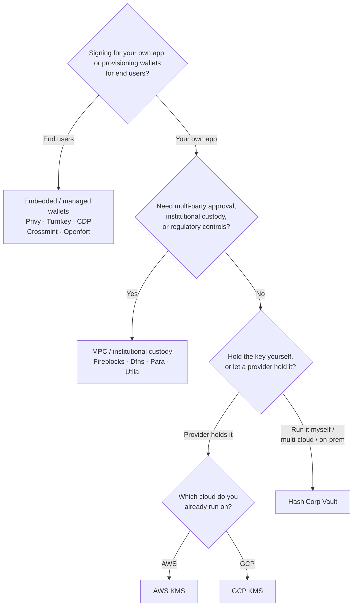

Keychain, her backend genelinde tek bir `SolanaSigner` arayüzü sunar; bu nedenle
tercih mimari değil, operasyonel bir karardır — daha sonra yapılandırma
aracılığıyla değiştirebilirsiniz. Bu nedenle, **bir üründen değil,
gereksinimlerinizden başlayın.** Çoğunu iki soru belirler: _özel anahtar nerede
saklanıyor ve bununla imza yetkilendirmesine kimin izni var?_

Tek bir en iyi backend yoktur. Her biri belirli bir kısıtlamalar bütününe daha
iyi uyar — halihazırda üzerinde çalıştığınız bulut, anahtar altyapısını kendiniz
işletmek isteyip istemediğiniz ve sahip olmanız gereken gözetim ile onay
kontrolleri. Aşağıdaki akış, bu kısıtlamaları bir backend'e eşler.

<Callout type="info">
  Bu kılavuz backend (sunucu tarafı) imzalamayı kapsar. Son kullanıcılarınız
  kendi işlemlerini bir tarayıcıda imzaladığında, bunun yerine Wallet Standard
  aracılığıyla bir cüzdan kullanın — bkz. [Üretimde
  İmzalama](/docs/core/transactions/signing-in-production).
</Callout>

## Karar akışı

<Callout type="info">
  Yerel geliştirme ve testler bunların hiçbirine ihtiyaç duymaz — prototipleme
  için **Memory** backend'ini kullanın, ardından yapılandırma aracılığıyla
  yukarıdaki üretim backend'lerinden birine geçin.
</Callout>

## Soruları inceleyin

<Steps>

<Step>

### Kendi uygulamanız için mi imzalıyorsunuz, yoksa son kullanıcılarınız için mi?

**Son kullanıcıların** sahip olduğu ve yönettiği cüzdanlar sağlıyorsanız
(tüketici uygulamaları, katılım akışları), **gömülü / yönetilen cüzdan**
backend'i kullanın — Privy, Turnkey, CDP, Crossmint veya Openfort. Bunlar,
kullanıcı başına cüzdanları ve kimlik doğrulamayı sizin adınıza yönetir.

**Kendi uygulamanız** adına imzalıyorsanız — ücret ödeyen, hazine, arka uç
otomasyonu — aşağıdan devam edin.

</Step>

<Step>

### Çok taraflı onay, kurumsal saklama veya mevzuat kontrolleri gerekiyor mu?

İmzalar üretilmeden önce bir onay politikasından, harcama limitinden veya
uyumluluk iş akışından geçmesi gerekiyorsa — ya da anahtarları tutan düzenlenmiş
bir saklayıcıya ihtiyaç duyuyorsanız — **MPC / kurumsal saklama** arka ucu
kullanın: Fireblocks, Dfns, Para veya Utila. Bu çözümler anahtarı böler veya
saklar ve politikanıza göre birlikte imzalar.

Yalnızca istek üzerine imzalayan bir anahtara ihtiyacınız varsa aşağıdan devam
edin.

</Step>

<Step>

### Anahtarı kendiniz mi tutmak istiyorsunuz, yoksa bir sağlayıcı mı tutsun?

Anahtarın, donanım destekli altyapıda bir bulut sağlayıcısı tarafından
tutulmasını ve IAM politikanızın imzalayanları kontrol etmesini istiyorsanız o
bulutun KMS'ini kullanın:

- **AWS üzerinde çalışıyorsanız** → AWS KMS
- **GCP üzerinde çalışıyorsanız** → GCP KMS

Anahtar altyapısını kendiniz işletmek istiyorsanız — ya da çoklu bulut veya
şirket içi ortam kullanıyorsanız — **HashiCorp Vault** kullanın. Sistemi siz
çalıştırır ve denetlersiniz; anahtar Transit motorunun içinde kalır ve istek
üzerine imzalar.

</Step>

</Steps>

## Saklama modelleri

Arka uçlar beş saklama modeli altında gruplandırılır. Yukarıdaki akış sizi
bunlardan birine yönlendirir.

- **Öz-saklama (süreç içi)** — uygulamanız ham özel anahtarı tutar. Geliştirme
  için kullanışlıdır, ancak üretim ortamı için uygun değildir. Arka uç:
  **Memory**.
- **Kendi barındırılan anahtar yönetimi** — anahtar altyapısını siz
  işletirsiniz; anahtar içinde kalır ve istek üzerine imzalar. Arka uç:
  **HashiCorp Vault**.
- **Bulut KMS / HSM** — bir bulut sağlayıcısı anahtarı donanım destekli
  altyapıda saklar; anahtar hizmeti asla terk etmez ve IAM politikanız
  imzalayanları kontrol eder. Arka uçlar: **AWS KMS**, **GCP KMS**.
- **MPC ve kurumsal saklama** — anahtar, politikanıza göre (onaylar, limitler)
  birlikte imzalayan bir sağlayıcı genelinde bölünür veya saklanır. Arka uçlar:
  **Fireblocks**, **Dfns**, **Para**, **Utila**.
- **Gömülü ve yönetilen cüzdanlar** — bir sağlayıcı, çoğunlukla son
  kullanıcıları dahil etmek amacıyla cüzdanları sizin adınıza yönetir. Arka
  uçlar: **Privy**, **Turnkey**, **CDP**, **Crossmint**, **Openfort**.

## Backend karşılaştırması

| Backend         | Saklama modeli                      | En uygun kullanım alanı                                   | Notlar                                                   |
| --------------- | ----------------------------------- | --------------------------------------------------------- | -------------------------------------------------------- |
| Memory          | Öz-saklama (süreç içi)              | Yerel geliştirme, testler, CI                             | Ham anahtar süreç içinde — üretimde kullanmayın          |
| HashiCorp Vault | Kendi barındırmalı anahtar yönetimi | Kendi anahtar altyapısını işleten ekipler                 | Transit motoru; siz işletir ve denetlersiniz             |
| AWS KMS         | Bulut KMS / HSM                     | AWS üzerinde çalışan backend'ler                          | Anahtar KMS'den hiç çıkmaz; IAM imzalamayı denetler      |
| GCP KMS         | Bulut KMS / HSM                     | GCP üzerinde çalışan backend'ler                          | Anahtar KMS'den hiç çıkmaz; IAM imzalamayı denetler      |
| Fireblocks      | MPC / kurumsal saklama              | Hazineler, borsalar, düzenlenmiş saklama                  | Politika motoru ve onay iş akışları                      |
| Dfns            | MPC cüzdan altyapısı                | Politika denetimleriyle programatik cüzdanlar             | Ed25519 imzalama                                         |
| Para            | MPC cüzdanlar                       | MPC destekli cüzdan isteyen uygulamalar                   | API anahtarı + cüzdan kimliği                            |
| Utila           | MPC saklama + ortak imzalayan       | Mevcut Utila tarafından yönetilen Solana cüzdanları       | `signMessage` desteklenmiyor; tx'i siz yayımlarsınız     |
| Privy           | Gömülü cüzdanlar                    | Kullanıcıları cüzdanlara dahil eden tüketici uygulamaları | Uygulama tarafından yönetilen gömülü cüzdanlar           |
| Turnkey         | Emanetsiz anahtar yönetimi          | Programatik, politika kapılı imzalama                     | Emanetsiz anahtar yönetimi                               |
| CDP             | Yönetilen cüzdan (Coinbase)         | Coinbase Geliştirici Platformu'ndaki uygulamalar          | `signMessage` yalnızca UTF-8 yüklerini kabul eder        |
| Crossmint       | Yönetilen cüzdanlar                 | Pazaryerleri ve yönetilen cüzdan uygulamaları             | `smart` ve `mpc` cüzdanlar; `signMessage` desteklenmiyor |
| Openfort        | Gömülü backend cüzdanları           | Sunucu taraflı cüzdanlar                                  | TEE'de depolanan anahtarlar                              |

## Kurumsal senaryolar

Tek bir uygulama çoğu zaman aynı anda bunların birden fazlasına ihtiyaç duyar.
Arayüz aynı olduğundan, çağrı noktalarını değiştirmeden her rol için farklı bir
arka uç çalıştırabilirsiniz.

- **Hazine işlemleri** — operasyonel "sıcak" imzalayıcıyı "soğuk" bir hazine
  imzalayıcısından ayırın. Hazineyi MPC saklama veya bir bulut HSM ile
  destekleyin ve yüksek değerli imzalar öncesinde onay politikaları gerektirin.
- **Onay iş akışları** — MPC ve saklama arka uçları (ör. Fireblocks), imza
  üretilmeden önce çok taraflı onayı zorunlu kılar.
- **Uyumluluk ve denetim** — bulut KMS (AWS/GCP) ve Vault, imzalama denetim
  günlükleri yayar; kurumsal saklayıcılar politika uygulama ve raporlama ekler.
- **Düzenlenmiş ortamlar** — ham anahtarların uygulamanıza hiç değmemesi için
  anahtar materyali bir HSM, KMS veya kurumsal saklayıcıda tutun.

Bu arka uçları güvenli bir şekilde çalıştırmak için
[Üretim en iyi uygulamaları](/docs/tools/keychain/production-best-practices)
sayfasına bakın.

<Cards>
  <Card title="Rust rehberi" href="/docs/tools/keychain/getting-started/rust">
    Her arka ucu Rust ile yapılandırın.
  </Card>
  <Card
    title="TypeScript rehberi"
    href="/docs/tools/keychain/getting-started/typescript"
  >
    Her arka ucu TypeScript ile yapılandırın.
  </Card>
</Cards>
