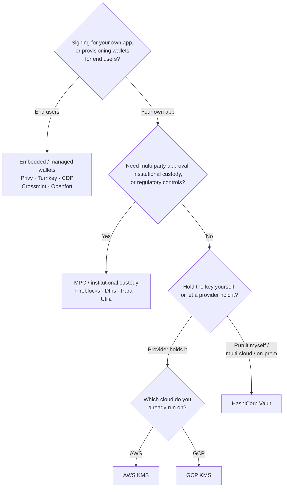

Keychain, her backend genelinde tek bir `SolanaSigner` arayüzü sunar;
dolayısıyla bu tercih mimari değil, operasyonel bir karardır — daha sonra
yapılandırma yoluyla değiştirebilirsiniz. Bu nedenle **bir üründen değil,
gereksinimlerinizden başlayın.** Çoğu şeyi iki soru belirler: _özel anahtar
nerede bulunuyor ve bununla imza yetkilendirmesine kim izinli?_

Tek bir en iyi backend yoktur. Her biri belirli bir kısıtlamalar bütünü için
daha uygundur — halihazırda kullandığınız bulut, anahtar altyapısını kendiniz
yönetmek isteyip istemediğiniz ve hangi gözetim ile onay kontrollerine sahip
olmanız gerektiği. Aşağıdaki akış, bu kısıtlamaları bir backend'e eşler.

<Callout type="info">
  Bu kılavuz backend (sunucu tarafı) imzalamayı kapsar. Son kullanıcılarınız
  kendi işlemlerini bir tarayıcıda imzaladığında, bunun yerine Wallet Standard
  aracılığıyla bir cüzdan kullanın — bkz. [Üretimde
  İmzalama](/docs/core/transactions/signing-in-production).
</Callout>

## Karar akışı

<Callout type="info">
  Yerel geliştirme ve testler için bunların hiçbirine gerek yoktur — prototip
  oluşturmak için **Memory** backend'ini kullanın, ardından yapılandırma yoluyla
  yukarıdaki üretim backend'lerinden birine geçin.
</Callout>

## Soruları yanıtlayın

<Steps>

<Step>

### Kendi uygulamanız için mi, yoksa son kullanıcılarınız için mi imzalıyorsunuz?

**Son kullanıcıların** sahip olduğu ve yönettiği cüzdanlar sağlıyorsanız
(tüketici uygulamaları, katılım akışları), **gömülü / yönetilen cüzdan**
backend'ini kullanın — Privy, Turnkey, CDP, Crossmint veya Openfort. Bunlar,
sizin adınıza kullanıcı başına cüzdanları ve kimlik doğrulamayı yönetir.

**Kendi uygulamanız** adına imzalıyorsanız — bir ücret ödeyici, hazine, arka uç
otomasyonu — aşağıdan devam edin.

</Step>

<Step>

### Çok taraflı onay, kurumsal saklama veya düzenleyici kontrollere ihtiyacınız var mı?

İmzaların üretilmeden önce bir onay politikasını, harcama limitini veya
uyumluluk iş akışını geçmesi gerekiyorsa — ya da anahtarları tutan düzenlenmiş
bir saklama sağlayıcısına ihtiyaç duyuyorsanız — bir **MPC / kurumsal saklama**
arka ucu kullanın: Fireblocks, Dfns, Para veya Utila. Bunlar anahtarı böler veya
saklar ve politikanıza göre birlikte imzalar.

Yalnızca istek üzerine imzalayan bir anahtara ihtiyacınız varsa, aşağıdan devam
edin.

</Step>

<Step>

### Anahtarı kendiniz mi tutmak istiyorsunuz, yoksa bir sağlayıcının mı tutmasını istiyorsunuz?

Bir bulut sağlayıcısının anahtarı donanım destekli altyapıda tutmasını ve IAM
politikanızın kimlerin imzalayabileceğini kontrol etmesini istiyorsanız, o
bulutun KMS'ini kullanın:

- **AWS'de çalışıyorsanız** → AWS KMS
- **GCP'de çalışıyorsanız** → GCP KMS

Anahtar altyapısını kendiniz işletmek istiyorsanız — ya da çoklu bulut veya
şirket içi ortamınız varsa — **HashiCorp Vault** kullanın. Siz çalıştırır ve
denetlersiniz; anahtar Transit motorunun içinde kalır ve istek üzerine imzalar.

</Step>

</Steps>

## Saklama modelleri

Arka uçlar beş saklama modeline göre gruplandırılır. Yukarıdaki akış sizi
bunlardan birine yönlendirir.

- **Öz-saklama (süreç içi)** — uygulamanız ham özel anahtarı tutar. Geliştirme
  için kullanışlıdır, ancak üretim için uygun değildir. Arka uç: **Memory**.
- **Kendi kendine barındırılan anahtar yönetimi** — anahtar altyapısını siz
  işletirsiniz; anahtar içinde kalır ve istek üzerine imzalar. Arka uç:
  **HashiCorp Vault**.
- **Bulut KMS / HSM** — bir bulut sağlayıcısı anahtarı donanım destekli
  altyapıda saklar; anahtar hizmetten hiç çıkmaz ve IAM politikanız kimlerin
  imzalayabileceğini kontrol eder. Arka uçlar: **AWS KMS**, **GCP KMS**.
- **MPC ve kurumsal saklama** — anahtar, politikanıza göre (onaylar, limitler)
  birlikte imzalayan bir sağlayıcı arasında bölünür veya saklanır. Arka uçlar:
  **Fireblocks**, **Dfns**, **Para**, **Utila**.
- **Gömülü ve yönetilen cüzdanlar** — bir sağlayıcı, çoğunlukla son
  kullanıcıları dahil etmek amacıyla cüzdanları sizin adınıza yönetir. Arka
  uçlar: **Privy**, **Turnkey**, **CDP**, **Crossmint**, **Openfort**.

## Backend karşılaştırması

| Backend         | Saklama modeli                      | En iyi kullanım alanı                                      | Notlar                                                   |
| --------------- | ----------------------------------- | ---------------------------------------------------------- | -------------------------------------------------------- |
| Memory          | Öz-saklama (süreç içi)              | Yerel geliştirme, testler, CI                              | Ham anahtar süreç içinde — üretimde kullanmayın          |
| HashiCorp Vault | Kendi barındırmalı anahtar yönetimi | Kendi anahtar altyapısını işleten ekipler                  | Transit motoru; siz işletir ve denetlersiniz             |
| AWS KMS         | Bulut KMS / HSM                     | AWS üzerinde çalışan backend'ler                           | Anahtar asla KMS'den çıkmaz; IAM imzalamayı denetler     |
| GCP KMS         | Bulut KMS / HSM                     | GCP üzerinde çalışan backend'ler                           | Anahtar asla KMS'den çıkmaz; IAM imzalamayı denetler     |
| Fireblocks      | MPC / kurumsal saklama              | Hazineler, borsalar, düzenlenmiş saklama                   | Politika motoru ve onay iş akışları                      |
| Dfns            | MPC cüzdan altyapısı                | Politika kontrollü programatik cüzdanlar                   | Ed25519 imzalama                                         |
| Para            | MPC cüzdanlar                       | MPC destekli cüzdan isteyen uygulamalar                    | API anahtarı + cüzdan kimliği                            |
| Utila           | MPC saklama + ortak imzalayıcı      | Mevcut Utila tarafından yönetilen Solana cüzdanları        | `signMessage` desteklenmiyor; tx'i siz yayınlarsınız     |
| Privy           | Gömülü cüzdanlar                    | Kullanıcıları cüzdanlara yönlendiren tüketici uygulamaları | Uygulama tarafından yönetilen gömülü cüzdanlar           |
| Turnkey         | Emanetsiz anahtar yönetimi          | Programatik, politika kapılı imzalama                      | Emanetsiz anahtar yönetimi                               |
| CDP             | Yönetilen cüzdan (Coinbase)         | Coinbase Geliştirici Platformundaki uygulamalar            | `signMessage` yalnızca UTF-8 yükleri kabul eder          |
| Crossmint       | Yönetilen cüzdanlar                 | Pazaryerleri ve yönetilen cüzdan uygulamaları              | `smart` ve `mpc` cüzdanlar; `signMessage` desteklenmiyor |
| Openfort        | Gömülü backend cüzdanları           | Sunucu taraflı cüzdanlar                                   | TEE'de depolanan anahtarlar                              |

## Kurumsal senaryolar

Tek bir uygulama çoğu zaman aynı anda bunların birden fazlasına ihtiyaç duyar.
Arayüz aynı olduğundan, çağrı noktalarını değiştirmeden her rol için farklı bir
arka uç çalıştırabilirsiniz.

- **Hazine işlemleri** — operasyonel bir "sıcak" imzalayıcıyı "soğuk" bir hazine
  imzalayıcısından ayırın. Hazineyi MPC saklama veya bir bulut HSM ile
  destekleyin ve yüksek değerli imzalar öncesinde onay politikaları zorunlu
  kılın.
- **Onay iş akışları** — MPC ve saklama arka uçları (ör. Fireblocks), imza
  üretilmeden önce çok taraflı onayı zorunlu kılar.
- **Uyumluluk ve denetim** — bulut KMS (AWS/GCP) ve Vault, imzalama denetim
  günlükleri yayar; kurumsal saklama sağlayıcıları politika uygulaması ve
  raporlama ekler.
- **Düzenlenmiş ortamlar** — ham anahtarlar uygulamanıza hiç temas etmeyecek
  şekilde anahtar materyalini bir HSM, KMS veya kurumsal saklama sağlayıcısında
  tutun.

Bu arka uçları güvenli şekilde işletmek için bkz.
[Üretim en iyi uygulamaları](/docs/tools/keychain/production-best-practices).

<Cards>
  <Card title="Rust rehberi" href="/docs/tools/keychain/getting-started/rust">
    Her arka ucu Rust ile yapılandırın.
  </Card>
  <Card
    title="TypeScript rehberi"
    href="/docs/tools/keychain/getting-started/typescript"
  >
    Her arka ucu TypeScript ile yapılandırın.
  </Card>
</Cards>
