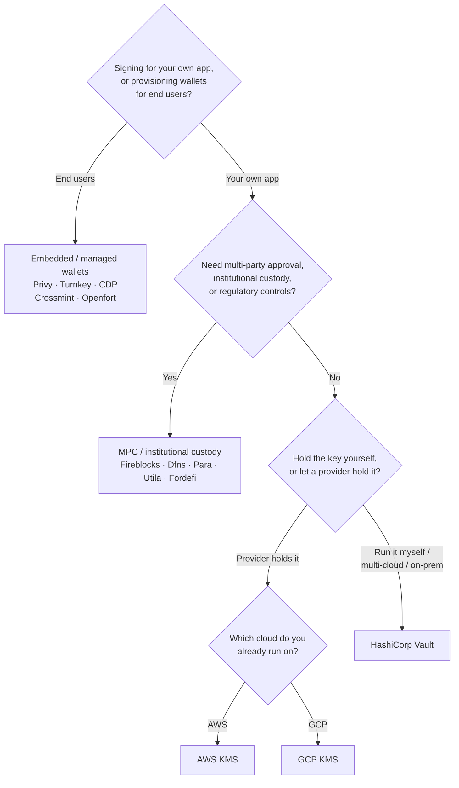

Keychain, tüm arka uçlarda tek bir `SolanaSigner` temel arayüzü sunar; bu nedenle
çoğu arka uç için seçim mimari değil, operasyonel bir karardır: daha sonra
yapılandırma yoluyla değiştirebilirsiniz. İstisna, işlem yapısıdır. Crossmint
ve Fordefi native auto modu sunucu tarafında imzalayıp yayınlar, Fordefi native
manual modu ise işlemi imzalamadan önce yeniden yazar; dolayısıyla bunlardan birine
geçmek veya birinden ayrılmak, imzalayıcıyı çağırma biçiminizi değiştirir. Bu nedenle **bir üründen değil, gereksinimlerinizden yola çıkın.** Kararın büyük kısmını iki soru belirler: _Özel anahtar nerede duruyor ve onunla bir imzayı kimin yetkilendirmesine izin veriliyor?_

Ledger dışındaki tüm arka uçlar dört dilde de (Rust, TypeScript,
Python ve Go) sunulur. Ledger yalnızca Rust'ta bulunur ve isteğe bağlı `ledger` özelliğinin arkasındadır.

Tek bir en iyi arka uç yoktur. Her biri belirli bir kısıt kümesine daha iyi uyar:
hâlihazırda üzerinde çalıştığınız bulut, anahtar altyapısını kendinizin işletip
işletmek istemediği ve sahip olmanız gereken saklama ile onay kontrolleri.
Aşağıdaki akış bu kısıtları bir arka uca eşler.

<Callout type="info">
  Bu kılavuz arka uç (sunucu tarafı) imzalamayı kapsar. Son kullanıcılarınız
  kendi işlemlerini tarayıcıda imzalıyorsa, bunun yerine Wallet Standard üzerinden
  bir cüzdan kullanın. Bkz. [Üretimde İmzalama](/docs/core/transactions/signing-in-production).
</Callout>

## Karar akışı

```mermaid title="Choosing a Keychain backend"
flowchart TD
    Start{Signing for your own app,<br/>or provisioning wallets<br/>for end users?}
    Start -->|End users| Managed[Embedded / managed wallets<br/>Privy · Turnkey · CDP<br/>Crossmint · Openfort]
    Start -->|Your own app| Q2{Need multi-party approval,<br/>institutional custody,<br/>or regulatory controls?}
    Q2 -->|Yes| MPC[MPC / institutional custody<br/>Fireblocks · Dfns · Para · Utila · Fordefi]
    Q2 -->|No| Q3{Hold the key yourself,<br/>or let a provider hold it?}
    Q3 -->|Provider holds it| Q4{Which cloud do you<br/>already run on?}
    Q4 -->|AWS| AWS[AWS KMS]
    Q4 -->|GCP| GCP[GCP KMS]
    Q3 -->|Run it myself /<br/>multi-cloud / on-prem| Vault[HashiCorp Vault]
```

<Callout type="info">
  Yerel geliştirme ve testlerde bunların hiçbirine ihtiyacınız yoktur: prototipleme için
  **Memory** arka ucunu kullanın, ardından yapılandırma yoluyla yukarıdaki üretim arka uçlarından birine geçin.
</Callout>

## Soruları yanıtlayın

<Steps>

<Step>

### Kendi uygulamanız için mi, yoksa son kullanıcılarınız için mi imzalama yapıyorsunuz?

**Son kullanıcıların** sahip olduğu ve kullandığı cüzdanlar sağlıyorsanız (tüketici uygulamaları,
kayıt akışları), **gömülü / yönetilen cüzdan** arka uçlarından birini kullanın: Privy, Turnkey,
CDP, Crossmint veya Openfort. Bunlar, kullanıcı başına cüzdanları ve kimlik doğrulamayı
sizin adınıza yönetir.

**Kendi uygulamanız** olarak imzalama yapıyorsanız (ücret ödeyen, hazine,
arka uç otomasyonu), aşağıdan devam edin.

</Step>

<Step>

### Çok taraflı onaya, kurumsal saklamaya veya düzenleyici kontrollere ihtiyacınız var mı?

İmzalar üretilmeden önce bir onay politikasından, harcama limitinden veya uyumluluk
iş akışından geçmek zorundaysa ya da anahtarları tutan düzenlemeye tabi bir saklayıcıya
ihtiyacınız varsa, bir **MPC / kurumsal saklama** arka ucu kullanın: Fireblocks, Dfns, Para,
Utila veya Fordefi. Bunlar anahtarı böler veya saklar ve politikanıza göre birlikte imzalar.

Yalnızca istek üzerine imzalayan bir anahtara ihtiyacınız varsa, aşağıdan devam edin.

</Step>

<Step>

### Anahtarı kendiniz mi tutmak istiyorsunuz, yoksa bir sağlayıcının tutmasını mı?

Anahtarı donanım destekli altyapıda bir bulut sağlayıcısının tutmasını istiyorsanız ve
kimin imzalayabileceğini IAM politikanız belirliyorsa, o bulutun KMS'sini kullanın:

- **AWS üzerinde çalışıyorsanız** → AWS KMS
- **GCP üzerinde çalışıyorsanız** → GCP KMS

Anahtar altyapısını kendiniz işletmek istiyorsanız veya çoklu bulut ya da
şirket içi (on-prem) ortamdaysanız, **HashiCorp Vault** kullanın. Onu siz çalıştırır ve denetlersiniz; anahtar Transit motorunun içinde kalır ve istek üzerine imzalar.

</Step>

</Steps>

## Saklama modelleri

Arka uçlar altı saklama modelinde toplanır. Yukarıdaki akış sizi bunlardan birine
yönlendirir.

- **Öz saklama (süreç içi)**: uygulamanız ham özel anahtarı tutar.
  Geliştirme için kullanışlıdır, ancak üretim için uygun değildir. Arka uç:
  **Memory**.
- **Öz saklama (donanım cüzdanı)**: anahtar hiçbir zaman Ledger cihazından çıkmaz ve
  her imzayı bir kişi cihazın ekranında onaylar. Etkileşimli operatör imzalaması için uygundur,
  gözetimsiz hizmetler için değil. Yalnızca Rust'ta, isteğe bağlıdır ve denetim kapsamında
  değildir. Arka uç: **Ledger**.
- **Kendi barındırdığınız anahtar yönetimi**: anahtar altyapısını siz işletirsiniz; anahtar
  altyapının içinde kalır ve istek üzerine imzalar. Arka uç: **HashiCorp Vault**.
- **Bulut KMS / HSM**: bir bulut sağlayıcısı anahtarı donanım destekli
  altyapıda saklar; anahtar hizmetten asla çıkmaz ve kimin imzalayabileceğini
  IAM politikanız belirler. Arka uçlar: **AWS KMS**, **GCP KMS**.
- **MPC ve kurumsal saklama**: anahtar, politikanıza (onaylar, limitler) göre birlikte imzalayan
  bir sağlayıcı arasında bölünür veya onun tarafından saklanır.
  Arka uçlar: **Fireblocks**, **Dfns**, **Para**, **Utila**, **Fordefi**.
- **Gömülü ve yönetilen cüzdanlar**: bir sağlayıcı cüzdanları sizin adınıza yönetir,
  genellikle son kullanıcıları sisteme dahil etmek için. Arka uçlar: **Privy**, **Turnkey**, **CDP**,
  **Crossmint**, **Openfort**.

## Backend karşılaştırması

| Backend         | Saklama modeli                  | En iyi kullanım alanı                                     | Notlar                                                                                                              |
| --------------- | ------------------------------ | -------------------------------------------- | ------------------------------------------------------------------------------------------------------------------ |
| Memory          | Öz-saklama (süreç içi)      | Yerel geliştirme, testler, CI                 | Süreçte ham anahtar; üretimde kullanmayın                                                                       |
| Ledger          | Öz saklama (donanım cüzdanı) | Rust araçlarından etkileşimli operatör imzalaması | Yalnızca Rust, isteğe bağlı `ledger` özelliği, denetlenmemiş; her imza cihaz üzerinde onaylanır                                 |
| HashiCorp Vault | Kendi barındırmalı anahtar yönetimi     | Kendi anahtar altyapısını işleten ekipler   | Transit motoru; siz işletir ve denetlersiniz                                                                           |
| AWS KMS         | Bulut KMS / HSM                | AWS üzerinde çalışan backend'ler                      | Anahtar asla KMS'den çıkmaz; IAM imzalamayı denetler                                                                         |
| GCP KMS         | Bulut KMS / HSM                | GCP üzerinde çalışan backend'ler                      | Anahtar asla KMS'den çıkmaz; IAM imzalamayı denetler                                                                         |
| Fireblocks      | MPC / kurumsal saklama    | Hazineler, borsalar, düzenlenmiş saklama     | Politika motoru ve onay iş akışları                                                                               |
| Dfns            | MPC cüzdan altyapısı      | Politika kontrollü programatik cüzdanlar    | Ed25519 imzalama                                                                                                    |
| Para            | MPC cüzdanlar                    | MPC destekli cüzdan isteyen uygulamalar            | API anahtarı + cüzdan kimliği                                                                                                |
| Utila           | MPC saklama + ortak imzalayıcı        | Mevcut Utila tarafından yönetilen Solana cüzdanları        | `signMessage` desteklenmiyor; tx'i siz yayınlarsınız                                                                    |
| Fordefi         | MPC / kurumsal saklama    | Politika kontrolleriyle kurumsal saklama   | Kara kutu: siz gönderirsiniz. Native auto: Fordefi yeniden yazar ve gönderir. Native manual: Fordefi yeniden yazar, sonucu siz gönderirsiniz |
| Privy           | Gömülü cüzdanlar               | Kullanıcıları cüzdanlara yönlendiren tüketici uygulamaları    | Uygulama tarafından yönetilen gömülü cüzdanlar                                                                                       |
| Turnkey         | Emanetsiz anahtar yönetimi   | Programatik, politika kapılı imzalama           | Emanetsiz anahtar yönetimi                                                                                       |
| CDP             | Yönetilen cüzdan (Coinbase)      | Coinbase Geliştirici Platformundaki uygulamalar      | `signMessage` yalnızca UTF-8 yükleri kabul eder                                                                          |
| Crossmint       | Yönetilen cüzdanlar                | Pazaryerleri ve yönetilen cüzdan uygulamaları         | Yalnızca gönderim: sunucu tarafında yayınlar, gas sponsorluğu için yeniden yazabilir; `signMessage` desteklenmez                   |
| Openfort        | Gömülü backend cüzdanları       | Sunucu taraflı cüzdanlar                          | TEE'de depolanan anahtarlar                                                                                                    |

## Yetenek yapısı

Saklamanın ötesinde, her arka ucun tek bir işlem yapısı vardır ve bu, imzalayıcıyı
nasıl çağıracağınızı belirler:

- **İmzala**: sağlayıcı oluşturduğunuz baytları imzalar ve yayınlamayı siz yaparsınız. Ledger ve
  Fordefi black box modu dahil çoğu arka uç.
- **Yeniden yaz ve imzala**: sağlayıcı işlemi yeniden yazar, ardından
  yayınlamadan imzalar. Döndürdüğü işlemle devam edin. Fordefi native
  manual modu.
- **İmzala ve yayınla**: sağlayıcı sunucu tarafında imzalar ve yayınlar; bu nedenle bir
  hata, hiçbir şeyin zincire ulaşmadığı anlamına gelmez. Crossmint ve Fordefi native auto modu.

Her dilin README dosyasındaki imzalayıcı yetenekleri tablosu, her arka ucun
yapısını listeler;
[güvenlik modeli](https://github.com/solana-foundation/solana-keychain/blob/main/docs/SECURITY_MODEL.md)
her yapının neyi garanti ettiğini açıklar.

## Kurumsal senaryolar

Tek bir uygulama genellikle bunlardan birden fazlasına aynı anda ihtiyaç duyar. Arayüz
ortak olduğundan, arka uçlar aynı yetenek yapısını paylaştığı sürece çağrı noktalarını
değiştirmeden her rol için farklı bir arka uç çalıştırabilirsiniz.

- **Hazine işlemleri** — operasyonel bir "sıcak" imzalayıcıyı "soğuk" bir hazine
  imzalayıcısından ayırın. Hazineyi MPC saklama veya bir bulut HSM ile
  destekleyin ve yüksek değerli imzalar öncesinde onay politikaları zorunlu
  kılın.
- **Onay iş akışları** — MPC ve saklama arka uçları (ör. Fireblocks), imza
  üretilmeden önce çok taraflı onayı zorunlu kılar.
- **Uyumluluk ve denetim** — bulut KMS (AWS/GCP) ve Vault, imzalama denetim
  günlükleri yayar; kurumsal saklama sağlayıcıları politika uygulaması ve
  raporlama ekler.
- **Düzenlenmiş ortamlar** — ham anahtarlar uygulamanıza hiç temas etmeyecek
  şekilde anahtar materyalini bir HSM, KMS veya kurumsal saklama sağlayıcısında
  tutun.

Bu arka uçları güvenli şekilde işletmek için bkz.
[Üretim en iyi uygulamaları](/docs/tools/keychain/production-best-practices).

<Cards>
  <Card title="Rust rehberi" href="/docs/tools/keychain/getting-started/rust">
    Her arka ucu Rust ile yapılandırın.
  </Card>
  <Card
    title="TypeScript rehberi"
    href="/docs/tools/keychain/getting-started/typescript"
  >
    Her arka ucu TypeScript ile yapılandırın.
  </Card>
</Cards>
