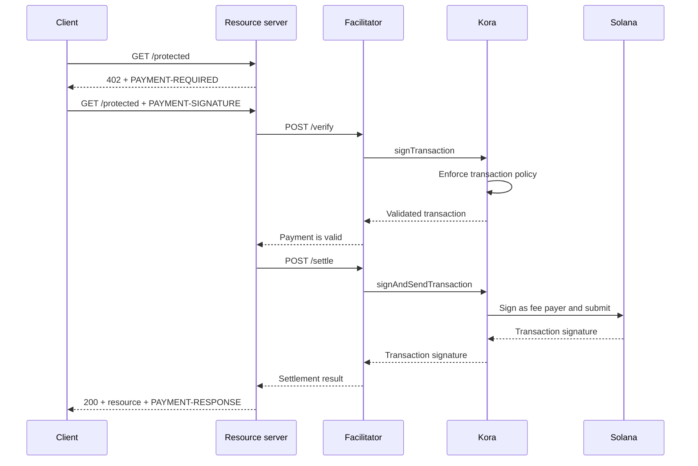

Kora, bir [x402 V2 kolaylaştırıcısının](/docs/tools/x402-facilitator) arkasında Solana imzalama, işlem politikası ve ücret sponsorluğu katmanını sağlayabilir. Kolaylaştırıcı x402 HTTP API'sini uygular; Kora kabul ettiği ödeme işlemlerini doğrular, imzalar ve gönderir.

Bu kılavuz, referans Kora kolaylaştırıcısını Solana Devnet üzerinde başlatır. Bu, entegrasyonu test etmek için kullanılan bir geliştirme ortamıdır; üretim dağıtımı değildir.

## Mimari



Dört uygulama rolü birbirinden ayrı kalır:

- **İstemci**, bir ödeme gereksinimini seçer ve ödeme yetkisini imzalar.
- **Kaynak sunucu**, bir rotayı fiyatlandırır ve yalnızca başarılı doğrulama ve uzlaşmanın ardından yerine getirir.
- **Kolaylaştırıcı**, x402'nin `/supported`, `/verify` ve `/settle` uç noktalarını sunar.
- **Kora**, yalnızca politikası tarafından izin verilen işlemleri imzalar ve bunların Solana ağ ücretlerini sponsorlu olarak karşılayabilir.

Kora, x402 protokolünün yerini almaz. Bu kolaylaştırıcı uygulaması tarafından kullanılan imzalama ve politika sınırıdır.

## Referans kolaylaştırıcıyı başlatın

Git ve [Docker with Compose](https://docs.docker.com/compose/) gereklidir. En son kararlı Kora sürümünü klonlayın ve x402 demosuna girin:

```bash
git clone --branch v2.0.5 --depth 1 https://github.com/solana-foundation/kora.git
cd kora/examples/x402/demo
cp .env.example .env
```

`.env` dosyasındaki `KORA_PRIVATE_KEY` değerini tek kullanımlık bir Devnet keypair olarak ayarlayın. Demo imzalayıcı yapılandırması bir base58 secret, bayt dizisi keypair veya bir JSON keypair dosyasının yolunu kabul eder. İşlem ücretlerini sponsorlu olarak karşılayabilmesi için genel adresini Devnet SOL ile finanse edin.

<Callout type="caution" title="Tek kullanımlık bir Devnet imzalayıcısı kullanın">
  Docker demosu, Kora imzalayıcısını bir ortam değişkeninden yükler. Bu demoya üretim imzalama anahtarı koymayın ve `.env` dosyasını commit etmeyin.
</Callout>

Kora ve kolaylaştırıcıyı başlatın:

```bash
docker compose up --build
```

İlk derleme birkaç dakika sürebilir. Her iki sağlık denetimi de geçtiğinde, başka bir terminalden kolaylaştırıcının duyurulan yeteneklerini inceleyin:

```bash
curl http://127.0.0.1:3000/supported
```

Yanıt, x402 sürüm `2`'yi, `exact` şemasını ve Devnet CAIP-2 ağ tanımlayıcısını duyurmalıdır:

```json
{
  "kinds": [
    {
      "x402Version": 2,
      "scheme": "exact",
      "network": "solana:EtWTRABZaYq6iMfeYKouRu166VU2xqa1",
      "extra": {
        "feePayer": "<KORA_SIGNER_ADDRESS>"
      }
    }
  ]
}
```

Kora varsayılan olarak `127.0.0.1:8080` üzerinde, kolaylaştırıcı ise `127.0.0.1:3000` üzerinde dinler. Demoyu `Ctrl+C` ile durdurun.

## Kaynak sunucuya bağlanın

x402 kaynak sunucusunu yerel kolaylaştırıcıyı ve Kora imzalayıcısının genel adresini alıcı olarak kullanacak şekilde yapılandırın:

```bash
FACILITATOR_URL=http://127.0.0.1:3000
SOLANA_PAY_TO=<KORA_SIGNER_ADDRESS>
```

Ardından bir Express rotasına x402 V2 ara yazılımı eklemek için [Solana üzerinde x402](/docs/payments/agentic-payments/x402) kılavuzunu takip edin. Ödenmemiş bir istek `PAYMENT-REQUIRED` alır, yeniden deneme `PAYMENT-SIGNATURE` taşır ve başarılı bir yanıt `PAYMENT-RESPONSE` taşır.

`X-PAYMENT`, `X-PAYMENT-RESPONSE` veya `solana-devnet` ağ adını kullanan örnekleri kopyalamayın. Bu alanlar x402 V1'e aittir.

Kora deposu aynı `examples/x402/demo` dizininde korumalı bir API ve ödeme odaklı bir istemci de içerir. Tam yerel akışı test etmeniz gerektiğinde bu uygulamaları kullanın.

## Kora politikasını yapılandırın

Referans `kora/kora.toml` kasıtlı olarak dardır. Doğrulama politikası şunları kontrol eder:

- imzalayıcının hangi Solana programlarına izin verdiğini;
- hangi SPL token mint'lerinin kullanılabileceğini;
- sponsorlu maksimum lamport ve imza sayısını;
- hangi ücret ödeyici işlemlerinin yasak olduğunu; ve
- hangi Token-2022 uzantılarının reddedildiğini.

Demo, kolaylaştırıcısının ihtiyaç duyduğu yalnızca Kora RPC yöntemlerini etkinleştirir:
`signTransaction`, `signAndSendTransaction`, `getBlockhash`, `getPayerSigner`,
`getConfig` ve `getVersion`.

Politikayı ücret ödeyici anahtarı için güvenlik sınırı olarak değerlendirin. Üretim hizmeti için:

1. Yalnızca x402 şemanızın ürettiği programları, token mint'lerini ve işlem biçimlerini izin listesine alın.
2. Kora imzalayıcısından değer taşıyabilecek transferleri, yetki değişikliklerini, hesap kapatmayı ve diğer talimatları engelleyin.
3. Ele geçirilmiş bir kolaylaştırıcı kimlik bilgisinden kaynaklanabilecek kaybı sınırlamak için işlem ve kullanım limitleri belirleyin.
4. Ortam değişkeninde tutulan özel anahtar yerine yönetilen bir imzalayıcı arka ucu kullanın.

## Kolaylaştırıcı ile Kora arasındaki bağlantıyı güvenli hale getirin

Demo, Kora API anahtarı kimlik doğrulamasını etkinleştirir. Kolaylaştırıcı, `kora.toml` dosyasındaki `[kora.auth].api_key` değeriyle eşleşmesi gereken `KORA_API_KEY` değerini gönderir.

Üretim için ayrıca:

- Kora'yı özel bir ağda tutun ve TLS'yi güvenilir bir sınırda sonlandırın;
- API kimlik bilgilerini bir secret yöneticisinde saklayın ve düzenli olarak yenileyin;
- Kurcalama ve tekrar saldırısı koruması için Kora'nın HMAC istek kimlik doğrulamasını değerlendirin;
- Muhasebe modeliniz gerektiriyorsa ücret ödeyici ve ödeme alıcı anahtarlarını ayırın; ve
- Politika redleri, uzlaşma hataları, ücret tüketimi ve imzalayıcı bakiyesi üzerinde uyarılar oluşturun.

## Ödeme uzlaşmasını sağlamlaştırın

Kora Solana işlemini doğrular; ancak x402 protokol doğruluğunun sorumluluğu hâlâ kolaylaştırıcı ve kaynak sunucuya aittir. Bir kaynağa hizmet vermeden önce şunları zorunlu kılın:

- seçilen x402 sürümü, şema, ağ, varlık, tutar ve alıcıyı;
- yetkilendirme süresini ve tam Solana talimat düzenini;
- atomik tekrar korumasını ve idempotent uzlaşmayı;
- ürünün gerektirdiği taahhüt düzeyinde onayı; ve
- satın alma, uzlaşma sonucu ve yerine getirme arasında kalıcı bir eşlemeyi.

Yalnızca Kora'nın imzalama için bir işlemi kabul ettiğinden dolayı ücretli içerik döndürmeyin. Yalnızca kolaylaştırıcı başarılı bir uzlaşma sonucu döndürdükten sonra yerine getirin.

## İlgili kaynaklar

- [Kora deposu ve x402 demosu](https://github.com/solana-foundation/kora/tree/main/examples/x402/demo)
- [Kora operatör yapılandırması](/docs/tools/kora/operators/configuration)
- [Kora imzalayıcı arka uçları](/docs/tools/kora/operators/signers)
- [Kora güvenlik denetimleri](/docs/tools/kora/security-audits)
- [x402 V2 spesifikasyonu](https://github.com/x402-foundation/x402/blob/main/specs/x402-specification-v2.md)
- [Ajan ödemelere genel bakış](/docs/payments/agentic-payments)
