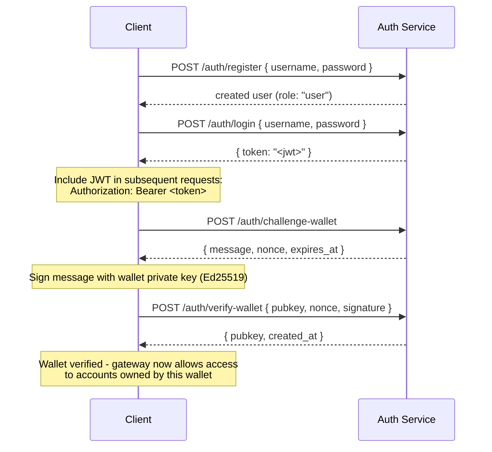

## Genel Bakış

Private Channels, ağ geçidi erişimini JWT kimlik doğrulaması ve rol tabanlı erişim kontrolü (RBAC) ile kısıtlayan isteğe bağlı bir Auth Service içerir. Kimlik doğrulama devre dışı bırakıldığında, ağ geçidi tüm bağlantıları kabul eder. Etkinleştirildiğinde, istemcilerin her istekte geçerli bir JWT sunması gerekir.

Bu sayfa her iki kitleyi de kapsar:

- **Geliştiriciler** - kayıt, giriş, cüzdan doğrulama ve kimlik doğrulamalı istekler yapma
- **Operatörler** - auth service'i etkinleştirme, `JWT_SECRET` yapılandırması ve `operator` rolü sağlama

## Kimlik Doğrulamayı Etkinleştirme

Kimlik doğrulama, hem ağ geçidinde hem de Auth Service üzerinde `JWT_SECRET` (boş olmayan) ayarlanarak etkinleştirilir. Auth Service ayrıca `AUTH_DATABASE_URL` gerektirir.

`JWT_SECRET` ayarlanmadığında, ağ geçidi açık modda çalışır; herhangi bir token gerekmez.

> **Docker Compose:** Auth service bir Docker Compose profilidir ve **varsayılan olarak başlatılmaz**. Dahil etmek için `docker compose` komutunuza `--profile auth` ekleyin; `JWT_SECRET` ve `POSTGRES_PASSWORD` gibi gizli bilgilerin gerçekten çözümlenmesi için `--env-file .env` de ekleyin (Compose, herhangi bir `--env-file` bayrağı iletildiğinde otomatik `.env` yüklemeyi devre dışı bırakır):
>
> ```bash
> docker compose -f docker-compose.devnet.yml --env-file versions.env --env-file .env.devnet --env-file .env --profile auth up -d
> ```

## Auth Service API

Tüm uç noktalar `/auth` altındadır. Auth service, `AUTH_PORT` üzerinde dinleme yapar (varsayılan `8903`).

### `POST /auth/register`

Yeni bir hesap oluşturur. Tüm kullanıcılar `user` rolüyle kaydedilir.

```json
{ "username": "alice", "password": "hunter2" }
```

- Kullanıcı adı: 5-32 karakter, alfanümerik ve `_` ile `-`
- Parola: 6-128 karakter
- Oluşturulan kullanıcıyı döndürür; parola hiçbir zaman döndürülmez

### `POST /auth/login`

Kimlik doğrulaması yaparak 24 saat geçerli imzalı bir JWT alın.

```json
{ "username": "alice", "password": "hunter2" }
```

`{ "token": "<jwt>" }` döndürür. Hem yanlış kullanıcı adı hem de yanlış parola, kullanıcı adı numaralandırmasını önlemek amacıyla `401` döndürür.

### `POST /auth/challenge-wallet`

Bir Solana cüzdanının sahipliğini kanıtlamak için imzalama meydan okuması isteğinde bulunur. Geçerli bir JWT gerektirir.

Bir mesaj, nonce ve son kullanma tarihi döndürür. Meydan okuma 10 dakika içinde sona erer.

```json
{
  "message": "PrivateChannel wallet verification\nuser: <uuid>\nnonce: <uuid>\nexpires: <unix>",
  "nonce": "<uuid>",
  "expires_at": "<iso8601>"
}
```

### `POST /auth/verify-wallet`

İmzalı meydan okumayı göndererek bir cüzdanı doğrulanmış olarak kaydeder. Geçerli bir JWT gerektirir.

```json
{
  "pubkey": "<base58 pubkey>",
  "nonce": "<uuid from challenge>",
  "signature": "<base58 Ed25519 signature>"
}
```

Servis, meydan okuma mesajını yeniden oluşturur, Ed25519 imzasını doğrular ve cüzdanı saklar. Her nonce yalnızca bir kez kullanılabilir; tekrar kullanım denemeleri reddedilir.

`{ "pubkey": "<base58>", "created_at": "<iso8601>" }` döndürür.

### `GET /auth/wallets`

Kimliği doğrulanmış kullanıcının tüm doğrulanmış cüzdanlarını listeler. Geçerli bir JWT gerektirir.

### `DELETE /auth/wallets/{pubkey}`

Kimliği doğrulanmış kullanıcının hesabından doğrulanmış bir cüzdanı kaldırır. Geçerli bir JWT gerektirir.

### `GET /health`

Canlılık kontrolü. `200 ok` döndürür. Kimlik doğrulama gerekmez.

## JWT Yapısı

Token'lar HS256 algoritmasını kullanır ve yayımlanmadan 24 saat sonra sona erer.

| Talep  | Değer                           |
| ------ | ------------------------------- |
| `sub`  | Kullanıcı UUID'si                       |
| `role` | `"user"` veya `"operator"`        |
| `iss`  | `"private-channel-auth"`        |
| `aud`  | `"private-channel-gateway"`     |
| `exp`  | Unix zaman damgası (yayımdan 24 saat sonra) |

> `iss` ve `aud` JWT yükünde mevcut olsa da bunlar uygulama talepleri yapısına seri dışı alınmaz; ağ geçidinin JWT yapılandırması tarafından doğrulanır. Uygulama katmanı kodu yalnızca `sub`, `role` ve `exp` alanlarına erişebilir.

Token'ı `Authorization` başlığında iletin:

```
Authorization: Bearer <JWT_TOKEN>
```

## Roller

### user

Kayıt sırasında atanan varsayılan rol.

- Erişim, kullanıcının kendi doğrulanmış cüzdanlarıyla sınırlıdır
- Engellenen işlemler: `getBlock`, `getTransaction`, `simulateTransaction`
- İzin verilenler: Escrow Program üzerinde `Deposit` çağrısı, `WithdrawFunds` aracılığıyla para çekme işlemi başlatma

### operator

Yükseltilmiş rol. Doğrudan sağlanması gerekir; `user`'dan `operator`'a kendi kendine yükseltme yolu yoktur.

**Rolü atayın**, Admin CLI (`private-channel-auth-admin`) aracılığıyla:

```bash
private-channel-auth-admin set-role --username alice --role operator
```

veya doğrudan SQL ile:

<Callout type="warning">
  Bu ayrıcalıklı bir veritabanı işlemidir. Auth Service veritabanına erişimi buna göre kısıtlayın ve rol değişikliklerini denetleyin.
</Callout>

```sql
UPDATE private_channel_auth.users SET role = 'operator' WHERE username = 'alice';
```

**Kendi kendini doğrulama akışı olmadan cüzdan kaydetme (Admin CLI,
`private-channel-auth-admin`):**

```bash
private-channel-auth-admin attach-wallet --username alice --pubkey <base58-pubkey>
```

Bu komut, doğrulanmış bir cüzdanı doğrudan `verified_wallets` tablosuna ekler ve meydan okuma/doğrulama akışını atlar. `(user_id, pubkey)` üzerinde benzersiz kısıtlama uygular. Bu komut tek başına `operator` rolünü **vermez**; bunun için `set-role` veya yukarıdaki SQL güncellemesini kullanın. Bu komut, etkileşimli meydan okuma/doğrulama akışına gerek kalmadan bir hesaba (örneğin bir servis hesabına) cüzdan eklemek içindir.

**Yetenekler:**

- Tüm cüzdan sahipliği kontrollerini atlar
- `getBlock`, `getTransaction`, `simulateTransaction` dahil tüm ağ geçidi RPC yöntemlerine tam erişim
- Gereksinim duyulan işlemler: `ReleaseFunds`, `ResetSmtRoot`

## Tam Kimlik Doğrulama Akışı



## Kimlik Doğrulamalı İstekler Yapma

```typescript
const response = await fetch("http://localhost:8899/", {
  method: "POST",
  headers: {
    "Content-Type": "application/json",
    Authorization: `Bearer ${jwtToken}`
  },
  body: JSON.stringify({
    jsonrpc: "2.0",
    id: 1,
    method: "getBalance",
    params: [walletAddress]
  })
});
const data = await response.json();
```

## Ağ Geçidi Uç Noktaları

Bu uç noktalar kimlik doğrulama gerektirmez:

| Uç Nokta  | Yöntem | Açıklama                               | Başarı                  | Başarısızlık                     |
| --------- | ------ | ----------------------------------------- | ------------------------ | --------------------------- |
| `/health` | GET    | Canlılık kontrolü                            | `200 {"status":"ok"}`    | -                           |
| `/ready`  | GET    | Derin hazırlık kontrolü; yazma + okuma düğümlerini sorgular | `200 {"status":"ready"}` | `503 {"status":"degraded"}` |

`JWT_SECRET` ve ağ geçidi ortam değişkeni referansı için
[Yapılandırma referansına](/docs/tools/private-channels/operators/configuration) bakın.

## RPC Yöntemi Erişim Matrisi

Aşağıdaki yöntemler ağ geçidi tarafından tanınır. `JWT_SECRET` ayarlandığında erişim, JWT rolüne göre belirlenir:

| Yöntem                        | Rota      | JWT Yok | `user`           | `operator` |
| ----------------------------- | ---------- | ------ | ---------------- | ---------- |
| `sendTransaction`             | Yazma düğümü | ✓      | ✓                | ✓          |
| `getLatestBlockhash`          | Okuma düğümü  | ✓      | ✓                | ✓          |
| `getSlot`                     | Okuma düğümü  | ✓      | ✓                | ✓          |
| `getRecentBlockhash`          | Okuma düğümü  | ✓      | ✓                | ✓          |
| `getSignatureStatuses`        | Okuma düğümü  | ✓      | ✓                | ✓          |
| `getTransactionCount`         | Okuma düğümü  | ✓      | ✓                | ✓          |
| `getFirstAvailableBlock`      | Okuma düğümü  | ✓      | ✓                | ✓          |
| `getBlocks`                   | Okuma düğümü  | ✓      | ✓                | ✓          |
| `getEpochInfo`                | Okuma düğümü  | ✓      | ✓                | ✓          |
| `getEpochSchedule`            | Okuma düğümü  | ✓      | ✓                | ✓          |
| `getRecentPerformanceSamples` | Okuma düğümü  | ✓      | ✓                | ✓          |
| `getBlockTime`                | Okuma düğümü  | ✓      | ✓                | ✓          |
| `getVoteAccounts`             | Okuma düğümü  | ✓      | ✓                | ✓          |
| `getSupply`                   | Okuma düğümü  | ✓      | ✓                | ✓          |
| `getSlotLeaders`              | Okuma düğümü  | ✓      | ✓                | ✓          |
| `isBlockhashValid`            | Okuma düğümü  | ✓      | ✓                | ✓          |
| `getAccountInfo`              | Okuma düğümü  | 401    | sahiplik-korumalı¹ | ✓          |
| `getTokenAccountBalance`      | Okuma düğümü  | 401    | sahiplik-korumalı¹ | ✓          |
| `getSignaturesForAddress`     | Okuma düğümü  | 401    | sahiplik-korumalı¹ | ✓          |
| `getBlock`                    | Okuma düğümü  | 401    | 403              | ✓          |
| `getTransaction`              | Okuma düğümü  | 401    | 403              | ✓          |
| `simulateTransaction`         | Okuma düğümü  | 401    | 403              | ✓          |

¹ **Sahiplik-korumalı**: Bir SPL Token account için (owner alanı `TokenkegQ...` veya `TokenzQ...` ise ve veri en az 165 bayt ise), ağ geçidi `owner` veya `delegate` alanının kimliği doğrulanmış kullanıcının doğrulanmış cüzdanlarından biriyle eşleşip eşleşmediğini kontrol eder. Diğer hesap türleri (bir System Program cüzdanı veya bilinmeyen bir PDA) için, bu tür hesapların incelenecek owner/delegate alanı bulunmadığından, sorgulandığı pubkey'nin kendisinin kullanıcının doğrulanmış cüzdanlarından biri olup olmadığı kontrol edilir. Her iki kontrolün başarısız olması 403 döndürür.
