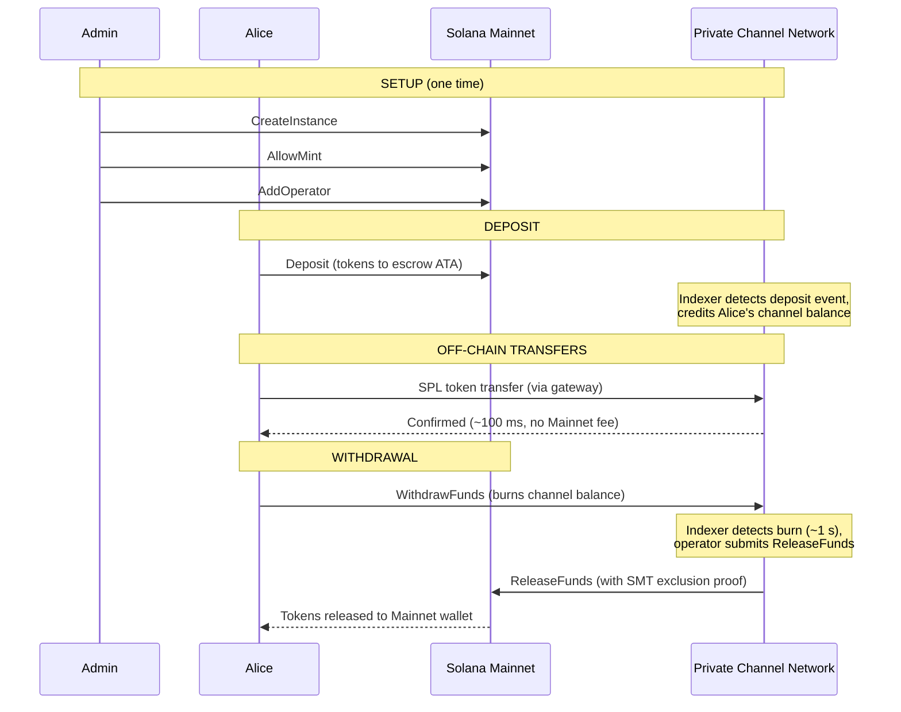
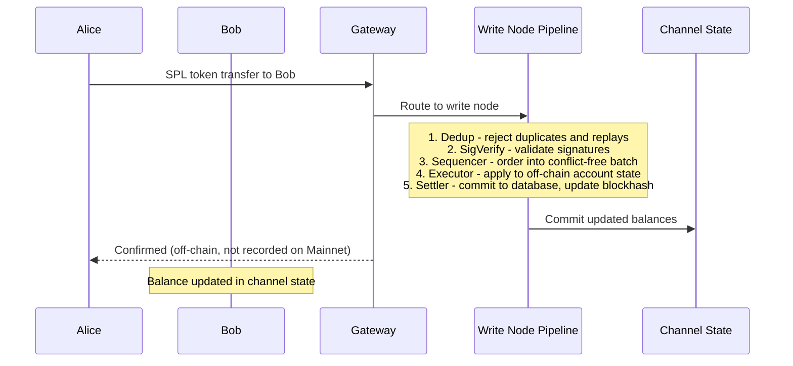
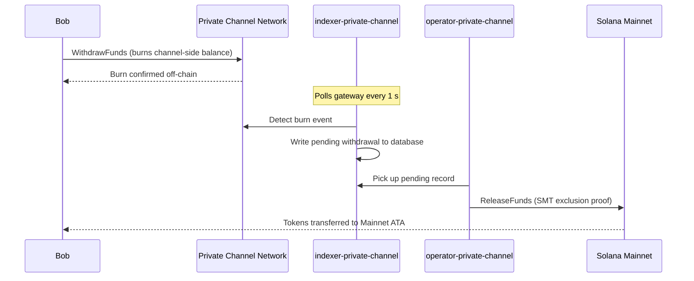

## Özel Kanal Nedir?

Özel kanal, Solana'ya bağlı zincir dışı bir ödeme ağıdır. Kullanıcılar SPL tokenlarını zincir üstü bir emanet programına yatırır, ardından yüksek hız ve sıfır transfer maliyetiyle bir ağ geçidi üzerinden zincir dışı işlem yapar. Solana Mainnet'e geri ödeme, fonların her zaman kullanılabilir olmasını ve çift harcamanın imkânsız olmasını sağlayan bir Seyrek Merkle Ağacı (Sparse Merkle Tree) kanıtı aracılığıyla gerçekleşir.

Solana'nın yerel ödeme akışının aksine, bir kanal içindeki transferler kullanıcı çekim yapana kadar zincir üzerinde görünmez. Kanal ağı, işlemleri Solana'nın blok süresinden bağımsız olarak işleyen kendi işlem hattını (dedup -> sig verify -> sequencer -> executor -> settler) çalıştırır.

## Katılımcılar

### Instance Admin

Admin, `CreateInstance` aracılığıyla `Instance` PDA'sını dağıtır ve hangi SPL token mint'lerinin kabul edileceğini (`AllowMint` / `BlockMint`) kontrol eder. Admin, `AddOperator` / `RemoveOperator` aracılığıyla operatörleri yetkilendirir ve iptal eder; `SetNewAdmin` aracılığıyla admin haklarını devredebilir. Her instance için bir admin bulunur. Admin hakları devri tek adımda geri alınamaz: mevcut admin, yeni adminin iş birliği olmadan rolü geri alamaz.

### Operatörler

Operatörler admin tarafından yetkilendirilir. Bir `Operator` PDA'sına sahiptirler ve `ReleaseFunds` (Mainnet'e çekimleri ödemek için) ile `ResetSmtRoot` (Sparse Merkle Tree'yi döndürmek için) çağrısı yapmasına izin verilen tek hesaplardır. Operatörler, ağ geçidindeki tüm sahiplik kontrollerini atlar ve `getBlock`, `getTransaction` ile `simulateTransaction` dahil tüm JSON-RPC yöntemlerine erişebilir. JWT rolü: `"operator"`. Operatörler doğrudan veritabanında yetkilendirilmelidir; kendi kendine yetki yükseltme mümkün değildir. Dağıtım ve yapılandırma ayrıntıları için [Operatörler kılavuzuna](/docs/tools/private-channels/operators) bakın.

### Kullanıcılar

Kullanıcılar Auth Service aracılığıyla kendi kendine kaydolur. JWT rolü: `"user"`. Kullanıcılar, Emanet Programı üzerinde doğrudan `Deposit` çağrısı yapabilir ve Çekim Programı'ndaki kanal taraflı `WithdrawFunds` talimatı aracılığıyla çekim başlatabilir. Ağ geçidi erişimi yalnızca kendi doğrulanmış cüzdanlarıyla sınırlıdır; `getBlock`, `getTransaction` veya `simulateTransaction` çağrısı yapamazlar.

## Kanal Yaşam Döngüsü

1. **Instance oluşturma** - Admin, `Instance` PDA'sını oluşturan ve izin verilen mint'leri yapılandıran `CreateInstance` çağrısını yapar.
2. **Yatırma** - Kullanıcılar, `Deposit` talimatı aracılığıyla emanete SPL token yatırır. Tokenlar, instance'ın associated token account'una aktarılır.
3. **Zincir dışı transferler** - Kullanıcılar transferleri ağ geçidi üzerinden gönderir. Transferler, Mainnet'e dokunmadan kanal ağında sıralanır ve yürütülür.
4. **Çekim başlatma** - Kullanıcı, bakiyesini yakmak ve çekim sinyali vermek için Çekim Programı'nda (kanal tarafı) `WithdrawFunds` çağrısını yapar.
5. **Mainnet ödemesi** - Bir operatör geçerli bir SMT dışlama kanıtı sağlar ve tokenları kullanıcının cüzdanına serbest bırakmak için Emanet Programı'nda (Mainnet) `ReleaseFunds` çağrısını yapar.
6. **Ağaç döndürme** - SMT kapasiteye (65.536 yaprak) yaklaştığında, operatör ağacı döndürmek ve yeni bir epoch başlatmak için `ResetSmtRoot` çağrısını yapar.

### Transfer

### Çekim

## Özel Kanallar Ne Zaman Kullanılır

Uygulamanız şunlara ihtiyaç duyduğunda özel kanalları kullanın:

- **Zincir dışı verim** - transfer hacminiz Solana TPS'ini doyurabilir veya saniyenin altında onay gerektirir
- **Gizlilik** - karşı taraf kimlikleri ve transfer tutarları zincir üzerinde görünmemelidir
- **Sıfır transfer ücreti** - işlem başına SOL maliyetinin engelleyici olduğu sık transferlerde

Bunun yerine yerel SPL transferlerini şu durumlarda kullanın:

- **Zincir üstü birleştirilebilirlik** gereklidir (DeFi, takas, borç verme; diğer programların transferi gözlemleyebilmesi veya üzerinde işlem yapabilmesi gerekir)
- **Tek transferli ödeme** yeterlidir ve gizlilik bir endişe kaynağı değildir
- **Ağ geçidi altyapısı** mevcut değildir veya operasyonel olarak uygulanabilir değildir
