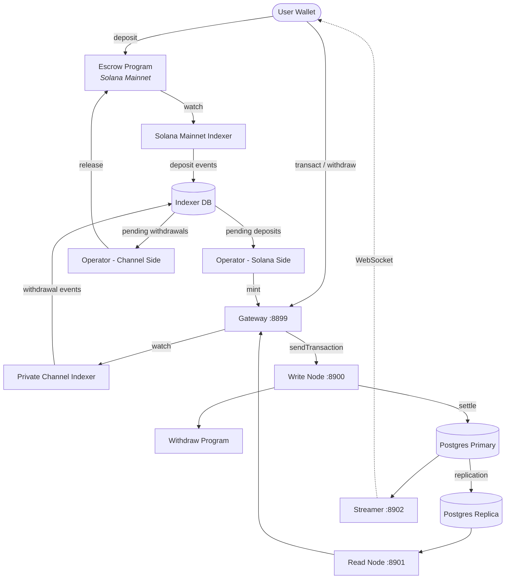

<Callout type="warning">
  Private Channels güvenlik denetiminden geçmemiştir ve gerçek fonlarla üretim ortamında kullanılması, kapsamlı bir güvenlik incelemesi yapılmadan önerilmez.
</Callout>

<Callout type="info">
  **Bir örnek mi dağıtıyorsunuz?** [Operatör kılavuzuna](/docs/tools/private-channels/operators) gidin. **Mevcut bir örneğe mi entegre oluyorsunuz?** [Hızlı Başlangıç](/docs/tools/private-channels/quickstart/installation) bölümüne gidin. Bu sayfa, her iki kitle için de mimari referans niteliğindedir.
</Callout>

## Mimari

Private Channels dört bileşenden oluşur: zincir üzerinde iki Solana programı (Escrow ve Withdraw) ve zincir dışında iki servis (Gateway ve Auth Service). Bu bileşenler birlikte, fonların Mainnet'te yaşadığı ancak transferlerin zincir dışında gerçekleştiği bir durum kanalı protokolü oluşturur.

### Escrow Programı

Escrow Programı, yatırılan SPL tokenlarını tutan zincir üzerinde bir Solana programıdır. Sistemin güven çapasıdır: bir operatör, fonları serbest bırakmak için geçerli bir Sparse Merkle Tree dışlama kanıtı sunana kadar tüm fonlar nihayetinde escrow'da tutulur.

- Program ID: `9tgHa1DcnaSSUtmMsst8ovKTe1Gfxzezn27KnH9xXYeU`
- Bu ID, `declare_id!()` aracılığıyla program ikili dosyasına derlenir. Zincir dışı servisler, aynı ID'yi derleme zamanında oluşturulan istemci crate'inden okur; bir ortam değişkeninden değil.
- `Instance`, `AllowedMint` ve `Operator` PDA'larını yönetir
- Talimatlar: `CreateInstance`, `AllowMint`, `BlockMint`, `AddOperator`,
  `RemoveOperator`, `SetNewAdmin`, `Deposit`, `ReleaseFunds`, `ResetSmtRoot`

### Withdraw Programı

Withdraw Programı, Solana Mainnet'te değil, özel kanal ağında çalışır. Kullanıcılar, kanal tarafındaki token bakiyelerini yakmak için `WithdrawFunds` fonksiyonunu çağırır. Bu yakma işlemi fonları otomatik olarak serbest bırakmaz; operatöre bir çekim işleminin beklemede olduğunu bildirir. Ardından operatör, uzlaşmayı tamamlamak için geçerli bir SMT kanıtıyla Escrow Programı üzerinde `ReleaseFunds` fonksiyonunu çağırır.

- Program ID: `J231K9UEpS4y4KAPwGc4gsMNCjKFRMYcQBcjVW7vBhVi`
- Bu ID program ikili dosyasına derlenir. Zincir dışı servisler, aynı ID'yi derleme zamanında oluşturulan istemci crate'inden okur; bir ortam değişkeninden değil.

### Gateway

Gateway, istemci isteklerini kanalın yazma düğümüne (işlem gönderimi için) ve okuma düğümüne (sorgular için) yönlendiren, Solana JSON-RPC uyumlu bir proxy'dir. Ortam değişkenleri aracılığıyla yapılandırılır: `GATEWAY_PORT`, `GATEWAY_WRITE_URL`, `GATEWAY_READ_URL`.

Sağlık uç noktaları (kimlik doğrulama gerekmez):

- `GET /health` - canlılık kontrolü; `200 {"status":"ok"}` döndürür
- `GET /ready` - derin hazırlık kontrolü, yazma ve okuma düğümlerini sorgular; `200 {"status":"ready"}` veya `503 {"status":"degraded"}` döndürür

#### RPC Metot Yönlendirme ve Erişim

Gateway, `sendTransaction` isteklerini yazma düğümüne, diğer tüm metotları ise okuma düğümüne yönlendirir. 64 KB'dan büyük istekler HTTP 413 ile reddedilir. Kimlik doğrulama etkinleştirildiğinde, metot erişimi JWT rolüne göre denetlenir. Tam metot matrisi için **[Kimlik Doğrulama ve Roller](/docs/tools/private-channels/concepts/auth)** bölümüne bakın.

### Auth Service

Auth Service, gateway erişim kontrolü için HS256 JWT'leri (24 saatlik süre) yayımlayan isteğe bağlı bir bileşendir. `JWT_SECRET` ortam değişkeni ayarlandığında etkinleştirilir. Bu değişken olmadan gateway tüm bağlantıları kabul eder.

JWT talepleri: `sub` (kullanıcı UUID'si), `role` (`"user"` veya `"operator"`), `iss` (`"private-channel-auth"`), `aud` (`"private-channel-gateway"`), `exp` (Unix zaman damgası). `iss` ve `aud`, gateway'in JWT yapılandırması tarafından doğrulanır; uygulama talep yapısına seri kaldırılmaz: uygulama katmanı koduna yalnızca `sub`, `role` ve `exp` erişilebilirdir.

Roller:

- `user` - erişim yalnızca doğrulanmış kendi cüzdanlarıyla sınırlıdır; `getBlock`, `getTransaction` veya `simulateTransaction` çağrılamaz
- `operator` - tüm sahiplik kontrollerini atlar; tam RPC metot erişimi; veritabanında sağlanması gerekir (kendi kendine yükseltme yapılamaz)

### Streamer

Streamer, bağlı istemcilere gerçek zamanlı kanal durum güncellemeleri ileten ve RPC'yi sorgulamaya gerek kalmadan çalışan bir WebSocket sunucusudur. Durum değişiklikleri için PostgreSQL'i sorgular. Bu kılavuzun dağıttığı devnet yığınının değil, temel Docker Compose yığınının bir parçasıdır; ayrıntılar için [Yapılandırma referansı](/docs/tools/private-channels/operators/configuration#service-port-reference) bölümüne bakın.

- Port: `8902`, `STREAMER_PORT` aracılığıyla yapılandırılabilir
- Bağlantı: `ws://localhost:8902`
- Sağlık uç noktası: `GET /health` - herhangi bir dahili yoklama döngüsü 30 saniyenin ötesinde duraksarsa `503` döndürür

<Callout type="warning">
  WebSocket olay şeması henüz kamuoyuna belgelenmemiştir. Resmi belgeler hazır olana kadar uygulama ayrıntıları için [`core/src/bin/streamer.rs`](https://github.com/solana-foundation/solana-private-channels/blob/main/core/src/bin/streamer.rs) dosyasına başvurun.
</Callout>



## İşlem Hattı

```text
Transaction -> [1:Dedup] -> [2:SigVerify] -> [3:Sequencer] -> [4:Executor] -> [5:Settler] -> Database
```

Gateway'e gönderilen işlemler, durumları kaydedilmeden önce beş aşamalı bir süreçten geçer:

1. **Tekilleştirme (Dedup)** - tekrarlanan işlemleri hatta girmeden önce filtreler
2. **İmza Doğrulama (SigVerify)** - işlem imzalarını imzalayanın açık anahtarına karşı doğrular
3. **Sıralayıcı (Sequencer)** - geçerli işlemleri kanonik bir geçmiş oluşturmak için belirleyici biçimde sıralar
4. **Yürütücü (Executor)** - işlemleri kanalın hesap katmanına (BOB Cache + AccountsDB) karşı yürütür ve bakiyeleri zincir dışında günceller
5. **Uzlaştırıcı (Settler)** - birikmiş işlem sonuçlarını PostgreSQL'e işler ve Redis önbelleğini günceller; bir sonraki blok döngüsü için yeni blok karmaları oluşturur. Mainnet uzlaşması (`ReleaseFunds` çağrısı) `operator-private-channel` servisi tarafından ayrı olarak yönetilir

## Temel Özellikler

### Gizlilik

Kanal katılımcıları arasındaki transferler Solana Mainnet'e kaydedilmez. Yalnızca yatırma işlemleri (kanala giriş) ve nihai çekimler (kanaldan çıkış) zincir üzerinde görünür. Karşı taraf kimlikleri ve transfer tutarları, kanal işlemi sırasında dış gözlemcilere görünmez.

### Performans

Zincir dışı işlem hattı, Solana'nın blok süresini kritik yoldan çıkarır. Transferler, bir Solana bloğu onaylandığında değil, sıralayıcı onları işlediğinde onaylanır. Bu, uygulama katmanı transferleri için saniyenin altında kesinlik ve Solana'nın yerel TPS'ini aşan iş hacmi sağlar.

### Uzlaşma

Her çekim işlemi, zincir üzerinde bir Sparse Merkle Tree kanıtıyla güvence altına alınır. SMT kökü, Escrow Programı üzerindeki `Instance.withdrawal_transactions_root` alanında saklanır. `ReleaseFunds` çağrıldığında, program önce görülmemiş bir nonce için mevcut zincir üstü köke karşı bir dışlama kanıtını doğrular, ardından söz konusu nonce için çağıran tarafından sağlanan yeni köke karşı ayrı bir dahil etme kanıtını doğrular. Her iki kontrol de geçildikten sonra yeni kök saklanır; bu sayede bir operatör anahtarı ele geçirilse bile çift harcama imkânsız hale gelir.

## Güvenlik Modeli

**Admin anahtarı** - örnek oluşturmayı (`CreateInstance`) ve operatör sağlamayı (`AddOperator` / `RemoveOperator`) denetler. Admin anahtarının ele geçirilmesi, rastgele operatör sağlanmasına olanak tanır. `SetNewAdmin`, admin yetkisini tek bir adımda geri dönüşsüz biçimde devreder; admin anahtarını buna göre koruyun.

**Operatör anahtarları** - `ReleaseFunds` ve `ResetSmtRoot` fonksiyonlarını çağırabilir. Mevcut zincir üstü köke karşı geçerli bir SMT dışlama kanıtı olmadan fon serbest bırakamazlar. Zincir üstü `verify_smt_exclusion_proof` kontrolü, yetkisiz çekimlere karşı son savunma hattıdır: yalnızca ele geçirilmiş bir operatör anahtarı escrow'u boşaltmak için yeterli değildir.

**SMT kökü** - zincir üzerinde `Instance.withdrawal_transactions_root` alanında saklanır. Her `ReleaseFunds` çağrısıyla atomik olarak güncellenir. Her kanıtın görülmemiş bir nonce'u referans alması gerektiğinden, bir operatör anahtarı ele geçirilse bile aynı kanal bakiyesini çift harcamak imkânsızdır.

**Ağaç rotasyonu** - `Instance.current_tree_index`, ağaç epoch'larını takip eder. `ResetSmtRoot` çağrıldığında, ağaç dizinini artırır ve önceki ağaç epoch'undan gelen tüm nonce'ları geçersiz kılarak yeni uzlaşma döngüleri için temiz bir başlangıç noktası sağlar.

## Operasyonel Anahtar Güvenliği

<Callout type="warning">
  Zincir dışı servisler, yukarıdaki Güvenlik Modeli'nde açıklanan zincir üstü admin/operatör yetkilileriyle ilgisi olmayan kendi imzalayan sözcük dağarcığını kullanır. `ADMIN_PRIVATE_KEY` her operatör servisi için zorunludur ve işlem ücretlerini öder; isteğe bağlı ayrı bir `OPERATOR_PRIVATE_KEY` ise `ReleaseFunds` ve `ResetSmtRoot` için zincir üstü Operatör imzasını sağlar ve ayarlanmadığında `ADMIN_PRIVATE_KEY` değerine geri döner. Protokol düzeyindeki örnek admin anahtarını (`CreateInstance` / `AddOperator` / `SetNewAdmin` için kullanılan) bu değişkenlerden hiçbirine koymayın ve çalışma zamanında açığa çıkarmayın; bu anahtarı soğuk ve çevrimdışı tutun.
</Callout>

`ReleaseFunds` ve `ResetSmtRoot`, iki zincir üstü imza gerektirir: ücret ödeyici (`ADMIN_PRIVATE_KEY`'den) ve Operator PDA'nın yetkililisi (`OPERATOR_PRIVATE_KEY`'den ya da ayarlanmamışsa `ADMIN_PRIVATE_KEY`'den). Bu dağıtım kılavuzunun devnet izlemesi, oluşturulan operatör keypair'ini `ADMIN_PRIVATE_KEY`'e koyar ve `OPERATOR_PRIVATE_KEY`'i ayarlanmamış bırakır; böylece aynı keypair her iki imzalayan rolünü de üstlenir. `ADMIN_PRIVATE_KEY`'e giren anahtarı, sıcak cüzdan özel anahtarıyla aynı kontrollerle değerlendirin:

- Yalnızca gitignore'a alınmış `.env` dosyasında saklayın; `.env.devnet` veya taahhüt edilmiş herhangi bir yapılandırmada asla saklamayın
- Üretim dağıtımları için düz metin ortam değişkeni yerine bir gizli dizi yöneticisi (AWS Secrets Manager, HashiCorp Vault) kullanmayı değerlendirin
- Protokol düzeyindeki örnek admin keypair'i (`AddOperator` / `SetNewAdmin` çağırmak için kullanılan) soğuk tutulmalıdır; yalnızca örnek kurulumu ve operatör sağlama sırasında gereklidir, çalışma zamanında değil

`SetNewAdmin`, admin haklarını **tek bir işlemde geri dönüşsüz biçimde** devreder: mevcut admin, yeni adminin iş birliği olmadan herhangi bir kurtarma yoluna sahip değildir. Hedef adresi doğrulamadan çağırmayın.

## Sonraki Adımlar

<Cards>
  <Card
    title="Hızlı Başlangıç"
    href="/docs/tools/private-channels/quickstart/installation"
  >
    Ortamınızı kurun ve TypeScript istemcileri oluşturun.
  </Card>
  <Card title="Kanallar" href="/docs/tools/private-channels/concepts/channels">
    Katılımcıları ve kanal yaşam döngüsünü anlayın.
  </Card>
  <Card
    title="Sparse Merkle Tree"
    href="/docs/tools/private-channels/concepts/smt"
  >
    Çekim kanıtlarının zincir üzerinde nasıl doğrulandığını anlayın.
  </Card>
  <Card
    title="Talimatlar"
    href="/docs/tools/private-channels/instructions/deposit"
  >
    Tüm programlar için eksiksiz talimat referansı.
  </Card>
</Cards>
