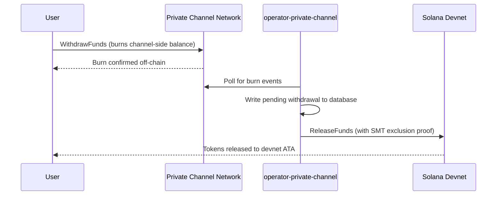

## Genel Bakış

Private Channels'tan para çekme iki adımlı bir işlemdir. İlk olarak, kullanıcı Withdraw Program üzerinde `WithdrawFunds` çağırarak kanal tarafındaki token bakiyesini yakar. İkinci olarak, bir operatör fonları serbest bırakmak için Escrow Program üzerinde (bu kılavuzda devnet) geçerli bir Sparse Merkle Tree dışlama kanıtıyla `ReleaseFunds` çağırır. SMT kanıtı, her para çekme nonce'ının yalnızca bir kez kullanılabilmesini sağlayarak çift harcamayı önler.



## Adım 1: Kanalda Para Çekmeyi Başlat

Kanal tarafındaki bakiyenizi yakmak için Withdraw Program üzerinde `WithdrawFunds` çağırın.
`tokenAccount` PDA'sını otomatik türeten ve üretim kullanımı için önerilen form olan `Async` varyantını kullanın:

```typescript
import { getWithdrawFundsInstructionAsync } from "../private-channel-withdraw-program/clients/typescript/src/generated";
import {
  createSolanaRpc,
  address,
  pipe,
  createTransactionMessage,
  setTransactionMessageFeePayerSigner,
  setTransactionMessageLifetimeUsingBlockhash,
  appendTransactionMessageInstruction,
  signAndSendTransactionMessageWithSigners,
  assertIsTransactionMessageWithSingleSendingSigner,
  getBase58Decoder
} from "@solana/kit";

// Point to the gateway, not a public Solana RPC
const privateChannelRpc = createSolanaRpc("http://localhost:8899");

const withdrawIx = await getWithdrawFundsInstructionAsync({
  user: userSigner,
  mint: address(mintAddress),
  amount: 1_000_000n, // 1 USDC (6 decimals)
  destination: null // null = release to signer's devnet wallet
});

const { value: latestBlockhash } = await privateChannelRpc
  .getLatestBlockhash({ commitment: "confirmed" })
  .send();

// Sent to the Private Channels gateway (not Solana RPC directly), which
// expects the legacy transaction format - do not switch this to version 0.
const transactionMessage = pipe(
  createTransactionMessage({ version: "legacy" }),
  (m) => setTransactionMessageFeePayerSigner(userSigner, m),
  (m) => setTransactionMessageLifetimeUsingBlockhash(latestBlockhash, m),
  (m) => appendTransactionMessageInstruction(withdrawIx, m)
);

assertIsTransactionMessageWithSingleSendingSigner(transactionMessage);

const signatureBytes =
  await signAndSendTransactionMessageWithSigners(transactionMessage);
const signature = getBase58Decoder().decode(signatureBytes);
console.log("Withdrawal initiated:", signature);
```

- Withdraw Program ID: `J231K9UEpS4y4KAPwGc4gsMNCjKFRMYcQBcjVW7vBhVi`
- Bu işlemi genel bir Solana RPC'ye değil, ağ geçidine (`http://localhost:8899`) gönderin
- `destination` belirtilirse, serbest bırakılan fonlar imzalayanın cüzdanı yerine o cüzdana gönderilir

## Ne Beklenmeli

`WithdrawFunds` çağrıldıktan sonra başka bir işlem yapmanıza gerek yoktur. Operatör servisleri uzlaşmayı otomatik olarak gerçekleştirir:

1. `indexer-private-channel`, yakma olayları için kanalı her 1 saniyede bir yoklar ve sizin olayınız tespit edildiğinde bekleyen bir para çekme kaydı yazar
2. `operator-private-channel`, bekleyen kayıtlar için veritabanını her 1 saniyede bir yoklar ve gerekli SMT dışlama kanıtıyla Solana devnet üzerindeki Escrow Program'a `ReleaseFunds` gönderir; yeniden denemeden önce 400 ms aralıklarla en fazla 5 kez devnet onayı için yoklama yapar

Fonlar normal koşullar altında genellikle birkaç saniye içinde devnet cüzdanınızda görünür.

## Operatör Uzlaşması Nasıl Gerçekleşir (Referans)

Kanal tarafındaki yakma işleminden sonra, sağlanmış bir operatörün geçerli bir SMT dışlama kanıtıyla Escrow Program üzerinde `ReleaseFunds` çağırması gerekir; operatör, para çekme nonce'ının daha önce kullanılmadığını kanıtlamadan fonları serbest bırakamaz. Bu adım `operator-private-channel` tarafından otomatik olarak gerçekleştirilir; kendiniz çağırmanıza gerek yoktur.

Operatör şunları sağlar:

- `amount`: yakılan miktarla eşleşmelidir
- `user`: devnet üzerindeki alıcı cüzdan
- `new_withdrawal_root`: bu para çekiminden sonra güncellenmiş SMT kökü
- `transaction_nonce`: bu yaprak için benzersiz nonce
- `sibling_proofs`: 512 bayt (ağaç kanıtı için 16 x 32 baytlık kardeş hash'ler)

## Doğrulama

Operatör çağrısı onaylandıktan sonra devnet token bakiyenizi kontrol edin:

```bash
spl-token balance <MINT_ADDRESS> --owner <YOUR_WALLET>
```

Ya da RPC aracılığıyla:

```typescript
import { createSolanaRpc, address } from "@solana/kit";
import { findAssociatedTokenPda } from "@solana-program/token";

const TOKEN_PROGRAM_ADDRESS = address(
  "TokenkegQfeZyiNwAJbNbGKPFXCWuBvf9Ss623VQ5DA"
);

// Query devnet directly; ReleaseFunds settles here, not through the gateway
const rpc = createSolanaRpc("https://api.devnet.solana.com");

const [yourDevnetAta] = await findAssociatedTokenPda({
  mint: address(mintAddress),
  owner: address(userSigner.address),
  tokenProgram: TOKEN_PROGRAM_ADDRESS
});

const balance = await rpc.getTokenAccountBalance(yourDevnetAta).send();
console.log(balance.value.uiAmountString);
```

## Hızlı Başlangıcı Tamamladınız

Devnet üzerinde tam Private Channels döngüsünü çalıştırdınız: SPL tokenları escrow'a yatırdınız, ağ geçidi üzerinden zincir dışı bir transfer gönderdинiz ve fonları devnet cüzdanınıza geri çektiniz.

<Cards>
  <Card
    title="Kanal Yaşam Döngüsü"
    href="/docs/tools/private-channels/concepts/channels"
  >
    Katılımcıları ve yatırımdan para çekmeye kadar olan tam akışı derinlemesine anlayın.
  </Card>
  <Card
    title="Kimlik Doğrulama ve Roller"
    href="/docs/tools/private-channels/concepts/auth"
  >
    Entegrasyonunuza JWT kimlik doğrulaması ekleyin.
  </Card>
  <Card
    title="Fon Serbest Bırakma Referansı"
    href="/docs/tools/private-channels/instructions/release-funds"
  >
    Operatör araçları için tam ReleaseFunds talimat referansı.
  </Card>
  <Card
    title="Sparse Merkle Tree"
    href="/docs/tools/private-channels/concepts/smt"
  >
    Para çekme kanıtlarının çift harcamayı nasıl önlediğini anlayın.
  </Card>
</Cards>
