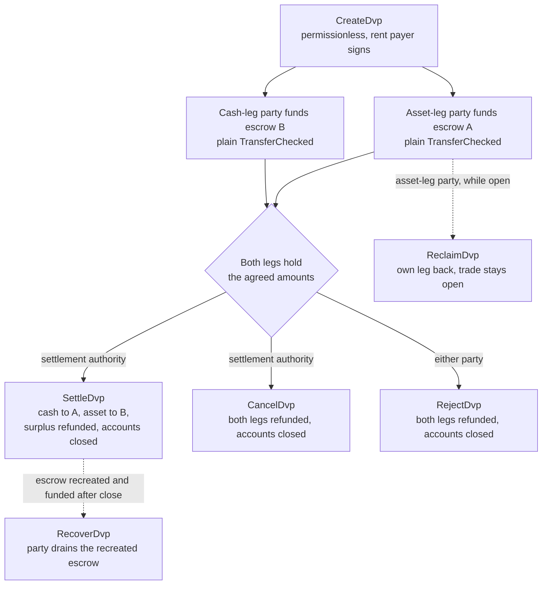
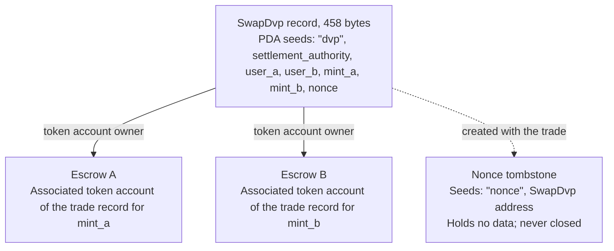

Програма DvP — це стандартна програма для поставки проти платежу (delivery versus payment) у Solana,
якою опікується Solana Foundation і яку проаудитовано компанією Cantina. Дві сторони домовляються
про угоду, кожна надсилає свою ногу на ескроу-акаунт звичайним переказом
токенів, а розрахунковий орган проводить розрахунок за обома ногами в одній транзакції, тож
або виконуються обидві, або жодна. Розрахунковий орган — це третя адреса,
вказана в угоді, наприклад майданчик або агент, який її організував. Жодна зі сторін не
пише й не розгортає програму, а гаманець чи кастодіан, який може надіслати стандартний
переказ токенів (`TransferChecked`), може профінансувати ногу без жодної інтеграції
з DvP. До розрахунку кожна зі сторін може забрати свою ногу назад або скасувати
угоду.

<Callout type="warn" title="Перевіряйте запис, перш ніж діяти на його підставі">

Створення запису угоди не потребує дозволів, тому запис не є доказом
домовленості. Кожна сторона перевіряє збережені умови перед фінансуванням, а розрахунковий
орган — перед розрахунком (див.
[перевірка](#verification-before-funding-and-settlement)).

</Callout>

## Як це працює

Кожна угода отримує запис, що належить програмі, та два ескроу-акаунти — по одному на ногу. Сторона
активної ноги (`user_a`) і сторона грошової ноги (`user_b`) фінансують кожна свою ногу,
переказуючи токени на ескроу-акаунт цієї ноги. Розрахунковий
орган — єдиний підписант, який може провести розрахунок. Розрахунок переказує погоджену
кількість кожної ноги протилежній стороні, повертає будь-який надлишок стороні, якій належить
нога, і закриває запис та обидва ескроу. Атомарність забезпечують [транзакції](/docs/core/transactions) Solana:
обидва перекази виконуються в одній транзакції,
тож або набувають чинності обидва, або жоден.

Кожне повернення коштів, забирання ноги та повернення надлишку надходить на власний associated
token account сторони: акаунт `user_a` для `mint_a`, акаунт `user_b` для `mint_b`. 
Кастодіан або казначейська система може профінансувати ногу зі свого акаунта, але все,
що повертається, потрапляє на акаунт сторони, а не назад до кастодіана. Кожна угода
також залишає постійний маркерний акаунт (див. [Стан](#state)).

## Посібники

Сторінки з кроками проводять одну угоду від створення до розрахунку, з прикладами на TypeScript і
Rust для кожної інструкції.

<Cards>
  <Card title="Створення угоди" href="/docs/defi/dvp-program/create-a-trade">
    Установіть клієнти та запишіть умови угоди за допомогою CreateDvp
  </Card>
  <Card title="Фінансування ніг" href="/docs/defi/dvp-program/fund-the-legs">
    Перевірте збережені умови, а потім профінансуйте кожну ногу простим переказом
  </Card>
  <Card title="Розрахунок за угодою" href="/docs/defi/dvp-program/settle-the-trade">
    Проведіть розрахунок за обома ногами в одній транзакції як розрахунковий орган
  </Card>
  <Card title="Скасування угоди" href="/docs/defi/dvp-program/unwind-a-trade">
    Заберіть ногу, скасуйте або відхиліть угоду та поверніть запізнілі депозити
  </Card>
</Cards>

[Демо на devnet](https://solana.com/delivery-vs-payment/demo) проводить угоду від
початку до кінця: створює угоду, фінансує обидва ескроу стандартними переказами токенів і
проводить розрахунок за обома ногами в одній транзакції.

## Вибір між програмою та делегуванням

[Delivery vs Payment (DvP) із використанням делегування](/docs/tokenization/dvp) проводить
той самий обмін без програми: кожна сторона делегує свою позицію
розрахунковому агенту, який переміщує обидві ноги в одній транзакції.

- **Програма** не потребує делегування, тож обмеження в один делегат на
  token account не застосовується, а розрахунковий орган не може перенаправити надходження.
  Кожна угода залежить від програми з можливістю оновлення та її upgrade authority.
- **Шаблон делегування** не залежить від програми та працює з mint-ами, які
  використовують Scaled UI Amount. Програма відхиляє такі mint-и, що виключає будь-який
  mint, створений із шаблону `tokenized-security` від Mosaic (див.
  [обмеження конфігурації mint](#mint-configuration-constraints)).

## Ролі

Програма симетрична. В її інтерфейсі двоє сторін — це `user_a`, який
поставляє `mint_a`, і `user_b`, який поставляє `mint_b`. У README та
згенерованих клієнтах `mint_a` називається активною ногою, а `mint_b` — грошовою,
і ці сторінки дотримуються цієї домовленості, проте ніщо в програмі не вимагає, щоб грошова
нога була саме грошовим інструментом. Два активи або два стейблкоїни розраховуються так
само.

| Роль                 | Хто                               | Підписує                                              | Примітки                                                                                                                                                                                                     |
| -------------------- | --------------------------------- | -------------------------------------------------- | --------------------------------------------------------------------------------------------------------------------------------------------------------------------------------------------------------- |
| Сторона активної ноги      | `user_a`, поставляє `mint_a`       | Власний переказ для фінансування; Reclaim, Reject, Recover | Гаманець на основі keypair або смарт-гаманець на основі PDA, наприклад сховище multisig. Multisig-акаунт SPL Token або program account не може бути стороною: Create завершується помилкою `PartyNotSignerCapable`                   |
| Сторона грошової ноги       | `user_b`, поставляє `mint_b`       | Власний переказ для фінансування; Reclaim, Reject, Recover | Та сама вимога                                                                                                                                                                                          |
| Розрахунковий орган | Третя адреса, указана під час створення | Settle, Cancel                                     | Єдиний підписант, який може провести розрахунок. Не може перенаправити надходження, які фіксуються під час створення. Отримує rent закритих акаунтів, коли проводить розрахунок або скасовує угоду                                         |
| Платник rent           | Той, хто підписує `CreateDvp`         | Create                                             | Сплачує rent (депозит у SOL, що підтримує акаунт відкритим) за запис, nonce tombstone та обидва ескроу. Не записується як отримувач rent: rent закритих акаунтів отримує той, хто закриває угоду |

## ID програми

```text
dvp34bdbcEm4f4FCUjGV4mDAkDshaQR4LkK8fdcsyZq
```

| Кластер      | Програма                                       | Upgrade authority                              | Останній slot розгортання |
| ------------ | --------------------------------------------- | ---------------------------------------------- | ------------------ |
| mainnet-beta | `dvp34bdbcEm4f4FCUjGV4mDAkDshaQR4LkK8fdcsyZq` | `DXtFpbPjcn2hxPnw79x1Pfoj35vXh5AsWBkS37YnXMVv` | 452,058,374        |
| devnet       | `dvp34bdbcEm4f4FCUjGV4mDAkDshaQR4LkK8fdcsyZq` | `5EX1zFeJWj4rGYZv432WnYw8CbaSUeTdxPx4r573UgYU` | 479,376,863        |

Програму можна оновлювати в обох кластерах. Наведені вище значення — це те, що
`solana program show` показала 2 жовтня 2026 року; виконайте ту саму команду, щоб
отримати актуальні значення. Збірка на devnet старіша за коміт, під який
написано сторінки з кроками (див. [Встановлення](/docs/defi/dvp-program/create-a-trade#install)),
але набір інструкцій і помилок той самий.

## Життєвий цикл



Угода відкрита від `CreateDvp` до моменту, коли її закриє одна з інструкцій Settle, Cancel або Reject.
У фінансування немає окремої інструкції: нога вважається профінансованою, коли її ескроу-
акаунт містить щонайменше погоджену суму. Reclaim діє для окремої ноги й залишає
угоду відкритою, тож проблема з однією ногою не змушує іншу сторону скасовувати
всю угоду.

## Стан

Кожна угода має один акаунт `SwapDvp` розміром 458 байтів, який належить програмі. Його
адреса виводиться з розрахункового органу, двох сторін, двох
mint-ів і nonce (seeds
`["dvp", settlement_authority, user_a, user_b, mint_a, mint_b, nonce]`). 
Суми та час зберігаються всередині акаунта й не впливають на адресу,
тому їх потрібно зчитувати, а не вгадувати. Невеликий маркерний акаунт,
nonce tombstone за адресою `["nonce", swap_dvp]`, створюється разом з угодою й
ніколи не закривається, тож кожну комбінацію сторін, mint-ів, органу й nonce можна
використати лише для однієї угоди.



| Поле                                  | Тип          | Значення                                                                                                 |
| -------------------------------------- | ------------- | ------------------------------------------------------------------------------------------------------- |
| `bump`                                 | `u8`          | PDA bump                                                                                                |
| `user_a`, `user_b`                     | `Pubkey`      | Дві сторони                                                                                         |
| `mint_a`, `mint_b`                     | `Pubkey`      | Mint-и активної та грошової ніг                                                                        |
| `settlement_authority`                 | `Pubkey`      | Єдиний підписант, який може провести розрахунок або скасувати угоду                                                               |
| `token_program_a`, `token_program_b`   | `Pubkey`      | token program, якій належить кожен mint; в одній угоді можна поєднувати ноги SPL Token і Token-2022                    |
| `amount_a`, `amount_b`                 | `u64`         | Погоджена сума кожної ноги в найменшій одиниці mint (базові одиниці)                                 |
| `expiry_timestamp`                     | `i64`         | Після цього мережевого часу (ончейн-годинника) Settle відхиляється. Reclaim, Cancel і Reject і далі працюють |
| `nonce`                                | `u64`         | Розрізняє угоди, що мають однакові інші seeds. Одноразовий                                             |
| `ref_string`                           | `[u8; 64]`    | Непрозорий клієнтський референс, доповнений нулями; програма його ніколи не читає                                     |
| `user_a_settlement_destination`        | `Pubkey`      | Отримує грошову ногу під час Settle; за замовчуванням `user_a`                                                   |
| `user_b_settlement_destination`        | `Pubkey`      | Отримує активну ногу під час Settle; за замовчуванням `user_b`                                                  |
| `mint_a_authority`, `mint_b_authority` | `Pubkey`      | Mint authority, зафіксовані під час створення; Settle завершується помилкою, якщо будь-який із них змінився                           |
| `earliest_settlement_timestamp`        | `Option<i64>` | Якщо задано, Settle відхиляється до цього мережевого часу                                                     |

Перелік полів узято з IDL програми на коміті, указаному в розділі
[Створення угоди](/docs/defi/dvp-program/create-a-trade#install).

## Інструкції

| Інструкція  | Підписант               | Дія                                                                                                                                                              |
| ------------ | -------------------- | ------------------------------------------------------------------------------------------------------------------------------------------------------------------- |
| `CreateDvp`  | Будь-який платник            | Створює запис `SwapDvp`, його nonce tombstone та обидва ескроу-акаунти. Не переміщує жодних токенів                                                                        |
| `ReclaimDvp` | `user_a` або `user_b` | Повертає з ескроу власну ногу підписанта. Угода залишається відкритою, і ногу можна профінансувати знову                                                                      |
| `SettleDvp`  | Розрахунковий орган | Переказує `amount_a` на адресу призначення `user_b`, а `amount_b` — на адресу призначення `user_a`, повертає будь-який надлишок стороні ноги, закриває запис та обидва ескроу |
| `CancelDvp`  | Розрахунковий орган | Повертає все, що містить ескроу A, стороні `user_a`, а ескроу B — стороні `user_b`, закриває запис та обидва ескроу                                                            |
| `RejectDvp`  | `user_a` або `user_b` | Той самий ефект, що й у Cancel, але підписує сторона                                                                                                                            |
| `RecoverDvp` | `user_a` або `user_b` | Після закриття угоди: переказує вміст перестворленого ескроу на власний token account підписанта та закриває його. Покриває депозит, що надійшов після Settle, Cancel або Reject  |

Кожне повернення коштів надходить на власний associated token account сторони для mint
цієї ноги, незалежно від того, хто профінансував ескроу.

Акаунти та аргументи кожної інструкції наведено на сторінці відповідного кроку.

## Помилки

| Код | Помилка                            | Коли                                                                                                   |
| ---- | -------------------------------- | ------------------------------------------------------------------------------------------------------ |
| 0    | `SignerNotParty`                 | Reclaim, Reject або Recover підписано адресою, яка не є `user_a` чи `user_b`                      |
| 1    | `DvpExpired`                     | Settle після `expiry_timestamp`                                                                        |
| 2    | `SettlementAuthorityMismatch`    | Settle або Cancel підписано адресою, відмінною від розрахункового органу                              |
| 3    | `SettlementTooEarly`             | Settle до `earliest_settlement_timestamp`                                                          |
| 4    | `LegNotFunded`                   | Settle, коли ескроу містить менше за погоджену суму                                               |
| 5    | `ExpiryNotInFuture`              | Create із терміном дії, що збігається з поточним мережевим часом або передує йому                                            |
| 6    | `EarliestAfterExpiry`            | Create із найранішим часом розрахунку, що припадає після закінчення терміну дії                                               |
| 7    | `SelfDvp`                        | Create, де `user_a` дорівнює `user_b`                                                                 |
| 8    | `SameMint`                       | Create, де `mint_a` дорівнює `mint_b`                                                                 |
| 9    | `ZeroAmount`                     | Create з нульовою сумою для будь-якої з ніг                                                                |
| 10   | `BlockedMintExtension`           | Create або Settle з mint, що має TransferFee, InterestBearing, ScaledUiAmount або NonTransferable |
| 11   | `SettlementAuthorityIsParty`     | Create, де розрахунковий орган збігається зі стороною                                                  |
| 12   | `SettlementAuthorityExecutable`  | Create із виконуваним розрахунковим органом                                                         |
| 13   | `NonceAlreadyUsed`               | Create повторно використовує `(seeds, nonce)`, для якого вже існує tombstone                                         |
| 14   | `ExpiryTooFarInFuture`           | Create із терміном дії понад один рік уперед                                                         |
| 15   | `RefStringTooLong`               | Create із референсом довше за 64 байти                                                           |
| 16   | `DvpStillOpen`                   | Recover, поки угода ще відкрита; використовуйте Reclaim                                                     |
| 17   | `DvpNeverCreated`                | Recover із seed-ами, для яких немає tombstone                                                              |
| 18   | `EscrowPreloadedWithLamports`    | Create, коли ненативний ескроу утримує lamports понад свій мінімум для звільнення від rent                           |
| 19   | `SettlementDestinationIsSwapDvp` | Create із призначенням розрахунку, що збігається із записом угоди                                         |
| 20   | `SwapDvpPreloadedWithLamports`   | Create, коли адреса запису утримує lamports понад свій резерв rent                                   |
| 21   | `RecipientAtaMismatch`           | Token account отримувача або повернення більше не належить очікуваному гаманцю та мінту                  |
| 22   | `PartyNotSignerCapable`          | Create зі стороною, яка не є системним, невиконуваним акаунтом                                 |
| 23   | `MintAuthorityChanged`           | Settle, коли mint authority ноги відрізняється від значення, зафіксованого під час створення                         |

## Події та індексація

Програма не створює жодних ончейн-подій. Індексатор або система звірки зчитує
стан акаунта `SwapDvp` і баланси токенів двох ескроу та використовує
`ref_string`, щоб співставити угоду з її офчейн-замовленням. Оскільки запис
закривається під час розрахунку, система, якій потрібні умови постфактум,
зберігає їх під час зчитування або відновлює з транзакції, що створила
угоду.

## Підтримувані токени

В угоді можна поєднати ногу SPL Token з ногою Token-2022; кожна нога має власну
Token Program. Ноги з Wrapped SOL підтримуються.

| Розширення Token-2022 на мінті ноги                                                     | Поведінка програми                                                  |
| ---------------------------------------------------------------------------------------- | ----------------------------------------------------------------- |
| TransferFee, InterestBearing, ScaledUiAmount, NonTransferable                            | Відхиляється на Create і Settle з помилкою `BlockedMintExtension`         |
| PermanentDelegate, Pausable, DefaultAccountState, freeze authority, MintCloseAuthority | Приймається; кожен із цих authority може діяти над токенами в ескроу           |
| ConfidentialTransfer                                                                     | Приймається; суми на цій нозі є публічними                          |
| TransferHook                                                                             | Підтримується, до 32 додаткових акаунтів на ногу                        |
| MemoTransfer на акаунті призначення або повернення                                          | Приймається; програма надсилає потрібне memo перед переказом |

Комісія за переказ призвела б до того, що отримувач недоотримає узгодженої суми.
Interest Bearing і Scaled UI Amount не змінюють «сирі» суми, але їхня ставка
або множник можуть змінитися між створенням і розрахунком угоди, що змінює
відображення узгоджених сум. NonTransferable заблокував би обидві ноги.

Прийняті authority можуть переміщувати, заморожувати чи зупиняти токени в ескроу
протягом усього життєвого циклу угоди (див. нижче). Ескроу не можна налаштувати
на отримання конфіденційних переказів, тому суми в ескроу та суми розрахунку
на конфіденційній нозі є публічними.

Для мінта з хуком клієнт визначає додаткові акаунти хука й додає
їх до Settle, Cancel, Reject, Reclaim і Recover. Ліміт у 32 на ногу
враховує програму хука та його акаунт валідації. Якщо hook authority
збільшить список акаунтів хука понад цей ліміт, кожен переказ на цій нозі
завершуватиметься помилкою, зокрема Reclaim, Cancel, Reject і Recover, доки authority
не скасує зміну. Ліміт акаунтів у транзакції може спрацювати раніше за ліміт на ногу,
коли обидві ноги мають хуки.

Коли акаунт призначення або повернення вимагає memo, програма викликає програму
Memo перед переказом, тому кожна інструкція, що переміщує токени
з ескроу, приймає акаунт `memo_program`.

### Обмеження конфігурації мінта

**Scaled UI Amount.** Шаблон `tokenized-security` у
[Mosaic](https://github.com/solana-foundation/mosaic), інструментарії випуску токенів від Solana Foundation,
завжди додає Scaled UI Amount, тому програма не приймає
мінт, створений із цього шаблону, як ногу. Мінт, призначений для цієї програми,
можна створити без цього розширення (див.
[Token Extensions](/docs/tokens/extensions));
[DvP із делегуванням](/docs/tokenization/dvp) виконує розрахунок через делеговані
повноваження й не застосовує цю перевірку.

**Мінти, заморожені за замовчуванням.** Ескроу кожної угоди — це associated token account,
який належить Program Derived Address, нову для кожної угоди. На мінті з
Default Account State, встановленим у frozen, ескроу створюється замороженим, і переказ
для його поповнення завершується помилкою, доки його не розморожено. У межах
[Token ACL](/docs/tokenization/token-acl) це означає, що емітент або його трансфер-агент допускає ескроу угоди до поповнення: або додаючи адресу запису
угоди (власника ескроу) до allowlist, щоб будь-хто міг розморозити
ескроу, якщо конфігурація Token ACL мінта вмикає розморожування без дозволів, або
просячи freeze authority розморозити його напряму. Заморожене ескроу також блокує
Settle, Reclaim, Cancel, Reject і Recover на цій нозі, тож freeze
authority, а на мінті з хуком — hook authority, є довіреною стороною протягом
усього життя угоди. Шлях із замороженим ескроу описано тут, але він не задіяний
у фрагментах для devnet.

## Обмеження

- Жодного зіставлення, визначення цін чи книги замовлень. Сторони узгоджують умови
  поза реєстром, і одна з них їх записує.
- Жодного неттінгу, лише двосторонні угоди: один запис — це одна угода між двома сторонами.
- Жодного часткового виконання. Settle переміщує рівно узгоджену суму кожної ноги
  і повертає будь-який надлишок стороні ноги.
- Жодної позареєстрової ноги. Обидві ноги — це token accounts у Solana; грошова нога
  в наявних системах розраховується окремо й узгоджується.
- Жодної перевірки прав, allowlist чи KYC. Власні засоби контролю мінта забезпечують
  відповідність власників.
- Жодного автоматичного розрахунку. Settlement authority має підписати.
- Жодних подій і жодної комісії протоколу, окрім комісій за транзакції та rent.

Програма усуває основний ризик між двома сторонами: жодна нога не переміщується,доки не переміститься й інша. Вона не усуває кредитного ризику емітента чи ризику погашення за жодним
з токенів, можливості freeze authority, pause authority чи permanent delegate мінта
діяти над токенами в ескроу (див. [підтримувані токени](#supported-tokens)), а також
залежності від доступності settlement authority для підпису.

## Перевірка перед поповненням і розрахунком

`CreateDvp` не потребує дозволів: підписує лише платник, а сторони й
settlement authority — ні. Тому будь-хто може створити запис із будь-якими
сторонами та умовами. Перед поповненням і ще раз перед розрахунком зчитайте
акаунт `SwapDvp` і переконайтеся, що:

1. Акаунт належить програмі DvP і має рівно 458 байтів. Акаунт,
   що не належить програмі, можна заповнити байтами, які декодуються як
   справжній запис.
2. `user_a`, `user_b`, `mint_a`, `mint_b` і `settlement_authority` відповідають
   узгодженій угоді.
3. `amount_a`, `amount_b`, `expiry_timestamp` і
   `earliest_settlement_timestamp` відповідають узгодженим умовам.
4. Обидва призначення розрахунку — це узгоджені адреси. Підроблений запис може
   перенаправити кошти.

[Поповнення ніг](/docs/defi/dvp-program/fund-the-legs#verify-the-terms) перелічує
перевірні рідери згенерованих клієнтів і показує перевірку в коді.

Вважайте угоду розрахованою, коли транзакція Settle досягає
[`finalized`](/docs/rpc#configuring-state-commitment). Це рівень
підтвердження мережі; чи він також означає остаточність розрахунку для юридичних цілей,
залежить від домовленостей сторін і застосовних режимів.

## Версіонування

Акаунт `SwapDvp` не має поля версії. Його структура фіксована — 458 байтів
(`SwapDvp::LEN`), а перевірні рідери відхиляють акаунт будь-якої іншої довжини.
IDL має власну версію — `0.1.0` станом на 2 жовтня 2026 року.

Програма може оновлюватися в обох кластерах (див. [ID програми](#program-id)). Запис
угоди існує лише доти, доки її не розраховано, не скасовано чи не відхилено, тож перевірте
репозиторій, як оновлення впливає на відкриті угоди, і перегенеруйте клієнтів
з IDL розгорнутої збірки.

## Репозиторій та аудит

Вихідний код, IDL, згенеровані клієнти й тести містяться в
[`solana-foundation/dvp`](https://github.com/solana-foundation/dvp) за ліцензією
MIT. Програма — це `no_std` програма на Pinocchio; клієнти
генеруються з IDL за допомогою Codama. Звіти про вразливості надсилаються через
посилання на security advisory репозиторію згідно з його `SECURITY.md`.

Програму перевірила
[Cantina](https://cantina.xyz/portfolio/fe870bb4-d96d-4902-8aec-9dfcfa2d6a79).

## Пов’язане

- [Поставка проти платежу (DvP) із делегуванням](/docs/tokenization/dvp): патерн
  делегування без програми
- [Token ACL](/docs/tokenization/token-acl): як мінт із обмеженим доступом взаємодіє з
  акаунтами ескроу
