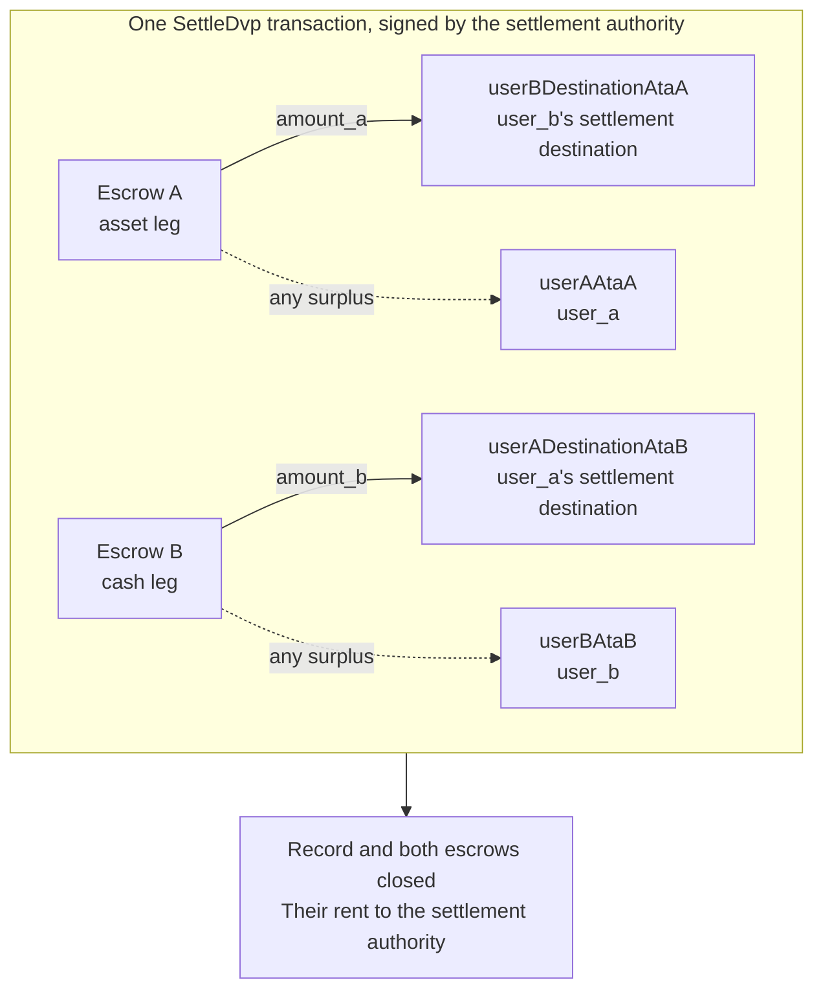

`SettleDvp` підписує розрахунковий уповноважений, указаний у записі угоди. В одній
транзакції вона переміщує `amount_a` з ноги активу на адресу призначення
сторони грошової ноги та `amount_b` з грошової ноги на адресу призначення
сторони ноги активу, повертає будь-який надлишок в обох ескроу стороні відповідної ноги
і закриває запис та обидва ескроу. Якщо будь-який із цих переказів не може бути виконаний,
інструкція завершується помилкою, і нічого не переміщується.

Ця сторінка є продовженням розділів [створення угоди](/docs/defi/dvp-program/create-a-trade)
та [фінансування ніг](/docs/defi/dvp-program/fund-the-legs); клієнт, підписанти,
`trade` і token accounts сторін переходять звідти.

## Повторна перевірка перед підписанням

Розрахунковий уповноважений підписує транзакцію, яка переміщує обидві ноги, тому
перед підписанням він виконує те саме читання, що й кожна зі сторін: власник, розмір, сторони,
mint-и, суми, термін дії та обидві адреси призначення (див.
[фінансування ніг](/docs/defi/dvp-program/fund-the-legs#verify-the-terms)). Сама
програма під час розрахунку повторно перевіряє, що кожен mint досі належить token
program, записаній під час створення, не має заблокованих розширень і має тих самих
mint authority, що й під час створення угоди, тож mint, перестворений із заблокованим
розширенням, іншою token program або іншим mint authority, не може
бути розрахований.

## Створення акаунтів отримувачів

Розрахунок записує дані в чотири token accounts, які програма не створює:

| Акаунт                | Отримує                     | Власник                           |
| ---------------------- | ---------------------------- | ------------------------------- |
| `userADestinationAtaB` | Грошова нога (`amount_b`)    | `user_a_settlement_destination` |
| `userBDestinationAtaA` | Нога активу (`amount_a`)   | `user_b_settlement_destination` |
| `userAAtaA`            | Будь-який надлишок на нозі активу | `user_a`                        |
| `userBAtaB`            | Будь-який надлишок на грошовій нозі  | `user_b`                        |

Акаунти для надлишку використовуються лише тоді, коли ескроу містить більше за погоджену
суму, але будь-хто, хто володіє mint, може створити надлишок, надіславши кілька базових
одиниць в ескроу. Якщо акаунт для повернення не існує, уся транзакція
розрахунку завершується помилкою, тому створіть усі чотири ідемпотентно в тій самій транзакції.

<Tabs items={["TypeScript", "Rust"]}>
  <Tab value="TypeScript">
    ```ts
    import {
      findAssociatedTokenPda,
      getCreateAssociatedTokenIdempotentInstruction,
    } from "@solana-program/token-2022";

    const destinationA = t.userASettlementDestination; // defaults to userA
    const destinationB = t.userBSettlementDestination; // defaults to userB

    const [userADestinationAtaB] = await findAssociatedTokenPda({
      mint: mintB,
      owner: destinationA,
      tokenProgram: tokenProgramB,
    });
    const [userBDestinationAtaA] = await findAssociatedTokenPda({
      mint: mintA,
      owner: destinationB,
      tokenProgram: tokenProgramA,
    });
    // userAAtaA and userBAtaB are from fund the legs.

    const createRecipientAccounts = [
      { ata: userADestinationAtaB, owner: destinationA, mint: mintB, tokenProgram: tokenProgramB },
      { ata: userBDestinationAtaA, owner: destinationB, mint: mintA, tokenProgram: tokenProgramA },
      { ata: userAAtaA, owner: userA, mint: mintA, tokenProgram: tokenProgramA },
      { ata: userBAtaB, owner: userB, mint: mintB, tokenProgram: tokenProgramB },
    ].map(({ ata, owner, mint, tokenProgram }) =>
      getCreateAssociatedTokenIdempotentInstruction({
        payer: authoritySigner,
        ata,
        owner,
        mint,
        tokenProgram,
      }),
    );
    ```

  </Tab>

  <Tab value="Rust">
    ```rust
    use spl_associated_token_account_client::address::get_associated_token_address_with_program_id;
    use spl_associated_token_account_client::instruction::create_associated_token_account_idempotent;

    let authority: Pubkey = pubkey!("SETTLEMENT_AUTHORITY_ADDRESS_HERE");
    let destination_a = trade.user_a_settlement_destination; // defaults to user_a
    let destination_b = trade.user_b_settlement_destination; // defaults to user_b

    let user_a_destination_ata_b =
        get_associated_token_address_with_program_id(&destination_a, &mint_b, &token_program_b);
    let user_b_destination_ata_a =
        get_associated_token_address_with_program_id(&destination_b, &mint_a, &token_program_a);
    let user_a_ata_a = get_associated_token_address_with_program_id(&user_a, &mint_a, &token_program_a);
    let user_b_ata_b = get_associated_token_address_with_program_id(&user_b, &mint_b, &token_program_b);

    let create_recipient_accounts = [
        create_associated_token_account_idempotent(&authority, &destination_a, &mint_b, &token_program_b),
        create_associated_token_account_idempotent(&authority, &destination_b, &mint_a, &token_program_a),
        create_associated_token_account_idempotent(&authority, &user_a, &mint_a, &token_program_a),
        create_associated_token_account_idempotent(&authority, &user_b, &mint_b, &token_program_b),
    ];
    ```

  </Tab>
</Tabs>

## Розрахунок

`legAExtrasCount` повідомляє програмі, скільки з акаунтів, доданих після
фіксованого списку, належать transfer hook ноги активу; решта належать transfer hook
грошової ноги. Для mint-ів без transfer hooks передайте нуль і нічого не додавайте. Memo
program account потрібен інструкції та використовується лише для адрес призначення,
які вимагають memo.

<Tabs items={["TypeScript", "Rust"]}>
  <Tab value="TypeScript">
    ```ts
    import { MEMO_PROGRAM_ADDRESS } from "@solana-program/memo";
    import { getSettleDvpInstruction } from "./dvp";

    const settleInstruction = getSettleDvpInstruction({
      settlementAuthority: authoritySigner,
      swapDvp,
      mintA,
      mintB,
      dvpAtaA: escrowA,
      dvpAtaB: escrowB,
      userADestinationAtaB,
      userBDestinationAtaA,
      userAAtaA,
      userBAtaB,
      tokenProgramA,
      tokenProgramB,
      memoProgram: MEMO_PROGRAM_ADDRESS,
      legAExtrasCount: 0,
    });

    const { context: settleContext } = await client.sendTransaction([
      ...createRecipientAccounts,
      settleInstruction,
    ]);
    const settleSignature = settleContext.signature;
    console.log("Submitted:", settleSignature);

    // sendTransaction returns at the client's commitment (confirmed by default).
    // Wait for finalized before recording the trade as settled.
    let finalized = false;
    for (let attempt = 0; attempt < 30 && !finalized; attempt++) {
      const {
        value: [status],
      } = await client.rpc.getSignatureStatuses([settleSignature]).send();
      if (status?.err) {
        throw new Error("Settle transaction failed");
      }
      finalized = status?.confirmationStatus === "finalized";
      if (!finalized) {
        await new Promise((resolve) => setTimeout(resolve, 2_000));
      }
    }
    if (!finalized) {
      // A closed record means it settled; an open one is safe to settle again.
      throw new Error("Settle not finalized after 60s; read the trade record");
    }
    console.log("Settled:", settleSignature);
    ```

  </Tab>

  <Tab value="Rust">
    ```rust
    use dvp_swap_program_client::instructions::SettleDvpBuilder;

    const MEMO_PROGRAM_ID: Pubkey = pubkey!("MemoSq4gqABAXKb96qnH8TysNcWxMyWCqXgDLGmfcHr");

    let settle_ix = SettleDvpBuilder::new()
        .settlement_authority(authority)
        .swap_dvp(swap_dvp)
        .mint_a(mint_a)
        .mint_b(mint_b)
        .dvp_ata_a(escrow_a)
        .dvp_ata_b(escrow_b)
        .user_a_destination_ata_b(user_a_destination_ata_b)
        .user_b_destination_ata_a(user_b_destination_ata_a)
        .user_a_ata_a(user_a_ata_a)
        .user_b_ata_b(user_b_ata_b)
        .token_program_a(token_program_a)
        .token_program_b(token_program_b)
        .memo_program(MEMO_PROGRAM_ID)
        .leg_a_extras_count(0)
        .instruction();
    ```

  </Tab>
</Tabs>



### Transfer hooks

Згенерований IDL перелічує лише фіксовані акаунти, тому згенеровані білдери
не знають про акаунти hook. Визначте додаткові account metas кожного hook mint
так само, як для прямого переказу цього токена, а потім додайте їх до
інструкції: спершу акаунти ноги активу, потім грошової ноги, а
`legAExtrasCount` має дорівнювати кількості в першій групі. У TypeScript розгорніть
визначені metas у масив `accounts` інструкції; у Rust використовуйте
`add_remaining_accounts` у білдері. Ліміт становить 32 акаунти на ногу,
включно з програмою hook і акаунтом валідації; ліміт акаунтів у транзакції
може спрацювати першим, коли обидві ноги мають hooks. Програма знімає прапорець підписанта
з кожного переданого акаунта, тож hook не може отримати підпис розрахункового
уповноваженого цим шляхом.

## Запис результату

Вважайте угоду розрахованою, коли транзакція розрахунку досягає `finalized`. Після розрахунку
запис і обидва ескроу більше не існують, тож система, якій згодом потрібні
умови, зберігає їх зі свого читання перед розрахунком або з транзакції
створення. rent закритих акаунтів дістався розрахунковому
уповноваженому.

## Помилки розрахунку

`LegNotFunded` означає, що ескроу містить менше за погоджену суму; `DvpExpired`
і `SettlementTooEarly` означають, що часове вікно пропущено; `MintAuthorityChanged`
і `BlockedMintExtension` означають, що mint змінився після створення;
`RecipientAtaMismatch` означає, що token account призначення або повернення відсутній чи
більше не належить очікуваному власнику та mint, зазвичай через те, що описаний вище
крок створення акаунтів було пропущено. У кожному з цих випадків нічого не переміщено, і
сторони можуть скасувати угоду з урахуванням повноважень mint (див.
[скасування угоди](/docs/defi/dvp-program/unwind-a-trade)).

## Наступні кроки

- [Скасування угоди](/docs/defi/dvp-program/unwind-a-trade): повернення профінансованих
  ніг, коли угода не розраховується
