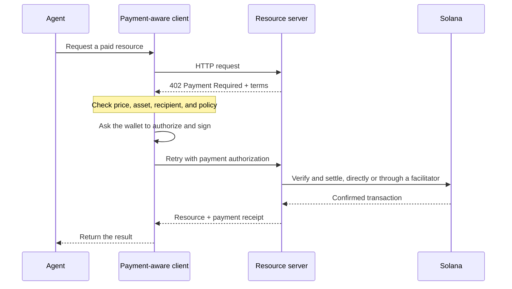

Агентні платежі дозволяють програмному забезпеченню дізнатися ціну, авторизувати платіж і отримати
ресурс в межах одного HTTP-процесу. Агент може оплатити запит даних, інференс
моделі чи виклик інструмента, не створюючи попередньо платіжний акаунт і не копіюючи
API-ключ.

<Cards>
  <Card title="MPP" href="/docs/payments/agentic-payments/mpp">
    Використовуйте HTTP-автентифікацію для разових платежів і сесій оплати за фактичним використанням.
  </Card>
  <Card title="x402" href="/docs/payments/agentic-payments/x402">
    Додайте до HTTP-ресурсу вимоги до платежу x402 V2, підписи та розрахунок.
  </Card>
</Cards>

## Загальний процес оплати

MPP і x402 використовують різні заголовки та моделі даних, але їхній базовий HTTP-процес
подібний:

## MPP і x402

Обидва протоколи можуть проводити розрахунки стейблкоїнами на Solana. Обирайте залежно від
моделі оплати та сумісності, які потрібні вашому сервісу, а не лише через спільний код
статусу `402`.

|                         | MPP                                                               | x402                                                                     |
| ----------------------- | ----------------------------------------------------------------- | ------------------------------------------------------------------------ |
| Виклик (challenge)               | `WWW-Authenticate: Payment`                                       | `PAYMENT-REQUIRED`                                                       |
| Авторизація клієнта    | `Authorization: Payment`                                          | `PAYMENT-SIGNATURE`                                                      |
| Квитанція                 | `Payment-Receipt`                                                 | `PAYMENT-RESPONSE`                                                       |
| Моделі платежів на Solana   | Разовий `charge` і обмежені за сумою `session` із обліком використання           | Схеми, як-от `exact` і `upto`; підтримка залежить від мережі та клієнта |
| Архітектура розрахунку | Перевірка на сервері або необов’язковий релей чи шлюз                | Сервер ресурсу з локальною перевіркою або фасилітатор                 |
| Хороша відправна точка     | API, яким потрібна семантика HTTP-автентифікації або багаторазовий облік використання | Ресурси з оплатою за запит і наявні клієнти x402                      |

MPP — це **Machine Payments Protocol**. Не плутайте його з **Model
Context Protocol (MCP)**. MCP надає агентам доступ до інструментів і ресурсів; MPP або x402
можуть вимагати оплату, коли агент викликає один із цих інструментів.

<Callout type="info">
  Сервіс може пропонувати більше ніж один протокол. Клієнт обирає підтримуваний ним
  варіант оплати, а потім використовує відповідні заголовки виклику, авторизації та
  квитанції протягом усього обміну.
</Callout>
