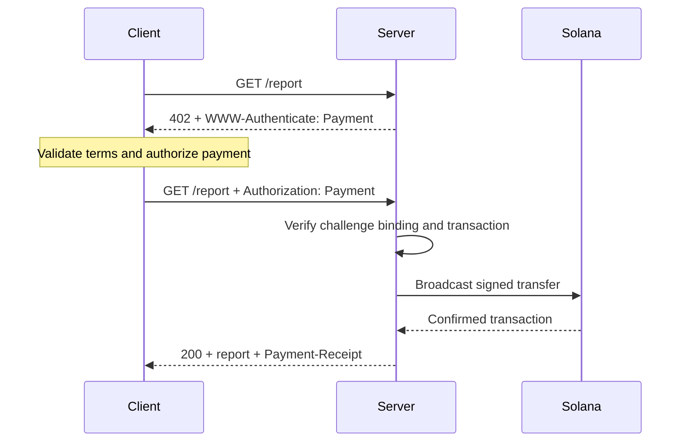
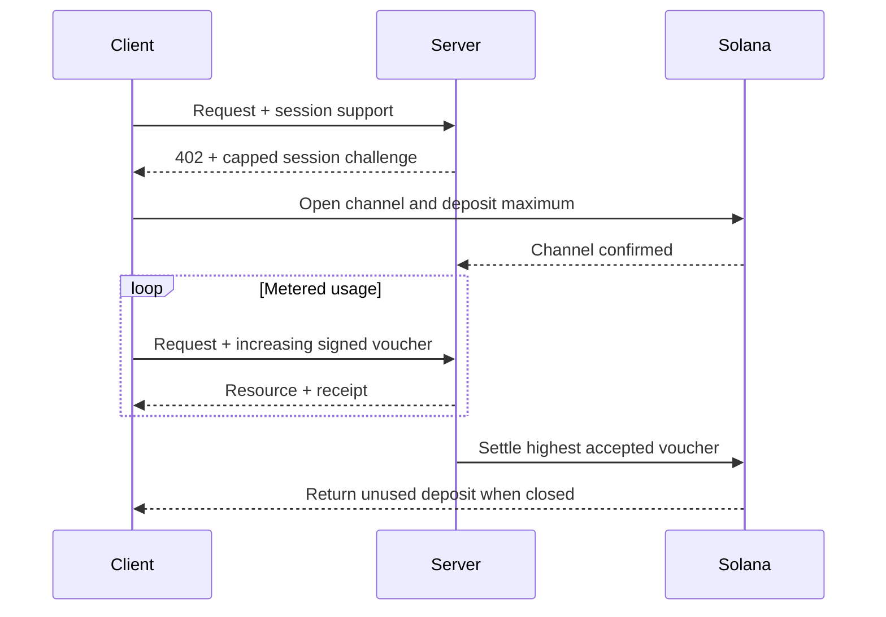

[Machine Payments Protocol (MPP)](https://mpp.dev/) застосовує семантику HTTP-автентифікації до платежів. Сервер надсилає виклик у відповідь на неоплачений запит, клієнт повертає платіжні облікові дані, а сервер повертає квитанцію після
прийняття платежу.

MPP розділяє три аспекти:

- **Інтент** описує комерційну взаємодію, наприклад одноразовий
  `charge` або тарифікований за використанням `session`.
- **Платіжний метод** описує, як переміщується вартість. Метод Solana підтримує
  нативний SOL та SPL-токени для платежів (charge).
- HTTP-**транспорт** передає виклики, облікові дані, квитанції та помилки.

MPP публікується як набір Internet-Drafts. Вважайте
[актуальні специфікації](https://paymentauth.org/) джерелом істини та
пам’ятайте, що деталі можуть змінюватися, доки чернетки перебувають у розробці.

## HTTP-обмін

MPP використовує стандартні поля HTTP-автентифікації замість специфічних для протоколу
платіжних заголовків:

| Повідомлення                 | HTTP-представлення                                         |
| ----------------------- | ----------------------------------------------------------- |
| Платіжний виклик       | `402 Payment Required` із `WWW-Authenticate: Payment ...` |
| Платіжні облікові дані      | Повторний запит із `Authorization: Payment ...`           |
| Квитанція про успішну оплату      | Відповідь із ресурсом та `Payment-Receipt: ...`               |
| Недійсні платіжні дані | Тіло Problem Details із використанням `application/problem+json`       |



Виклик містить згенерований сервером ID, realm, метод, інтент, закодований
платіжний запит і строк дії. Облікові дані повторюють виклик і додають
платіжне підтвердження, специфічне для методу. Сервер має перевіряти обидві частини; дійсний
переказ, що належить іншому виклику, не повинен розблоковувати ресурс.

## Одноразові платежі Solana

Інтент `charge` у Solana підтримує два типи облікових даних:

- **Режим pull** використовує підписану транзакцію. Клієнт підписує переказ і
  надсилає транзакцію серверу. Сервер перевіряє її, за потреби додає підпис
  платника комісії, транслює, підтверджує та повертає підпис транзакції
  у своїй квитанції.
- **Режим push** використовує підпис транзакції. Спочатку клієнт транслює транзакцію, потім
  надсилає серверу підтверджений підпис. Сервер отримує та перевіряє
  транзакцію, перш ніж повернути ресурс.

Режим pull дає змогу серверу спонсорувати комісії за транзакції та реалізовувати логіку повторних спроб на стороні сервера.
Режим push корисний, коли гаманець вимагає, щоб клієнт сам надсилав
транзакцію, але він не може використовувати спонсорування комісій сервером.

Нормативні поля та правила верифікації див. у
[специфікації Solana charge](https://paymentauth.org/draft-solana-charge-00.html).

## Додавання платежу MPP до API на Express

Solana Pay Kit надає актуальну інтеграцію TypeScript для MPP та x402.
Встановіть його разом з Express:

```bash
pnpm add @solana/pay-kit @solana/kit@^6.9.0 express
pnpm add --save-dev @types/express tsx
```

Цей найпростіший приклад використовує хостований пісочницю Surfpool і публічного
демонстраційного одержувача з пакета. Він призначений лише для локальної розробки:

```ts filename=server.ts
import express from "express";
import { createPayKit, usd } from "@solana/pay-kit";

const pay = await createPayKit({
  accept: ["mpp"],
  rpcUrl: "https://402.surfnet.dev:8899"
});

const app = express();

app.get("/report", pay.express(usd("0.01")), (_req, res) => {
  res.json({ report: "Paid report" });
});

app.listen(4567, () => {
  console.log("Paid API listening on http://127.0.0.1:4567");
});
```

Запустіть його та порівняйте неоплачений запит із запитом із підтримкою оплати:

```bash
pnpm tsx server.ts
curl -i http://127.0.0.1:4567/report
pay --sandbox curl http://127.0.0.1:4567/report
```

Обробник маршруту виконується лише після того, як middleware прийме платіж.

<Callout type="warn" title="Замініть усі значення пісочниці за замовчуванням у продакшені">
  Налаштуйте явну мережу, одержувача-мерчанта, виділений RPC, стабільний
  секрет прив’язки виклику, продакшн-підписувач і надійне сховище для захисту від повторів. Ніколи не
  спрямовуйте реальні платежі на демонстраційного підписувача з пакета.
</Callout>

## Тарифіковані сесії

Використовуйте `session` Solana MPP, коли клієнт здійснюватиме багато дрібних пов’язаних платежів.
Сесія відкриває ончейн-платіжний канал із максимальним депозитом, а потім використовує
кумулятивні підписані ваучери в міру зростання використання. Сервер може перевіряти ваучери
офчейн і пізніше розраховувати найбільшу прийняту суму.

Це корисно для інференсу з тарифікацією за токенами, завантажень з тарифікацією за байтами, даних у реальному часі
та повторюваних викликів інструментів. Це не те саме, що надсилати окремий ончейн-платіж
за кожну подію.



Називайте сесію **платежем за сесію**, **платіжним каналом** або **обмеженою повторюваною
авторизацією**. Називайте її потоковим платежем лише тоді, коли сервіс і платіжний
контракт справді тарифікують потік використання.

## Верифікація в продакшені

Для кожного платежу Solana charge сервер має перевіряти щонайменше таке:

- Виклик автентичний, чинний, прив’язаний до цього запиту та призначений для
  цього realm.
- Транзакція використовує очікувану мережу, актив або mint, одержувача, суму
  та програму токенів (token program).
- Будь-які інструкції платника комісії або associated token account явно
  дозволені та не можуть вичерпати кошти підписувача сервера.
- Транзакція успішно виконана на потрібному рівні підтвердження (commitment level).
- Підпис транзакції ще не було використано.
- Перевірка повторного використання та операція споживання є атомарними для всіх екземплярів сервера.

Для сесій також зберігайте стан каналу, прийняту кумулятивну суму та
мітку розрахунку в спільному сховищі. Задокументуйте, як клієнти повертають невикористані
кошти, якщо сервер стає недоступним.

## Пов’язані ресурси

- [Специфікації MPP](https://paymentauth.org/)
- [Документація протоколу MPP](https://mpp.dev/protocol)
- [Solana Pay Kit](https://github.com/solana-foundation/pay-kit)
- [Огляд агентних платежів](/docs/payments/agentic-payments)
- [Готовність до продакшену](/docs/tools/production-readiness)
