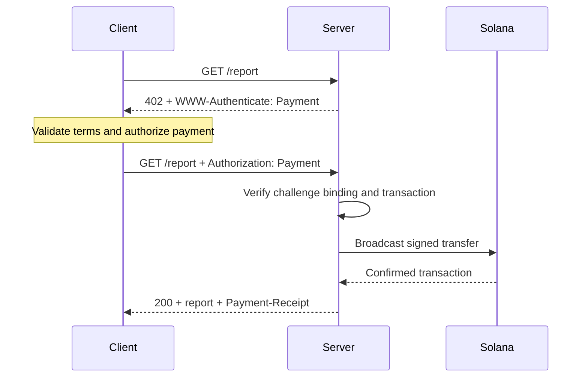
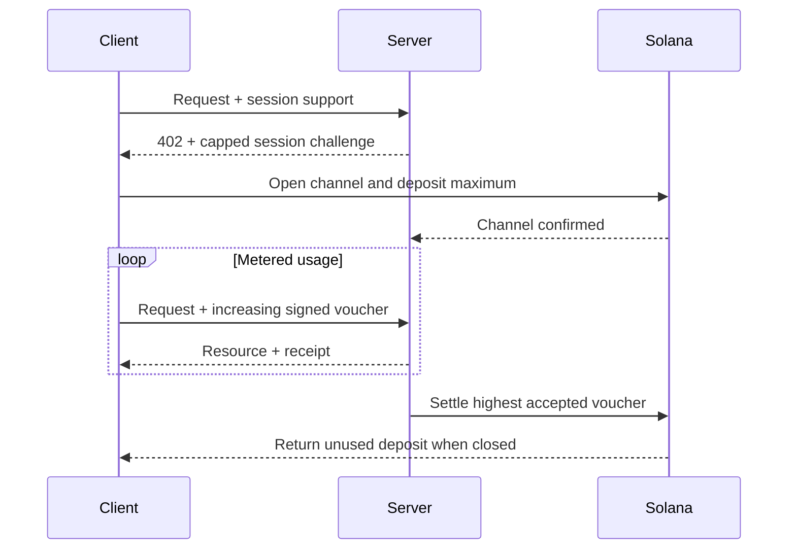

[Machine Payments Protocol (MPP)](https://mpp.dev/) застосовує семантику HTTP-автентифікації до платежів. Сервер надсилає виклик у відповідь на неоплачений запит, клієнт повертає платіжні облікові дані, а сервер після
прийняття платежу повертає квитанцію.

MPP розділяє три аспекти:

- **Намір (intent)** описує комерційну взаємодію, наприклад одноразовий
  `charge` або тарифікований за використанням `session`.
- **Спосіб оплати (payment method)** описує, як переміщується вартість. Метод для Solana підтримує
  нативний SOL і токени SPL для платежів типу charge.
- HTTP-**транспорт** передає виклики, облікові дані, квитанції та помилки.

MPP публікується як набір Internet-Drafts. Вважайте
[актуальні специфікації](https://paymentauth.org/) першоджерелом істини та
пам’ятайте, що деталі можуть змінюватися, поки чернетки перебувають у роботі.

## HTTP-обмін

MPP використовує стандартні поля HTTP-автентифікації замість специфічних для протоколу
платіжних заголовків:

| Повідомлення                 | HTTP-представлення                                         |
| ----------------------- | ----------------------------------------------------------- |
| Платіжний виклик       | `402 Payment Required` із `WWW-Authenticate: Payment ...` |
| Платіжні облікові дані      | Повторний запит із `Authorization: Payment ...`           |
| Квитанція про успішну оплату      | Відповідь із ресурсом та `Payment-Receipt: ...`               |
| Недійсні платіжні дані | Тіло Problem Details із `application/problem+json`       |


```mermaid title="MPP Charge Flow"
sequenceDiagram
    participant Client
    participant Server
    participant Solana
    Client->>Server: GET /report
    Server-->>Client: 402 + WWW-Authenticate: Payment
    Note over Client: Validate terms and authorize payment
    Client->>Server: GET /report + Authorization: Payment
    Server->>Server: Verify challenge binding and transaction
    Server->>Solana: Broadcast signed transfer
    Solana-->>Server: Confirmed transaction
    Server-->>Client: 200 + report + Payment-Receipt
```

Виклик містить згенерований сервером ID, realm, метод, намір, закодований
платіжний запит і строк дії. Облікові дані повторюють виклик і додають
платіжне підтвердження, специфічне для методу. Сервер повинен перевірити обидві частини: дійсний
переказ, що належить до іншого виклику, не має відкривати доступ до ресурсу.

## Одноразові платежі Solana

Намір `charge` у Solana підтримує два типи облікових даних:

- **Режим pull** використовує підписану транзакцію. Клієнт підписує переказ і
  надсилає транзакцію на сервер. Сервер перевіряє її, за потреби додає підпис
  платника комісії, розсилає в мережу, підтверджує та повертає підпис транзакції
  у своїй квитанції.
- **Режим push** використовує підпис транзакції. Спочатку клієнт розсилає транзакцію в мережу, потім
  надсилає підтверджений підпис на сервер. Сервер отримує та перевіряє
  транзакцію, перш ніж повернути ресурс.

Режим pull уможливлює оплату комісій за транзакції сервером і логіку повторних спроб на стороні сервера.
Режим push корисний, коли гаманець вимагає, щоб клієнт сам надсилав свою
транзакцію, але в ньому не можна використовувати спонсорство комісій сервером.

Нормативні поля та правила перевірки дивіться в
[специфікації Solana charge](https://paymentauth.org/draft-solana-charge-00.html).

## Додавання платежу MPP до API на Express

Solana Pay Kit надає актуальну інтеграцію MPP і x402 для TypeScript.
Встановіть його разом з Express:

```bash
pnpm add @solana/pay-kit @solana/kit@^6.9.0 express
pnpm add --save-dev @types/express tsx
```

Цей найпростіший приклад використовує хмарне пісочне середовище Surfpool і публічного
демонстраційного одержувача з пакета. Він призначений лише для локальної розробки:

```ts filename=server.ts
import express from "express";
import { createPayKit, usd } from "@solana/pay-kit";

const pay = await createPayKit({
  accept: ["mpp"],
  rpcUrl: "https://402.surfnet.dev:8899"
});

const app = express();

app.get("/report", pay.express(usd("0.01")), (_req, res) => {
  res.json({ report: "Paid report" });
});

app.listen(4567, () => {
  console.log("Paid API listening on http://127.0.0.1:4567");
});
```

Запустіть його та порівняйте неоплачений запит із запитом, що враховує оплату:

```bash
pnpm tsx server.ts
curl -i http://127.0.0.1:4567/report
pay --sandbox curl http://127.0.0.1:4567/report
```

Обробник маршруту виконується лише після того, як middleware прийме платіж.

<Callout type="warn" title="Замініть усі типові значення пісочниці в продакшені">
  Налаштуйте явну мережу, одержувача-мерчанта, виділений RPC, стабільний
  секрет прив’язки виклику, продакшн-підписувач і надійне сховище для захисту від повторного відтворення. Ніколи не
  спрямовуйте реальні платежі на демонстраційний підписувач із пакета.
</Callout>

## Сесії з тарифікацією за використанням

Використовуйте `session` Solana MPP, коли клієнт здійснюватиме багато дрібних пов’язаних платежів.
Сесія відкриває ончейн-платіжний канал із максимальним депозитом, а потім використовує
кумулятивні підписані ваучери в міру зростання використання. Сервер може перевіряти ваучери
офчейн і пізніше розрахувати найбільшу прийняту суму.

Це корисно для інференсу з тарифікацією за токенами, завантажень з тарифікацією за байтами, актуальних даних
і повторюваних викликів інструментів. Це не те саме, що надсилати окремий ончейн-
платіж за кожну подію.


```mermaid title="MPP Session Lifecycle"
sequenceDiagram
    participant Client
    participant Server
    participant Solana
    Client->>Server: Request + session support
    Server-->>Client: 402 + capped session challenge
    Client->>Solana: Open channel and deposit maximum
    Solana-->>Server: Channel confirmed
    loop Metered usage
        Client->>Server: Request + increasing signed voucher
        Server-->>Client: Resource + receipt
    end
    Server->>Solana: Settle highest accepted voucher
    Solana-->>Client: Return unused deposit when closed
```

Називайте сесію **сесійним платежем**, **платіжним каналом** або **обмеженою повторюваною
авторизацією**. Називайте її потоковим платежем, лише якщо сервіс і платіжний
контракт дійсно тарифікують потік використання.

## Перевірка в продакшені

Для кожного платежу Solana charge сервер повинен перевірити щонайменше:

- Виклик автентичний, не прострочений, прив’язаний до цього запиту та призначений для
  цього realm.
- Транзакція використовує очікувану мережу, актив або mint, одержувача, суму
  та token program.
- Будь-які інструкції платника комісії або associated token account прямо
  дозволені й не можуть вичерпати кошти підписувача сервера.
- Транзакція успішно виконана на потрібному рівні підтвердження.
- Підпис транзакції ще не було використано.
- Перевірка повторного відтворення та операція споживання атомарні для всіх екземплярів сервера.

Для сесій також зберігайте стан каналу, прийняту кумулятивну суму та
мітку розрахунку у спільному сховищі. Задокументуйте, як клієнти повертають невикористані
кошти, якщо сервер стає недоступним.

## Пов’язані ресурси

- [Специфікації MPP](https://paymentauth.org/)
- [Документація протоколу MPP](https://mpp.dev/protocol)
- [Solana Pay Kit](https://github.com/solana-foundation/pay-kit)
- [Огляд агентних платежів](/docs/payments/agentic-payments)
- [Готовність до продакшену](/docs/tools/security#verify-addresses)
