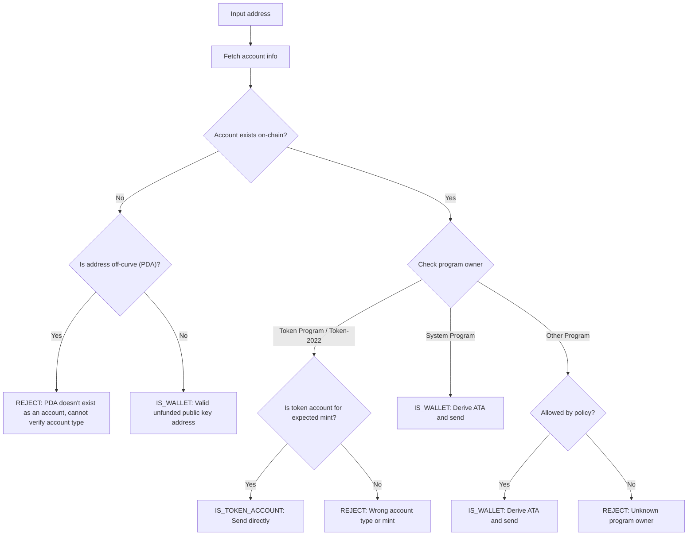

Надсилання токенів на неправильну адресу може призвести до безповоротної втрати
коштів. Перевірка адреси гарантує, що ви надсилаєте токени лише на адреси, які
можуть належним чином отримати їх та отримати до них доступ.

<Callout>
  Див. [Як працюють платежі в Solana](/docs/payments/how-payments-work) для
  ознайомлення з основними концепціями платежів.
</Callout>

## Розуміння адрес Solana

Акаунти Solana мають два типи адрес: on-curve та off-curve.

### Адреси on-curve

Стандартні адреси — це публічні ключі з пар ключів Ed25519. Ці адреси:

- Мають відповідний приватний ключ, який може підписувати транзакції
- Використовуються як адреси гаманців

### Адреси off-curve (PDA)

[Program Derived Addresses](/docs/core/pda) детерміновано виводяться з
ідентифікатора програми та seeds. Ці адреси:

- **Не** мають відповідного приватного ключа
- Можуть бути підписані лише програмою, з якої було виведено адресу

## Типи акаунтів у платежах

Використовуйте адресу для отримання [акаунта](/docs/core/accounts) з мережі,
перевірте його власника-програму та тип акаунта, щоб визначити, як обробляти
адресу.

<Callout>
  Знання того, чи є адреса on-curve або off-curve, не повідомляє вам, який тип
  акаунта це, яка програма володіє ним або чи існує акаунт за цією адресою. Ви
  повинні отримати акаунт з мережі, щоб визначити ці деталі.
</Callout>

### Акаунти System Program (гаманці)

Акаунти, що належать System Program, є стандартними гаманцями. Щоб надіслати
SPL-токени на гаманець, ви виводите та використовуєте його
[associated token account (ATA)](/docs/tokens/basics/create-token-account#whats-an-associated-token-account).

Після виведення адреси ATA перевірте, чи існує токен-акаунт в мережі. Якщо ATA
не існує, ви можете включити інструкцію для створення токен-акаунта одержувача в
тій самій транзакції, що й переказ. Однак це вимагає сплати rent за новий
токен-акаунт. Оскільки одержувач володіє ATA, SOL, сплачені за rent, не можуть
бути повернені відправнику.

<Callout type="warn">
  Без захисних заходів субсидування створення ATA може бути використане
  зловмисниками. Зловмисник може запитати переказ, створити свій ATA за ваш
  рахунок, закрити ATA для повернення орендної плати в SOL і повторити процес.
</Callout>

### Токен-акаунти

[Токен-акаунти](/docs/tokens/basics/create-token-account) належать Token Program
або Token-2022 Program і зберігають баланси токенів. Якщо отримана адреса
належить токен-програмі, ви повинні перевірити, що акаунт є токен-акаунтом (а не
mint account) і відповідає очікуваному mint account токена перед відправленням.

<Callout type="info">
  Token Programs автоматично перевіряють, що обидва токен-акаунти в переказі
  містять токени одного mint. Якщо перевірка не вдається, транзакція
  відхиляється і кошти не втрачаються.
</Callout>

### Mint accounts

[Mint accounts](/docs/tokens/basics/create-mint) відстежують пропозицію токенів
та метадані конкретного токена. Mint accounts також належать Token Programs, але
**не** є дійсними одержувачами для переказів токенів. Спроба надіслати токени на
адресу mint призводить до невдалої транзакції, але кошти не втрачаються.

### Інші акаунти

Акаунти, що належать іншим програмам, вимагають прийняття рішення щодо політики.
Деякі акаунти (наприклад, мультипідписні гаманці) можуть бути дійсними
власниками токен-акаунтів, тоді як інші слід відхилити.

## Процес перевірки

Наступна діаграма показує еталонне дерево рішень для валідації адреси:



<Steps>
<Step>

### Отримання акаунта

Використовуйте адресу для отримання деталей акаунта з мережі.

</Step>
<Step>

### Акаунт не існує

Якщо за цією адресою не існує акаунта, перевірте, чи адреса знаходиться на
кривій чи поза кривою:

- **Поза кривою (PDA)**: Консервативно відхиляйте адресу, щоб уникнути
  надсилання на ATA, який може бути недоступним. Без існуючого облікового запису
  ви не можете визначити лише за адресою, яка програма створила цей PDA або чи є
  адреса для ATA. Виведення ATA для цієї адреси для надсилання токенів може
  призвести до блокування коштів у недоступному токен-акаунті.

- **На кривій**: Це дійсна адреса гаманця (публічний ключ), яка ще не була
  профінансована. Виведіть ATA, перевірте, чи він існує, і надішліть токени на
  нього. Ви повинні прийняти рішення щодо політики, чи фінансувати створення
  ATA, якщо він не існує.

</Step>
<Step>

### Обліковий запис існує

Якщо обліковий запис існує, перевірте, якій програмі він належить:

- **System Program**: Це стандартний гаманець. Виведіть ATA, перевірте, чи він
  існує, і надішліть токени на нього. Ви повинні прийняти рішення щодо політики,
  чи фінансувати створення ATA, якщо він не існує.

- **Token Program / Token-2022**: Переконайтеся, що обліковий запис є
  токен-акаунтом (а не mint account) і що він містить токен (mint), який ви
  маєте намір надіслати. Якщо дійсний, надішліть токени безпосередньо на цю
  адресу. Якщо це mint account або токен-акаунт для іншого mint, відхиліть
  адресу.

- **Інша програма**: Це вимагає рішення щодо політики. Деякі програми, такі як
  мультипідписні гаманці, можуть бути прийнятними власниками токен-акаунтів.
  Якщо ваша політика дозволяє це, виведіть ATA і надішліть. В іншому випадку
  відхиліть адресу.

</Step>
</Steps>

## Демонстрація

Наступний приклад показує лише логіку валідації адреси. Це довідковий код для
ілюстративних цілей.

<Callout>
  Демонстрація не показує, як отримати ATA або побудувати транзакцію для
  відправлення токенів. Зверніться до документації про [обліковий запис
  токенів](/docs/tokens/basics/create-token-account#how-to-create-an-associated-token-account)
  та [переказ токенів](/docs/tokens/basics/transfer-tokens) для прикладів коду.
</Callout>

Демонстрація нижче використовує три можливі результати:

| Результат          | Значення                        | Дія                                               |
| ------------------ | ------------------------------- | ------------------------------------------------- |
| `IS_WALLET`        | Дійсна адреса гаманця           | Отримати та надіслати на associated token account |
| `IS_TOKEN_ACCOUNT` | Дійсний обліковий запис токенів | Надіслати токени безпосередньо на цю адресу       |
| `REJECT`           | Недійсна адреса                 | Не надсилати                                      |

<CodeTabs flags="r">

```ts !! title="Demo"
// !collapse(1:35) collapsed

import {
  type Address,
  type Rpc,
  type GetAccountInfoApi,
  createSolanaRpc,
  fetchJsonParsedAccount,
  isOffCurveAddress,
  generateKeyPairSigner,
  getProgramDerivedAddress
} from "@solana/kit";

// =============================================================================
// Constants
// =============================================================================

const defaultRpc = createSolanaRpc("https://api.mainnet-beta.solana.com");

const SYSTEM_PROGRAM = "11111111111111111111111111111111" as Address;
const TOKEN_PROGRAM = "TokenkegQfeZyiNwAJbNbGKPFXCWuBvf9Ss623VQ5DA" as Address;
const TOKEN_2022_PROGRAM =
  "TokenzQdBNbLqP5VEhdkAS6EPFLC1PHnBqCXEpPxuEb" as Address;

// =============================================================================
// Validation Function
// =============================================================================

/**
 * Possible validation results for an input address.
 */
export type ValidationResult =
  | { type: "IS_TOKEN_ACCOUNT" }
  | { type: "IS_WALLET" }
  | { type: "REJECT"; reason: string };

/**
 * Validates an input address and classifies it as a wallet, token account, or invalid.
 *
 * @param inputAddress - The address to validate
 * @param rpc - Optional RPC client (defaults to mainnet)
 * @returns Classification result:
 *   - IS_WALLET: Valid wallet address
 *   - IS_TOKEN_ACCOUNT: Valid token account
 *   - REJECT: Invalid address for transfers
 */
export async function validateAddress(
  inputAddress: Address,
  rpc: Rpc<GetAccountInfoApi> = defaultRpc
): Promise<ValidationResult> {
  const account = await fetchJsonParsedAccount(rpc, inputAddress);
  // Log the account data for demo
  console.log("\nAccount:", account);

  // Account doesn't exist on-chain
  if (!account.exists) {
    // Off-curve = PDA that doesn't exist as an account
    // Reject conservatively to avoid sending to an address that may be inaccessible.
    if (isOffCurveAddress(inputAddress)) {
      return { type: "REJECT", reason: "PDA doesn't exist as an account" };
    }
    // On-curve = valid keypair address, treat as unfunded wallet
    return { type: "IS_WALLET" };
  }

  // Account exists, check program owner
  const owner = account.programAddress;

  // System Program = wallet
  if (owner === SYSTEM_PROGRAM) {
    return { type: "IS_WALLET" };
  }

  // Token Program or Token-2022, check if token account
  if (owner === TOKEN_PROGRAM || owner === TOKEN_2022_PROGRAM) {
    const accountType = (
      account.data as { parsedAccountMeta?: { type?: string } }
    ).parsedAccountMeta?.type;

    if (accountType === "account") {
      return { type: "IS_TOKEN_ACCOUNT" };
    }
    // Reject if not a token account (mint account)
    return {
      type: "REJECT",
      reason: "Not a token account"
    };
  }

  // Unknown program owner
  return { type: "REJECT", reason: "Unknown program owner" };
}

// =============================================================================
// Examples
// =============================================================================
// !collapse(1:1000) collapsed

// Wallets
const EXISTING_WALLET =
  "H8sMJSCQxfKiFTCfDR3DUMLPwcRbM61LGFJ8N4dK3WjS" as Address;
const NEW_WALLET = (await generateKeyPairSigner()).address;

// Token accounts
const USDC_TOKEN_ACCOUNT =
  "3emsAVdmGKERbHjmGfQ6oZ1e35dkf5iYcS6U4CPKFVaa" as Address;
const PYUSD_TOKEN_ACCOUNT =
  "47od2TPRvqJipfPVWZdyenLEngPw8hC36nDxiLyvGsEP" as Address;

// Token mints (should be rejected)
const USDC_MINT = "EPjFWdd5AufqSSqeM2qN1xzybapC8G4wEGGkZwyTDt1v" as Address;
const PYUSD_MINT = "2b1kV6DkPAnxd5ixfnxCpjxmKwqjjaYmCZfHsFu24GXo" as Address;

// PDA that doesn't exist (should be rejected)
const [NON_EXISTENT_PDA] = await getProgramDerivedAddress({
  programAddress: (await generateKeyPairSigner()).address,
  seeds: ["seed"]
});

// Program account (should be rejected)
const PROGRAM_ACCOUNT =
  "p1exdMJcjVao65QdewkaZRUnU6VPSXhus9n2GzWfh98" as Address;

async function runExample(label: string, address: Address) {
  console.log(`\n${"─".repeat(60)}`);
  console.log(`Example: ${label}`);
  console.log(`Input: ${address}`);
  console.log(`${"─".repeat(60)}`);

  const result = await validateAddress(address);
  console.log("\nResult:", result);
}

console.log("\n" + "═".repeat(60));
console.log("  IS_WALLET Examples");
console.log("═".repeat(60));

await runExample("Existing funded wallet", EXISTING_WALLET);
await runExample("New wallet (unfunded)", NEW_WALLET);

console.log("\n" + "═".repeat(60));
console.log("  IS_TOKEN_ACCOUNT Examples");
console.log("═".repeat(60));

await runExample("USDC token account (Token Program)", USDC_TOKEN_ACCOUNT);
await runExample("PYUSD token account (Token-2022)", PYUSD_TOKEN_ACCOUNT);

console.log("\n" + "═".repeat(60));
console.log("  REJECT Examples");
console.log("═".repeat(60));

await runExample("USDC mint address", USDC_MINT);
await runExample("PYUSD mint address", PYUSD_MINT);
await runExample("Non-existent PDA", NON_EXISTENT_PDA);
await runExample("Program account", PROGRAM_ACCOUNT);

console.log("\n" + "═".repeat(60));
console.log("  Done!");
console.log("═".repeat(60) + "\n");
```

</CodeTabs>
