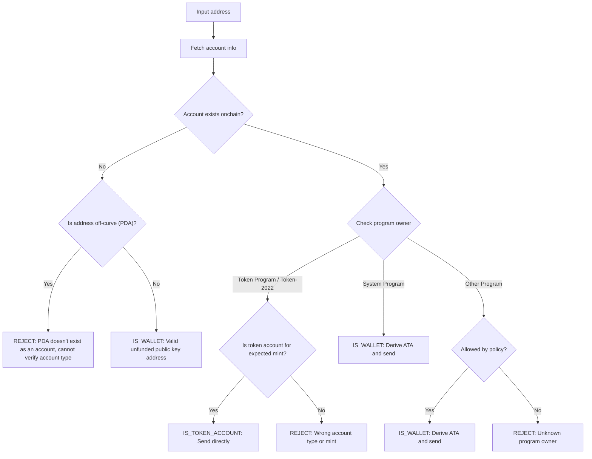

Відправлення коштів на неправильну адресу може призвести до їх безповоротної
втрати. Перевірка адреси гарантує, що ви надсилаєте кошти лише на адреси, які
можуть їх належним чином отримати та використати.

Перевірка залежить від того, що ви надсилаєте:

- **SPL-токени** частково захищені самостійно. Token Program відхиляє переказ,
  якщо акаунти не відповідають очікуваному mint, тому неправильно спрямований
  переказ токенів завершується невдачею без втрати коштів. Більша частина цієї
  сторінки присвячена відправленню SPL-токенів.
- **Нативний SOL** не має такого захисту. Переказ через System Program
  виконується на будь-який акаунт, тому SOL, надісланий на неправильного
  отримувача, блокується назавжди. Дивіться
  [Відправлення нативного SOL](#sending-native-sol).

<Callout>
  Дивіться [Як працюють платежі в Solana](/docs/payments/how-payments-work), щоб
  ознайомитися з основними концепціями платежів.
</Callout>

## Розуміння адрес Solana

Акаунти Solana мають два типи адрес: on-curve та off-curve.

### On-Curve адреси

Стандартні адреси — це публічні ключі з Ed25519 keypairs. Ці адреси:

- Мають відповідний приватний ключ, який може підписувати транзакції
- Використовуються як адреси гаманців

### Off-Curve адреси (PDA)

[Program Derived Addresses](/docs/core/pda) детерміновано виводяться з
ідентифікатора програми та seeds. Ці адреси:

- **Не** мають відповідного приватного ключа
- Можуть підписуватися лише програмою, з якої було виведено адресу

## Типи акаунтів у платежах

Використовуйте адресу для отримання [акаунту](/docs/core/accounts) з мережі,
перевірте власника програми та тип акаунту, щоб визначити, як обробляти цю
адресу.

<Callout>
  Знання того, чи є адреса on-curve або off-curve, не вказує на тип акаунту, яка
  програма ним володіє або чи існує акаунт за цією адресою. Необхідно отримати
  акаунт з мережі, щоб з'ясувати ці деталі.
</Callout>

### Акаунти System Program (Гаманці)

Акаунти, якими володіє System Program, є стандартними гаманцями. Щоб надіслати
SPL-токени на гаманець, необхідно визначити та використати його
[Associated Token Account (ATA)](/docs/tokens/basics/create-token-account#whats-an-associated-token-account).

Після визначення адреси ATA перевірте, чи існує token account в мережі. Якщо ATA
не існує, ви можете включити інструкцію зі створення token account отримувача в
ту саму транзакцію, що й переказ. Однак це вимагає сплати rent за новий token
account. Оскільки отримувач є власником ATA, SOL, сплачені за rent, не можуть
бути повернені відправником.

<Callout type="warn">
  Без належного захисту субсидування створення ATA може бути використане
  зловмисно. Недобросовісний користувач може запросити переказ, створити свій
  ATA за ваш рахунок, закрити ATA, щоб повернути rent SOL, і повторювати це
  знову.
</Callout>

### Token Accounts

[Token accounts](/docs/tokens/basics/create-token-account) знаходяться у
власності Token Program або Token-2022 Program та зберігають баланси токенів.
Якщо адреса, яку ви отримали, належить token program, слід перевірити, що акаунт
є token account (а не mint account) і відповідає очікуваному token mint account
перед надсиланням.

<Callout type="info">
  Token Programs автоматично перевіряють, що обидва token accounts у переказі
  містять токени одного й того самого mint. Якщо перевірка не проходить,
  транзакція відхиляється і жодні кошти не втрачаються.
</Callout>

### Mint Accounts

[Mint accounts](/docs/tokens/basics/create-mint) відстежують постачання токенів
та метадані конкретного токена. Mint accounts також належать Token Programs, але
**не** є дійсними отримувачами для переказу токенів. Спроба надіслати токени на
adresu mint призводить до невдалої транзакції, але жодні кошти не втрачаються.

### Інші акаунти

Акаунти, якими володіють інші програми, потребують окремого рішення щодо
політики. Деякі акаунти (наприклад, мультипідписні гаманці) можуть бути
законними власниками token account, тоді як інші слід відхиляти.

## Надсилання нативного SOL

Наведена вище класифікація визначає, куди можуть надходити SPL-токени. З
нативним SOL все суворіше: єдиним безпечним одержувачем є **гаманець System
Program** (або незаповнена адреса на кривій, яка ним стає).

Переказ через System Program додає lamport до будь-якого акаунту, включно з
мінтами, token accounts, програмами та PDA. Lamport може виводити лише
програма-власник акаунту, тому надсилання SOL на неправильну адресу може
призвести до безповоротної втрати коштів.

На відміну від переказу SPL-токенів, транзакція **не** відхиляється, якщо
одержувач є неочікуваною адресою.

При надсиланні нативного SOL прийнятним результатом є лише `IS_WALLET`.
`IS_TOKEN_ACCOUNT` **не є** таким: token account зберігає SPL-токени, і SOL,
надісланий туди, виходить з-під контролю відправника.

<Callout type="warn">
  Це поширена причина втрати SOL: користувач вставляє адресу мінту токена (або
  адресу програми) у поле виведення SOL. Переказ виконується успішно, але SOL не
  підлягає поверненню. Завжди перевіряйте одержувача перед підписанням
  SOL-переказу.
</Callout>

## Процес перевірки

На наступній діаграмі показано еталонне дерево рішень для перевірки адреси:


```mermaid title="Address Verification Flow"
flowchart TD
    A["Input address"]
    B["Fetch account info"]

    A --> B
    B --> C{"Account exists onchain?"}

    %% --- Non-existent account path ---
    C -- "No" --> D{"Is address off-curve (PDA)?"}
    D -- "Yes" --> R1["REJECT: PDA doesn't exist as an account, cannot verify account type"]
    D -- "No" --> W1["IS_WALLET: Valid unfunded public key address"]

    %% --- Existing account path ---
    C -- "Yes" --> F{"Check program owner"}

    F -- "Token Program / Token-2022" --> G{"Is token account for expected mint?"}
    G -- "Yes" --> T1["IS_TOKEN_ACCOUNT: Send directly"]
    G -- "No" --> R2["REJECT: Wrong account type or mint"]

    F -- "System Program" --> W2["IS_WALLET: Derive ATA and send"]

    F -- "Other Program" --> K{"Allowed by policy?"}
    K -- "Yes" --> W3["IS_WALLET: Derive ATA and send"]
    K -- "No" --> R3["REJECT: Unknown program owner"]
```

<Steps>
<Step>

### Отримання акаунту

Використайте адресу для отримання деталей акаунту з мережі.

</Step>
<Step>

### Акаунт не існує

Якщо за цією адресою не існує жодного акаунту, перевірте, чи знаходиться адреса
на кривій чи поза нею:

- **Поза кривою (PDA)**: З міркувань безпеки відхиліть адресу, щоб уникнути
  надсилання на ATA, який може бути недоступним. За відсутності наявного акаунту
  неможливо визначити лише за адресою, якою програмою було виведено цей PDA або
  чи є адреса ATA. Виведення ATA для цієї адреси з метою надсилання токенів може
  призвести до блокування коштів у недоступному token account.

- **На кривій**: Це дійсна адреса гаманця (публічний ключ), яка ще не поповнена.
  Отримайте ATA, перевірте, чи він існує, і надішліть токени на нього. Ви
  повинні прийняти політичне рішення щодо фінансування створення ATA, якщо він
  не існує.

</Step>
<Step>

### Акаунт існує

Якщо акаунт існує, перевірте, якій програмі він належить:

- **System Program**: Це стандартний гаманець. Отримайте ATA, перевірте, чи він
  існує, і надішліть токени на нього. Ви повинні прийняти політичне рішення щодо
  фінансування створення ATA, якщо він не існує.

- **Token Program / Token-2022**: Переконайтеся, що акаунт є token account (а не
  mint account), і що він містить токен (mint), який ви збираєтеся надіслати.
  Якщо все коректно, надішліть токени безпосередньо на цю адресу. Якщо це mint
  account або token account для іншого mint, відхиліть адресу.

- **Інша програма**: Це вимагає прийняття політичного рішення. Деякі програми,
  наприклад мультипідписні гаманці, можуть бути допустимими власниками token
  accounts. Якщо ваша політика це дозволяє, отримайте ATA і надішліть. В іншому
  разі відхиліть адресу.

</Step>
</Steps>

## Демо

Наступний приклад демонструє лише логіку перевірки адреси. Це довідковий код для
ілюстративних цілей.

<Callout>
  Демо не показує, як отримати ATA або побудувати транзакцію для надсилання
  токенів. Зверніться до документації [token
  account](/docs/tokens/basics/create-token-account#how-to-create-an-associated-token-account)
  та [передачі токенів](/docs/tokens/basics/transfer-tokens) для прикладів коду.
</Callout>

Демо нижче використовує три можливих результати:

| Результат          | Значення              | Дія                                               |
| ------------------ | --------------------- | ------------------------------------------------- |
| `IS_WALLET`        | Дійсна адреса гаманця | Отримати та надіслати на associated token account |
| `IS_TOKEN_ACCOUNT` | Дійсний token account | Надіслати токени безпосередньо на цю адресу       |
| `REJECT`           | Недійсна адреса       | Не надсилати                                      |

Потім він зіставляє кожен результат із прийнятністю для кожного активу за
допомогою `canReceiveNativeSol` (лише гаманці) та `canReceiveSplToken` (гаманці
або token accounts). token account повертає `IS_TOKEN_ACCOUNT`, тому може
отримувати SPL-токени, але **не** нативний SOL — саме ця відмінність запобігає
блокуванню SOL.

<CodeTabs flags="r">

```ts !! title="Demo"
// !collapse(1:35) collapsed

import {
  type Address,
  type Rpc,
  type GetAccountInfoApi,
  createSolanaRpc,
  fetchJsonParsedAccount,
  isOffCurveAddress,
  generateKeyPairSigner,
  getProgramDerivedAddress
} from "@solana/kit";

// =============================================================================
// Constants
// =============================================================================

const defaultRpc = createSolanaRpc("https://api.mainnet-beta.solana.com");

const SYSTEM_PROGRAM = "11111111111111111111111111111111" as Address;
const TOKEN_PROGRAM = "TokenkegQfeZyiNwAJbNbGKPFXCWuBvf9Ss623VQ5DA" as Address;
const TOKEN_2022_PROGRAM =
  "TokenzQdBNbLqP5VEhdkAS6EPFLC1PHnBqCXEpPxuEb" as Address;

// =============================================================================
// Validation Function
// =============================================================================

/**
 * Possible validation results for an input address.
 */
export type ValidationResult =
  | { type: "IS_TOKEN_ACCOUNT" }
  | { type: "IS_WALLET" }
  | { type: "REJECT"; reason: string };

/**
 * Validates an input address and classifies it as a wallet, token account, or invalid.
 *
 * @param inputAddress - The address to validate
 * @param rpc - Optional RPC client (defaults to mainnet)
 * @returns Classification result:
 *   - IS_WALLET: Valid wallet address
 *   - IS_TOKEN_ACCOUNT: Valid token account
 *   - REJECT: Invalid address for transfers
 */
export async function validateAddress(
  inputAddress: Address,
  rpc: Rpc<GetAccountInfoApi> = defaultRpc
): Promise<ValidationResult> {
  const account = await fetchJsonParsedAccount(rpc, inputAddress);
  // Log the account data for demo
  console.log("\nAccount:", account);

  // Account doesn't exist onchain
  if (!account.exists) {
    // Off-curve = PDA that doesn't exist as an account
    // Reject conservatively to avoid sending to an address that may be inaccessible.
    if (isOffCurveAddress(inputAddress)) {
      return { type: "REJECT", reason: "PDA doesn't exist as an account" };
    }
    // On-curve = valid keypair address, treat as unfunded wallet
    return { type: "IS_WALLET" };
  }

  // Account exists, check program owner
  const owner = account.programAddress;

  // System Program = wallet
  if (owner === SYSTEM_PROGRAM) {
    return { type: "IS_WALLET" };
  }

  // Token Program or Token-2022, check if token account
  if (owner === TOKEN_PROGRAM || owner === TOKEN_2022_PROGRAM) {
    const accountType = (
      account.data as { parsedAccountMeta?: { type?: string } }
    ).parsedAccountMeta?.type;

    if (accountType === "account") {
      return { type: "IS_TOKEN_ACCOUNT" };
    }
    // Reject if not a token account (mint account)
    return {
      type: "REJECT",
      reason: "Not a token account"
    };
  }

  // Unknown program owner
  return { type: "REJECT", reason: "Unknown program owner" };
}

/**
 * Native SOL is only safe to send to a wallet. Any other account locks it.
 */
function canReceiveNativeSol(result: ValidationResult): boolean {
  return result.type === "IS_WALLET";
}

/**
 * SPL tokens can go to a wallet (via its ATA) or directly to a token account.
 */
function canReceiveSplToken(result: ValidationResult): boolean {
  return result.type === "IS_WALLET" || result.type === "IS_TOKEN_ACCOUNT";
}

// =============================================================================
// Examples
// =============================================================================
// !collapse(1:1000) collapsed

// Wallets
const EXISTING_WALLET =
  "H8sMJSCQxfKiFTCfDR3DUMLPwcRbM61LGFJ8N4dK3WjS" as Address;
const NEW_WALLET = (await generateKeyPairSigner()).address;

// Token accounts
const USDC_TOKEN_ACCOUNT =
  "3emsAVdmGKERbHjmGfQ6oZ1e35dkf5iYcS6U4CPKFVaa" as Address;
const PYUSD_TOKEN_ACCOUNT =
  "47od2TPRvqJipfPVWZdyenLEngPw8hC36nDxiLyvGsEP" as Address;

// Token mints (should be rejected)
const USDC_MINT = "EPjFWdd5AufqSSqeM2qN1xzybapC8G4wEGGkZwyTDt1v" as Address;
const PYUSD_MINT = "2b1kV6DkPAnxd5ixfnxCpjxmKwqjjaYmCZfHsFu24GXo" as Address;

// PDA that doesn't exist (should be rejected)
const [NON_EXISTENT_PDA] = await getProgramDerivedAddress({
  programAddress: (await generateKeyPairSigner()).address,
  seeds: ["seed"]
});

// Program account (should be rejected)
const PROGRAM_ACCOUNT =
  "p1exdMJcjVao65QdewkaZRUnU6VPSXhus9n2GzWfh98" as Address;

async function runExample(label: string, address: Address) {
  console.log(`\n${"─".repeat(60)}`);
  console.log(`Example: ${label}`);
  console.log(`Input: ${address}`);
  console.log(`${"─".repeat(60)}`);

  const result = await validateAddress(address);
  console.log("\nResult:", result);
  console.log(
    `Can receive SOL?   ${canReceiveNativeSol(result) ? "YES" : "NO"}`
  );
  console.log(
    `Can receive token? ${canReceiveSplToken(result) ? "YES" : "NO"}`
  );
}

console.log("\n" + "═".repeat(60));
console.log("  IS_WALLET Examples");
console.log("═".repeat(60));

await runExample("Existing funded wallet", EXISTING_WALLET);
await runExample("New wallet (unfunded)", NEW_WALLET);

console.log("\n" + "═".repeat(60));
console.log("  IS_TOKEN_ACCOUNT Examples");
console.log("═".repeat(60));

await runExample("USDC token account (Token Program)", USDC_TOKEN_ACCOUNT);
await runExample("PYUSD token account (Token-2022)", PYUSD_TOKEN_ACCOUNT);

console.log("\n" + "═".repeat(60));
console.log("  REJECT Examples");
console.log("═".repeat(60));

await runExample("USDC mint address", USDC_MINT);
await runExample("PYUSD mint address", PYUSD_MINT);
await runExample("Non-existent PDA", NON_EXISTENT_PDA);
await runExample("Program account", PROGRAM_ACCOUNT);

console.log("\n" + "═".repeat(60));
console.log("  Done!");
console.log("═".repeat(60) + "\n");
```

</CodeTabs>
