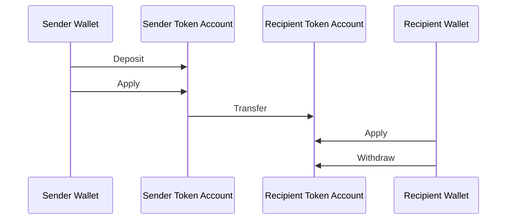
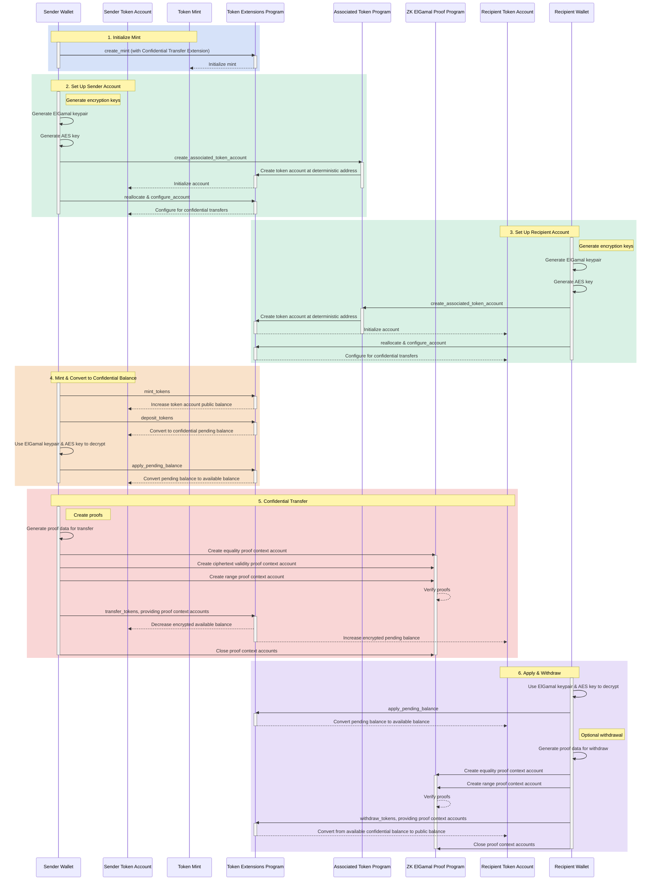

## Що таке конфіденційні перекази?

Конфіденційні перекази дозволяють переміщувати токени між token accounts, не
розкриваючи суму переказу. Це корисно для транзакцій із захистом
конфіденційності. Приватними є лише суми переказів і баланси токенів. Адреси
token account залишаються публічними.

- [Огляд протоколу](https://www.solana-program.com/docs/confidential-balances/overview)
  — Деталі щодо базового криптографічного протоколу
- [Посібник швидкого старту](https://www.solana-program.com/docs/confidential-balances#setup)
  — Налаштування та базові команди CLI
- [Cookbook конфіденційних балансів](https://github.com/solana-developers/Confidential-Balances-Sample)
  — Фрагменти коду для роботи з розширенням Confidential Transfer

### Як це працює?

Розширення Confidential Transfer додає
[інструкції](https://github.com/solana-program/token-2022/blob/efd0c957fefbd79882d77df5fb2dac88c001249c/program/src/extension/confidential_transfer/instruction.rs#L29)
до Token Extensions Program, що дозволяє переміщувати токени між акаунтами без
розкриття суми переказу.

Базовий процес конфіденційних переказів токенів виглядає так:

1. Створіть mint account з розширенням конфіденційного переказу.
2. Створіть token accounts з розширенням конфіденційного переказу для
   відправника та отримувача.
3. Виконайте мінтинг токенів на акаунт відправника.
4. **Внесіть** публічний баланс відправника до **конфіденційного очікуваного
   балансу**.
5. **Застосуйте** очікуваний баланс відправника до **конфіденційного доступного
   балансу**.
6. Конфіденційно **переведіть** токени з token account відправника на token
   account отримувача.
7. **Застосуйте** очікуваний баланс отримувача до **конфіденційного доступного
   балансу**.
8. **Виведіть** конфіденційний доступний баланс отримувача до **публічного
   балансу**.

Докладніше про кроки процесу конфіденційного переказу дивіться на відповідних
сторінках:

<Cards>
  <Card
    title="Створити mint account"
    href="/docs/tokens/extensions/confidential-transfer/create-mint"
  >
    Як створити mint account з розширенням Confidential Transfer
  </Card>
  <Card
    title="Створити token account"
    href="/docs/tokens/extensions/confidential-transfer/create-token-account"
  >
    Як налаштувати token account з розширенням Confidential Transfer
  </Card>
  <Card
    title="Внести токени"
    href="/docs/tokens/extensions/confidential-transfer/deposit-tokens"
  >
    Як внести токени до конфіденційного очікуваного балансу
  </Card>
  <Card
    title="Застосувати очікуваний баланс"
    href="/docs/tokens/extensions/confidential-transfer/apply-pending-balance"
  >
    Як застосувати очікуваний баланс до доступного конфіденційного балансу
  </Card>
  <Card
    title="Вивести токени"
    href="/docs/tokens/extensions/confidential-transfer/withdraw-tokens"
  >
    Як вивести токени з конфіденційного доступного балансу
  </Card>
  <Card
    title="Перевести токени"
    href="/docs/tokens/extensions/confidential-transfer/transfer-tokens"
  >
    Як конфіденційно переводити токени між token accounts
  </Card>
  <Card
    title="Посібник з інтеграції"
    href="/docs/tokens/extensions/confidential-transfer/integration-guide"
  >
    Як гаманці, оглядачі та біржі можуть підтримувати токени з конфіденційним
    переказом
  </Card>
  <Card
    title="Посібник емітента"
    href="/docs/tokens/extensions/confidential-transfer/issuer-guide"
  >
    Як випускати та керувати токеном з конфіденційним переказом (політика
    підтвердження, аудитори, комісії, мінтинг і спалення)
  </Card>
</Cards>

Діаграма нижче показує детальну послідовність основного процесу для
конфіденційних переказів токенів:

## Інструкції конфіденційного переказу

Повний список інструкцій розширення конфіденційного переказу
[instructions](https://github.com/solana-program/token-2022/blob/efd0c957fefbd79882d77df5fb2dac88c001249c/program/src/extension/confidential_transfer/instruction.rs#L29)
наведено нижче:

| Інструкція                          | Опис                                                                                                                                                                               |
| ----------------------------------- | ---------------------------------------------------------------------------------------------------------------------------------------------------------------------------------- |
| _rs`InitializeMint`_                | Налаштовує mint account для конфіденційних переказів. Ця інструкція повинна бути включена в ту саму транзакцію, що й інструкція _rs`TokenInstruction::InitializeMint`_.            |
| _rs`UpdateMint`_                    | Оновлює налаштування конфіденційного переказу для mint.                                                                                                                            |
| _rs`ConfigureAccount`_              | Налаштовує token account для конфіденційних переказів.                                                                                                                             |
| _rs`ApproveAccount`_                | Затверджує token account для конфіденційних переказів, якщо mint вимагає схвалення для нових token accounts.                                                                       |
| _rs`EmptyAccount`_                  | Очищає очікувані та доступні конфіденційні баланси, щоб дозволити закрити token account.                                                                                           |
| _rs`Deposit`_                       | Конвертує публічний баланс токенів у очікуваний конфіденційний баланс.                                                                                                             |
| _rs`Withdraw`_                      | Конвертує доступний конфіденційний баланс назад у публічний баланс.                                                                                                                |
| _rs`Transfer`_                      | Конфіденційно переказує токени між token accounts.                                                                                                                                 |
| _rs`ApplyPendingBalance`_           | Конвертує очікуваний баланс у доступний баланс після депозитів або переказів.                                                                                                      |
| _rs`EnableConfidentialCredits`_     | Дозволяє token account отримувати конфіденційні перекази токенів.                                                                                                                  |
| _rs`DisableConfidentialCredits`_    | Блокує вхідні конфіденційні перекази, залишаючи можливість публічних переказів.                                                                                                    |
| _rs`EnableNonConfidentialCredits`_  | Дозволяє token account отримувати публічні перекази токенів.                                                                                                                       |
| _rs`DisableNonConfidentialCredits`_ | Блокує звичайні перекази, щоб обліковий запис отримував лише конфіденційні перекази.                                                                                               |
| _rs`TransferWithFee`_               | Конфіденційно переказує токени між token accounts з комісією.                                                                                                                      |
| _rs`ConfigureAccountWithRegistry`_  | Альтернативний спосіб налаштування token accounts для конфіденційних переказів із використанням облікового запису _rs`ElGamalRegistry`_ замість доказу _rs`VerifyPubkeyValidity`_. |
