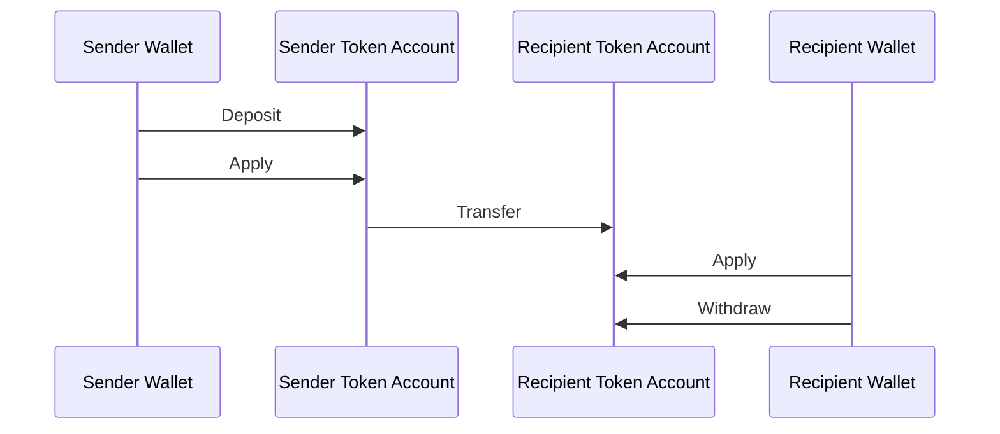
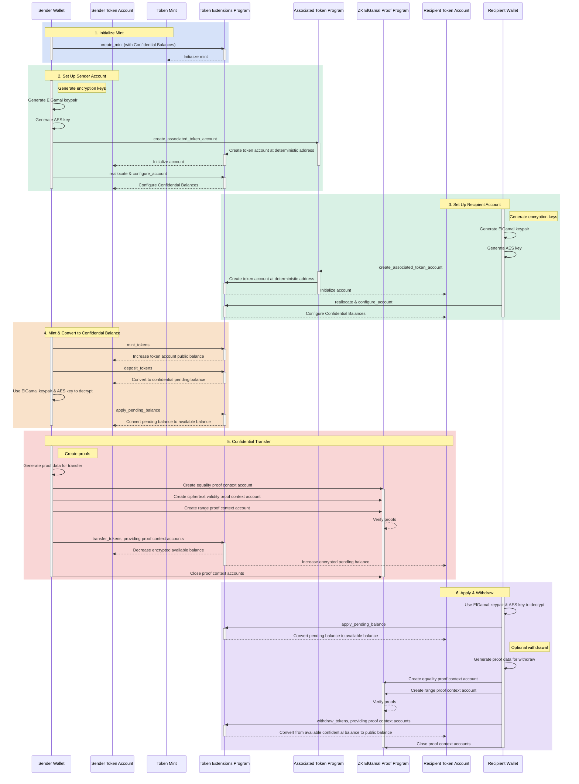

## Що таке Confidential Balances?

<Embed url="https://youtu.be/Bqs95tFcRIU" />

Confidential Balances — це розширення Token-2022, яке дозволяє переказувати токени між token account без розкриття суми переказу. Це корисно для транзакцій із захистом конфіденційності. Приватними є лише суми переказів і баланси токенів. Адреси token account залишаються публічними.

- [Огляд протоколу](https://www.solana-program.com/docs/confidential-balances/overview)
  — Деталі щодо базового криптографічного протоколу
- [Посібник із швидкого старту](https://www.solana-program.com/docs/confidential-balances#setup)
  — Налаштування та основні команди CLI
- [Confidential Balances Cookbook](https://github.com/solana-developers/Confidential-Balances-Sample) -
  Фрагменти коду з прикладами використання Confidential Balances

### Як це працює?

Розширення Confidential Balances додає
[інструкції](https://github.com/solana-program/token-2022/blob/efd0c957fefbd79882d77df5fb2dac88c001249c/program/src/extension/confidential_transfer/instruction.rs#L29)
до програми Token Extension, які дозволяють переказувати токени між
акаунтами без розкриття суми переказу.

```mermaid title="Confidential Balances Basic Overview"
    sequenceDiagram

    participant A as Sender Wallet
    participant AA as Sender Token Account
    participant BB as Recipient Token Account
    participant B as Recipient Wallet

    A->>AA: Deposit
    A->>AA: Apply

    AA->>BB: Transfer
    B->>BB: Apply

    B->>BB: Withdraw

```

Базовий процес конфіденційних переказів токенів виглядає так:

1. Створіть mint account з увімкненим Confidential Balances.
2. Створіть token account з увімкненим Confidential Balances для відправника та
   отримувача.
3. Відкарбуйте токени на акаунт відправника.
4. **Внесіть** публічний баланс відправника до **конфіденційного очікуваного
   балансу**.
5. **Застосуйте** очікуваний баланс відправника до **конфіденційного доступного
   балансу**.
6. Конфіденційно **перекажіть** токени з token account відправника до token
   account отримувача.
7. **Застосуйте** очікуваний баланс отримувача до **конфіденційного доступного
   балансу**.
8. **Виведіть** конфіденційний доступний баланс отримувача до **публічного
   балансу**.

### Ключі аудитора

Mint account у Confidential Balances може зберігати необов'язковий глобальний публічний ключ ElGamal аудитора. Якщо він налаштований, кожен конфіденційний переказ містить суму, зашифровану для відправника, отримувача та аудитора. Доказ переказу підтверджує, що всі три шифротексти містять однакову суму. Сума залишається недоступною для широкого загалу, але власник секретного ключа аудитора може розшифровувати суми переказів для цього mint.

Орган управління Confidential Balances встановлює ключ аудитора під час ініціалізації розширення або змінює його пізніше за допомогою _rs`UpdateMint`_. Орган управління може змінювати або видаляти ключ. Зміна ключа застосовується лише до майбутніх переказів, тому зберігайте попередні секретні ключі, якщо потрібен доступ до історичного аудиту. Ключі аудитора надають доступ лише для читання; вони не авторизують перекази токенів і не розкривають повний конфіденційний баланс акаунта.

Приклади налаштування та зміни ключів аудитора наведено в розділі
[Налаштування аудитора](/docs/tokens/extensions/confidential-transfer/issuer-guide#configure-an-auditor).
Гаманці, оглядачі, біржі та постачальники послуг відповідності також мають ознайомитися з
[настановами щодо інтеграції аудитора](/docs/tokens/extensions/confidential-transfer/integration-guide#auditors-and-compliance).

Докладніше про кроки процесу конфіденційного переказу дивіться на відповідних
сторінках:

<Cards>
  <Card
    title="Створення mint account"
    href="/docs/tokens/extensions/confidential-transfer/create-mint"
  >
    Як створити mint account з увімкненим Confidential Balances
  </Card>
  <Card
    title="Створення token account"
    href="/docs/tokens/extensions/confidential-transfer/create-token-account"
  >
    Як налаштувати token account з увімкненим Confidential Balances
  </Card>
  <Card
    title="Внесення токенів"
    href="/docs/tokens/extensions/confidential-transfer/deposit-tokens"
  >
    Як внести токени до конфіденційного очікуваного балансу
  </Card>
  <Card
    title="Застосування очікуваного балансу"
    href="/docs/tokens/extensions/confidential-transfer/apply-pending-balance"
  >
    Як застосувати очікуваний баланс до доступного конфіденційного балансу
  </Card>
  <Card
    title="Виведення токенів"
    href="/docs/tokens/extensions/confidential-transfer/withdraw-tokens"
  >
    Як вивести токени з конфіденційного доступного балансу
  </Card>
  <Card
    title="Переказ токенів"
    href="/docs/tokens/extensions/confidential-transfer/transfer-tokens"
  >
    Як конфіденційно переказувати токени між token accounts
  </Card>
  <Card
    title="Посібник з інтеграції"
    href="/docs/tokens/extensions/confidential-transfer/integration-guide"
  >
    Як гаманці, оглядачі та біржі можуть підтримувати токени Confidential Balances
  </Card>
  <Card
    title="Посібник для емітента"
    href="/docs/tokens/extensions/confidential-transfer/issuer-guide"
  >
    Як випускати токен Confidential Balances та керувати ним (політика затвердження,
    аудитори, комісії, mint та burn)
  </Card>
</Cards>

Діаграма нижче показує детальну послідовність основного процесу конфіденційних
переказів токенів:

```mermaid title="Confidential Balances Detailed Overview"
sequenceDiagram
    participant Sender as Sender Wallet
    participant SenderAccount as Sender Token Account
    participant Mint as Token Mint
    participant Token22 as Token Extensions Program
    participant ATAProgram as Associated Token Program
    participant ElGamal as ZK ElGamal Proof Program
    participant RecipientAccount as Recipient Token Account
    participant Recipient as Recipient Wallet

    rect rgba(120, 160, 235, 0.3)
    Note over Sender,Mint: 1. Initialize Mint

    activate Sender
    Sender->>Token22: create_mint (with Confidential Balances)
    activate Token22
    Token22-->>Mint: Initialize mint
    deactivate Token22
    deactivate Sender
    end

    rect rgba(130, 210, 170, 0.3)
    Note over Sender,SenderAccount: 2. Set Up Sender Account

    activate Sender
    Note right of Sender: Generate encryption keys
    Sender->>Sender: Generate ElGamal keypair
    Sender->>Sender: Generate AES key

    Sender->>ATAProgram: create_associated_token_account
    activate ATAProgram
    ATAProgram->>Token22: Create token account at deterministic address
    activate Token22
    Token22-->>SenderAccount: Initialize account
    deactivate Token22
    deactivate ATAProgram

    Sender->>Token22: reallocate & configure_account
    activate Token22
    Token22-->>SenderAccount: Configure Confidential Balances
    deactivate Token22
    deactivate Sender
    end

    rect rgba(130, 210, 170, 0.3)
    Note over Recipient,RecipientAccount: 3. Set Up Recipient Account

    activate Recipient
    Note right of Recipient: Generate encryption keys
    Recipient->>Recipient: Generate ElGamal keypair
    Recipient->>Recipient: Generate AES key

    Recipient->>ATAProgram: create_associated_token_account
    activate ATAProgram
    ATAProgram->>Token22: Create token account at deterministic address
    activate Token22
    Token22-->>RecipientAccount: Initialize account
    deactivate Token22
    deactivate ATAProgram

    Recipient->>Token22: reallocate & configure_account
    activate Token22
    Token22-->>RecipientAccount: Configure Confidential Balances
    deactivate Token22
    deactivate Recipient
    end

    rect rgba(235, 160, 80, 0.3)
    Note over Sender,SenderAccount: 4. Mint & Convert to Confidential Balance

    activate Sender
    Sender->>Token22: mint_tokens
    activate Token22
    Token22-->>SenderAccount: Increase token account public balance
    deactivate Token22

    Sender->>Token22: deposit_tokens
    activate Token22
    Token22-->>SenderAccount: Convert to confidential pending balance
    deactivate Token22

    Sender->>Sender: Use ElGamal keypair & AES key to decrypt
    Sender->>Token22: apply_pending_balance
    activate Token22
    Token22-->>SenderAccount: Convert pending balance to available balance
    deactivate Token22
    deactivate Sender
    end

    rect rgba(235, 120, 120, 0.3)
    Note over Sender,RecipientAccount: 5. Confidential Transfer

    activate Sender
    Note right of Sender: Create proofs
    Sender->>Sender: Generate proof data for transfer

    Sender->>ElGamal: Create equality proof context account
    activate ElGamal
    Sender->>ElGamal: Create ciphertext validity proof context account
    Sender->>ElGamal: Create range proof context account
    ElGamal-->>ElGamal: Verify proofs

    Sender->>Token22: transfer_tokens, providing proof context accounts
    activate Token22
    Token22-->>SenderAccount: Decrease encrypted available balance
    Token22-->>RecipientAccount: Increase encrypted pending balance
    deactivate Token22

    Sender->>ElGamal: Close proof context accounts
    deactivate ElGamal
    deactivate Sender
    end

    rect rgba(180, 150, 235, 0.3)
    Note over Recipient,RecipientAccount: 6. Apply & Withdraw

    activate Recipient
    Recipient->>Recipient: Use ElGamal keypair & AES key to decrypt
    Recipient->>Token22: apply_pending_balance
    activate Token22
    Token22-->>RecipientAccount: Convert pending balance to available balance
    deactivate Token22

    Note right of Recipient: Optional withdrawal
    Recipient->>Recipient: Generate proof data for withdraw

    Recipient->>ElGamal: Create equality proof context account
    activate ElGamal
    Recipient->>ElGamal: Create range proof context account
    ElGamal-->>ElGamal: Verify proofs

    Recipient->>Token22: withdraw_tokens, providing proof context accounts
    activate Token22
    Token22-->>RecipientAccount: Convert from available confidential balance to public balance
    deactivate Token22

    Recipient->>ElGamal: Close proof context accounts
    deactivate ElGamal
    deactivate Recipient
    end
```

## Інструкції Confidential Balances

Повний список
[інструкцій](https://github.com/solana-program/token-2022/blob/efd0c957fefbd79882d77df5fb2dac88c001249c/program/src/extension/confidential_transfer/instruction.rs#L29)
розширення Confidential Balances наведено нижче:

| Інструкція                         | Опис                                                                                                                                                       |
| ----------------------------------- | ----------------------------------------------------------------------------------------------------------------------------------------------------------------- |
| _rs`InitializeMint`_                | Вмикає Confidential Balances на mint account. Ця інструкція повинна бути включена в ту саму транзакцію, що й інструкція _rs`TokenInstruction::InitializeMint`_. |
| _rs`UpdateMint`_                    | Оновлює політику затвердження акаунтів mint та необов'язковий глобальний публічний ключ ElGamal аудитора.                                                                        |
| _rs`ConfigureAccount`_              | Вмикає Confidential Balances на token account.                                                                                                                 |
| _rs`ApproveAccount`_                | Затверджує token account для Confidential Balances, якщо mint вимагає затвердження для нових token account.                                                          |
| _rs`EmptyAccount`_                  | Очищує очікувані та доступні конфіденційні баланси, щоб дозволити закриття token account.                                                                         |
| _rs`Deposit`_                       | Конвертує публічний баланс токенів у очікуваний конфіденційний баланс.                                                                                                  |
| _rs`Withdraw`_                      | Конвертує доступний конфіденційний баланс назад у публічний баланс.                                                                                                   |
| _rs`Transfer`_                      | Конфіденційно переказує токени між token accounts.                                                                                                           |
| _rs`ApplyPendingBalance`_           | Конвертує очікуваний баланс у доступний баланс після депозитів або переказів.                                                                                      |
| _rs`EnableConfidentialCredits`_     | Дозволяє token account отримувати конфіденційні перекази токенів.                                                                                                   |
| _rs`DisableConfidentialCredits`_    | Блокує вхідні конфіденційні перекази, водночас дозволяючи публічні перекази.                                                                                     |
| _rs`EnableNonConfidentialCredits`_  | Дозволяє token account отримувати публічні перекази токенів.                                                                                                         |
| _rs`DisableNonConfidentialCredits`_ | Блокує звичайні перекази, щоб token account міг отримувати лише конфіденційні перекази.                                                                                     |
| _rs`TransferWithFee`_               | Конфіденційно переказує токени між token accounts з комісією.                                                                                                |
| _rs`ConfigureAccountWithRegistry`_  | Альтернативний спосіб налаштування token account для Confidential Balances з використанням акаунта _rs`ElGamalRegistry`_ замість доказу _rs`VerifyPubkeyValidity`_.         |
