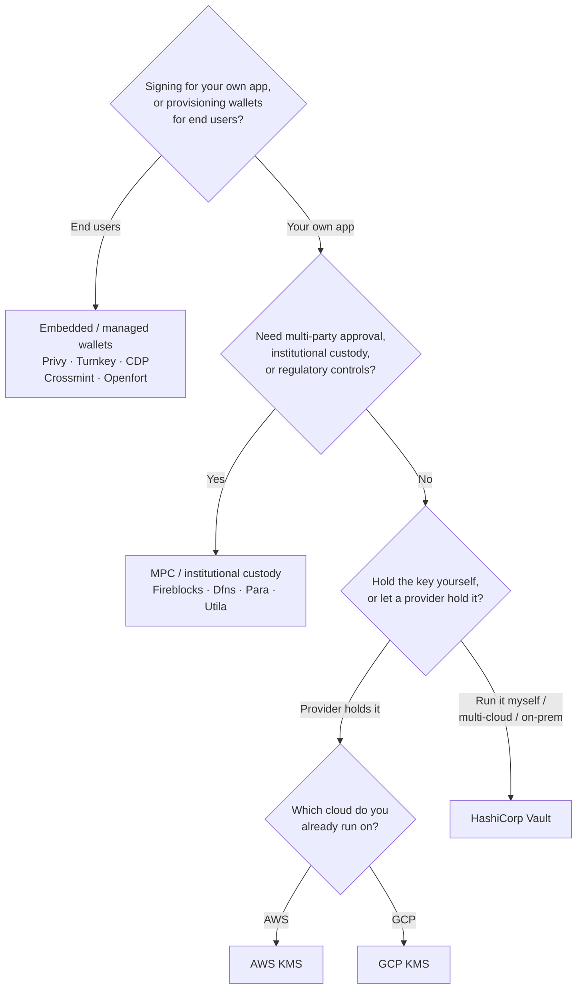

Keychain надає єдиний інтерфейс `SolanaSigner` для кожного бекенду, тому вибір є
операційним, а не архітектурним — ви можете змінити його пізніше через
конфігурацію. Тому **починайте з ваших вимог, а не з продукту.** Два питання
вирішують більшість: _де зберігається приватний ключ і хто має право
авторизувати підпис з його допомогою?_

Не існує єдиного найкращого бекенду. Кожен з них краще підходить для певного
набору обмежень — хмара, яку ви вже використовуєте, бажання керувати ключовою
інфраструктурою, а також необхідні вам засоби зберігання ключів та контролю
підтверджень. Наведена нижче схема зіставляє ці обмеження з відповідним
бекендом.

<Callout type="info">
  Цей посібник охоплює підписання на стороні сервера (бекенд). Якщо ваші кінцеві
  користувачі підписують власні транзакції у браузері, використовуйте гаманець
  через Wallet Standard — див. [Підписання у
  продакшні](/docs/core/transactions/signing-in-production).
</Callout>

## Схема прийняття рішень

<Callout type="info">
  Для локальної розробки та тестування це не потрібно — використовуйте бекенд
  **Memory** для прототипування, а потім перейдіть до одного з наведених вище
  продакшн-бекендів через конфігурацію.
</Callout>

## Розгляд питань

<Steps>

<Step>

### Ви підписуєте для власного застосунку чи для кінцевих користувачів?

Якщо ви надаєте гаманці, якими **кінцеві користувачі** володіють і керують
(споживчі застосунки, онбординг-процеси), використовуйте бекенд **вбудованого /
керованого гаманця** — Privy, Turnkey, CDP, Crossmint або Openfort. Вони керують
гаманцями та автентифікацією окремих користувачів від вашого імені.

Якщо ви підписуєте як **власний застосунок** — платник комісій, скарбниця,
серверна автоматизація — продовжуйте нижче.

</Step>

<Step>

### Вам потрібне багатостороннє підтвердження, інституційне зберігання або регуляторний контроль?

Якщо підписи мають пройти через політику затвердження, ліміт витрат або
комплаєнс-процес перш ніж бути створеними — або вам потрібен регульований
кастодіан, що зберігає ключі — використовуйте бекенд **MPC / інституційного
зберігання**: Fireblocks, Dfns, Para або Utila. Вони розподіляють або зберігають
ключ і підписують разом згідно з вашою політикою.

Якщо вам потрібен лише ключ, який підписує на запит, продовжуйте нижче.

</Step>

<Step>

### Ви хочете зберігати ключ самостійно чи довірити це провайдеру?

Якщо хмарний провайдер має зберігати ключ в апаратній інфраструктурі, а ваша
IAM-політика контролює, хто може підписувати, — використовуйте KMS цієї хмари:

- **Розгортання на AWS** → AWS KMS
- **Розгортання на GCP** → GCP KMS

Якщо ви хочете самостійно керувати ключовою інфраструктурою — або ви
використовуєте мультихмарне чи локальне середовище — використовуйте **HashiCorp
Vault**. Ви самі запускаєте й аудитуєте його; ключ залишається всередині рушія
Transit і підписує на запит.

</Step>

</Steps>

## Моделі зберігання

Бекенди згруповано в п'ять моделей зберігання. Схема вище приводить вас до
однієї з них.

- **Самостійне зберігання (у процесі)** — ваш застосунок зберігає необроблений
  приватний ключ. Зручно для розробки, але не підходить для продакшну. Бекенд:
  **Memory**.
- **Самостійне управління ключами** — ви керуєте ключовою інфраструктурою; ключ
  залишається всередині неї та підписує на запит. Бекенд: **HashiCorp Vault**.
- **Cloud KMS / HSM** — хмарний провайдер зберігає ключ в апаратній
  інфраструктурі; ключ ніколи не покидає сервіс, а ваша IAM-політика контролює
  хто може підписувати. Бекенди: **AWS KMS**, **GCP KMS**.
- **MPC та інституційне зберігання** — ключ розподілено або передано на
  зберігання провайдеру, який підписує разом згідно з вашою політикою
  (затвердження, ліміти). Бекенди: **Fireblocks**, **Dfns**, **Para**,
  **Utila**.
- **Вбудовані та керовані гаманці** — провайдер управляє гаманцями від вашого
  імені, часто для онбордингу кінцевих користувачів. Бекенди: **Privy**,
  **Turnkey**, **CDP**, **Crossmint**, **Openfort**.

## Порівняння бекендів

| Бекенд          | Модель зберігання                 | Найкраще для                                      | Примітки                                                  |
| --------------- | --------------------------------- | ------------------------------------------------- | --------------------------------------------------------- |
| Memory          | Самостійне зберігання (у процесі) | Локальна розробка, тести, CI                      | Відкритий ключ у процесі — не використовуйте у продакшені |
| HashiCorp Vault | Власна інфраструктура ключів      | Команди з власною інфраструктурою ключів          | Transit engine; ви самостійно керуєте та аудитуєте        |
| AWS KMS         | Хмарний KMS / HSM                 | Бекенди, що працюють на AWS                       | Ключ ніколи не покидає KMS; IAM контролює підписання      |
| GCP KMS         | Хмарний KMS / HSM                 | Бекенди, що працюють на GCP                       | Ключ ніколи не покидає KMS; IAM контролює підписання      |
| Fireblocks      | MPC / інституційне зберігання     | Трежері, біржі, регульоване зберігання            | Рушій політик та робочі процеси затвердження              |
| Dfns            | MPC-інфраструктура гаманців       | Програмні гаманці з керуванням політиками         | Підписання Ed25519                                        |
| Para            | MPC-гаманці                       | Застосунки з MPC-гаманцями                        | API ключ + ID гаманця                                     |
| Utila           | MPC-зберігання + co-signer        | Наявні Solana-гаманці під управлінням Utila       | `signMessage` не підтримується; ви транслюєте транзакцію  |
| Privy           | Вбудовані гаманці                 | Споживчі застосунки для онбордингу користувачів   | Вбудовані гаманці під управлінням застосунку              |
| Turnkey         | Некастодіальне управління ключами | Програмне підписання з контролем політик          | Некастодіальне управління ключами                         |
| CDP             | Керований гаманець (Coinbase)     | Застосунки на Coinbase Developer Platform         | `signMessage` приймає лише UTF-8 payload                  |
| Crossmint       | Керовані гаманці                  | Маркетплейси та застосунки з керованими гаманцями | Гаманці `smart` та `mpc`; `signMessage` не підтримується  |
| Openfort        | Вбудовані бекенд-гаманці          | Серверні гаманці                                  | Ключі зберігаються в TEE                                  |

## Корпоративні сценарії

Одному застосунку часто потрібно декілька з цих можливостей одночасно. Оскільки
інтерфейс однаковий, можна використовувати різний бекенд для кожної ролі, не
змінюючи місця викликів.

- **Операції зі скарбницею** — розділіть операційний «гарячий» підписант від
  «холодного» підписанта скарбниці. Підкріпіть скарбницю за допомогою
  MPC-зберігання або хмарного HSM та вимагайте політик затвердження перед
  виконанням підписів великої вартості.
- **Процеси затвердження** — бекенди MPC та зберігання (наприклад, Fireblocks)
  забезпечують багатостороннє затвердження перед формуванням підпису.
- **Відповідність нормативним вимогам та аудит** — хмарні KMS (AWS/GCP) і Vault
  формують журнали аудиту підписів; інституційні кастодіани додають виконання
  політик та звітність.
- **Регульовані середовища** — зберігайте ключовий матеріал в HSM, KMS або
  інституційному кастодіані, щоб необроблені ключі ніколи не торкалися вашого
  застосунку.

Дивіться
[Найкращі практики для виробничого середовища](/docs/tools/keychain/production-best-practices)
для безпечної роботи з цими бекендами.

<Cards>
  <Card title="Посібник Rust" href="/docs/tools/keychain/getting-started/rust">
    Налаштуйте кожен бекенд у Rust.
  </Card>
  <Card
    title="Посібник TypeScript"
    href="/docs/tools/keychain/getting-started/typescript"
  >
    Налаштуйте кожен бекенд у TypeScript.
  </Card>
</Cards>
