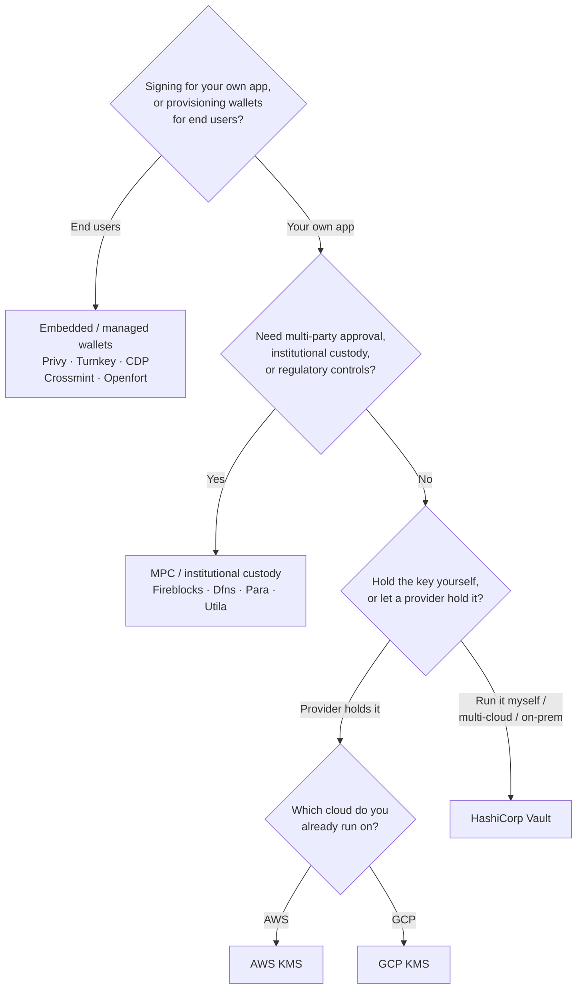

Keychain надає єдиний інтерфейс `SolanaSigner` для кожного бекенду, тому вибір є
операційним, а не архітектурним — ви зможете змінити його пізніше через
конфігурацію. Тому **починайте з ваших вимог, а не з продукту.** Два питання
вирішують більшість: _де зберігається приватний ключ і хто має право
авторизувати підпис за його допомогою?_

Не існує єдиного найкращого бекенду. Кожен із них краще підходить для певного
набору обмежень — хмара, яку ви вже використовуєте, необхідність керувати
ключовою інфраструктурою, а також вимоги до зберігання ключів і контролю
затвердження. Наведена нижче схема співставляє ці обмеження з відповідним
бекендом.

<Callout type="info">
  Цей посібник охоплює підписання на стороні бекенду (серверне). Якщо ваші
  кінцеві користувачі підписують власні транзакції у браузері, використовуйте
  гаманець через Wallet Standard — див. [Підписання у виробничому
  середовищі](/docs/core/transactions/signing-in-production).
</Callout>

## Схема прийняття рішень

<Callout type="info">
  Для локальної розробки та тестування нічого з цього не потрібно —
  використовуйте бекенд **Memory** для прототипування, а потім перейдіть до
  одного з наведених вище виробничих бекендів через конфігурацію.
</Callout>

## Огляд питань

<Steps>

<Step>

### Ви підписуєте для власного застосунку чи для кінцевих користувачів?

Якщо ви надаєте гаманці, якими **кінцеві користувачі** володіють та керують
(споживчі застосунки, процеси онбордингу), використовуйте бекенд **вбудованого /
керованого гаманця** — Privy, Turnkey, CDP, Crossmint або Openfort. Вони керують
гаманцями та автентифікацією кожного користувача від вашого імені.

Якщо ви підписуєте як **власний застосунок** — платник комісій, скарбниця,
автоматизація бекенду — продовжуйте нижче.

</Step>

<Step>

### Чи потрібні вам багатостороннє погодження, інституційне зберігання або регуляторний контроль?

Якщо підписи мають пройти через політику погодження, ліміт витрат або процес
відповідності перед створенням — або вам потрібен регульований кастодіан, що
зберігає ключі — використовуйте бекенд **MPC / інституційного зберігання**:
Fireblocks, Dfns, Para або Utila. Вони розподіляють або зберігають ключ і
підписують спільно відповідно до вашої політики.

Якщо вам потрібен лише ключ, який підписує на запит, продовжуйте нижче.

</Step>

<Step>

### Ви хочете зберігати ключ самостійно чи довірити його постачальнику?

Якщо хмарний постачальник має зберігати ключ в апаратній інфраструктурі, а ваша
політика IAM контролює, хто може підписувати, використовуйте KMS цієї хмари:

- **Працюєте на AWS** → AWS KMS
- **Працюєте на GCP** → GCP KMS

Якщо ви хочете самостійно керувати ключовою інфраструктурою — або використовуєте
мульти-хмарне чи локальне середовище — використовуйте **HashiCorp Vault**. Ви
самі запускаєте й аудитуєте його; ключ залишається всередині рушія Transit і
підписує на запит.

</Step>

</Steps>

## Моделі зберігання

Бекенди об'єднуються у п'ять моделей зберігання. Наведений вище алгоритм
приводить вас до однієї з них.

- **Самостійне зберігання (у процесі)** — ваш застосунок зберігає необроблений
  приватний ключ. Зручно для розробки, але не підходить для виробничого
  середовища. Бекенд: **Memory**.
- **Самостійно розгорнуте управління ключами** — ви керуєте ключовою
  інфраструктурою; ключ залишається всередині неї і підписує на запит. Бекенд:
  **HashiCorp Vault**.
- **Хмарний KMS / HSM** — хмарний постачальник зберігає ключ в апаратній
  інфраструктурі; ключ ніколи не покидає сервіс, а ваша політика IAM контролює
  хто може підписувати. Бекенди: **AWS KMS**, **GCP KMS**.
- **MPC та інституційне зберігання** — ключ розподілений або перебуває під
  опікою постачальника, який підписує спільно відповідно до вашої політики
  (погодження, ліміти). Бекенди: **Fireblocks**, **Dfns**, **Para**, **Utila**.
- **Вбудовані та керовані гаманці** — постачальник управляє гаманцями від вашого
  імені, часто для підключення кінцевих користувачів. Бекенди: **Privy**,
  **Turnkey**, **CDP**, **Crossmint**, **Openfort**.

## Порівняння бекендів

| Бекенд          | Модель зберігання                 | Найкраще для                                                 | Примітки                                                            |
| --------------- | --------------------------------- | ------------------------------------------------------------ | ------------------------------------------------------------------- |
| Memory          | Самостійне зберігання (в процесі) | Локальна розробка, тести, CI                                 | Відкритий ключ у процесі — не використовувати у продакшені          |
| HashiCorp Vault | Самостійне керування ключами      | Команди, що підтримують власну інфраструктуру ключів         | Transit engine; ви самостійно керуєте та аудитуєте його             |
| AWS KMS         | Хмарний KMS / HSM                 | Бекенди, що працюють на AWS                                  | Ключ ніколи не покидає KMS; IAM контролює підписання                |
| GCP KMS         | Хмарний KMS / HSM                 | Бекенди, що працюють на GCP                                  | Ключ ніколи не покидає KMS; IAM контролює підписання                |
| Fireblocks      | MPC / інституційне зберігання     | Скарбниці, біржі, регульоване зберігання                     | Механізм політик та робочі процеси затвердження                     |
| Dfns            | MPC-інфраструктура гаманців       | Програматичні гаманці з контролем політик                    | Підписання Ed25519                                                  |
| Para            | MPC-гаманці                       | Застосунки, що потребують гаманців на основі MPC             | API-ключ + ID гаманця                                               |
| Utila           | MPC-зберігання + co-signer        | Наявні Solana-гаманці під керуванням Utila                   | `signMessage` не підтримується; ви самостійно транслюєте транзакцію |
| Privy           | Вбудовані гаманці                 | Споживчі застосунки для підключення користувачів до гаманців | Вбудовані гаманці під керуванням застосунку                         |
| Turnkey         | Некастодіальне керування ключами  | Програматичне підписання з контролем політик                 | Некастодіальне керування ключами                                    |
| CDP             | Керований гаманець (Coinbase)     | Застосунки на Coinbase Developer Platform                    | `signMessage` приймає лише UTF-8 навантаження                       |
| Crossmint       | Керовані гаманці                  | Маркетплейси та застосунки з керованими гаманцями            | Гаманці `smart` та `mpc`; `signMessage` не підтримується            |
| Openfort        | Вбудовані бекенд-гаманці          | Серверні гаманці                                             | Ключі зберігаються в TEE                                            |

## Корпоративні сценарії

Одному застосунку часто потрібно кілька з них одночасно. Оскільки інтерфейс
ідентичний, можна використовувати різний бекенд для кожної ролі, не змінюючи
місця викликів.

- **Операції з казначейством** — розділіть оперативний "гарячий" підписант від
  "холодного" казначейського підписанта. Забезпечте казначейство за допомогою
  MPC-зберігання або хмарного HSM і вимагайте політик погодження перед підписами
  з високою вартістю.
- **Робочі процеси погодження** — бекенди MPC та зберігання (наприклад,
  Fireblocks) забезпечують багатостороннє погодження перед формуванням підпису.
- **Відповідність вимогам та аудит** — хмарний KMS (AWS/GCP) і Vault ведуть
  журнали аудиту підписів; інституційні зберігачі додають застосування політик і
  звітність.
- **Регульовані середовища** — зберігайте ключовий матеріал в HSM, KMS або
  інституційного зберігача, щоб необроблені ключі ніколи не торкалися вашого
  застосунку.

Дивіться
[Найкращі практики для продакшну](/docs/tools/keychain/production-best-practices)
для безпечної роботи з цими бекендами.

<Cards>
  <Card
    title="Посібник з Rust"
    href="/docs/tools/keychain/getting-started/rust"
  >
    Налаштуйте кожен бекенд у Rust.
  </Card>
  <Card
    title="Посібник з TypeScript"
    href="/docs/tools/keychain/getting-started/typescript"
  >
    Налаштуйте кожен бекенд у TypeScript.
  </Card>
</Cards>
