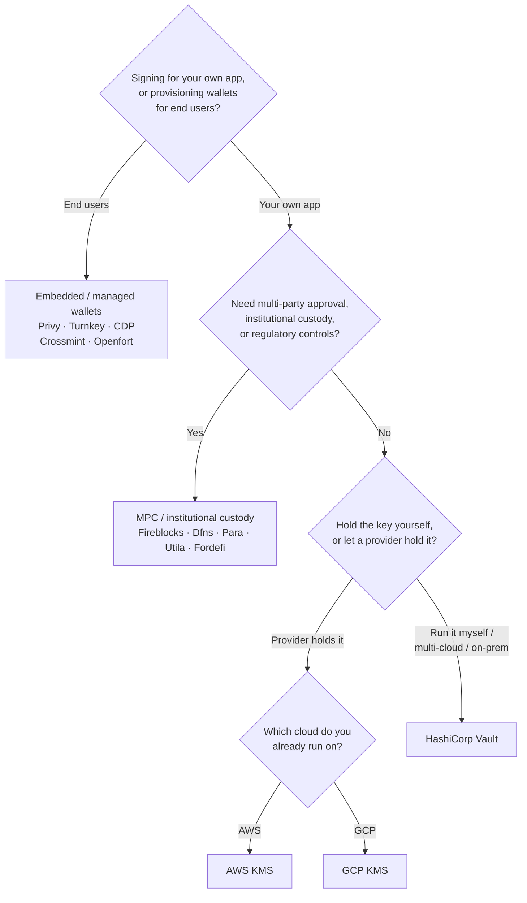

Keychain надає один базовий інтерфейс `SolanaSigner` для всіх бекендів, тож для
більшості бекендів вибір є операційним, а не архітектурним: пізніше його можна змінити
через конфігурацію. Виняток — формат транзакції. Crossmint
і Fordefi у нативному автоматичному режимі підписують і транслюють транзакції на стороні сервера, а Fordefi у нативному
ручному режимі перед підписанням переписує транзакцію, тож перехід до одного
з них або від нього змінює спосіб виклику підписувача. Через це **виходьте
з власних вимог, а не з продукту.** Більшість рішення визначають два питання: _де
зберігається приватний ключ і хто має право авторизувати підпис за його допомогою?_

Усі бекенди, окрім Ledger, доступні для всіх чотирьох мов (Rust, TypeScript,
Python і Go). Ledger працює лише з Rust і вмикається окремою опціональною функцією `ledger`.

Найкращого бекенду на всі випадки не існує. Кожен із них краще підходить для певного набору
обмежень: хмара, якою ви вже користуєтеся, бажання самостійно керувати ключовою
інфраструктурою, а також обов’язкові вимоги до зберігання ключів і контролю підтверджень.
Схема нижче зіставляє ці обмеження з бекендом.

<Callout type="info">
  Цей посібник охоплює підписання на стороні бекенду (сервера). Якщо ваші кінцеві користувачі підписують
  власні транзакції в браузері, натомість використовуйте гаманець через Wallet Standard.
  Див. [Підписання у
  продакшені](/docs/core/transactions/signing-in-production).
</Callout>

## Схема прийняття рішень

```mermaid title="Choosing a Keychain backend"
flowchart TD
    Start{Signing for your own app,<br/>or provisioning wallets<br/>for end users?}
    Start -->|End users| Managed[Embedded / managed wallets<br/>Privy · Turnkey · CDP<br/>Crossmint · Openfort]
    Start -->|Your own app| Q2{Need multi-party approval,<br/>institutional custody,<br/>or regulatory controls?}
    Q2 -->|Yes| MPC[MPC / institutional custody<br/>Fireblocks · Dfns · Para · Utila · Fordefi]
    Q2 -->|No| Q3{Hold the key yourself,<br/>or let a provider hold it?}
    Q3 -->|Provider holds it| Q4{Which cloud do you<br/>already run on?}
    Q4 -->|AWS| AWS[AWS KMS]
    Q4 -->|GCP| GCP[GCP KMS]
    Q3 -->|Run it myself /<br/>multi-cloud / on-prem| Vault[HashiCorp Vault]
```

<Callout type="info">
  Для локальної розробки та тестів усе це не потрібне: використовуйте бекенд **Memory**
  для прототипування, а потім перейдіть на один із продакшн-бекендів, наведених вище, через
  конфігурацію.
</Callout>

## Розгляд питань

<Steps>

<Step>

### Ви підписуєте для власного застосунку чи для кінцевих користувачів?

Якщо ви створюєте гаманці, якими володіють і керують **кінцеві користувачі** (споживчі застосунки,
процеси онбордингу), використовуйте бекенд **вбудованих / керованих гаманців**: Privy, Turnkey,
CDP, Crossmint або Openfort. Вони керують гаманцями окремих користувачів та автентифікацією
від вашого імені.

Якщо ви підписуєте **від імені власного застосунку** (платник комісії, скарбниця, автоматизація
на бекенді), переходьте до наступного кроку.

</Step>

<Step>

### Чи потрібні вам багатосторонні підтвердження, інституційне зберігання ключів або регуляторний контроль?

Якщо підписи мають пройти політику підтверджень, ліміт витрат або процес комплаєнсу,
перш ніж будуть створені, або вам потрібен регульований кастодіан, який зберігає
ключі, використовуйте бекенд **MPC / інституційного зберігання**: Fireblocks, Dfns, Para,
Utila або Fordefi. Вони розділяють ключ або зберігають його та співпідписують відповідно до вашої
політики.

Якщо вам потрібен лише ключ, що підписує на запит, переходьте до наступного кроку.

</Step>

<Step>

### Ви хочете зберігати ключ самостійно чи довірити його провайдеру?

Якщо хмарний провайдер має зберігати ключ в апаратно захищеній інфраструктурі, а
ваша політика IAM визначає, хто може підписувати, використовуйте KMS відповідної хмари:

- **Працюєте на AWS** → AWS KMS
- **Працюєте на GCP** → GCP KMS

Якщо ви хочете самостійно керувати ключовою інфраструктурою або використовуєте кілька хмар чи
on-prem, оберіть **HashiCorp Vault**. Ви самі запускаєте й аудитуєте його; ключ залишається всередині
Transit engine і підписує на запит.

</Step>

</Steps>

## Моделі зберігання

Бекенди поділяються на шість моделей зберігання ключів. Схема вище підводить вас до однієї
з них.

- **Самостійне зберігання (в межах процесу)**: ваш застосунок зберігає необроблений приватний ключ.
  Зручно для розробки, але непридатно для продакшену. Бекенд:
  **Memory**.
- **Самостійне зберігання (апаратний гаманець)**: ключ ніколи не залишає пристрій Ledger,
  а кожен підпис людина підтверджує на його екрані. Підходить для інтерактивного
  підписання оператором, але не для автономних сервісів. Лише Rust, вмикається опційно та не входить
  до аудиту. Бекенд: **Ledger**.
- **Самостійне керування ключами**: ви керуєте ключовою інфраструктурою; ключ
  залишається всередині неї та підписує на запит. Бекенд: **HashiCorp Vault**.
- **Хмарний KMS / HSM**: хмарний провайдер зберігає ключ в апаратно захищеній
  інфраструктурі; ключ ніколи не залишає сервіс, а ваша політика IAM визначає,
  хто може підписувати. Бекенди: **AWS KMS**, **GCP KMS**.
- **MPC та інституційне зберігання**: ключ розділяється або зберігається у
  провайдера, який співпідписує відповідно до вашої політики (підтвердження, ліміти).
  Бекенди: **Fireblocks**, **Dfns**, **Para**, **Utila**, **Fordefi**.
- **Вбудовані та керовані гаманці**: провайдер керує гаманцями від вашого імені,
  часто для онбордингу кінцевих користувачів. Бекенди: **Privy**, **Turnkey**, **CDP**,
  **Crossmint**, **Openfort**.

## Порівняння бекендів

| Бекенд         | Модель зберігання                  | Найкраще для                                     | Примітки                                                                                                              |
| --------------- | ------------------------------ | -------------------------------------------- | ------------------------------------------------------------------------------------------------------------------ |
| Memory          | Самостійне зберігання (у процесі)      | Локальна розробка, тести, CI                 | Необроблений ключ у процесі; не використовуйте в продакшені                                                                       |
| Ledger          | Самостійне зберігання (апаратний гаманець) | Інтерактивне підписання оператором із засобів на Rust | Лише Rust, опційна функція `ledger`, без аудиту; кожен підпис підтверджується на пристрої                                 |
| HashiCorp Vault | Власна інфраструктура ключів     | Команди з власною інфраструктурою ключів   | Transit engine; ви самостійно керуєте та аудитуєте                                                                           |
| AWS KMS         | Хмарний KMS / HSM                | Бекенди, що працюють на AWS                      | Ключ ніколи не покидає KMS; IAM контролює підписання                                                                         |
| GCP KMS         | Хмарний KMS / HSM                | Бекенди, що працюють на GCP                      | Ключ ніколи не покидає KMS; IAM контролює підписання                                                                         |
| Fireblocks      | MPC / інституційне зберігання    | Трежері, біржі, регульоване зберігання     | Рушій політик та робочі процеси затвердження                                                                               |
| Dfns            | MPC-інфраструктура гаманців      | Програмні гаманці з керуванням політиками    | Підписання Ed25519                                                                                                    |
| Para            | MPC-гаманці                    | Застосунки з MPC-гаманцями            | API ключ + ID гаманця                                                                                                |
| Utila           | MPC-зберігання + co-signer        | Наявні Solana-гаманці під управлінням Utila        | `signMessage` не підтримується; ви транслюєте транзакцію                                                                    |
| Fordefi         | MPC / інституційне зберігання    | Інституційне зберігання з засобами контролю політик   | Чорна скринька: ви надсилаєте. Native auto: Fordefi переписує й надсилає. Native manual: Fordefi переписує, ви надсилаєте результат |
| Privy           | Вбудовані гаманці               | Споживчі застосунки для онбордингу користувачів    | Вбудовані гаманці під управлінням застосунку                                                                                       |
| Turnkey         | Некастодіальне управління ключами   | Програмне підписання з контролем політик           | Некастодіальне управління ключами                                                                                       |
| CDP             | Керований гаманець (Coinbase)      | Застосунки на Coinbase Developer Platform      | `signMessage` приймає лише UTF-8 payload                                                                          |
| Crossmint       | Керовані гаманці                | Маркетплейси та застосунки з керованими гаманцями         | Лише надсилання: трансляція на стороні сервера, може переписувати транзакцію для спонсорування газу; `signMessage` не підтримується                   |
| Openfort        | Вбудовані бекенд-гаманці       | Серверні гаманці                          | Ключі зберігаються в TEE                                                                                                    |

## Можливості та формат транзакції

Крім типу зберігання ключів, кожен бекенд має один формат роботи з транзакціями, і він визначає, як
ви викликаєте підписувач:

- **Підписання**: провайдер підписує байти, які ви сформували, а ви транслюєте їх самостійно. Більшість
  бекендів, зокрема Ledger і Fordefi у режимі «чорної скриньки».
- **Переписування та підписання**: провайдер переписує транзакцію, а потім підписує її
  без трансляції. Продовжуйте з транзакції, яку він повертає. Fordefi у нативному
  ручному режимі.
- **Підписання та трансляція**: провайдер підписує й транслює на стороні сервера, тому
  помилка не означає, що транзакція не потрапила в мережу. Crossmint і Fordefi у нативному автоматичному режимі.

У таблиці можливостей підписувачів у README кожної мови вказано формат роботи кожного
бекенду; у розділі
[моделі безпеки](https://github.com/solana-foundation/solana-keychain/blob/main/docs/SECURITY_MODEL.md)
пояснюється, що гарантує кожен формат.

## Корпоративні сценарії

Одному застосунку часто потрібно кілька таких бекендів одночасно. Оскільки
інтерфейс спільний, ви можете використовувати різні бекенди для різних ролей без зміни
місць виклику, якщо ці бекенди мають однаковий формат роботи з транзакціями.

- **Операції зі скарбницею** — розділіть операційний «гарячий» підписант від
  «холодного» підписанта скарбниці. Підкріпіть скарбницю за допомогою
  MPC-зберігання або хмарного HSM та вимагайте політик затвердження перед
  виконанням підписів великої вартості.
- **Процеси затвердження** — бекенди MPC та зберігання (наприклад, Fireblocks)
  забезпечують багатостороннє затвердження перед формуванням підпису.
- **Відповідність нормативним вимогам та аудит** — хмарні KMS (AWS/GCP) і Vault
  формують журнали аудиту підписів; інституційні кастодіани додають виконання
  політик та звітність.
- **Регульовані середовища** — зберігайте ключовий матеріал в HSM, KMS або
  інституційному кастодіані, щоб необроблені ключі ніколи не торкалися вашого
  застосунку.

Дивіться
[Найкращі практики для виробничого середовища](/docs/tools/keychain/production-best-practices)
для безпечної роботи з цими бекендами.

<Cards>
  <Card title="Посібник Rust" href="/docs/tools/keychain/getting-started/rust">
    Налаштуйте кожен бекенд у Rust.
  </Card>
  <Card
    title="Посібник TypeScript"
    href="/docs/tools/keychain/getting-started/typescript"
  >
    Налаштуйте кожен бекенд у TypeScript.
  </Card>
</Cards>
