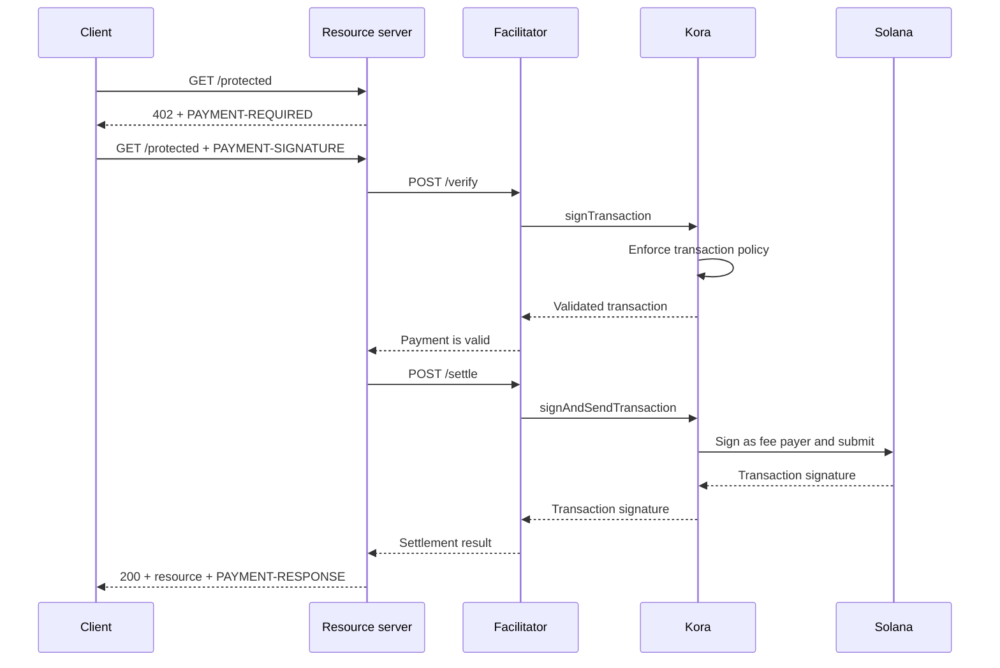

Kora може забезпечити рівень підписання транзакцій Solana, управління політиками транзакцій і спонсорування комісій для [фасилітатора x402 V2](/docs/tools/x402-facilitator). Фасилітатор реалізує HTTP API x402; Kora перевіряє, підписує та надсилає прийняті платіжні транзакції.

Цей посібник запускає референсний фасилітатор Kora в мережі Solana Devnet. Це середовище розробки для тестування інтеграції, а не продакшн-розгортання.

## Архітектура



Чотири ролі застосунку залишаються розділеними:

- **Клієнт** обирає вимогу до оплати та підписує авторизацію платежу.
- **Сервер ресурсів** встановлює ціну для маршруту та виконує його лише після успішної перевірки та розрахунку.
- **Фасилітатор** надає ендпоінти x402 `/supported`, `/verify` та `/settle`.
- **Kora** підписує лише транзакції, дозволені її політикою, і може спонсорувати комісії мережі Solana.

Kora не замінює протокол x402. Вона є межею підписання та застосування політик у цій реалізації фасилітатора.

## Запуск референсного фасилітатора

Вам знадобляться Git і [Docker з Compose](https://docs.docker.com/compose/). Клонуйте останній стабільний реліз Kora та перейдіть до демо x402:

```bash
git clone --branch v2.0.5 --depth 1 https://github.com/solana-foundation/kora.git
cd kora/examples/x402/demo
cp .env.example .env
```

Встановіть `KORA_PRIVATE_KEY` у файлі `.env` на одноразовий keypair Devnet. Конфігурація підписувача демо приймає секрет у форматі base58, масив байтів keypair або шлях до файлу JSON keypair. Поповніть публічну адресу SOL у Devnet, щоб вона могла спонсорувати комісії транзакцій.

<Callout type="caution" title="Використовуйте одноразовий підписувач Devnet">
  Демо Docker завантажує підписувач Kora зі змінної середовища. Не розміщуйте продакшн-ключ підписання в цьому демо та не додавайте файл `.env` до репозиторію.
</Callout>

Запустіть Kora та фасилітатор:

```bash
docker compose up --build
```

Перше збирання може зайняти кілька хвилин. Коли обидві перевірки стану пройдуть, перегляньте оголошені можливості фасилітатора з іншого термінала:

```bash
curl http://127.0.0.1:3000/supported
```

Відповідь має оголошувати x402 версії `2`, схему `exact` та мережевий ідентифікатор CAIP-2 для Devnet:

```json
{
  "kinds": [
    {
      "x402Version": 2,
      "scheme": "exact",
      "network": "solana:EtWTRABZaYq6iMfeYKouRu166VU2xqa1",
      "extra": {
        "feePayer": "<KORA_SIGNER_ADDRESS>"
      }
    }
  ]
}
```

Kora слухає на `127.0.0.1:8080`, а фасилітатор — на `127.0.0.1:3000` за замовчуванням. Зупиніть демо за допомогою `Ctrl+C`.

## Підключення сервера ресурсів

Налаштуйте сервер ресурсів x402 для використання локального фасилітатора та публічної адреси підписувача Kora як одержувача:

```bash
FACILITATOR_URL=http://127.0.0.1:3000
SOLANA_PAY_TO=<KORA_SIGNER_ADDRESS>
```

Потім дотримуйтесь інструкцій [x402 на Solana](/docs/payments/agentic-payments/x402), щоб додати проміжне програмне забезпечення x402 V2 до маршруту Express. Неоплачений запит отримує `PAYMENT-REQUIRED`, повторний запит містить `PAYMENT-SIGNATURE`, а успішна відповідь містить `PAYMENT-RESPONSE`.

Не копіюйте приклади, що використовують `X-PAYMENT`, `X-PAYMENT-RESPONSE` або назву мережі `solana-devnet`. Ці поля належать до x402 V1.

Репозиторій Kora також містить захищений API та платіжний клієнт у тому самому каталозі `examples/x402/demo`. Використовуйте ці застосунки, коли потрібно перевірити повний локальний процес.

## Налаштування політики Kora

Референсний файл `kora/kora.toml` навмисно має вузький набір правил. Його політика перевірки контролює:

- які програми Solana дозволяє підписувач;
- які SPL token mint можна використовувати;
- максимальну кількість спонсорованих lamport і підписів;
- які операції платника комісій заборонені; та
- які розширення Token-2022 відхиляються.

Демо вмикає лише ті методи Kora RPC, які потрібні його фасилітатору:
`signTransaction`, `signAndSendTransaction`, `getBlockhash`, `getPayerSigner`,
`getConfig` та `getVersion`.

Розглядайте політику як межу безпеки для ключа платника комісій. Для продакшн-сервісу:

1. Дозвольте лише програми, token mint і форми транзакцій, які генерує ваша схема x402.
2. Забороніть перекази, зміни прав доступу, закриття облікових записів та інші інструкції, які можуть переміщувати кошти від підписувача Kora.
3. Встановіть обмеження на транзакції та використання, які обмежують збитки у разі компрометації облікових даних фасилітатора.
4. Використовуйте керований бекенд підписувача замість приватного ключа, що зберігається у змінних середовища.

## Захист з'єднання між фасилітатором і Kora

Демо вмикає автентифікацію за API-ключем Kora. Фасилітатор надсилає значення `KORA_API_KEY`, яке має збігатися з `[kora.auth].api_key` у файлі `kora.toml`.

Для продакшну також:

- тримайте Kora в приватній мережі та завершуйте TLS на довіреній межі;
- зберігайте облікові дані API у менеджері секретів і регулярно їх ротуйте;
- розгляньте HMAC-автентифікацію запитів Kora для захисту від підробки та повторних атак;
- розділяйте ключі платника комісій і одержувача платежів, якщо цього вимагає ваша модель обліку; та
- налаштуйте сповіщення про відхилення політик, збої розрахунків, споживання комісій і баланс підписувача.

## Підвищення надійності розрахунків

Kora перевіряє транзакцію Solana, але фасилітатор і сервер ресурсів все одно несуть відповідальність за коректність протоколу x402. Перед наданням ресурсу перевіряйте:

- обрану версію x402, схему, мережу, актив, суму та одержувача;
- час дії авторизації та точне розташування інструкцій Solana;
- атомарний захист від повторного відтворення та ідемпотентний розрахунок;
- підтвердження на рівні завершеності, якого вимагає продукт; та
- надійне зіставлення між покупкою, результатом розрахунку та виконанням.

Не повертайте оплачений контент лише тому, що Kora прийняла транзакцію для підписання. Виконуйте запит лише після того, як фасилітатор повертає успішний результат розрахунку.

## Пов'язані ресурси

- [Репозиторій Kora та демо x402](https://github.com/solana-foundation/kora/tree/main/examples/x402/demo)
- [Конфігурація оператора Kora](/docs/tools/kora/operators/configuration)
- [Бекенди підписувача Kora](/docs/tools/kora/operators/signers)
- [Аудити безпеки Kora](/docs/tools/kora/security-audits)
- [Специфікація x402 V2](https://github.com/x402-foundation/x402/blob/main/specs/x402-specification-v2.md)
- [Огляд агентних платежів](/docs/payments/agentic-payments)
