## Огляд

Private Channels включає необов'язковий сервіс автентифікації (Auth Service), який обмежує доступ до шлюзу за допомогою JWT-автентифікації та рольового контролю доступу (RBAC). Коли автентифікація вимкнена, шлюз приймає всі з'єднання. Коли увімкнена, клієнти повинні надавати дійсний JWT у кожному запиті.

Ця сторінка охоплює обидві аудиторії:

- **Розробники** — реєстрація, вхід, верифікація гаманця та виконання автентифікованих запитів
- **Оператори** — увімкнення сервісу автентифікації, налаштування `JWT_SECRET` та надання ролі `operator`

## Увімкнення автентифікації

Автентифікація вмикається шляхом встановлення `JWT_SECRET` (непорожнє значення) як на шлюзі, так і в Auth Service. Auth Service також потребує `AUTH_DATABASE_URL`.

Якщо `JWT_SECRET` не встановлено, шлюз працює у відкритому режимі; токен не потрібен.

> **Docker Compose:** Сервіс автентифікації є профілем Docker Compose і **не
> запускається за замовчуванням**. Щоб увімкнути його, передайте `--profile auth` до вашої
> команди `docker compose`, включаючи `--env-file .env`, щоб секрети на кшталт
> `JWT_SECRET` та `POSTGRES_PASSWORD` дійсно підставлялися (Compose вимикає
> автоматичне завантаження `.env` після передачі будь-якого прапора `--env-file`):
>
> ```bash
> docker compose -f docker-compose.devnet.yml --env-file versions.env --env-file .env.devnet --env-file .env --profile auth up -d
> ```

## API сервісу автентифікації

Всі ендпоінти знаходяться під `/auth`. Сервіс автентифікації прослуховує `AUTH_PORT`
(за замовчуванням `8903`).

### `POST /auth/register`

Створити новий обліковий запис. Усі користувачі реєструються з роллю `user`.

```json
{ "username": "alice", "password": "hunter2" }
```

- Ім'я користувача: 5–32 символи, літерно-цифрові плюс `_` та `-`
- Пароль: 6–128 символів
- Повертає створеного користувача; пароль ніколи не повертається

### `POST /auth/login`

Автентифікуватися та отримати підписаний JWT, дійсний протягом 24 годин.

```json
{ "username": "alice", "password": "hunter2" }
```

Повертає `{ "token": "<jwt>" }`. Як неправильне ім'я користувача, так і неправильний пароль повертають `401`, щоб запобігти перебору імен користувачів.

### `POST /auth/challenge-wallet`

Запросити завдання для підпису з метою підтвердження права власності на гаманець Solana. Потрібен дійсний JWT.

Повертає повідомлення, nonce та час закінчення дії. Завдання діє 10 хвилин.

```json
{
  "message": "PrivateChannel wallet verification\nuser: <uuid>\nnonce: <uuid>\nexpires: <unix>",
  "nonce": "<uuid>",
  "expires_at": "<iso8601>"
}
```

### `POST /auth/verify-wallet`

Надіслати підписане завдання для реєстрації гаманця як верифікованого. Потрібен дійсний JWT.

```json
{
  "pubkey": "<base58 pubkey>",
  "nonce": "<uuid from challenge>",
  "signature": "<base58 Ed25519 signature>"
}
```

Сервіс відновлює повідомлення завдання, верифікує підпис Ed25519 та зберігає гаманець. Кожен nonce може бути використаний лише один раз; повторні запити відхиляються.

Повертає `{ "pubkey": "<base58>", "created_at": "<iso8601>" }`.

### `GET /auth/wallets`

Перелічити всі верифіковані гаманці автентифікованого користувача. Потрібен дійсний JWT.

### `DELETE /auth/wallets/{pubkey}`

Видалити верифікований гаманець з облікового запису автентифікованого користувача. Потрібен дійсний JWT.

### `GET /health`

Перевірка доступності. Повертає `200 ok`. Автентифікація не потрібна.

## Структура JWT

Токени використовують алгоритм HS256 та закінчуються через 24 години після видачі.

| Claim  | Значення                           |
| ------ | ------------------------------- |
| `sub`  | UUID користувача                       |
| `role` | `"user"` або `"operator"`        |
| `iss`  | `"private-channel-auth"`        |
| `aud`  | `"private-channel-gateway"`     |
| `exp`  | Unix-мітка часу (24 год від видачі) |

> `iss` та `aud` присутні в payload JWT, але валідуються
> конфігурацією JWT шлюзу, а не десеріалізуються у структуру claims програми.
> Код прикладного рівня має доступ лише до `sub`, `role` та `exp`.

Передайте токен у заголовку `Authorization`:

```
Authorization: Bearer <JWT_TOKEN>
```

## Ролі

### user

Роль за замовчуванням при реєстрації.

- Доступ обмежено верифікованими гаманцями самого користувача
- Заблоковано: `getBlock`, `getTransaction`, `simulateTransaction`
- Може: викликати `Deposit` на Escrow Program, ініціювати виведення коштів через `WithdrawFunds`

### operator

Підвищена роль. Повинна надаватися безпосередньо; самостійного підвищення з `user` до `operator` не існує.

**Надати роль** через Admin CLI (`private-channel-auth-admin`):

```bash
private-channel-auth-admin set-role --username alice --role operator
```

або за допомогою прямого SQL:

<Callout type="warning">
  Це привілейована операція з базою даних. Обмежте доступ до бази даних Auth Service відповідним чином та проводьте аудит будь-яких змін ролей.
</Callout>

```sql
UPDATE private_channel_auth.users SET role = 'operator' WHERE username = 'alice';
```

**Зареєструвати гаманець без процесу самостійної верифікації (Admin CLI,
`private-channel-auth-admin`):**

```bash
private-channel-auth-admin attach-wallet --username alice --pubkey <base58-pubkey>
```

Це безпосередньо вставляє верифікований гаманець у таблицю `verified_wallets`,
оминаючи процес challenge/verify. Застосовує обмеження унікальності для
`(user_id, pubkey)`. Сама по собі ця команда **не** надає роль `operator`; для цього
використовуйте `set-role` або наведений вище SQL-запит. Ця команда призначена для
прикріплення гаманця до облікового запису (наприклад, сервісного акаунта) без
необхідності проходити інтерактивний процес challenge/verify.

**Можливості:**

- Обходить усі перевірки права власності на гаманець
- Повний доступ до всіх RPC-методів шлюзу, включаючи `getBlock`,
  `getTransaction`, `simulateTransaction`
- Обов'язково для: `ReleaseFunds`, `ResetSmtRoot`

## Повний процес автентифікації

```mermaid
sequenceDiagram
    participant Client
    participant Auth as Auth Service

    Client->>Auth: POST /auth/register { username, password }
    Auth-->>Client: created user (role: "user")

    Client->>Auth: POST /auth/login { username, password }
    Auth-->>Client: { token: "<jwt>" }

    Note over Client: Include JWT in subsequent requests:<br/>Authorization: Bearer <token>

    Client->>Auth: POST /auth/challenge-wallet
    Auth-->>Client: { message, nonce, expires_at }

    Note over Client: Sign message with wallet private key (Ed25519)

    Client->>Auth: POST /auth/verify-wallet { pubkey, nonce, signature }
    Auth-->>Client: { pubkey, created_at }

    Note over Client: Wallet verified - gateway now allows access<br/>to accounts owned by this wallet
```



## Виконання автентифікованих запитів

```typescript
const response = await fetch("http://localhost:8899/", {
  method: "POST",
  headers: {
    "Content-Type": "application/json",
    Authorization: `Bearer ${jwtToken}`
  },
  body: JSON.stringify({
    jsonrpc: "2.0",
    id: 1,
    method: "getBalance",
    params: [walletAddress]
  })
});
const data = await response.json();
```

## Ендпоінти шлюзу

Ці ендпоінти не потребують автентифікації:

| Ендпоінт  | Метод | Опис                               | Успіх                  | Помилка                     |
| --------- | ------ | ----------------------------------------- | ------------------------ | --------------------------- |
| `/health` | GET    | Перевірка доступності                            | `200 {"status":"ok"}`    | -                           |
| `/ready`  | GET    | Глибока перевірка готовності; опитує вузли запису та читання | `200 {"status":"ready"}` | `503 {"status":"degraded"}` |

Довідку щодо `JWT_SECRET` та змінних середовища шлюзу див. у
[довіднику конфігурації](/docs/tools/private-channels/operators/configuration).

## Матриця доступу до RPC-методів

Наступні методи розпізнаються шлюзом. Якщо встановлено `JWT_SECRET`,
доступ залежить від ролі у JWT:

| Метод                        | Маршрут      | Без JWT | `user`           | `operator` |
| ----------------------------- | ---------- | ------ | ---------------- | ---------- |
| `sendTransaction`             | Вузол запису | ✓      | ✓                | ✓          |
| `getLatestBlockhash`          | Вузол читання  | ✓      | ✓                | ✓          |
| `getSlot`                     | Вузол читання  | ✓      | ✓                | ✓          |
| `getRecentBlockhash`          | Вузол читання  | ✓      | ✓                | ✓          |
| `getSignatureStatuses`        | Вузол читання  | ✓      | ✓                | ✓          |
| `getTransactionCount`         | Вузол читання  | ✓      | ✓                | ✓          |
| `getFirstAvailableBlock`      | Вузол читання  | ✓      | ✓                | ✓          |
| `getBlocks`                   | Вузол читання  | ✓      | ✓                | ✓          |
| `getEpochInfo`                | Вузол читання  | ✓      | ✓                | ✓          |
| `getEpochSchedule`            | Вузол читання  | ✓      | ✓                | ✓          |
| `getRecentPerformanceSamples` | Вузол читання  | ✓      | ✓                | ✓          |
| `getBlockTime`                | Вузол читання  | ✓      | ✓                | ✓          |
| `getVoteAccounts`             | Вузол читання  | ✓      | ✓                | ✓          |
| `getSupply`                   | Вузол читання  | ✓      | ✓                | ✓          |
| `getSlotLeaders`              | Вузол читання  | ✓      | ✓                | ✓          |
| `isBlockhashValid`            | Вузол читання  | ✓      | ✓                | ✓          |
| `getAccountInfo`              | Вузол читання  | 401    | перевірка власності¹ | ✓          |
| `getTokenAccountBalance`      | Вузол читання  | 401    | перевірка власності¹ | ✓          |
| `getSignaturesForAddress`     | Вузол читання  | 401    | перевірка власності¹ | ✓          |
| `getBlock`                    | Вузол читання  | 401    | 403              | ✓          |
| `getTransaction`              | Вузол читання  | 401    | 403              | ✓          |
| `simulateTransaction`         | Вузол читання  | 401    | 403              | ✓          |

¹ **Перевірка власності**: для SPL token account (поле owner — `TokenkegQ...`
або `TokenzQ...`, дані щонайменше 165 байт) шлюз перевіряє, що поле `owner` або `delegate` збігається з одним із верифікованих гаманців автентифікованого користувача. Для будь-якого іншого типу акаунта (гаманець System Program або невідомий
PDA) натомість перевіряється, чи є запитуваний pubkey одним із верифікованих гаманців користувача, оскільки такі акаунти не мають полів owner/delegate для перевірки.
Якщо будь-яка з перевірок не пройдена, повертається 403.
