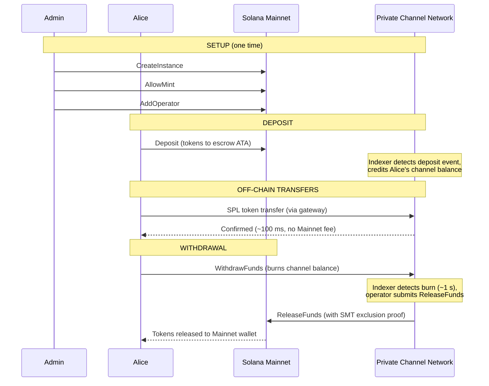
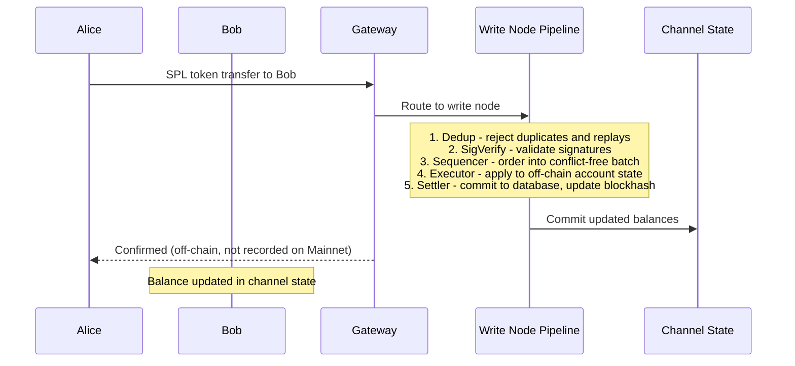
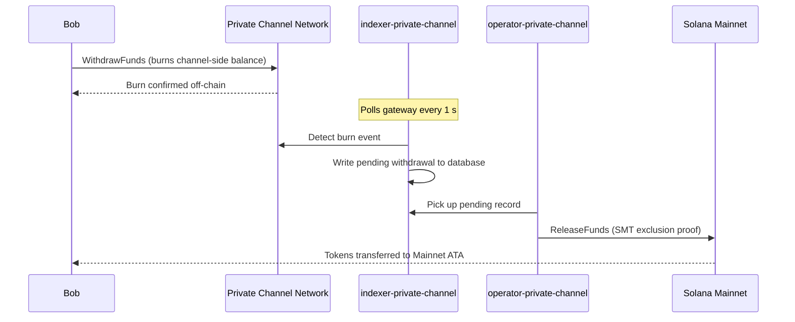

## Що таке приватний канал?

Приватний канал — це позамережева платіжна система, прив'язана до Solana. Користувачі вносять SPL-токени до смарт-контракту ескроу в мережі, після чого здійснюють транзакції поза мережею через шлюз із високою швидкістю та без комісії за кожен переказ. Розрахунок із Solana Mainnet відбувається через доказ Sparse Merkle Tree, що гарантує можливість отримання коштів у будь-який момент і унеможливлює подвійне витрачання.

На відміну від нативного платіжного потоку Solana, перекази всередині каналу не з'являються в мережі до моменту виведення коштів користувачем. Мережа каналу працює на власному конвеєрі транзакцій (dedup -> sig verify -> sequencer -> executor -> settler), який обробляє транзакції незалежно від часу блоку Solana.

## Учасники

### Адміністратор інстансу

Адміністратор розгортає `Instance` PDA через `CreateInstance` та контролює, які SPL-токени приймаються (`AllowMint` / `BlockMint`). Адміністратор надає та відкликає права операторів через `AddOperator` / `RemoveOperator`, а також може передавати права адміністратора через `SetNewAdmin`. На кожен інстанс припадає один адміністратор. Передача прав адміністратора є незворотною та відбувається в один крок: поточний адміністратор не може повернути собі роль без участі нового адміністратора.

### Оператори

Оператори призначаються адміністратором. Вони мають `Operator` PDA і є єдиними акаунтами, яким дозволено викликати `ReleaseFunds` (для розрахунку виведень до Mainnet) та `ResetSmtRoot` (для ротації Sparse Merkle Tree). Оператори обходять усі перевірки прав власності у шлюзі та мають доступ до всіх методів JSON-RPC, зокрема `getBlock`, `getTransaction` і `simulateTransaction`. Роль JWT: `"operator"`. Оператори мають бути призначені безпосередньо в базі даних; самостійне підвищення прав не передбачено. Дивіться
[посібник з операторів](/docs/tools/private-channels/operators) для отримання деталей щодо розгортання та налаштування.

### Користувачі

Користувачі реєструються самостійно через Auth Service. Роль JWT: `"user"`. Користувачі можуть викликати `Deposit` безпосередньо в програмі Escrow Program та ініціювати виведення коштів через інструкцію `WithdrawFunds` на стороні каналу в програмі Withdraw Program. Доступ до шлюзу обмежено лише їхніми власними верифікованими гаманцями; вони не можуть викликати `getBlock`, `getTransaction` або `simulateTransaction`.

## Життєвий цикл каналу

1. **Створення інстансу** — адміністратор викликає `CreateInstance`, створюючи `Instance` PDA та налаштовуючи дозволені токени.
2. **Депозит** — користувачі вносять SPL-токени до ескроу через інструкцію `Deposit`. Токени переміщуються на associated token account інстансу.
3. **Позамережеві перекази** — користувачі надсилають перекази через шлюз. Перекази упорядковуються та виконуються в мережі каналу без взаємодії з Mainnet.
4. **Ініціювання виведення** — користувач викликає `WithdrawFunds` у програмі Withdraw Program (на стороні каналу), щоб спалити свій баланс і ініціювати виведення коштів.
5. **Розрахунок у Mainnet** — оператор надає дійсний доказ виключення SMT та викликає `ReleaseFunds` у програмі Escrow Program (Mainnet), вивільняючи токени до гаманця користувача.
6. **Ротація дерева** — коли SMT наближається до максимальної місткості (65 536 листів), оператор викликає `ResetSmtRoot` для ротації дерева та початку нового epoch.

### Переказ

### Виведення

## Коли використовувати приватні канали

Використовуйте приватні канали, якщо ваш застосунок потребує:

- **Позамережевої пропускної здатності** — обсяг ваших переказів може перевантажити TPS Solana, або вам потрібне підтвердження швидше за секунду
- **Конфіденційності** — особи контрагентів та суми переказів не повинні з'являтися в мережі
- **Відсутності комісії за кожен переказ** — часті перекази, де вартість SOL за транзакцію є надмірною

Використовуйте нативні SPL-перекази натомість, якщо:

- **Потрібна компонованість у мережі** (DeFi, свопи, кредитування; інші програми повинні мати можливість відстежувати переказ або виконувати дії на його основі)
- **Розрахунок за один переказ** є прийнятним і конфіденційність не є пріоритетом
- **Відсутня або технічно нездійсненна** шлюзова інфраструктура
