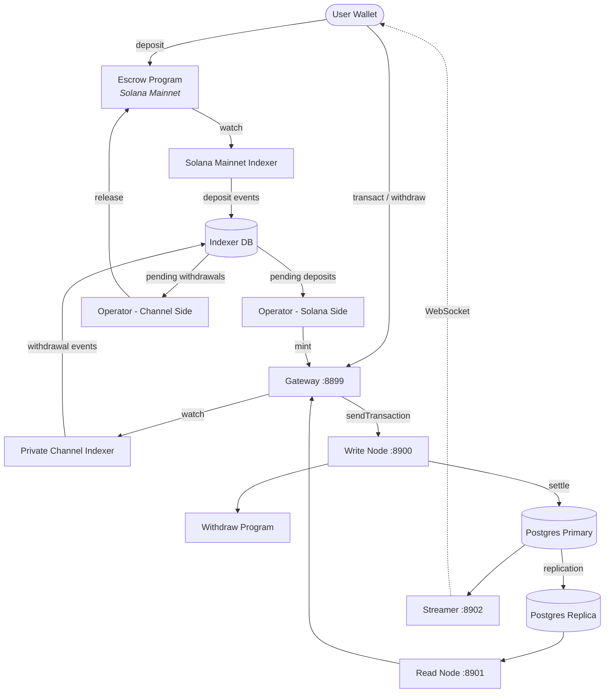

<Callout type="warning">
  Private Channels не пройшов аудит безпеки і не рекомендується для
  використання в продакшені з реальними коштами без ретельної перевірки безпеки.
</Callout>

<Callout type="info">
  **Розгортаєте екземпляр?** Перейдіть до [посібника для
  операторів](/docs/tools/private-channels/operators). **Інтегруєтесь із наявним
  екземпляром?** Перейдіть до
  [Quickstart](/docs/tools/private-channels/quickstart/installation). Ця сторінка
  є довідником з архітектури для обох аудиторій.
</Callout>

## Архітектура

Private Channels складається з чотирьох компонентів: двох on-chain програм Solana
(Escrow і Withdraw) та двох off-chain сервісів (Gateway і Auth Service).
Разом вони утворюють протокол state channel, де кошти зберігаються в Mainnet, але
трансфери розраховуються off-chain.

### Програма Escrow

Програма Escrow — це on-chain програма Solana, яка зберігає внесені SPL-токени.
Вона є якорем довіри системи: всі кошти в кінцевому підсумку зберігаються в
ескроу, доки оператор не надасть дійсний доказ виключення Sparse Merkle Tree для
їх вивільнення.

- Program ID: `9tgHa1DcnaSSUtmMsst8ovKTe1Gfxzezn27KnH9xXYeU`
- Цей ID скомпільовано в бінарний файл програми через `declare_id!()`. Off-chain
  сервіси зчитують той самий ID під час компіляції зі згенерованого клієнтського крейту, а не
  зі змінної середовища.
- Керує PDA-акаунтами `Instance`, `AllowedMint` та `Operator`
- Інструкції: `CreateInstance`, `AllowMint`, `BlockMint`, `AddOperator`,
  `RemoveOperator`, `SetNewAdmin`, `Deposit`, `ReleaseFunds`, `ResetSmtRoot`

### Програма Withdraw

Програма Withdraw працює в мережі приватного каналу, а не в Solana Mainnet.
Користувачі викликають `WithdrawFunds`, щоб спалити баланс токенів на стороні каналу. Це спалення
не вивільняє кошти автоматично; воно сигналізує оператору про те, що
знімання коштів очікує на обробку. Після цього оператор викликає `ReleaseFunds` у програмі Escrow
з дійсним SMT-доказом для завершення розрахунку.

- Program ID: `J231K9UEpS4y4KAPwGc4gsMNCjKFRMYcQBcjVW7vBhVi`
- Цей ID скомпільовано в бінарний файл програми. Off-chain сервіси зчитують той самий
  ID під час компіляції зі згенерованого клієнтського крейту, а не зі змінної
  середовища.

### Gateway

Gateway — це сумісний із Solana JSON-RPC проксі-сервер, який маршрутизує клієнтські запити до
вузла запису мережі каналу (для надсилання транзакцій) і вузла читання (для
запитів). Налаштовується через змінні середовища: `GATEWAY_PORT`,
`GATEWAY_WRITE_URL`, `GATEWAY_READ_URL`.

Ендпоінти перевірки стану (без автентифікації):

- `GET /health` — перевірка живості; повертає `200 {"status":"ok"}`
- `GET /ready` — глибока перевірка готовності, зондує вузли запису та читання; повертає
  `200 {"status":"ready"}` або `503 {"status":"degraded"}`

#### Маршрутизація та доступ до методів RPC

Gateway маршрутизує `sendTransaction` до вузла запису, а всі інші методи —
до вузла читання. Запити розміром понад 64 КБ відхиляються з HTTP 413. Коли
автентифікацію увімкнено, доступ до методів контролюється JWT-роллю. Дивіться
**[Автентифікація та ролі](/docs/tools/private-channels/concepts/auth)** для
повної матриці методів.

### Auth Service

Auth Service — це необов'язковий компонент, який видає HS256 JWT (термін дії 24 години)
для контролю доступу до gateway. Він активується, коли встановлено змінну середовища `JWT_SECRET`.
Без неї gateway приймає всі підключення.

JWT-claims: `sub` (UUID користувача), `role` (`"user"` або `"operator"`), `iss`
(`"private-channel-auth"`), `aud` (`"private-channel-gateway"`), `exp` (Unix-
мітка часу). `iss` та `aud` перевіряються конфігурацією JWT gateway,
а не десеріалізуються в структуру claims додатка: лише `sub`, `role` та
`exp` доступні коду прикладного рівня.

Ролі:

- `user` — доступ обмежено власними верифікованими гаманцями; не може викликати `getBlock`,
  `getTransaction` або `simulateTransaction`
- `operator` — обходить усі перевірки власності; повний доступ до методів RPC; має бути
  підготовлено в базі даних (самостійне підвищення привілеїв неможливе)

### Streamer

Streamer — це WebSocket-сервер, який надсилає оновлення стану каналу підключеним
клієнтам у реальному часі, усуваючи потребу в опитуванні RPC. Він опитує
PostgreSQL на наявність змін стану. Є частиною базового стеку Docker Compose, а не
devnet-стеку, який розгортає цей посібник; дивіться
[довідник з конфігурації](/docs/tools/private-channels/operators/configuration#service-port-reference).

- Порт: `8902`, налаштовується через `STREAMER_PORT`
- Підключення: `ws://localhost:8902`
- Ендпоінт перевірки стану: `GET /health` — повертає `503`, якщо будь-який внутрішній цикл опитування
  зупиняється більш ніж на 30 секунд

<Callout type="warning">
  Схема подій WebSocket ще не задокументована публічно. Зверніться до
  [`core/src/bin/streamer.rs`](https://github.com/solana-foundation/solana-private-channels/blob/main/core/src/bin/streamer.rs)
  для отримання деталей реалізації до появи офіційної документації.
</Callout>



## Конвеєр транзакцій

```text
Transaction -> [1:Dedup] -> [2:SigVerify] -> [3:Sequencer] -> [4:Executor] -> [5:Settler] -> Database
```

Транзакції, надіслані до Gateway, проходять через п'ятиетапний конвеєр перед
фіксацією їхнього стану:

1. **Dedup** — фільтрує дублікати транзакцій перед їх потраплянням у конвеєр
2. **SigVerify** — перевіряє підписи транзакцій відносно відкритого ключа підписанта
3. **Sequencer** — детерміновано впорядковує дійсні транзакції для встановлення
   канонічної історії
4. **Executor** — виконує транзакції відносно рівня акаунтів каналу
   (BOB Cache + AccountsDB), оновлюючи баланси off-chain
5. **Settler** — фіксує накопичені результати транзакцій у PostgreSQL та
   оновлює кеш Redis; генерує нові blockhash-и для наступного циклу блоків.
   Розрахунок у Mainnet (виклик `ReleaseFunds`) обробляється окремо сервісом
   `operator-private-channel`

## Ключові можливості

### Конфіденційність

Трансфери між учасниками каналу не записуються в Solana Mainnet. Лише
депозити (вхід у канал) та фінальні виведення (вихід із каналу)
відображаються on-chain. Ідентичності контрагентів та суми трансферів не видимі
стороннім спостерігачам під час роботи каналу.

### Продуктивність

Off-chain конвеєр виключає час блоку Solana з критичного шляху.
Трансфери підтверджуються, коли секвенсер обробляє їх, а не коли підтверджується блок Solana.
Це забезпечує фіналізацію за долі секунди та пропускну здатність, що перевищує нативний
TPS Solana для трансферів прикладного рівня.

### Розрахунок

Кожне виведення захищено on-chain доказом Sparse Merkle Tree. Корінь SMT
зберігається в `Instance.withdrawal_transactions_root` програми Escrow.
Коли викликається `ReleaseFunds`, програма спочатку перевіряє доказ виключення для
небаченого nonce відносно поточного on-chain кореня, а потім перевіряє окремий
доказ включення для цього nonce відносно нового кореня, наданого викликачем. Лише після
проходження обох перевірок зберігається новий корінь, що унеможливлює подвійне витрачання навіть
у разі компрометації ключа оператора.

## Модель безпеки

**Ключ адміна** — керує створенням екземплярів (`CreateInstance`) та підготовкою операторів
(`AddOperator` / `RemoveOperator`). Компрометація ключа адміна
уможливлює довільну підготовку операторів. `SetNewAdmin` безповоротно передає права адміна
в один крок; захищайте ключ адміна відповідним чином.

**Ключі операторів** — можуть викликати `ReleaseFunds` та `ResetSmtRoot`. Вони не можуть
вивільнити кошти без дійсного доказу виключення SMT відносно поточного on-chain
кореня. On-chain перевірка `verify_smt_exclusion_proof` є останньою лінією
захисту від несанкціонованих виведень: скомпрометованого ключа оператора самого по собі
недостатньо для спустошення ескроу.

**Корінь SMT** — зберігається on-chain у `Instance.withdrawal_transactions_root`.
Оновлюється атомарно з кожним викликом `ReleaseFunds`. Оскільки кожен доказ повинен
посилатися на небачений nonce, подвійне витрачання одного й того самого балансу каналу
неможливе навіть у разі компрометації ключа оператора.

**Ротація дерева** — `Instance.current_tree_index` відстежує epoch-и дерева. Коли
викликається `ResetSmtRoot`, він збільшує індекс дерева та інвалідує всі
nonce-и з попереднього epoch-у дерева, забезпечуючи чистий аркуш для нових циклів
розрахунку.

## Операційна безпека ключів

<Callout type="warning">
  Off-chain сервіси використовують власний словник підписантів, що не пов'язаний із
  on-chain правами адміна/оператора, описаними в моделі безпеки вище.
  `ADMIN_PRIVATE_KEY` потрібен для кожного сервісу оператора та сплачує
  комісії за транзакції; окремий, необов'язковий `OPERATOR_PRIVATE_KEY` надає
  on-chain підпис Оператора для `ReleaseFunds` і `ResetSmtRoot`, і
  використовує значення `ADMIN_PRIVATE_KEY`, якщо не встановлено. Ніколи не вносьте ключ адміна екземпляра
  протокольного рівня (використовуваний для `CreateInstance` / `AddOperator` / `SetNewAdmin`)
  в жодну зі змінних і не розкривайте його під час виконання; тримайте цей ключ в холодному
  та офлайн-сховищі.
</Callout>

`ReleaseFunds` та `ResetSmtRoot` вимагають двох on-chain підписів: платника комісії
(з `ADMIN_PRIVATE_KEY`) та повноважень PDA Оператора (з
`OPERATOR_PRIVATE_KEY`, або `ADMIN_PRIVATE_KEY`, якщо той не встановлено). Покрокове
проходження devnet у цьому посібнику з розгортання вносить згенерований keypair оператора
у `ADMIN_PRIVATE_KEY` і залишає `OPERATOR_PRIVATE_KEY` не встановленим, тому той самий keypair
виконує обидві ролі підписанта. Поводьтеся з ключем, що опиняється в `ADMIN_PRIVATE_KEY`, з
тими самими заходами контролю, що й із приватним ключем гарячого гаманця:

- Зберігайте його лише у файлі `.env` із gitignore, ніколи в `.env.devnet` чи будь-якому
  зафіксованому конфігурації
- Для продакшен-розгортань розгляньте менеджер секретів (AWS Secrets Manager,
  HashiCorp Vault) замість змінної середовища у відкритому тексті
- keypair адміна екземпляра протокольного рівня (використовуваний для виклику `AddOperator` /
  `SetNewAdmin`) слід тримати в холодному сховищі; він потрібен лише під час налаштування
  екземпляра та підготовки оператора, а не під час виконання

`SetNewAdmin` передає права адміна **безповоротно в одній транзакції**:
поточний адмін не має шляху відновлення без співпраці нового адміна. Не
викликайте цю функцію без перевірки цільової адреси.

## Наступні кроки

<Cards>
  <Card
    title="Quickstart"
    href="/docs/tools/private-channels/quickstart/installation"
  >
    Налаштуйте середовище та згенеруйте TypeScript-клієнти.
  </Card>
  <Card title="Канали" href="/docs/tools/private-channels/concepts/channels">
    Зрозумійте учасників та життєвий цикл каналу.
  </Card>
  <Card
    title="Sparse Merkle Tree"
    href="/docs/tools/private-channels/concepts/smt"
  >
    Зрозумійте, як докази виведення перевіряються on-chain.
  </Card>
  <Card
    title="Інструкції"
    href="/docs/tools/private-channels/instructions/deposit"
  >
    Повний довідник інструкцій для всіх програм.
  </Card>
</Cards>
