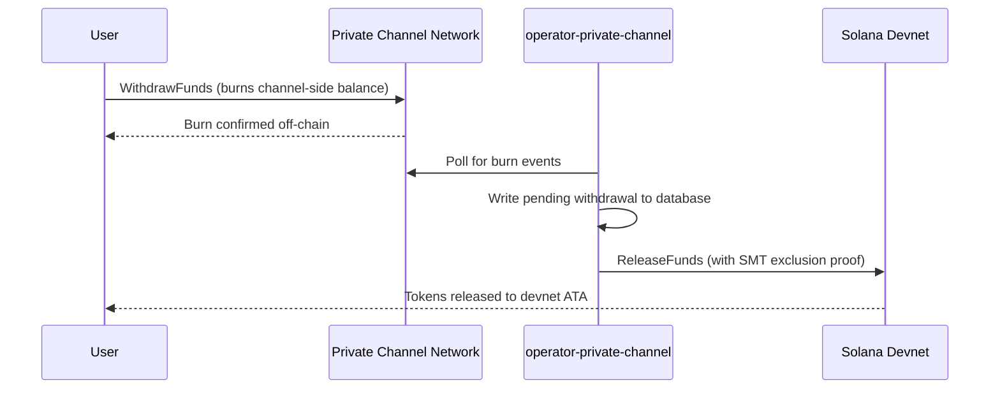

## Огляд

Виведення коштів із Private Channels — це двоетапний процес. Спочатку користувач спалює свій баланс токенів на стороні каналу, викликаючи `WithdrawFunds` у Withdraw Program. Потім оператор викликає `ReleaseFunds` у Escrow Program (devnet, у цьому покроковому керівництві) з дійсним доказом виключення Sparse Merkle Tree для вивільнення коштів. Доказ SMT гарантує, що кожен нонс виведення може бути використаний лише один раз, запобігаючи подвійним витратам.



## Крок 1: Ініціювання виведення в каналі

Викличте `WithdrawFunds` у Withdraw Program, щоб спалити свій баланс на стороні каналу.
Використовуйте варіант `Async`, який автоматично виводить PDA `tokenAccount` і є рекомендованою формою для використання у продакшені:

```typescript
import { getWithdrawFundsInstructionAsync } from "../private-channel-withdraw-program/clients/typescript/src/generated";
import {
  createSolanaRpc,
  address,
  pipe,
  createTransactionMessage,
  setTransactionMessageFeePayerSigner,
  setTransactionMessageLifetimeUsingBlockhash,
  appendTransactionMessageInstruction,
  signAndSendTransactionMessageWithSigners,
  assertIsTransactionMessageWithSingleSendingSigner,
  getBase58Decoder
} from "@solana/kit";

// Point to the gateway, not a public Solana RPC
const privateChannelRpc = createSolanaRpc("http://localhost:8899");

const withdrawIx = await getWithdrawFundsInstructionAsync({
  user: userSigner,
  mint: address(mintAddress),
  amount: 1_000_000n, // 1 USDC (6 decimals)
  destination: null // null = release to signer's devnet wallet
});

const { value: latestBlockhash } = await privateChannelRpc
  .getLatestBlockhash({ commitment: "confirmed" })
  .send();

// Sent to the Private Channels gateway (not Solana RPC directly), which
// expects the legacy transaction format - do not switch this to version 0.
const transactionMessage = pipe(
  createTransactionMessage({ version: "legacy" }),
  (m) => setTransactionMessageFeePayerSigner(userSigner, m),
  (m) => setTransactionMessageLifetimeUsingBlockhash(latestBlockhash, m),
  (m) => appendTransactionMessageInstruction(withdrawIx, m)
);

assertIsTransactionMessageWithSingleSendingSigner(transactionMessage);

const signatureBytes =
  await signAndSendTransactionMessageWithSigners(transactionMessage);
const signature = getBase58Decoder().decode(signatureBytes);
console.log("Withdrawal initiated:", signature);
```

- ID Withdraw Program: `J231K9UEpS4y4KAPwGc4gsMNCjKFRMYcQBcjVW7vBhVi`
- Надішліть цю транзакцію до шлюзу (`http://localhost:8899`), а не до публічного RPC Solana
- Якщо вказано `destination`, вивільнені кошти надходять до цього гаманця замість гаманця підписанта

## Чого очікувати

Після виклику `WithdrawFunds` більше нічого робити не потрібно. Сервіси оператора виконують розрахунок автоматично:

1. `indexer-private-channel` опитує канал кожну 1 секунду на наявність подій спалення та записує запис про очікуване виведення, коли ваше виведення виявлено
2. `operator-private-channel` опитує базу даних кожну 1 секунду на наявність очікуваних записів і надсилає `ReleaseFunds` до Escrow Program на Solana devnet із необхідним доказом виключення SMT; він опитує підтвердження devnet до 5 разів з інтервалом 400 мс перед повторною спробою

Кошти, як правило, з'являються у вашому гаманці devnet протягом кількох секунд за звичайних умов.

## Як оператор здійснює розрахунок (довідка)

Після спалення на стороні каналу підготовлений оператор повинен викликати `ReleaseFunds` у Escrow Program з дійсним доказом виключення SMT; оператор не може вивільнити кошти, не довівши, що нонс виведення не використовувався раніше. Цей крок виконується автоматично за допомогою `operator-private-channel`; вам не потрібно викликати його самостійно.

Оператор надає:

- `amount`: має відповідати спаленій сумі
- `user`: гаманець отримувача на devnet
- `new_withdrawal_root`: оновлений корінь SMT після цього виведення
- `transaction_nonce`: унікальний нонс для цього листа
- `sibling_proofs`: 512 байт (16 x 32-байтових хешів сусідніх вузлів для доказу дерева)

## Перевірка

Після підтвердження виклику оператора перевірте баланс токенів на devnet:

```bash
spl-token balance <MINT_ADDRESS> --owner <YOUR_WALLET>
```

Або через RPC:

```typescript
import { createSolanaRpc, address } from "@solana/kit";
import { findAssociatedTokenPda } from "@solana-program/token";

const TOKEN_PROGRAM_ADDRESS = address(
  "TokenkegQfeZyiNwAJbNbGKPFXCWuBvf9Ss623VQ5DA"
);

// Query devnet directly; ReleaseFunds settles here, not through the gateway
const rpc = createSolanaRpc("https://api.devnet.solana.com");

const [yourDevnetAta] = await findAssociatedTokenPda({
  mint: address(mintAddress),
  owner: address(userSigner.address),
  tokenProgram: TOKEN_PROGRAM_ADDRESS
});

const balance = await rpc.getTokenAccountBalance(yourDevnetAta).send();
console.log(balance.value.uiAmountString);
```

## Ви завершили швидкий старт

Ви пройшли повний цикл Private Channels на devnet: внесли SPL-токени в ескроу, надіслали офчейн-переказ через шлюз і вивели кошти назад до свого гаманця devnet.

<Cards>
  <Card
    title="Життєвий цикл каналу"
    href="/docs/tools/private-channels/concepts/channels"
  >
    Детально ознайомтеся з учасниками та повним потоком від депозиту до виведення.
  </Card>
  <Card
    title="Автентифікація та ролі"
    href="/docs/tools/private-channels/concepts/auth"
  >
    Додайте JWT-автентифікацію до своєї інтеграції.
  </Card>
  <Card
    title="Довідка з вивільнення коштів"
    href="/docs/tools/private-channels/instructions/release-funds"
  >
    Повна довідка з інструкції ReleaseFunds для інструментів оператора.
  </Card>
  <Card
    title="Sparse Merkle Tree"
    href="/docs/tools/private-channels/concepts/smt"
  >
    Дізнайтеся, як докази виведення запобігають подвійним витратам.
  </Card>
</Cards>
