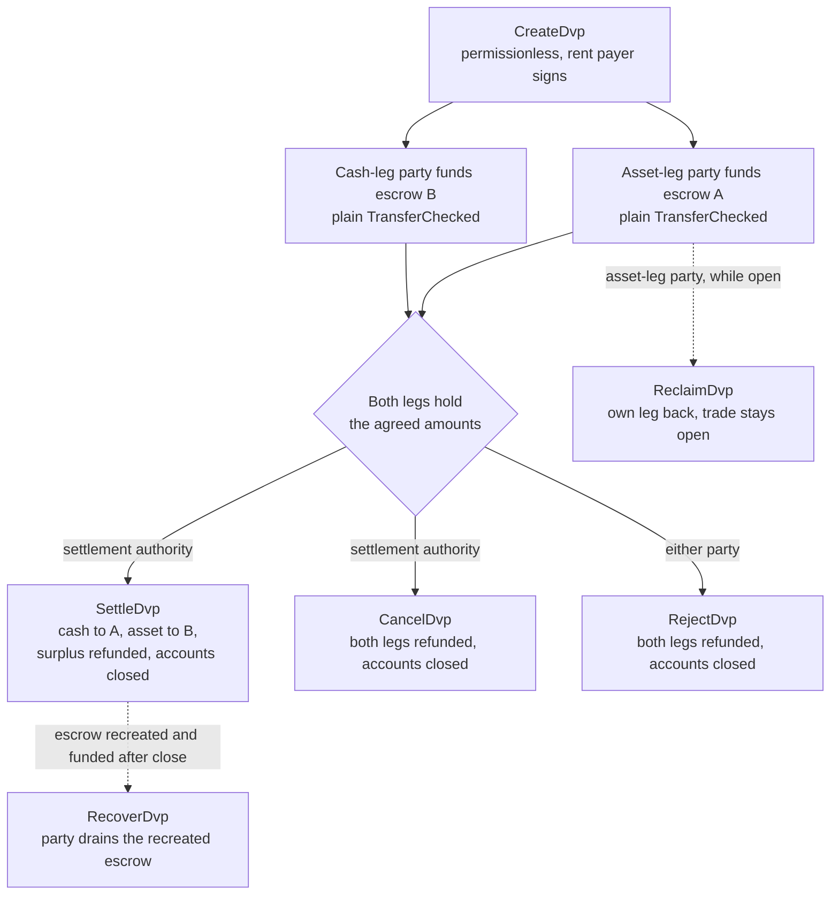
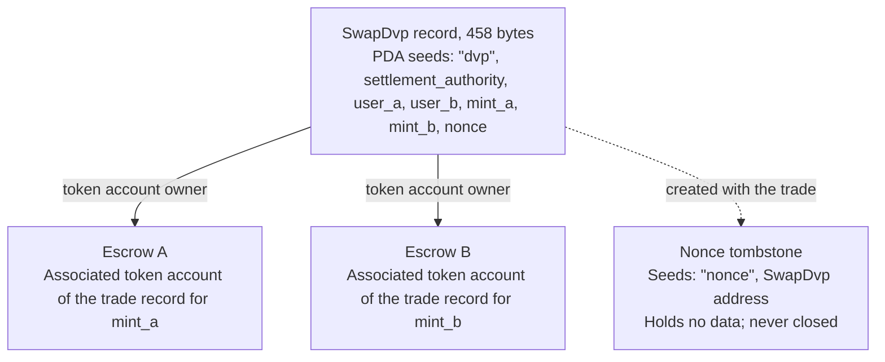

Chương trình DvP là chương trình tiêu chuẩn cho delivery versus payment trên Solana,
do Solana Foundation duy trì và được Cantina kiểm toán. Hai bên thống nhất một
thương vụ, mỗi bên gửi vế của mình vào một tài khoản escrow bằng một lệnh chuyển
token thông thường, và một bên có thẩm quyền tất toán sẽ tất toán cả hai vế trong một giao dịch, nên
hoặc cả hai cùng chuyển, hoặc không vế nào chuyển. Bên có thẩm quyền tất toán là một địa chỉ thứ ba
được nêu trong thương vụ, chẳng hạn sàn giao dịch hoặc đại lý đã sắp xếp thương vụ đó. Không bên nào
phải viết hay triển khai chương trình, và một ví hoặc đơn vị lưu ký có thể gửi lệnh chuyển
token tiêu chuẩn (`TransferChecked`) đều có thể nạp tiền cho một vế mà không cần tích hợp riêng cho DvP. Cho đến khi tất toán, mỗi bên đều có thể rút lại vế của mình hoặc hoàn tác
thương vụ.

<Callout type="warn" title="Đọc bản ghi trước khi hành động dựa trên nó">

Việc tạo bản ghi thương vụ không cần cấp phép, nên một bản ghi không phải là bằng chứng của sự
đồng thuận. Mỗi bên đọc các điều khoản đã lưu trước khi nạp tiền cho vế của mình, và bên có thẩm quyền tất toán
đọc trước khi tất toán (xem
[xác minh](#verification-before-funding-and-settlement)).

</Callout>

## Cách hoạt động

Mỗi thương vụ có một bản ghi do chương trình sở hữu và hai tài khoản escrow, mỗi vế một tài khoản. Bên
giữ vế tài sản (`user_a`) và bên giữ vế tiền mặt (`user_b`) mỗi bên nạp tiền cho một vế bằng cách
chuyển token vào tài khoản escrow của vế đó. Bên có thẩm quyền tất toán
là người ký duy nhất có thể tất toán. Việc tất toán chuyển số lượng đã thỏa thuận của mỗi vế
sang bên kia, trả lại phần dư (nếu có) cho bên sở hữu
vế đó, rồi đóng bản ghi cùng cả hai escrow. Tính nguyên tử đến từ các
[giao dịch](/docs/core/transactions) của Solana: cả hai lệnh chuyển nằm trong một giao dịch,
nên hoặc cả hai có hiệu lực hoặc không lệnh nào có hiệu lực.

Mọi khoản hoàn tiền, rút lại và hoàn phần dư đều được chuyển về associated
token account của chính mỗi bên: tài khoản của `user_a` cho `mint_a`, của `user_b` cho `mint_b`. Một
đơn vị lưu ký hoặc hệ thống ngân quỹ có thể nạp tiền cho một vế từ tài khoản của chính mình, nhưng mọi khoản
được hoàn lại sẽ về tài khoản của bên đó, không quay lại đơn vị lưu ký. Mỗi thương vụ
cũng để lại một tài khoản đánh dấu vĩnh viễn (xem [State](#state)).

## Hướng dẫn

Các trang từng bước đưa một thương vụ từ lúc tạo đến lúc tất toán, với TypeScript và
Rust cho từng lệnh.

<Cards>
  <Card title="Tạo một thương vụ" href="/docs/defi/dvp-program/create-a-trade">
    Cài đặt các client và ghi lại các điều khoản của thương vụ bằng CreateDvp
  </Card>
  <Card title="Nạp tiền cho các vế" href="/docs/defi/dvp-program/fund-the-legs">
    Xác minh các điều khoản đã lưu, rồi nạp tiền cho từng vế bằng một lệnh chuyển thông thường
  </Card>
  <Card title="Tất toán thương vụ" href="/docs/defi/dvp-program/settle-the-trade">
    Tất toán cả hai vế trong một giao dịch với tư cách bên có thẩm quyền tất toán
  </Card>
  <Card title="Hoàn tác một thương vụ" href="/docs/defi/dvp-program/unwind-a-trade">
    Rút lại một vế, hủy hoặc từ chối thương vụ, và thu hồi các khoản nạp muộn
  </Card>
</Cards>

Một [bản demo trên devnet](https://solana.com/delivery-vs-payment/demo) chạy một thương vụ từ đầu
đến cuối: tạo thương vụ, nạp tiền vào cả hai escrow bằng các lệnh chuyển token tiêu chuẩn, và
tất toán cả hai vế trong một giao dịch.

## Lựa chọn giữa chương trình và ủy quyền (delegation)

[Delivery vs Payment (DvP) sử dụng delegation](/docs/tokenization/dvp) tất toán
cùng một giao dịch trao đổi mà không cần chương trình: mỗi bên ủy quyền vị thế của mình cho một
đại lý tất toán, đại lý này chuyển cả hai vế trong một giao dịch.

- **Chương trình** không cần delegation, nên giới hạn một delegate cho mỗi token
  account không áp dụng, và bên có thẩm quyền tất toán không thể chuyển hướng số tiền nhận được.
  Mỗi thương vụ phụ thuộc vào một chương trình có thể nâng cấp và upgrade authority của nó.
- **Mô hình delegation** không phụ thuộc vào chương trình và hoạt động với các mint
  có Scaled UI Amount. Chương trình từ chối các mint đó, nghĩa là loại trừ mọi
  mint được tạo từ mẫu `tokenized-security` của Mosaic (xem
  [các ràng buộc về cấu hình mint](#mint-configuration-constraints)).

## Vai trò

Chương trình có tính đối xứng. Trong giao diện của nó, hai bên là `user_a`, người
giao `mint_a`, và `user_b`, người giao `mint_b`. README và các client được tạo sinh
gọi `mint_a` là vế tài sản và `mint_b` là vế tiền mặt, và
các trang này theo quy ước đó, nhưng không có gì trong chương trình yêu cầu vế tiền mặt
phải là công cụ tiền tệ. Hai tài sản, hay hai stablecoin, cũng được tất toán theo cách
tương tự.

| Vai trò                 | Ai                               | Ký                                              | Ghi chú                                                                                                                                                                                                     |
| -------------------- | --------------------------------- | -------------------------------------------------- | --------------------------------------------------------------------------------------------------------------------------------------------------------------------------------------------------------- |
| Bên giữ vế tài sản      | `user_a`, giao `mint_a`       | Lệnh chuyển nạp tiền của chính mình; Reclaim, Reject, Recover | Một ví keypair, hoặc ví thông minh dựa trên PDA như vault multisig. Một tài khoản multisig của SPL Token hoặc một program account không thể là một bên: Create thất bại với lỗi `PartyNotSignerCapable`                   |
| Bên giữ vế tiền mặt       | `user_b`, giao `mint_b`       | Lệnh chuyển nạp tiền của chính mình; Reclaim, Reject, Recover | Cùng yêu cầu                                                                                                                                                                                          |
| Bên có thẩm quyền tất toán | Một địa chỉ thứ ba được nêu khi tạo | Settle, Cancel                                     | Người ký duy nhất có thể tất toán. Không thể chuyển hướng số tiền nhận được, vốn được cố định khi tạo. Nhận rent của các tài khoản đã đóng khi tất toán hoặc hủy                                         |
| Bên trả rent           | Bất kỳ ai ký `CreateDvp`         | Create                                             | Chi trả rent (khoản đặt cọc SOL để giữ một tài khoản luôn mở) cho bản ghi, nonce tombstone và cả hai escrow. Không được ghi nhận là người nhận rent: rent của các tài khoản đã đóng thuộc về bên đóng thương vụ |

## Program ID

```text
dvp34bdbcEm4f4FCUjGV4mDAkDshaQR4LkK8fdcsyZq
```

| Cluster      | Chương trình                                       | Upgrade authority                              | Slot triển khai gần nhất |
| ------------ | --------------------------------------------- | ---------------------------------------------- | ------------------ |
| mainnet-beta | `dvp34bdbcEm4f4FCUjGV4mDAkDshaQR4LkK8fdcsyZq` | `DXtFpbPjcn2hxPnw79x1Pfoj35vXh5AsWBkS37YnXMVv` | 452,058,374        |
| devnet       | `dvp34bdbcEm4f4FCUjGV4mDAkDshaQR4LkK8fdcsyZq` | `5EX1zFeJWj4rGYZv432WnYw8CbaSUeTdxPx4r573UgYU` | 479,376,863        |

Chương trình có thể nâng cấp trên cả hai cluster. Các số liệu ở trên là những gì
`solana program show` báo cáo vào ngày 2 tháng 10 năm 2026; hãy chạy cùng lệnh để xem
giá trị hiện tại. Bản dựng devnet cũ hơn commit mà các trang hướng dẫn từng bước
được viết dựa trên (xem [Install](/docs/defi/dvp-program/create-a-trade#install)),
với cùng bộ lệnh và bộ lỗi.

## Vòng đời



Một thương vụ mở từ `CreateDvp` cho đến khi một trong các lệnh Settle, Cancel hoặc Reject đóng
nó. Việc nạp tiền không có lệnh riêng: một vế được coi là đã nạp khi tài khoản escrow
của nó chứa ít nhất số lượng đã thỏa thuận. Reclaim áp dụng cho từng vế và giữ
thương vụ ở trạng thái mở, nên sự cố ở một vế không buộc bên kia phải hủy
toàn bộ thương vụ.

## State

Mỗi thương vụ có một tài khoản `SwapDvp` dài 458 byte, do chương trình sở hữu. Địa chỉ của nó
được suy ra từ bên có thẩm quyền tất toán, hai bên, hai
mint và một nonce (các seed
`["dvp", settlement_authority, user_a, user_b, mint_a, mint_b, nonce]`). Các
số lượng và thời gian được lưu bên trong tài khoản và không ảnh hưởng đến địa chỉ,
vì vậy chúng phải được đọc chứ không thể suy đoán. Một tài khoản đánh dấu nhỏ,
nonce tombstone tại `["nonce", swap_dvp]`, được tạo cùng thương vụ và
không bao giờ bị đóng, nên mỗi tổ hợp gồm các bên, mint, bên có thẩm quyền và nonce chỉ có thể
dùng cho một thương vụ duy nhất.



| Trường                                  | Kiểu          | Ý nghĩa                                                                                                 |
| -------------------------------------- | ------------- | ------------------------------------------------------------------------------------------------------- |
| `bump`                                 | `u8`          | PDA bump                                                                                                |
| `user_a`, `user_b`                     | `Pubkey`      | Hai bên tham gia                                                                                         |
| `mint_a`, `mint_b`                     | `Pubkey`      | Các mint của vế tài sản và vế tiền mặt                                                                        |
| `settlement_authority`                 | `Pubkey`      | Người ký duy nhất có thể tất toán hoặc hủy                                                               |
| `token_program_a`, `token_program_b`   | `Pubkey`      | token program sở hữu mỗi mint; một thương vụ có thể kết hợp các vế SPL Token và Token-2022                    |
| `amount_a`, `amount_b`                 | `u64`         | Số lượng đã thỏa thuận của mỗi vế, theo đơn vị nhỏ nhất của mint (đơn vị cơ sở)                                 |
| `expiry_timestamp`                     | `i64`         | Sau thời điểm mạng này (đồng hồ onchain), Settle bị từ chối. Reclaim, Cancel và Reject vẫn hoạt động |
| `nonce`                                | `u64`         | Phân biệt các thương vụ có chung các seed còn lại. Chỉ dùng một lần                                             |
| `ref_string`                           | `[u8; 64]`    | Một tham chiếu client không có cấu trúc cụ thể, được đệm số 0; chương trình không bao giờ đọc nó                                     |
| `user_a_settlement_destination`        | `Pubkey`      | Nhận vế tiền mặt khi Settle; mặc định là `user_a`                                                   |
| `user_b_settlement_destination`        | `Pubkey`      | Nhận vế tài sản khi Settle; mặc định là `user_b`                                                  |
| `mint_a_authority`, `mint_b_authority` | `Pubkey`      | Các mint authority được ghi lại khi tạo; Settle thất bại nếu một trong hai đã thay đổi                           |
| `earliest_settlement_timestamp`        | `Option<i64>` | Nếu được đặt, Settle bị từ chối trước thời điểm mạng này                                                     |

Danh sách trường được lấy từ IDL của chương trình tại commit được nêu trong
[Tạo một thương vụ](/docs/defi/dvp-program/create-a-trade#install).

## Các lệnh

| Lệnh  | Người ký               | Tác dụng                                                                                                                                                              |
| ------------ | -------------------- | ------------------------------------------------------------------------------------------------------------------------------------------------------------------- |
| `CreateDvp`  | Bất kỳ payer nào            | Tạo bản ghi `SwapDvp`, nonce tombstone của nó và cả hai tài khoản escrow. Không di chuyển token                                                                        |
| `ReclaimDvp` | `user_a` hoặc `user_b` | Trả lại vế của chính người ký từ escrow. Thương vụ vẫn mở và vế đó có thể được nạp lại                                                                      |
| `SettleDvp`  | Bên có thẩm quyền tất toán | Chuyển `amount_a` đến địa chỉ nhận của `user_b` và `amount_b` đến địa chỉ nhận của `user_a`, trả phần dư (nếu có) cho bên sở hữu vế đó, đóng bản ghi và cả hai escrow |
| `CancelDvp`  | Bên có thẩm quyền tất toán | Hoàn lại toàn bộ số đang có trong escrow A cho `user_a` và escrow B cho `user_b`, đóng bản ghi và cả hai escrow                                                            |
| `RejectDvp`  | `user_a` hoặc `user_b` | Tác dụng giống Cancel, nhưng do một bên tham gia ký                                                                                                                            |
| `RecoverDvp` | `user_a` hoặc `user_b` | Sau khi thương vụ đã đóng: rút cạn một escrow được tạo lại về token account của chính người ký và đóng nó. Xử lý khoản nạp đến sau Settle, Cancel hoặc Reject  |

Mọi khoản hoàn tiền đều được chuyển về associated token account của chính mỗi bên cho mint của
vế đó, bất kể ai đã nạp tiền vào escrow.

Các tài khoản và đối số của từng lệnh nằm trong trang của bước tương ứng.

## Lỗi

| Mã | Lỗi                            | Khi nào                                                                                                   |
| ---- | -------------------------------- | ------------------------------------------------------------------------------------------------------ |
| 0    | `SignerNotParty`                 | Reclaim, Reject hoặc Recover được ký bởi một địa chỉ không phải `user_a` hay `user_b`                      |
| 1    | `DvpExpired`                     | Settle sau `expiry_timestamp`                                                                        |
| 2    | `SettlementAuthorityMismatch`    | Settle hoặc Cancel được ký bởi một địa chỉ khác với bên có thẩm quyền tất toán                              |
| 3    | `SettlementTooEarly`             | Settle trước `earliest_settlement_timestamp`                                                          |
| 4    | `LegNotFunded`                   | Settle khi một escrow chứa ít hơn số lượng đã thỏa thuận                                               |
| 5    | `ExpiryNotInFuture`              | Create với thời hạn hết hạn bằng hoặc trước thời gian mạng hiện tại                                            |
| 6    | `EarliestAfterExpiry`            | Create với thời điểm tất toán sớm nhất sau thời điểm hết hạn                                               |
| 7    | `SelfDvp`                        | Create với `user_a` bằng `user_b`                                                                 |
| 8    | `SameMint`                       | Create với `mint_a` bằng `mint_b`                                                                 |
| 9    | `ZeroAmount`                     | Create với số lượng bằng 0 ở một trong hai vế                                                                |
| 10   | `BlockedMintExtension`           | Create hoặc Settle với một mint có TransferFee, InterestBearing, ScaledUiAmount hoặc NonTransferable |
| 11   | `SettlementAuthorityIsParty`     | Create với bên có thẩm quyền tất toán trùng với một trong hai bên                                                  |
| 12   | `SettlementAuthorityExecutable`  | Create với bên có thẩm quyền tất toán là tài khoản có thể thực thi                                                         |
| 13   | `NonceAlreadyUsed`               | Create dùng lại một `(seeds, nonce)` đã có tombstone                                         |
| 14   | `ExpiryTooFarInFuture`           | Create với thời hạn hết hạn cách hiện tại hơn một năm                                                         |
| 15   | `RefStringTooLong`               | Create với tham chiếu dài hơn 64 byte                                                           |
| 16   | `DvpStillOpen`                   | Recover khi thương vụ vẫn còn mở; hãy dùng Reclaim                                                     |
| 17   | `DvpNeverCreated`                | Khôi phục bằng các seed không có tombstone                                                              |
| 18   | `EscrowPreloadedWithLamports`    | Create khi một escrow không phải native nắm giữ lamport vượt quá mức tối thiểu để được miễn rent                           |
| 19   | `SettlementDestinationIsSwapDvp` | Create với đích thanh toán trùng với bản ghi giao dịch                                         |
| 20   | `SwapDvpPreloadedWithLamports`   | Create khi địa chỉ bản ghi nắm giữ lamport vượt quá mức rent dự trữ                                   |
| 21   | `RecipientAtaMismatch`           | Một token account của người nhận hoặc token account hoàn tiền không còn thuộc về ví và mint dự kiến                  |
| 22   | `PartyNotSignerCapable`          | Create với một bên không phải là tài khoản do system sở hữu và không thể thực thi                                 |
| 23   | `MintAuthorityChanged`           | Settle khi mint authority của một leg khác với giá trị đã ghi nhận lúc tạo                         |

## Sự kiện và lập chỉ mục

Chương trình không phát ra sự kiện onchain nào. Một indexer hoặc hệ thống đối soát sẽ đọc
trạng thái tài khoản `SwapDvp` và số dư token của hai escrow, đồng thời dùng
`ref_string` để đối chiếu một giao dịch với lệnh đặt off-chain tương ứng. Vì bản ghi
bị đóng khi thanh toán, hệ thống cần các điều khoản về sau phải lưu
chúng khi đọc, hoặc dựng lại từ giao dịch đã tạo
ra giao dịch trao đổi đó.

## Token được hỗ trợ

Một giao dịch có thể ghép một leg SPL Token với một leg Token-2022; mỗi leg mang
token program riêng. Các leg Wrapped SOL được hỗ trợ.

| Extension Token-2022 trên mint của một leg                                                     | Hành vi của chương trình                                                  |
| ---------------------------------------------------------------------------------------- | ----------------------------------------------------------------- |
| TransferFee, InterestBearing, ScaledUiAmount, NonTransferable                            | Bị từ chối ở Create và Settle với lỗi `BlockedMintExtension`         |
| PermanentDelegate, Pausable, DefaultAccountState, freeze authority, MintCloseAuthority | Được chấp nhận; mỗi authority có thể tác động lên token đang ký quỹ           |
| ConfidentialTransfer                                                                     | Được chấp nhận; số lượng trên leg đó là công khai                          |
| TransferHook                                                                             | Được hỗ trợ, tối đa 32 tài khoản bổ sung cho mỗi leg                        |
| MemoTransfer trên tài khoản đích hoặc tài khoản hoàn tiền                                          | Được chấp nhận; chương trình phát memo bắt buộc trước khi chuyển |

Phí chuyển khoản sẽ khiến bên nhận nhận thiếu so với số lượng đã thỏa thuận.
Interest Bearing và Scaled UI Amount không làm thay đổi số lượng thô, nhưng lãi suất
hoặc hệ số nhân của chúng có thể thay đổi giữa lúc tạo và lúc thanh toán giao dịch, làm thay đổi
cách hiển thị các số lượng đã thỏa thuận. NonTransferable sẽ khiến cả hai leg bị kẹt.

Các authority được chấp nhận có thể di chuyển, đóng băng hoặc tạm dừng token đang ký quỹ trong
suốt vòng đời của giao dịch (xem bên dưới). Escrow không thể được cấu hình để nhận
các giao dịch chuyển bí mật, nên số lượng ký quỹ và số lượng đã thanh toán trên một leg
bí mật là công khai.

Với mint có hook, client xác định các tài khoản bổ sung của hook và nối chúng
vào Settle, Cancel, Reject, Reclaim và Recover. Giới hạn 32 cho mỗi leg
bao gồm cả chương trình hook và tài khoản xác thực của nó. Nếu hook authority
mở rộng danh sách tài khoản của hook vượt quá giới hạn đó, mọi giao dịch chuyển trên leg đó
sẽ thất bại, bao gồm Reclaim, Cancel, Reject và Recover, cho đến khi authority
hoàn tác thay đổi. Giới hạn tài khoản của giao dịch có thể bị chạm trước giới hạn theo từng leg khi
cả hai leg đều có hook.

Khi một tài khoản đích hoặc tài khoản hoàn tiền yêu cầu memo, chương trình gọi chương trình Memo
trước khi chuyển, đó là lý do mọi instruction chuyển token
ra khỏi escrow đều nhận một tài khoản `memo_program`.

### Ràng buộc cấu hình mint

**Scaled UI Amount.** Template `tokenized-security` trong
[Mosaic](https://github.com/solana-foundation/mosaic), bộ công cụ phát hành của Solana Foundation,
luôn thêm Scaled UI Amount, nên chương trình không chấp nhận một
mint được tạo từ template đó làm leg. Một mint dành cho chương trình này có thể
được tạo mà không có extension đó (xem
[Token Extensions](/docs/tokens/extensions));
[DvP dùng ủy quyền](/docs/tokenization/dvp) thanh toán thông qua quyền
ủy quyền và không áp dụng kiểm tra này.

**Mint bị đóng băng theo mặc định.** Escrow của mỗi giao dịch là một associated token account
thuộc sở hữu của một program-derived address mới cho giao dịch đó. Với mint có
Default Account State đặt là frozen, escrow được tạo ở trạng thái đóng băng, và giao dịch chuyển
tiền nạp vào nó sẽ thất bại cho đến khi được rã đông. Với
[Token ACL](/docs/tokenization/token-acl), điều đó có nghĩa là nhà phát hành hoặc transfer
agent của họ phải duyệt escrow của giao dịch trước khi nạp: bằng cách thêm địa chỉ
của bản ghi giao dịch (chủ sở hữu của escrow) vào allowlist, để bất kỳ ai cũng có thể rã đông
escrow khi cấu hình Token ACL của mint bật tính năng rã đông không cần cấp phép, hoặc bằng cách
để freeze authority rã đông trực tiếp. Một escrow bị đóng băng cũng chặn
Settle, Reclaim, Cancel, Reject và Recover trên leg đó, vì vậy freeze
authority, và với mint có hook thì là hook authority, là bên cần được tin cậy trong
suốt vòng đời giao dịch. Luồng escrow bị đóng băng được mô tả ở đây và không được
thực thi trong các đoạn mã devnet.

## Giới hạn

- Không có khớp lệnh, xác định giá hay sổ lệnh. Các bên thỏa thuận điều khoản ngoài
  sổ cái và một trong số họ ghi lại chúng.
- Không có bù trừ, và chỉ song phương: một bản ghi là một giao dịch giữa hai bên.
- Không có khớp một phần. Settle chuyển chính xác số lượng đã thỏa thuận của mỗi leg và
  trả lại phần dư (nếu có) cho bên của leg đó.
- Không có leg ngoài sổ cái. Cả hai leg đều là token account trên Solana; một leg tiền mặt
  trên hệ thống sẵn có được thanh toán riêng và đối soát sau.
- Không có kiểm tra điều kiện đủ tư cách, allowlist hay KYC. Các cơ chế kiểm soát của chính mint
  sẽ thực thi điều kiện đủ tư cách của người nắm giữ.
- Không có thanh toán tự động. Settlement authority phải ký.
- Không có sự kiện, và không có phí giao thức ngoài phí giao dịch và rent.

Chương trình loại bỏ rủi ro gốc giữa hai bên: không leg nào được di chuyển
trừ khi cả hai cùng di chuyển. Nó không loại bỏ rủi ro tín dụng của nhà phát hành hay rủi ro hoàn trả trên mỗi
token, khả năng freeze, pause hoặc permanent delegate authority của một mint
tác động lên token đang ký quỹ (xem [token được hỗ trợ](#supported-tokens)), hoặc
sự phụ thuộc vào việc settlement authority sẵn sàng để ký.

## Xác minh trước khi nạp tiền và thanh toán

`CreateDvp` không cần cấp phép: chỉ payer ký, còn các bên và
settlement authority thì không. Do đó, bất kỳ ai cũng có thể tạo một bản ghi nêu tên bất kỳ
bên nào với bất kỳ điều khoản nào. Trước khi nạp tiền, và một lần nữa trước khi thanh toán, hãy đọc
tài khoản `SwapDvp` và xác nhận:

1. Tài khoản thuộc sở hữu của chương trình DvP và có kích thước đúng 458 byte. Một tài khoản
   không thuộc sở hữu của chương trình có thể bị điền các byte giải mã giống như một
   bản ghi thật.
2. `user_a`, `user_b`, `mint_a`, `mint_b` và `settlement_authority` khớp với
   giao dịch đã thỏa thuận.
3. `amount_a`, `amount_b`, `expiry_timestamp` và
   `earliest_settlement_timestamp` khớp với các điều khoản đã thỏa thuận.
4. Cả hai đích thanh toán đều là các địa chỉ đã thỏa thuận. Một bản ghi giả mạo có thể
   chuyển hướng tiền thu được.

[Nạp tiền cho các leg](/docs/defi/dvp-program/fund-the-legs#verify-the-terms) liệt kê
các trình đọc có kiểm tra của client được tạo sinh và trình bày cách kiểm tra bằng mã.

Hãy coi một giao dịch là đã thanh toán khi giao dịch Settle đạt mức
[`finalized`](/docs/rpc#configuring-state-commitment). Đó là một mức
commitment của mạng; việc nó có đồng thời đánh dấu tính chung thẩm của thanh toán về mặt pháp lý hay không
phụ thuộc vào các thỏa thuận của các bên và các chế độ pháp lý áp dụng.

## Quản lý phiên bản

Tài khoản `SwapDvp` không có trường phiên bản. Bố cục của nó cố định ở 458 byte
(`SwapDvp::LEN`), và các trình đọc có kiểm tra sẽ từ chối tài khoản có độ dài khác.
IDL có phiên bản riêng, `0.1.0` tính đến ngày 2 tháng 10 năm 2026.

Chương trình có thể nâng cấp trên cả hai cluster (xem [Program ID](#program-id)). Một
bản ghi giao dịch chỉ tồn tại cho đến khi được thanh toán, hủy hoặc từ chối, vì vậy hãy kiểm tra
kho mã nguồn để biết một lần nâng cấp xử lý các giao dịch đang mở như thế nào, và tạo lại các client
từ IDL của bản build đã triển khai.

## Kho mã nguồn và kiểm toán

Mã nguồn, IDL, các client được tạo sinh và các bài kiểm thử nằm trong
[`solana-foundation/dvp`](https://github.com/solana-foundation/dvp) theo giấy phép
MIT. Chương trình là một chương trình Pinocchio `no_std`; các client được
tạo sinh từ IDL bằng Codama. Các báo cáo lỗ hổng được gửi qua
liên kết security advisory của kho mã nguồn, theo `SECURITY.md` của kho.

Chương trình đã được kiểm toán bởi
[Cantina](https://cantina.xyz/portfolio/fe870bb4-d96d-4902-8aec-9dfcfa2d6a79).

## Liên quan

- [Delivery vs Payment (DvP) dùng ủy quyền](/docs/tokenization/dvp): mô hình
  ủy quyền không cần chương trình
- [Token ACL](/docs/tokenization/token-acl): cách một mint có kiểm soát truy cập tương tác với các
  tài khoản escrow
