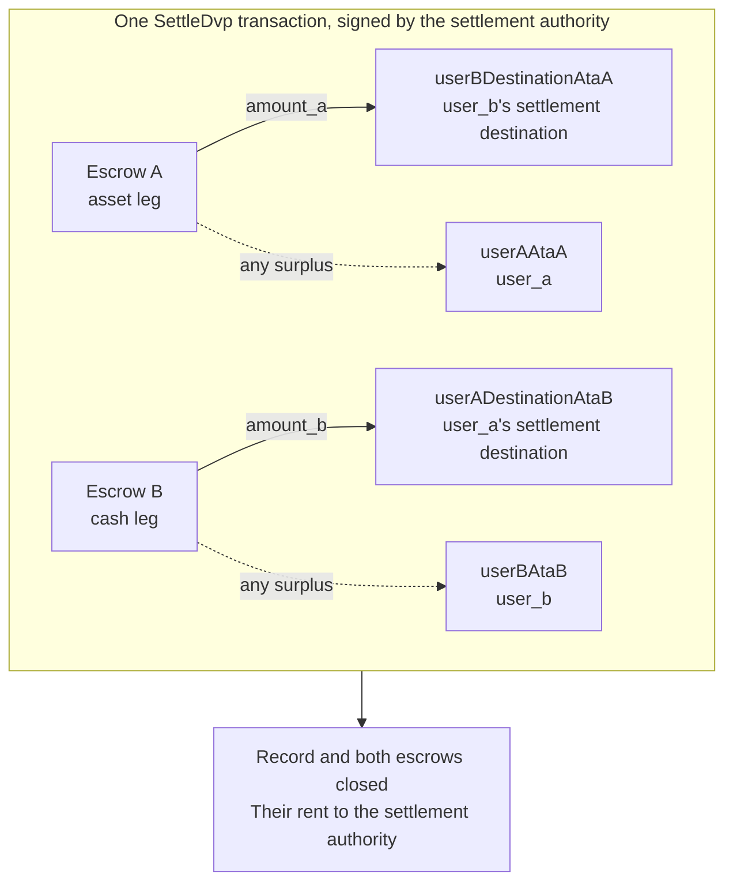

`SettleDvp` được ký bởi settlement authority được nêu trong bản ghi giao dịch. Trong
một transaction, lệnh này chuyển `amount_a` của leg tài sản đến địa chỉ đích
của bên giữ leg tiền mặt và `amount_b` của leg tiền mặt đến địa chỉ đích của bên giữ leg tài sản,
hoàn lại phần dư ở bất kỳ escrow nào cho bên tương ứng của leg đó, đồng thời đóng bản ghi
và cả hai escrow. Nếu bất kỳ khoản chuyển nào trong số đó không thể hoàn tất, instruction
sẽ thất bại và không có gì được chuyển đi.

Trang này tiếp nối từ [tạo giao dịch](/docs/defi/dvp-program/create-a-trade)
và [nạp tiền cho các leg](/docs/defi/dvp-program/fund-the-legs); client, các signer,
`trade` và các token account của các bên được giữ nguyên.

## Xác thực lại trước khi ký

Settlement authority ký transaction chuyển cả hai leg, vì vậy nó
thực hiện cùng thao tác đọc như mỗi bên trước khi ký: chủ sở hữu, kích thước, các bên,
mint, số lượng, thời hạn và cả hai địa chỉ đích (xem
[nạp tiền cho các leg](/docs/defi/dvp-program/fund-the-legs#verify-the-terms)). Bản thân
chương trình cũng kiểm tra lại khi thanh toán rằng mỗi mint vẫn thuộc về token
program đã được ghi nhận lúc tạo, không mang extension bị chặn, và có cùng
mint authority như khi giao dịch được tạo, vì vậy một mint được tạo lại với extension
bị chặn, token program khác hoặc mint authority khác sẽ không thể
thanh toán.

## Tạo các tài khoản nhận

Settle ghi vào bốn token account mà chương trình không tự tạo:

| Tài khoản                | Nhận                     | Chủ sở hữu                           |
| ---------------------- | ---------------------------- | ------------------------------- |
| `userADestinationAtaB` | Leg tiền mặt (`amount_b`)    | `user_a_settlement_destination` |
| `userBDestinationAtaA` | Leg tài sản (`amount_a`)   | `user_b_settlement_destination` |
| `userAAtaA`            | Phần dư của leg tài sản | `user_a`                        |
| `userBAtaB`            | Phần dư của leg tiền mặt  | `user_b`                        |

Các tài khoản nhận phần dư chỉ được dùng khi một escrow chứa nhiều hơn số lượng
đã thỏa thuận, nhưng bất kỳ ai nắm giữ mint đều có thể tạo ra phần dư bằng cách gửi vài đơn vị
cơ sở vào escrow. Nếu tài khoản hoàn tiền không tồn tại, toàn bộ lệnh Settle
sẽ thất bại, vì vậy hãy tạo cả bốn tài khoản theo kiểu idempotent trong cùng một transaction.

<Tabs items={["TypeScript", "Rust"]}>
  <Tab value="TypeScript">
    ```ts
    import {
      findAssociatedTokenPda,
      getCreateAssociatedTokenIdempotentInstruction,
    } from "@solana-program/token-2022";

    const destinationA = t.userASettlementDestination; // defaults to userA
    const destinationB = t.userBSettlementDestination; // defaults to userB

    const [userADestinationAtaB] = await findAssociatedTokenPda({
      mint: mintB,
      owner: destinationA,
      tokenProgram: tokenProgramB,
    });
    const [userBDestinationAtaA] = await findAssociatedTokenPda({
      mint: mintA,
      owner: destinationB,
      tokenProgram: tokenProgramA,
    });
    // userAAtaA and userBAtaB are from fund the legs.

    const createRecipientAccounts = [
      { ata: userADestinationAtaB, owner: destinationA, mint: mintB, tokenProgram: tokenProgramB },
      { ata: userBDestinationAtaA, owner: destinationB, mint: mintA, tokenProgram: tokenProgramA },
      { ata: userAAtaA, owner: userA, mint: mintA, tokenProgram: tokenProgramA },
      { ata: userBAtaB, owner: userB, mint: mintB, tokenProgram: tokenProgramB },
    ].map(({ ata, owner, mint, tokenProgram }) =>
      getCreateAssociatedTokenIdempotentInstruction({
        payer: authoritySigner,
        ata,
        owner,
        mint,
        tokenProgram,
      }),
    );
    ```

  </Tab>

  <Tab value="Rust">
    ```rust
    use spl_associated_token_account_client::address::get_associated_token_address_with_program_id;
    use spl_associated_token_account_client::instruction::create_associated_token_account_idempotent;

    let authority: Pubkey = pubkey!("SETTLEMENT_AUTHORITY_ADDRESS_HERE");
    let destination_a = trade.user_a_settlement_destination; // defaults to user_a
    let destination_b = trade.user_b_settlement_destination; // defaults to user_b

    let user_a_destination_ata_b =
        get_associated_token_address_with_program_id(&destination_a, &mint_b, &token_program_b);
    let user_b_destination_ata_a =
        get_associated_token_address_with_program_id(&destination_b, &mint_a, &token_program_a);
    let user_a_ata_a = get_associated_token_address_with_program_id(&user_a, &mint_a, &token_program_a);
    let user_b_ata_b = get_associated_token_address_with_program_id(&user_b, &mint_b, &token_program_b);

    let create_recipient_accounts = [
        create_associated_token_account_idempotent(&authority, &destination_a, &mint_b, &token_program_b),
        create_associated_token_account_idempotent(&authority, &destination_b, &mint_a, &token_program_a),
        create_associated_token_account_idempotent(&authority, &user_a, &mint_a, &token_program_a),
        create_associated_token_account_idempotent(&authority, &user_b, &mint_b, &token_program_b),
    ];
    ```

  </Tab>
</Tabs>

## Settle

`legAExtrasCount` cho chương trình biết có bao nhiêu account được thêm vào sau
danh sách cố định thuộc về transfer hook của khoản chuyển leg tài sản; phần còn lại thuộc về
leg tiền mặt. Với các mint không có transfer hook, hãy truyền giá trị không và không thêm gì. Program account
của chương trình Memo là bắt buộc đối với instruction và chỉ được dùng cho các địa chỉ đích
yêu cầu memo.

<Tabs items={["TypeScript", "Rust"]}>
  <Tab value="TypeScript">
    ```ts
    import { MEMO_PROGRAM_ADDRESS } from "@solana-program/memo";
    import { getSettleDvpInstruction } from "./dvp";

    const settleInstruction = getSettleDvpInstruction({
      settlementAuthority: authoritySigner,
      swapDvp,
      mintA,
      mintB,
      dvpAtaA: escrowA,
      dvpAtaB: escrowB,
      userADestinationAtaB,
      userBDestinationAtaA,
      userAAtaA,
      userBAtaB,
      tokenProgramA,
      tokenProgramB,
      memoProgram: MEMO_PROGRAM_ADDRESS,
      legAExtrasCount: 0,
    });

    const { context: settleContext } = await client.sendTransaction([
      ...createRecipientAccounts,
      settleInstruction,
    ]);
    const settleSignature = settleContext.signature;
    console.log("Submitted:", settleSignature);

    // sendTransaction returns at the client's commitment (confirmed by default).
    // Wait for finalized before recording the trade as settled.
    let finalized = false;
    for (let attempt = 0; attempt < 30 && !finalized; attempt++) {
      const {
        value: [status],
      } = await client.rpc.getSignatureStatuses([settleSignature]).send();
      if (status?.err) {
        throw new Error("Settle transaction failed");
      }
      finalized = status?.confirmationStatus === "finalized";
      if (!finalized) {
        await new Promise((resolve) => setTimeout(resolve, 2_000));
      }
    }
    if (!finalized) {
      // A closed record means it settled; an open one is safe to settle again.
      throw new Error("Settle not finalized after 60s; read the trade record");
    }
    console.log("Settled:", settleSignature);
    ```

  </Tab>

  <Tab value="Rust">
    ```rust
    use dvp_swap_program_client::instructions::SettleDvpBuilder;

    const MEMO_PROGRAM_ID: Pubkey = pubkey!("MemoSq4gqABAXKb96qnH8TysNcWxMyWCqXgDLGmfcHr");

    let settle_ix = SettleDvpBuilder::new()
        .settlement_authority(authority)
        .swap_dvp(swap_dvp)
        .mint_a(mint_a)
        .mint_b(mint_b)
        .dvp_ata_a(escrow_a)
        .dvp_ata_b(escrow_b)
        .user_a_destination_ata_b(user_a_destination_ata_b)
        .user_b_destination_ata_a(user_b_destination_ata_a)
        .user_a_ata_a(user_a_ata_a)
        .user_b_ata_b(user_b_ata_b)
        .token_program_a(token_program_a)
        .token_program_b(token_program_b)
        .memo_program(MEMO_PROGRAM_ID)
        .leg_a_extras_count(0)
        .instruction();
    ```

  </Tab>
</Tabs>



### Transfer hook

IDL được tạo ra chỉ liệt kê các account cố định, vì vậy các builder được tạo
không biết về các account của hook. Hãy resolve các extra account meta của từng hook mint theo
cùng cách như khi chuyển trực tiếp token đó, rồi thêm chúng vào
instruction: các account của leg tài sản trước, sau đó đến leg tiền mặt, với
`legAExtrasCount` được đặt bằng số lượng trong nhóm đầu tiên. Trong TypeScript, hãy spread
các meta đã resolve vào mảng `accounts` của instruction; trong Rust, hãy dùng
`add_remaining_accounts` trên builder. Giới hạn là 32 account cho mỗi leg,
bao gồm cả hook program và validation account; giới hạn account của transaction
có thể bị chạm trước khi cả hai leg đều có hook. Chương trình loại bỏ cờ signer
khỏi mọi account được chuyển tiếp, vì vậy một hook không thể lấy được chữ ký của
settlement authority qua đường này.

## Ghi nhận kết quả

Hãy coi giao dịch là đã thanh toán khi transaction Settle đạt trạng thái `finalized`. Bản
ghi và cả hai escrow không còn tồn tại sau khi thanh toán, vì vậy hệ thống cần
các điều khoản về sau phải lưu chúng từ lần đọc trước khi thanh toán hoặc từ transaction
tạo giao dịch. Khoản rent của các account đã đóng được chuyển cho
settlement authority.

## Lỗi Settle

`LegNotFunded` nghĩa là một escrow chứa ít hơn số lượng đã thỏa thuận; `DvpExpired`
và `SettlementTooEarly` nghĩa là đã bỏ lỡ khung thời gian; `MintAuthorityChanged`
và `BlockedMintExtension` nghĩa là một mint đã thay đổi sau khi tạo;
`RecipientAtaMismatch` nghĩa là một token account đích hoặc hoàn tiền bị thiếu hoặc
không còn thuộc về chủ sở hữu và mint dự kiến, thường là do bước
tạo tài khoản ở trên đã bị bỏ qua. Trong mọi trường hợp, không có gì được chuyển đi, và
các bên có thể hoàn tác, tùy thuộc vào các authority của mint (xem
[hoàn tác giao dịch](/docs/defi/dvp-program/unwind-a-trade)).

## Các bước tiếp theo

- [Hoàn tác giao dịch](/docs/defi/dvp-program/unwind-a-trade): thu hồi các leg
  đã nạp tiền khi giao dịch không được thanh toán
