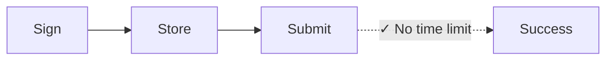
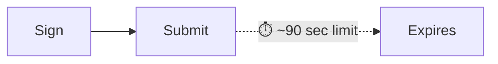

Mỗi giao dịch Solana bao gồm một blockhash gần đây—một tham chiếu đến trạng thái
mạng gần đây chứng minh giao dịch được tạo "bây giờ". Mạng từ chối bất kỳ giao
dịch nào có blockhash cũ hơn ~150 khối (~60-90 giây), ngăn chặn các cuộc tấn
công phát lại và gửi lỗi thời. Điều này hoạt động hoàn hảo cho thanh toán thời
gian thực. Nhưng nó phá vỡ các quy trình cần khoảng cách giữa ký và gửi, chẳng
hạn như:

| Tình huống               | Tại sao giao dịch tiêu chuẩn thất bại                                   |
| ------------------------ | ----------------------------------------------------------------------- |
| **Vận hành kho bạc**     | CFO ở Tokyo ký, Controller ở NYC phê duyệt—90 giây là không đủ          |
| **Quy trình tuân thủ**   | Giao dịch cần xem xét pháp lý/tuân thủ trước khi thực thi               |
| **Ký lưu trữ lạnh**      | Máy cách ly không khí yêu cầu chuyển giao thủ công các giao dịch đã ký  |
| **Chuẩn bị hàng loạt**   | Chuẩn bị bảng lương hoặc giải ngân trong giờ làm việc, thực thi qua đêm |
| **Phối hợp đa chữ ký**   | Nhiều người phê duyệt trên các múi giờ khác nhau                        |
| **Thanh toán theo lịch** | Lên lịch thanh toán để thực thi vào ngày tương lai                      |

Trong tài chính truyền thống, một tấm séc đã ký không hết hạn trong 90 giây. Một
số hoạt động blockchain cũng không nên như vậy. **Durable nonces** giải quyết
vấn đề này bằng cách thay thế blockhash gần đây bằng một giá trị được lưu trữ,
bền vững chỉ tiến lên khi bạn sử dụng nó—mang lại cho bạn các giao dịch vẫn hợp
lệ cho đến khi bạn sẵn sàng gửi.

## Cách hoạt động

Thay vì sử dụng blockhash gần đây (có hiệu lực ~150 block), bạn sử dụng **tài
khoản nonce**, một tài khoản đặc biệt lưu trữ giá trị _duy nhất_ có thể được sử
dụng thay cho blockhash. Mỗi giao dịch sử dụng nonce này phải "nâng cấp" nó như
là lệnh đầu tiên. Mỗi giá trị nonce chỉ có thể được sử dụng cho một giao dịch.





<Callout type="info">
  Tài khoản nonce tốn ~0.0015 SOL để miễn phí lưu trữ. Một tài khoản nonce = một
  giao dịch đang chờ xử lý tại một thời điểm. Đối với quy trình song song, hãy
  tạo nhiều tài khoản nonce.
</Callout>

### Tạo tài khoản nonce

Việc tạo tài khoản nonce yêu cầu hai lệnh trong một giao dịch duy nhất:

1. **Tạo tài khoản** sử dụng `getCreateAccountInstruction` từ System Program
2. **Khởi tạo nó như một nonce** sử dụng `getInitializeNonceAccountInstruction`

<ScrollyCoding>

## !!steps Tạo keypair

Tạo một keypair mới để sử dụng làm địa chỉ tài khoản nonce và tính toán không
gian cần thiết cũng như phí lưu trữ.

<CodePlaceholder title="Create Nonce Account" />

```ts !! title="Create Nonce Account"
const nonceKeypair = await generateKeyPairSigner();
const nonceSpace = BigInt(getNonceSize());
const nonceRent = await rpc
  .getMinimumBalanceForRentExemption(nonceSpace)
  .send();
```

## !!steps Tạo lệnh tạo tài khoản

Tạo tài khoản thuộc sở hữu của System Program với đủ lamport để miễn phí lưu
trữ.

<CodePlaceholder title="Create Nonce Account" />

```ts !! title="Create Nonce Account"
const nonceKeypair = await generateKeyPairSigner();
const nonceSpace = BigInt(getNonceSize());
const nonceRent = await rpc
  .getMinimumBalanceForRentExemption(nonceSpace)
  .send();

// !focus(1:7)
const createNonceAccountIx = getCreateAccountInstruction({
  payer: sender,
  newAccount: nonceKeypair,
  lamports: nonceRent,
  space: nonceSpace,
  programAddress: SYSTEM_PROGRAM_ADDRESS
});
```

## !!steps Khởi tạo lệnh nonce

Khởi tạo tài khoản như một tài khoản nonce, thiết lập quyền quản lý có thể nâng
cấp nó.

<CodePlaceholder title="Create Nonce Account" />

```ts !! title="Create Nonce Account"
const nonceKeypair = await generateKeyPairSigner();
const nonceSpace = BigInt(getNonceSize());
const nonceRent = await rpc
  .getMinimumBalanceForRentExemption(nonceSpace)
  .send();

const createNonceAccountIx = getCreateAccountInstruction({
  payer: sender,
  newAccount: nonceKeypair,
  lamports: nonceRent,
  space: nonceSpace,
  programAddress: SYSTEM_PROGRAM_ADDRESS
});

// !focus(1:4)
const initNonceIx = getInitializeNonceAccountInstruction({
  nonceAccount: nonceKeypair.address,
  nonceAuthority: sender.address
});
```

## !!steps Xây dựng giao dịch

Xây dựng một giao dịch với cả hai lệnh.

<CodePlaceholder title="Create Nonce Account" />

```ts !! title="Create Nonce Account"
const nonceKeypair = await generateKeyPairSigner();
const nonceSpace = BigInt(getNonceSize());
const nonceRent = await rpc
  .getMinimumBalanceForRentExemption(nonceSpace)
  .send();

const createNonceAccountIx = getCreateAccountInstruction({
  payer: sender,
  newAccount: nonceKeypair,
  lamports: nonceRent,
  space: nonceSpace,
  programAddress: SYSTEM_PROGRAM_ADDRESS
});

const initNonceIx = getInitializeNonceAccountInstruction({
  nonceAccount: nonceKeypair.address,
  nonceAuthority: sender.address
});

// !focus(1:7)
const { value: blockhash } = await rpc.getLatestBlockhash().send();
const createNonceTx = pipe(
  createTransactionMessage({ version: 0 }),
  (tx) => setTransactionMessageFeePayerSigner(sender, tx),
  (tx) => setTransactionMessageLifetimeUsingBlockhash(blockhash, tx),
  (tx) =>
    appendTransactionMessageInstructions(
      [createNonceAccountIx, initNonceIx],
      tx
    )
);
```

## !!steps Ký và gửi

Ký và gửi giao dịch để tạo và khởi tạo tài khoản nonce.

<CodePlaceholder title="Tạo tài khoản nonce" />

```ts !! title="Create Nonce Account"
const nonceKeypair = await generateKeyPairSigner();
const nonceSpace = BigInt(getNonceSize());
const nonceRent = await rpc
  .getMinimumBalanceForRentExemption(nonceSpace)
  .send();

const createNonceAccountIx = getCreateAccountInstruction({
  payer: sender,
  newAccount: nonceKeypair,
  lamports: nonceRent,
  space: nonceSpace,
  programAddress: SYSTEM_PROGRAM_ADDRESS
});

const initNonceIx = getInitializeNonceAccountInstruction({
  nonceAccount: nonceKeypair.address,
  nonceAuthority: sender.address
});

const { value: blockhash } = await rpc.getLatestBlockhash().send();
const createNonceTx = pipe(
  createTransactionMessage({ version: 0 }),
  (tx) => setTransactionMessageFeePayerSigner(sender, tx),
  (tx) => setTransactionMessageLifetimeUsingBlockhash(blockhash, tx),
  (tx) =>
    appendTransactionMessageInstructions(
      [createNonceAccountIx, initNonceIx],
      tx
    )
);

// !focus(1:6)
const signedCreateNonceTx =
  await signTransactionMessageWithSigners(createNonceTx);

await sendAndConfirmTransactionFactory({ rpc, rpcSubscriptions })(
  signedCreateNonceTx,
  { commitment: "confirmed" }
);
```

</ScrollyCoding>

### Xây dựng giao dịch hoãn lại

Thay vì blockhash gần đây, hãy sử dụng `blockhash` của tài khoản nonce làm thời
gian sống của giao dịch.

<ScrollyCoding>

## !!steps Lấy nonce

Lấy dữ liệu từ tài khoản nonce. Sử dụng `blockhash` từ tài khoản nonce làm thời
gian sống của giao dịch.

```sh title="Example Nonce Account Data"
{
  version: 1,
  state: 1,
  authority: 'HgjaL8artMtmntaQDVM2UBk3gppsYYERS4PkUhiaLZD1',
  # !mark
  blockhash: '5U7seXqfgZx1uh5DFhdH1vyBhr7XGRrKxBAnJJTbbUa',
  lamportsPerSignature: 5000n
}
```

<CodePlaceholder title="Xây dựng giao dịch hoãn lại" />

```ts !! title="Build Deferred Transaction"
// !focus(1:1)
const { data: nonceData } = await fetchNonce(rpc, nonceKeypair.address);
```

## !!steps Tạo chỉ thị chuyển khoản

Tạo chỉ thị cho khoản thanh toán của bạn. Ví dụ này cho thấy việc chuyển token.

<CodePlaceholder title="Xây dựng giao dịch hoãn lại" />

```ts !! title="Build Deferred Transaction"
const { data: nonceData } = await fetchNonce(rpc, nonceKeypair.address);

// !focus(1:6)
const transferInstruction = getTransferInstruction({
  source: senderAta,
  destination: recipientAta,
  authority: sender.address,
  amount: 250_000n
});
```

## !!steps Xây dựng giao dịch với durable nonce

Sử dụng `setTransactionMessageLifetimeUsingDurableNonce` để đặt nonce làm
blockhash và tự động thêm chỉ thị advance nonce vào đầu.

<CodePlaceholder title="Xây dựng giao dịch hoãn lại" />

```ts !! title="Build Deferred Transaction"
const { data: nonceData } = await fetchNonce(rpc, nonceKeypair.address);

const transferInstruction = getTransferInstruction({
  source: senderAta,
  destination: recipientAta,
  authority: sender.address,
  amount: 250_000n
});

// !focus(1:14)
const transactionMessage = pipe(
  createTransactionMessage({ version: 0 }),
  (tx) => setTransactionMessageFeePayerSigner(sender, tx),
  (tx) =>
    // !mark(1:8)
    setTransactionMessageLifetimeUsingDurableNonce(
      {
        nonce: nonceData.blockhash as Nonce,
        nonceAccountAddress: nonceKeypair.address,
        nonceAuthorityAddress: nonceData.authority
      },
      tx
    ),
  (tx) => appendTransactionMessageInstructions([transferInstruction], tx)
);
```

## !!steps Ký giao dịch

Ký giao dịch. Bây giờ nó sử dụng durable nonce thay vì blockhash tiêu chuẩn.

<CodePlaceholder title="Xây dựng giao dịch hoãn lại" />

```ts !! title="Build Deferred Transaction"
const { data: nonceData } = await fetchNonce(rpc, nonceKeypair.address);

const transferInstruction = getTransferInstruction({
  source: senderAta,
  destination: recipientAta,
  authority: sender.address,
  amount: 250_000n
});

const transactionMessage = pipe(
  createTransactionMessage({ version: 0 }),
  (tx) => setTransactionMessageFeePayerSigner(sender, tx),
  (tx) =>
    setTransactionMessageLifetimeUsingDurableNonce(
      {
        nonce: nonceData.blockhash as Nonce,
        nonceAccountAddress: nonceKeypair.address,
        nonceAuthorityAddress: nonceData.authority
      },
      tx
    ),
  (tx) => appendTransactionMessageInstructions([transferInstruction], tx)
);

// !focus(1:2)
const signedTransaction =
  await signTransactionMessageWithSigners(transactionMessage);
```

</ScrollyCoding>
