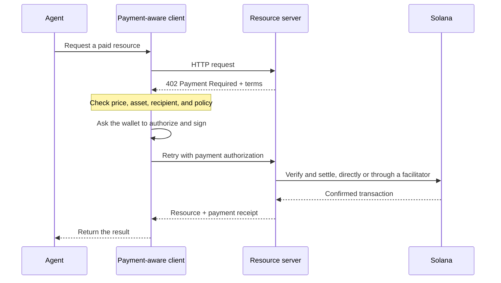

Thanh toán tác tử cho phép phần mềm tự khám phá mức giá, ủy quyền thanh toán và nhận
tài nguyên ngay trong cùng một quy trình HTTP. Một tác tử có thể trả phí cho một truy vấn dữ liệu, suy luận
mô hình hoặc lệnh gọi công cụ mà không cần tạo tài khoản thanh toán hay sao chép
khóa API trước.

<Cards>
  <Card title="MPP" href="/docs/payments/agentic-payments/mpp">
    Sử dụng xác thực HTTP cho các khoản thanh toán một lần và các phiên thanh toán tính theo mức sử dụng.
  </Card>
  <Card title="x402" href="/docs/payments/agentic-payments/x402">
    Thêm các yêu cầu thanh toán, chữ ký và quyết toán x402 V2 vào một tài nguyên
    HTTP.
  </Card>
</Cards>

## Quy trình thanh toán chung

MPP và x402 sử dụng các header và mô hình dữ liệu khác nhau, nhưng quy trình HTTP cơ bản của chúng
tương tự nhau:

## MPP và x402

Cả hai giao thức đều có thể quyết toán các khoản thanh toán bằng stablecoin trên Solana. Hãy lựa chọn dựa trên
mô hình thanh toán và khả năng tương tác mà dịch vụ của bạn cần, chứ không chỉ dựa vào mã trạng thái
`402` dùng chung.

|                         | MPP                                                               | x402                                                                     |
| ----------------------- | ----------------------------------------------------------------- | ------------------------------------------------------------------------ |
| Thách thức (Challenge)               | `WWW-Authenticate: Payment`                                       | `PAYMENT-REQUIRED`                                                       |
| Ủy quyền từ máy khách    | `Authorization: Payment`                                          | `PAYMENT-SIGNATURE`                                                      |
| Biên nhận                 | `Payment-Receipt`                                                 | `PAYMENT-RESPONSE`                                                       |
| Mô hình thanh toán trên Solana   | Các intent `charge` (thanh toán một lần) và `session` (tính theo mức sử dụng, có giới hạn)           | Các scheme như `exact` và `upto`; mức hỗ trợ khác nhau tùy theo mạng và máy khách |
| Kiến trúc quyết toán | Xác thực phía máy chủ, hoặc relay hay gateway tùy chọn                | Máy chủ tài nguyên xác minh cục bộ hoặc qua facilitator                 |
| Điểm khởi đầu phù hợp     | Các API cần ngữ nghĩa xác thực HTTP hoặc cần tính phí theo mức sử dụng lặp lại | Các tài nguyên trả phí theo từng yêu cầu và các máy khách x402 hiện có                      |

MPP là **Machine Payments Protocol**. Đừng nhầm lẫn với **Model
Context Protocol (MCP)**. MCP cung cấp các công cụ và tài nguyên cho tác tử; MPP hoặc x402
có thể yêu cầu thanh toán khi một tác tử gọi một trong những công cụ đó.

<Callout type="info">
  Một dịch vụ có thể công bố nhiều hơn một giao thức. Máy khách sẽ chọn một phương thức thanh toán
  mà nó hỗ trợ, sau đó sử dụng các header thách thức, ủy quyền và
  biên nhận tương ứng trong toàn bộ quá trình trao đổi.
</Callout>
