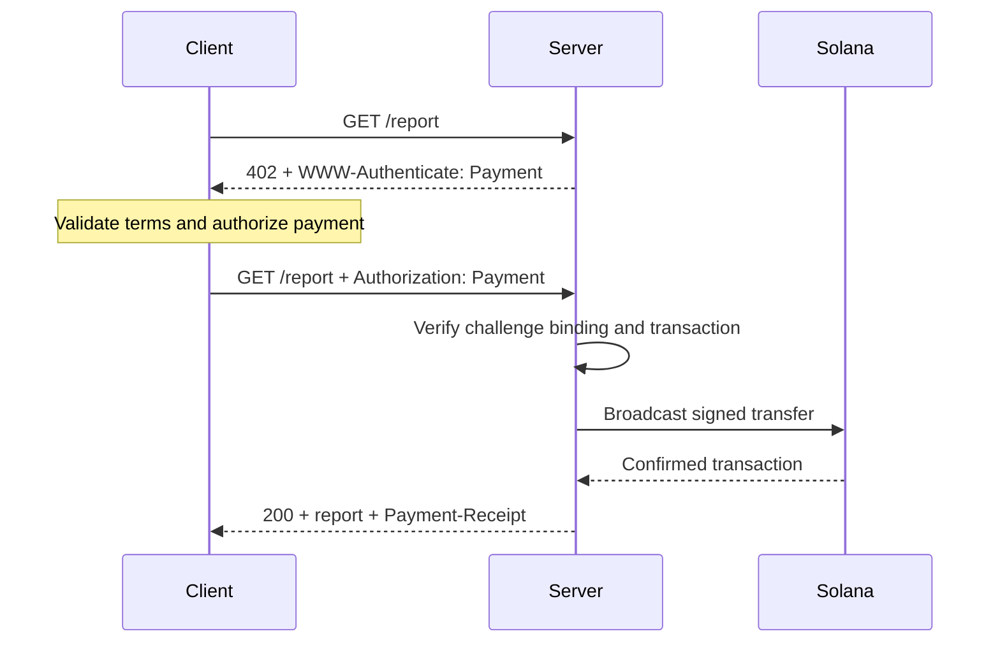
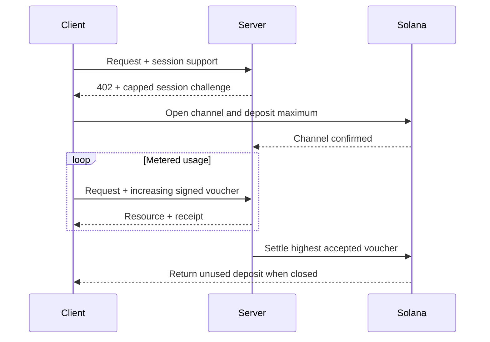

[Machine Payments Protocol (MPP)](https://mpp.dev/) áp dụng ngữ nghĩa xác thực HTTP cho thanh toán. Máy chủ sẽ gửi challenge cho một yêu cầu chưa thanh toán, máy khách trả về một payment credential, và máy chủ trả về receipt sau khi chấp nhận khoản thanh toán.

MPP tách biệt ba mối quan tâm:

- Một **intent** mô tả tương tác thương mại, chẳng hạn như một `charge` một lần hoặc một `session` tính theo mức sử dụng.
- Một **phương thức thanh toán** mô tả cách giá trị được chuyển đi. Phương thức Solana hỗ trợ SOL gốc và các token SPL cho charge.
- Một **transport** HTTP mang các challenge, credential, receipt và lỗi.

MPP được công bố dưới dạng một tập hợp Internet-Draft. Hãy coi [các đặc tả hiện hành](https://paymentauth.org/) là nguồn tham chiếu chính xác nhất và lưu ý rằng các chi tiết có thể thay đổi trong khi các bản nháp vẫn đang được hoàn thiện.

## Trao đổi HTTP

MPP sử dụng các trường xác thực HTTP tiêu chuẩn thay vì các header thanh toán riêng của giao thức:

| Thông điệp                 | Biểu diễn HTTP                                         |
| ----------------------- | ----------------------------------------------------------- |
| Payment challenge       | `402 Payment Required` với `WWW-Authenticate: Payment ...` |
| Payment credential      | Yêu cầu được gửi lại với `Authorization: Payment ...`           |
| Receipt thành công      | Phản hồi tài nguyên với `Payment-Receipt: ...`               |
| Thông tin thanh toán không hợp lệ | Nội dung Problem Details sử dụng `application/problem+json`       |



Một challenge bao gồm ID do máy chủ tạo, realm, phương thức, intent, yêu cầu thanh toán đã mã hóa và thời hạn. Credential lặp lại challenge và bổ sung bằng chứng thanh toán riêng của từng phương thức. Máy chủ phải xác minh cả hai phần; một giao dịch chuyển hợp lệ nhưng thuộc về challenge khác không được phép mở khóa tài nguyên.

## Thanh toán Solana một lần

Intent `charge` của Solana hỗ trợ hai loại credential:

- **Chế độ pull** sử dụng một giao dịch đã ký. Máy khách ký giao dịch chuyển và gửi giao dịch đó đến máy chủ. Máy chủ xác minh, có thể bổ sung chữ ký của fee payer, phát sóng giao dịch, xác nhận và trả về chữ ký giao dịch trong receipt.
- **Chế độ push** sử dụng chữ ký giao dịch. Máy khách phát sóng giao dịch trước, sau đó gửi chữ ký đã được xác nhận đến máy chủ. Máy chủ truy xuất và xác minh giao dịch trước khi trả về tài nguyên.

Chế độ pull cho phép máy chủ tài trợ phí giao dịch và thực hiện logic thử lại phía máy chủ. Chế độ push hữu ích khi ví yêu cầu máy khách tự gửi giao dịch của mình, nhưng không thể sử dụng tính năng máy chủ tài trợ phí.

Để biết các trường chuẩn tắc và quy tắc xác minh, hãy xem [đặc tả Solana charge](https://paymentauth.org/draft-solana-charge-00.html).

## Thêm MPP charge vào API Express

Solana Pay Kit cung cấp một tích hợp TypeScript hiện hành cho MPP và x402. Cài đặt nó cùng với Express:

```bash
pnpm add @solana/pay-kit @solana/kit@^6.9.0 express
pnpm add --save-dev @types/express tsx
```

Ví dụ tối giản này sử dụng sandbox Surfpool được lưu trữ sẵn và người nhận demo công khai của gói. Ví dụ chỉ dành cho phát triển cục bộ:

```ts filename=server.ts
import express from "express";
import { createPayKit, usd } from "@solana/pay-kit";

const pay = await createPayKit({
  accept: ["mpp"],
  rpcUrl: "https://402.surfnet.dev:8899"
});

const app = express();

app.get("/report", pay.express(usd("0.01")), (_req, res) => {
  res.json({ report: "Paid report" });
});

app.listen(4567, () => {
  console.log("Paid API listening on http://127.0.0.1:4567");
});
```

Chạy ví dụ và so sánh một yêu cầu chưa thanh toán với một yêu cầu có hỗ trợ thanh toán:

```bash
pnpm tsx server.ts
curl -i http://127.0.0.1:4567/report
pay --sandbox curl http://127.0.0.1:4567/report
```

Route handler chỉ chạy sau khi middleware chấp nhận khoản thanh toán.

<Callout type="warn" title="Thay thế mọi giá trị mặc định của sandbox trong môi trường production">
  Hãy cấu hình rõ ràng network, người nhận là merchant, RPC chuyên dụng, secret ràng buộc challenge ổn định, signer cho production và replay store bền vững. Tuyệt đối không chuyển các khoản thanh toán thật đến signer demo của gói.
</Callout>

## Phiên tính theo mức sử dụng

Hãy dùng `session` của Solana MPP khi máy khách sẽ thực hiện nhiều khoản thanh toán nhỏ có liên quan với nhau. Một session mở một kênh thanh toán onchain với mức ký quỹ tối đa, sau đó sử dụng các voucher đã ký tích lũy khi mức sử dụng tăng lên. Máy chủ có thể xác minh voucher offchain và quyết toán số tiền cao nhất đã được chấp nhận sau.

Cách này hữu ích cho suy luận (inference) tính theo token, tải xuống tính theo byte, dữ liệu trực tiếp và các lệnh gọi công cụ lặp lại. Nó không giống với việc gửi một khoản thanh toán onchain riêng cho từng sự kiện.



Hãy gọi session là **thanh toán theo phiên**, **kênh thanh toán** hoặc **ủy quyền lặp lại có giới hạn**. Chỉ gọi là thanh toán streaming khi dịch vụ và hợp đồng thanh toán thực sự đo lường một luồng mức sử dụng.

## Xác minh trong môi trường production

Với mọi Solana charge, máy chủ phải xác minh tối thiểu:

- Challenge là xác thực, chưa hết hạn, được ràng buộc với yêu cầu này và dành cho realm này.
- Giao dịch sử dụng đúng network, tài sản hoặc mint, người nhận, số tiền và token program như mong đợi.
- Mọi lệnh liên quan đến fee payer hoặc associated token account đều được cho phép rõ ràng và không thể làm cạn kiệt signer của máy chủ.
- Giao dịch đã thành công ở mức commitment yêu cầu.
- Chữ ký giao dịch chưa được sử dụng trước đó.
- Việc kiểm tra replay và thao tác consume phải mang tính nguyên tử trên tất cả các phiên bản máy chủ.

Với session, hãy lưu trữ bền vững trạng thái kênh, số tiền tích lũy đã được chấp nhận và settlement watermark trong một kho lưu trữ dùng chung. Hãy ghi lại tài liệu về cách máy khách thu hồi số tiền chưa sử dụng nếu máy chủ không khả dụng.

## Tài nguyên liên quan

- [Đặc tả MPP](https://paymentauth.org/)
- [Tài liệu giao thức MPP](https://mpp.dev/protocol)
- [Solana Pay Kit](https://github.com/solana-foundation/pay-kit)
- [Tổng quan về thanh toán agentic](/docs/payments/agentic-payments)
- [Sẵn sàng cho production](/docs/tools/production-readiness)
