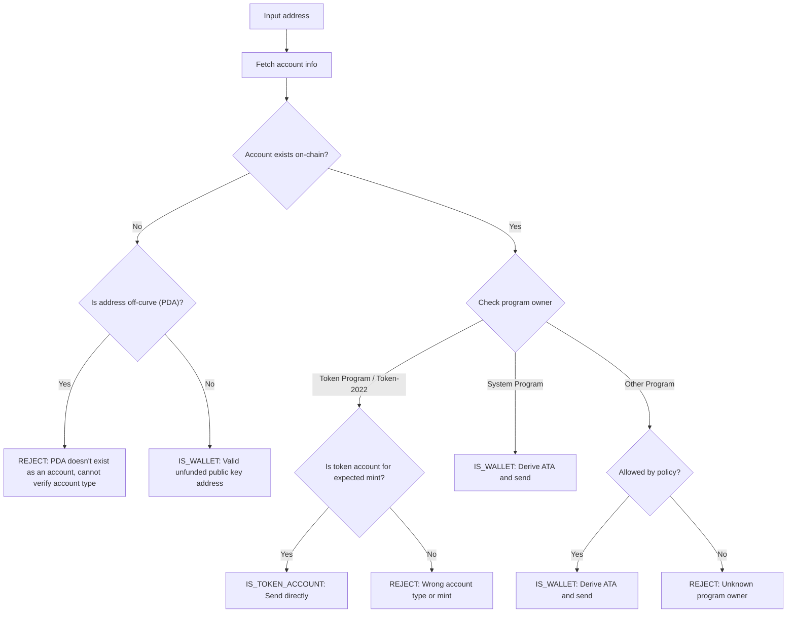

Gửi token đến sai địa chỉ có thể dẫn đến mất vĩnh viễn số tiền. Xác minh địa chỉ
đảm bảo bạn chỉ gửi token đến các địa chỉ có thể nhận và truy cập chúng một cách
đúng đắn.

<Callout>
  Xem [Cách thức hoạt động của thanh toán trên
  Solana](/docs/payments/how-payments-work) để hiểu các khái niệm thanh toán cốt
  lõi.
</Callout>

## Hiểu về địa chỉ Solana

Các tài khoản Solana có hai loại địa chỉ: on-curve và off-curve.

### Địa chỉ on-curve

Địa chỉ tiêu chuẩn là các khóa công khai từ cặp khóa Ed25519. Các địa chỉ này:

- Có khóa riêng tương ứng có thể ký giao dịch
- Được sử dụng làm địa chỉ ví

### Địa chỉ off-curve (PDA)

[Program Derived Addresses](/docs/core/pda) được tạo ra một cách xác định từ
program ID và các seed. Các địa chỉ này:

- **Không** có khóa riêng tương ứng
- Chỉ có thể được ký bởi chương trình mà địa chỉ được tạo ra từ đó

## Các loại tài khoản trong thanh toán

Sử dụng địa chỉ để lấy một [tài khoản](/docs/core/accounts) từ mạng, kiểm tra
chủ sở hữu chương trình và loại tài khoản để xác định cách xử lý địa chỉ.

<Callout>
  Việc biết một địa chỉ là on-curve hay off-curve không cho bạn biết loại tài
  khoản đó là gì, chương trình nào sở hữu nó, hoặc liệu có tồn tại tài khoản tại
  địa chỉ đó hay không. Bạn phải lấy tài khoản từ mạng để xác định các chi tiết
  này.
</Callout>

### Tài khoản System Program (ví)

Các tài khoản thuộc sở hữu của System Program là các ví tiêu chuẩn. Để gửi token
SPL đến một ví, bạn tạo ra và sử dụng
[Associated Token Account (ATA)](/docs/tokens/basics/create-token-account#whats-an-associated-token-account)
của nó.

Sau khi tạo ra địa chỉ ATA, hãy kiểm tra xem token account có tồn tại trên chuỗi
hay không. Nếu ATA không tồn tại, bạn có thể bao gồm một chỉ thị để tạo token
account của người nhận trong cùng giao dịch với việc chuyển tiền. Tuy nhiên,
điều này yêu cầu trả rent cho token account mới. Vì người nhận sở hữu ATA, số
SOL đã trả cho rent không thể được người gửi thu hồi.

<Callout type="warn">
  Nếu không có biện pháp bảo vệ, việc trợ cấp tạo ATA có thể bị lợi dụng. Một
  người dùng độc hại có thể yêu cầu chuyển khoản, tạo ATA của họ bằng chi phí
  của bạn, đóng ATA để lấy lại SOL từ rent, và lặp lại.
</Callout>

### Token accounts

[Token accounts](/docs/tokens/basics/create-token-account) thuộc sở hữu của
Token Program hoặc Token-2022 Program và lưu trữ số dư token. Nếu địa chỉ bạn
nhận được thuộc sở hữu của token program, bạn nên xác minh tài khoản đó là token
account (không phải mint account) và khớp với mint account token mong đợi trước
khi gửi.

<Callout type="info">
  Token Programs tự động xác thực rằng cả hai token accounts trong một giao dịch
  chuyển khoản đều chứa token của cùng một mint. Nếu xác thực thất bại, giao
  dịch sẽ bị từ chối và không có tiền nào bị mất.
</Callout>

### Mint accounts

[Mint accounts](/docs/tokens/basics/create-mint) theo dõi nguồn cung token và
metadata của một token cụ thể. Mint accounts cũng thuộc sở hữu của Token
Programs nhưng **không phải** là người nhận hợp lệ cho việc chuyển token. Việc
cố gắng gửi token đến địa chỉ mint sẽ dẫn đến giao dịch thất bại, nhưng không có
tiền nào bị mất.

### Các tài khoản khác

Các tài khoản thuộc sở hữu của các program khác yêu cầu quyết định chính sách.
Một số tài khoản (ví dụ: ví multisig) có thể là chủ sở hữu token account hợp lệ,
trong khi những tài khoản khác nên bị từ chối.

## Quy trình xác minh

Sơ đồ sau đây cho thấy cây quyết định tham khảo để xác thực một địa chỉ:



<Steps>
<Step>

### Lấy thông tin tài khoản

Sử dụng địa chỉ để lấy thông tin chi tiết tài khoản từ mạng.

</Step>
<Step>

### Tài khoản không tồn tại

Nếu không có tài khoản nào tồn tại tại địa chỉ này, hãy kiểm tra xem địa chỉ đó
là on-curve hay off-curve:

- **Ngoài đường cong (PDA)**: Từ chối địa chỉ một cách thận trọng để tránh gửi
  đến một ATA có thể không truy cập được. Nếu không có tài khoản hiện có, bạn
  không thể xác định từ địa chỉ đơn thuần chương trình nào đã tạo ra PDA này
  hoặc liệu địa chỉ có phải là ATA hay không. Việc tạo ATA cho địa chỉ này để
  gửi token có thể dẫn đến việc tiền bị khóa trong một token account không thể
  truy cập.

- **Trên đường cong**: Đây là địa chỉ ví hợp lệ (public key) chưa được nạp tiền.
  Tạo ATA, kiểm tra xem nó có tồn tại không và gửi token đến đó. Bạn phải đưa ra
  quyết định chính sách về việc có nên tài trợ cho việc tạo ATA hay không nếu nó
  chưa tồn tại.

</Step>
<Step>

### Tài khoản tồn tại

Nếu tài khoản tồn tại, kiểm tra chương trình nào sở hữu nó:

- **System Program**: Đây là ví tiêu chuẩn. Tạo ATA, kiểm tra xem nó có tồn tại
  không và gửi token đến đó. Bạn phải đưa ra quyết định chính sách về việc có
  nên tài trợ cho việc tạo ATA hay không nếu nó chưa tồn tại.

- **Token Program / Token-2022**: Xác minh tài khoản là token account (không
  phải mint account) và nó chứa token (mint) mà bạn định gửi. Nếu hợp lệ, gửi
  token trực tiếp đến địa chỉ này. Nếu đó là mint account hoặc token account cho
  một mint khác, từ chối địa chỉ.

- **Chương trình khác**: Điều này yêu cầu quyết định chính sách. Một số chương
  trình như ví đa chữ ký có thể là chủ sở hữu chấp nhận được của token account.
  Nếu chính sách của bạn cho phép, hãy tạo ATA và gửi. Nếu không, từ chối địa
  chỉ.

</Step>
</Steps>

## Demo

Ví dụ sau đây chỉ hiển thị logic xác thực địa chỉ. Đây là mã tham khảo cho mục
đích minh họa.

<Callout>
  Demo không hiển thị cách tạo ATA hoặc xây dựng giao dịch để gửi token. Tham
  khảo tài liệu về [token
  account](/docs/tokens/basics/create-token-account#how-to-create-an-associated-token-account)
  và [chuyển token](/docs/tokens/basics/transfer-tokens) để xem mã ví dụ.
</Callout>

Demo dưới đây sử dụng ba kết quả có thể xảy ra:

| Kết quả            | Ý nghĩa              | Hành động                               |
| ------------------ | -------------------- | --------------------------------------- |
| `IS_WALLET`        | Địa chỉ ví hợp lệ    | Tạo và gửi đến associated token account |
| `IS_TOKEN_ACCOUNT` | Token account hợp lệ | Gửi token trực tiếp đến địa chỉ này     |
| `REJECT`           | Địa chỉ không hợp lệ | Không gửi                               |

<CodeTabs flags="r">

```ts !! title="Demo"
// !collapse(1:35) collapsed

import {
  type Address,
  type Rpc,
  type GetAccountInfoApi,
  createSolanaRpc,
  fetchJsonParsedAccount,
  isOffCurveAddress,
  generateKeyPairSigner,
  getProgramDerivedAddress
} from "@solana/kit";

// =============================================================================
// Constants
// =============================================================================

const defaultRpc = createSolanaRpc("https://api.mainnet-beta.solana.com");

const SYSTEM_PROGRAM = "11111111111111111111111111111111" as Address;
const TOKEN_PROGRAM = "TokenkegQfeZyiNwAJbNbGKPFXCWuBvf9Ss623VQ5DA" as Address;
const TOKEN_2022_PROGRAM =
  "TokenzQdBNbLqP5VEhdkAS6EPFLC1PHnBqCXEpPxuEb" as Address;

// =============================================================================
// Validation Function
// =============================================================================

/**
 * Possible validation results for an input address.
 */
export type ValidationResult =
  | { type: "IS_TOKEN_ACCOUNT" }
  | { type: "IS_WALLET" }
  | { type: "REJECT"; reason: string };

/**
 * Validates an input address and classifies it as a wallet, token account, or invalid.
 *
 * @param inputAddress - The address to validate
 * @param rpc - Optional RPC client (defaults to mainnet)
 * @returns Classification result:
 *   - IS_WALLET: Valid wallet address
 *   - IS_TOKEN_ACCOUNT: Valid token account
 *   - REJECT: Invalid address for transfers
 */
export async function validateAddress(
  inputAddress: Address,
  rpc: Rpc<GetAccountInfoApi> = defaultRpc
): Promise<ValidationResult> {
  const account = await fetchJsonParsedAccount(rpc, inputAddress);
  // Log the account data for demo
  console.log("\nAccount:", account);

  // Account doesn't exist on-chain
  if (!account.exists) {
    // Off-curve = PDA that doesn't exist as an account
    // Reject conservatively to avoid sending to an address that may be inaccessible.
    if (isOffCurveAddress(inputAddress)) {
      return { type: "REJECT", reason: "PDA doesn't exist as an account" };
    }
    // On-curve = valid keypair address, treat as unfunded wallet
    return { type: "IS_WALLET" };
  }

  // Account exists, check program owner
  const owner = account.programAddress;

  // System Program = wallet
  if (owner === SYSTEM_PROGRAM) {
    return { type: "IS_WALLET" };
  }

  // Token Program or Token-2022, check if token account
  if (owner === TOKEN_PROGRAM || owner === TOKEN_2022_PROGRAM) {
    const accountType = (
      account.data as { parsedAccountMeta?: { type?: string } }
    ).parsedAccountMeta?.type;

    if (accountType === "account") {
      return { type: "IS_TOKEN_ACCOUNT" };
    }
    // Reject if not a token account (mint account)
    return {
      type: "REJECT",
      reason: "Not a token account"
    };
  }

  // Unknown program owner
  return { type: "REJECT", reason: "Unknown program owner" };
}

// =============================================================================
// Examples
// =============================================================================
// !collapse(1:1000) collapsed

// Wallets
const EXISTING_WALLET =
  "H8sMJSCQxfKiFTCfDR3DUMLPwcRbM61LGFJ8N4dK3WjS" as Address;
const NEW_WALLET = (await generateKeyPairSigner()).address;

// Token accounts
const USDC_TOKEN_ACCOUNT =
  "3emsAVdmGKERbHjmGfQ6oZ1e35dkf5iYcS6U4CPKFVaa" as Address;
const PYUSD_TOKEN_ACCOUNT =
  "47od2TPRvqJipfPVWZdyenLEngPw8hC36nDxiLyvGsEP" as Address;

// Token mints (should be rejected)
const USDC_MINT = "EPjFWdd5AufqSSqeM2qN1xzybapC8G4wEGGkZwyTDt1v" as Address;
const PYUSD_MINT = "2b1kV6DkPAnxd5ixfnxCpjxmKwqjjaYmCZfHsFu24GXo" as Address;

// PDA that doesn't exist (should be rejected)
const [NON_EXISTENT_PDA] = await getProgramDerivedAddress({
  programAddress: (await generateKeyPairSigner()).address,
  seeds: ["seed"]
});

// Program account (should be rejected)
const PROGRAM_ACCOUNT =
  "p1exdMJcjVao65QdewkaZRUnU6VPSXhus9n2GzWfh98" as Address;

async function runExample(label: string, address: Address) {
  console.log(`\n${"─".repeat(60)}`);
  console.log(`Example: ${label}`);
  console.log(`Input: ${address}`);
  console.log(`${"─".repeat(60)}`);

  const result = await validateAddress(address);
  console.log("\nResult:", result);
}

console.log("\n" + "═".repeat(60));
console.log("  IS_WALLET Examples");
console.log("═".repeat(60));

await runExample("Existing funded wallet", EXISTING_WALLET);
await runExample("New wallet (unfunded)", NEW_WALLET);

console.log("\n" + "═".repeat(60));
console.log("  IS_TOKEN_ACCOUNT Examples");
console.log("═".repeat(60));

await runExample("USDC token account (Token Program)", USDC_TOKEN_ACCOUNT);
await runExample("PYUSD token account (Token-2022)", PYUSD_TOKEN_ACCOUNT);

console.log("\n" + "═".repeat(60));
console.log("  REJECT Examples");
console.log("═".repeat(60));

await runExample("USDC mint address", USDC_MINT);
await runExample("PYUSD mint address", PYUSD_MINT);
await runExample("Non-existent PDA", NON_EXISTENT_PDA);
await runExample("Program account", PROGRAM_ACCOUNT);

console.log("\n" + "═".repeat(60));
console.log("  Done!");
console.log("═".repeat(60) + "\n");
```

</CodeTabs>
