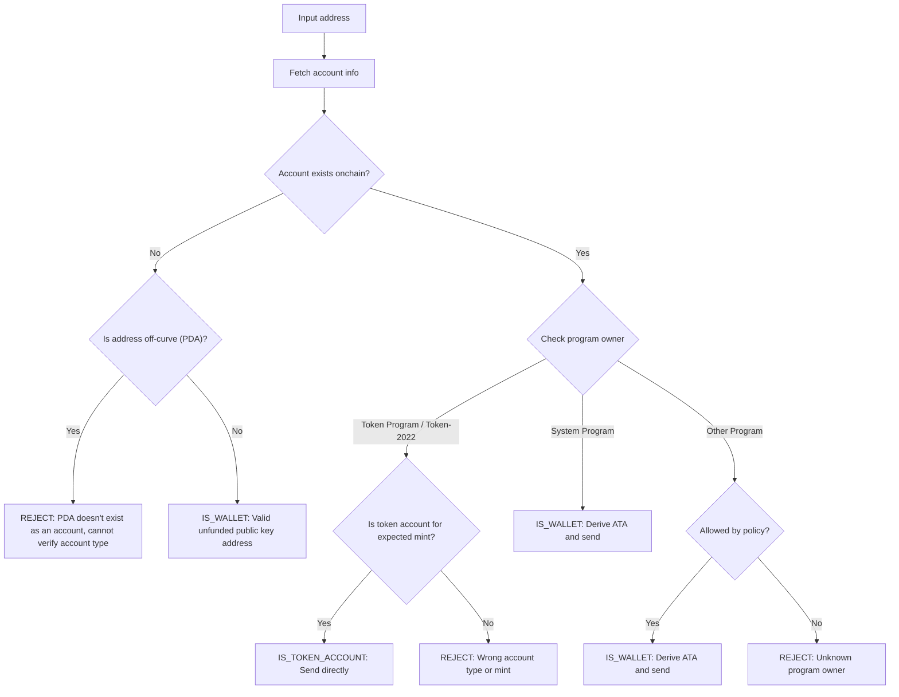

Gửi tiền đến địa chỉ sai có thể dẫn đến mất vĩnh viễn. Xác minh địa chỉ đảm bảo
bạn chỉ gửi đến các địa chỉ có thể nhận và truy cập đúng cách các khoản tiền đó.

Việc xác thực phụ thuộc vào những gì bạn gửi:

- **Token SPL** có khả năng tự bảo vệ một phần. Token Program từ chối giao dịch
  chuyển tiền khi các tài khoản không khớp với mint mong đợi, vì vậy một giao
  dịch token bị chuyển nhầm sẽ thất bại mà không mất tiền. Hầu hết trang này đề
  cập đến việc gửi token SPL.
- **SOL gốc** không có biện pháp bảo vệ như vậy. Giao dịch chuyển tiền qua
  System Program thành công vào bất kỳ tài khoản nào, vì vậy một người nhận
  không đúng sẽ khóa vĩnh viễn SOL đó. Xem [Gửi SOL gốc](#sending-native-sol).

<Callout>
  Xem [Cách Thanh Toán Hoạt Động trên Solana](/docs/payments/how-payments-work)
  để hiểu các khái niệm thanh toán cơ bản.
</Callout>

## Hiểu về Địa Chỉ Solana

Tài khoản Solana có hai loại địa chỉ: trên đường cong và ngoài đường cong.

### Địa Chỉ Trên Đường Cong

Địa chỉ tiêu chuẩn là các khóa công khai từ các keypair Ed25519. Các địa chỉ
này:

- Có khóa riêng tư tương ứng có thể ký giao dịch
- Được sử dụng làm địa chỉ ví

### Địa Chỉ Ngoài Đường Cong (PDA)

[Program Derived Address](/docs/core/pda) được suy ra một cách xác định từ ID
chương trình và các seed. Các địa chỉ này:

- **Không** có khóa riêng tư tương ứng
- Chỉ có thể được ký bởi chương trình mà địa chỉ đó được suy ra từ đó

## Các Loại Tài Khoản trong Thanh Toán

Sử dụng địa chỉ để truy xuất một [tài khoản](/docs/core/accounts) từ mạng, kiểm
tra chủ sở hữu chương trình và loại tài khoản để xác định cách xử lý địa chỉ đó.

<Callout>
  Biết một địa chỉ nằm trên đường cong hay ngoài đường cong không cho bạn biết
  loại tài khoản đó là gì, chương trình nào sở hữu nó, hay liệu tài khoản có tồn
  tại tại địa chỉ đó hay không. Bạn phải truy xuất tài khoản từ mạng để xác định
  các chi tiết này.
</Callout>

### Tài Khoản System Program (Ví)

Các tài khoản thuộc sở hữu của System Program là các ví tiêu chuẩn. Để gửi SPL
token đến một ví, bạn cần tạo và sử dụng
[Associated Token Account (ATA)](/docs/tokens/basics/create-token-account#what-is-an-associated-token-account)
của ví đó.

Sau khi tạo địa chỉ ATA, hãy kiểm tra xem token account đó có tồn tại trên chuỗi
hay không. Nếu ATA chưa tồn tại, bạn có thể đưa thêm một lệnh để tạo token
account cho người nhận trong cùng một giao dịch với lệnh chuyển. Tuy nhiên, điều
này yêu cầu phải trả rent cho token account mới. Vì người nhận sở hữu ATA, số
SOL đã trả cho rent sẽ không thể được người gửi thu hồi lại.

<Callout type="warn">
  Nếu không có các biện pháp bảo vệ, việc trợ cấp tạo ATA có thể bị lợi dụng.
  Một người dùng độc hại có thể yêu cầu chuyển tiền, để ATA của họ được tạo với
  chi phí của bạn, đóng ATA để lấy lại rent SOL, rồi lặp lại.
</Callout>

### Token Accounts

[Token accounts](/docs/tokens/basics/create-token-account) thuộc sở hữu của
Token Program hoặc Token-2022 Program và lưu trữ số dư token. Nếu địa chỉ bạn
nhận được thuộc sở hữu của một token program, bạn nên xác minh rằng tài khoản đó
là một token account (không phải mint account) và khớp với mint account token dự
kiến trước khi gửi.

<Callout type="info">
  Các Token Programs tự động xác thực rằng cả hai token account trong một lần
  chuyển đều chứa token của cùng một mint. Nếu xác thực thất bại, giao dịch sẽ
  bị từ chối và không có khoản tiền nào bị mất.
</Callout>

### Mint Accounts

[Mint accounts](/docs/tokens/basics/create-mint) theo dõi nguồn cung token và
siêu dữ liệu của một token cụ thể. Mint accounts cũng thuộc sở hữu của Token
Programs nhưng **không** phải là người nhận hợp lệ cho các giao dịch chuyển
token. Việc cố gắng gửi token đến một địa chỉ mint sẽ dẫn đến giao dịch thất
bại, nhưng không có khoản tiền nào bị mất.

### Các Tài Khoản Khác

Các tài khoản thuộc sở hữu của các chương trình khác đòi hỏi một quyết định về
chính sách. Một số tài khoản (ví dụ: ví multisig) có thể là chủ sở hữu token
account hợp lệ, trong khi một số khác nên bị từ chối.

## Gửi SOL Gốc

Phân loại ở trên xác định nơi token SPL có thể đến. SOL gốc thì chặt chẽ hơn:
người nhận an toàn duy nhất là **ví System Program** (hoặc một địa chỉ trên
đường cong chưa được cấp vốn mà sẽ trở thành một ví như vậy).

Một lệnh chuyển System Program thêm lamport vào bất kỳ tài khoản nào, bao gồm
các mint, token accounts, chương trình và PDA. Lamport chỉ có thể được rút ra
bởi program account sở hữu tài khoản đó, vì vậy việc gửi SOL đến người nhận
không đúng có thể dẫn đến việc tiền bị mất vĩnh viễn.

Không giống như lệnh chuyển token SPL, giao dịch **không** thất bại khi người
nhận là một địa chỉ không mong đợi.

Khi gửi SOL gốc, chỉ kết quả `IS_WALLET` mới được chấp nhận. `IS_TOKEN_ACCOUNT`
thì **không**: một token account chứa token SPL, và SOL được gửi đến đó nằm
ngoài tầm kiểm soát của người gửi.

<Callout type="warn">
  Đây là cách phổ biến khiến SOL bị mất: người dùng dán địa chỉ mint của token
  (hoặc địa chỉ chương trình) vào lệnh rút SOL. Lệnh chuyển thành công và SOL
  không thể thu hồi được. Luôn phân loại người nhận trước khi ký một lệnh chuyển
  SOL.
</Callout>

## Luồng Xác Minh

Sơ đồ sau đây hiển thị một cây quyết định tham chiếu để xác thực một địa chỉ:


```mermaid title="Address Verification Flow"
flowchart TD
    A["Input address"]
    B["Fetch account info"]

    A --> B
    B --> C{"Account exists onchain?"}

    %% --- Non-existent account path ---
    C -- "No" --> D{"Is address off-curve (PDA)?"}
    D -- "Yes" --> R1["REJECT: PDA doesn't exist as an account, cannot verify account type"]
    D -- "No" --> W1["IS_WALLET: Valid unfunded public key address"]

    %% --- Existing account path ---
    C -- "Yes" --> F{"Check program owner"}

    F -- "Token Program / Token-2022" --> G{"Is token account for expected mint?"}
    G -- "Yes" --> T1["IS_TOKEN_ACCOUNT: Send directly"]
    G -- "No" --> R2["REJECT: Wrong account type or mint"]

    F -- "System Program" --> W2["IS_WALLET: Derive ATA and send"]

    F -- "Other Program" --> K{"Allowed by policy?"}
    K -- "Yes" --> W3["IS_WALLET: Derive ATA and send"]
    K -- "No" --> R3["REJECT: Unknown program owner"]
```

<Steps>
<Step>

### Lấy Thông Tin Tài Khoản

Sử dụng địa chỉ để lấy thông tin chi tiết của tài khoản từ mạng.

</Step>
<Step>

### Tài Khoản Không Tồn Tại

Nếu không có tài khoản nào tồn tại tại địa chỉ này, hãy kiểm tra xem địa chỉ đó
nằm trên đường cong hay ngoài đường cong:

- **Ngoài đường cong (PDA)**: Từ chối địa chỉ một cách thận trọng để tránh gửi
  đến một ATA có thể không truy cập được. Nếu không có tài khoản hiện hữu, bạn
  không thể xác định chỉ từ địa chỉ đó chương trình nào đã tạo ra PDA này hay
  liệu địa chỉ đó có dành cho một ATA hay không. Việc tạo ATA cho địa chỉ này để
  gửi token có thể dẫn đến việc tiền bị khóa trong một token account không thể
  truy cập.

- **On-curve**: Đây là địa chỉ ví hợp lệ (khóa công khai) chưa được nạp tiền.
  Hãy dẫn xuất ATA, kiểm tra xem nó có tồn tại không, và gửi token đến đó. Bạn
  phải đưa ra quyết định chính sách về việc có tài trợ cho việc tạo ATA hay
  không nếu nó chưa tồn tại.

</Step>
<Step>

### Tài khoản đã tồn tại

Nếu một tài khoản tồn tại, hãy kiểm tra chương trình nào sở hữu nó:

- **System Program**: Đây là ví tiêu chuẩn. Hãy dẫn xuất ATA, kiểm tra xem nó có
  tồn tại không, và gửi token đến đó. Bạn phải đưa ra quyết định chính sách về
  việc có tài trợ cho việc tạo ATA hay không nếu nó chưa tồn tại.

- **Token Program / Token-2022**: Xác minh rằng tài khoản là một token account
  (không phải mint account) và nó chứa token (mint) mà bạn định gửi. Nếu hợp lệ,
  hãy gửi token trực tiếp đến địa chỉ này. Nếu đó là mint account hoặc một token
  account của một mint khác, hãy từ chối địa chỉ đó.

- **Other Program**: Điều này đòi hỏi một quyết định chính sách. Một số chương
  trình như ví multisig có thể là chủ sở hữu hợp lệ của token account. Nếu chính
  sách của bạn cho phép, hãy dẫn xuất ATA và gửi. Nếu không, hãy từ chối địa chỉ
  đó.

</Step>
</Steps>

## Demo

Ví dụ sau đây chỉ hiển thị logic xác thực địa chỉ. Đây là mã tham khảo dùng cho
mục đích minh họa.

<Callout>
  Demo không hướng dẫn cách dẫn xuất ATA hoặc xây dựng giao dịch để gửi token.
  Tham khảo tài liệu về [token
  account](/docs/tokens/basics/create-token-account#how-to-create-an-associated-token-account)
  và [chuyển token](/docs/tokens/basics/transfer-tokens) để xem mã ví dụ.
</Callout>

Demo dưới đây sử dụng ba kết quả có thể xảy ra:

| Kết quả            | Ý nghĩa              | Hành động                                    |
| ------------------ | -------------------- | -------------------------------------------- |
| `IS_WALLET`        | Địa chỉ ví hợp lệ    | Dẫn xuất và gửi đến associated token account |
| `IS_TOKEN_ACCOUNT` | Token account hợp lệ | Gửi token trực tiếp đến địa chỉ này          |
| `REJECT`           | Địa chỉ không hợp lệ | Không gửi                                    |

Sau đó, nó ánh xạ từng kết quả sang khả năng chấp nhận theo từng tài sản với
`canReceiveNativeSol` (chỉ ví) và `canReceiveSplToken` (ví hoặc associated token
account). Một token account trả về `IS_TOKEN_ACCOUNT`, do đó nó có thể nhận SPL
token nhưng **không thể** nhận SOL gốc — sự phân biệt giúp ngăn SOL bị khóa.

<CodeTabs flags="r">

```ts !! title="Demo"
// !collapse(1:35) collapsed

import {
  type Address,
  type Rpc,
  type GetAccountInfoApi,
  createSolanaRpc,
  fetchJsonParsedAccount,
  isOffCurveAddress,
  generateKeyPairSigner,
  getProgramDerivedAddress
} from "@solana/kit";

// =============================================================================
// Constants
// =============================================================================

const defaultRpc = createSolanaRpc("https://api.mainnet-beta.solana.com");

const SYSTEM_PROGRAM = "11111111111111111111111111111111" as Address;
const TOKEN_PROGRAM = "TokenkegQfeZyiNwAJbNbGKPFXCWuBvf9Ss623VQ5DA" as Address;
const TOKEN_2022_PROGRAM =
  "TokenzQdBNbLqP5VEhdkAS6EPFLC1PHnBqCXEpPxuEb" as Address;

// =============================================================================
// Validation Function
// =============================================================================

/**
 * Possible validation results for an input address.
 */
export type ValidationResult =
  | { type: "IS_TOKEN_ACCOUNT" }
  | { type: "IS_WALLET" }
  | { type: "REJECT"; reason: string };

/**
 * Validates an input address and classifies it as a wallet, token account, or invalid.
 *
 * @param inputAddress - The address to validate
 * @param rpc - Optional RPC client (defaults to mainnet)
 * @returns Classification result:
 *   - IS_WALLET: Valid wallet address
 *   - IS_TOKEN_ACCOUNT: Valid token account
 *   - REJECT: Invalid address for transfers
 */
export async function validateAddress(
  inputAddress: Address,
  rpc: Rpc<GetAccountInfoApi> = defaultRpc
): Promise<ValidationResult> {
  const account = await fetchJsonParsedAccount(rpc, inputAddress);
  // Log the account data for demo
  console.log("\nAccount:", account);

  // Account doesn't exist onchain
  if (!account.exists) {
    // Off-curve = PDA that doesn't exist as an account
    // Reject conservatively to avoid sending to an address that may be inaccessible.
    if (isOffCurveAddress(inputAddress)) {
      return { type: "REJECT", reason: "PDA doesn't exist as an account" };
    }
    // On-curve = valid keypair address, treat as unfunded wallet
    return { type: "IS_WALLET" };
  }

  // Account exists, check program owner
  const owner = account.programAddress;

  // System Program = wallet
  if (owner === SYSTEM_PROGRAM) {
    return { type: "IS_WALLET" };
  }

  // Token Program or Token-2022, check if token account
  if (owner === TOKEN_PROGRAM || owner === TOKEN_2022_PROGRAM) {
    const accountType = (
      account.data as { parsedAccountMeta?: { type?: string } }
    ).parsedAccountMeta?.type;

    if (accountType === "account") {
      return { type: "IS_TOKEN_ACCOUNT" };
    }
    // Reject if not a token account (mint account)
    return {
      type: "REJECT",
      reason: "Not a token account"
    };
  }

  // Unknown program owner
  return { type: "REJECT", reason: "Unknown program owner" };
}

/**
 * Native SOL is only safe to send to a wallet. Any other account locks it.
 */
function canReceiveNativeSol(result: ValidationResult): boolean {
  return result.type === "IS_WALLET";
}

/**
 * SPL tokens can go to a wallet (via its ATA) or directly to a token account.
 */
function canReceiveSplToken(result: ValidationResult): boolean {
  return result.type === "IS_WALLET" || result.type === "IS_TOKEN_ACCOUNT";
}

// =============================================================================
// Examples
// =============================================================================
// !collapse(1:1000) collapsed

// Wallets
const EXISTING_WALLET =
  "H8sMJSCQxfKiFTCfDR3DUMLPwcRbM61LGFJ8N4dK3WjS" as Address;
const NEW_WALLET = (await generateKeyPairSigner()).address;

// Token accounts
const USDC_TOKEN_ACCOUNT =
  "3emsAVdmGKERbHjmGfQ6oZ1e35dkf5iYcS6U4CPKFVaa" as Address;
const PYUSD_TOKEN_ACCOUNT =
  "47od2TPRvqJipfPVWZdyenLEngPw8hC36nDxiLyvGsEP" as Address;

// Token mints (should be rejected)
const USDC_MINT = "EPjFWdd5AufqSSqeM2qN1xzybapC8G4wEGGkZwyTDt1v" as Address;
const PYUSD_MINT = "2b1kV6DkPAnxd5ixfnxCpjxmKwqjjaYmCZfHsFu24GXo" as Address;

// PDA that doesn't exist (should be rejected)
const [NON_EXISTENT_PDA] = await getProgramDerivedAddress({
  programAddress: (await generateKeyPairSigner()).address,
  seeds: ["seed"]
});

// Program account (should be rejected)
const PROGRAM_ACCOUNT =
  "p1exdMJcjVao65QdewkaZRUnU6VPSXhus9n2GzWfh98" as Address;

async function runExample(label: string, address: Address) {
  console.log(`\n${"─".repeat(60)}`);
  console.log(`Example: ${label}`);
  console.log(`Input: ${address}`);
  console.log(`${"─".repeat(60)}`);

  const result = await validateAddress(address);
  console.log("\nResult:", result);
  console.log(
    `Can receive SOL?   ${canReceiveNativeSol(result) ? "YES" : "NO"}`
  );
  console.log(
    `Can receive token? ${canReceiveSplToken(result) ? "YES" : "NO"}`
  );
}

console.log("\n" + "═".repeat(60));
console.log("  IS_WALLET Examples");
console.log("═".repeat(60));

await runExample("Existing funded wallet", EXISTING_WALLET);
await runExample("New wallet (unfunded)", NEW_WALLET);

console.log("\n" + "═".repeat(60));
console.log("  IS_TOKEN_ACCOUNT Examples");
console.log("═".repeat(60));

await runExample("USDC token account (Token Program)", USDC_TOKEN_ACCOUNT);
await runExample("PYUSD token account (Token-2022)", PYUSD_TOKEN_ACCOUNT);

console.log("\n" + "═".repeat(60));
console.log("  REJECT Examples");
console.log("═".repeat(60));

await runExample("USDC mint address", USDC_MINT);
await runExample("PYUSD mint address", PYUSD_MINT);
await runExample("Non-existent PDA", NON_EXISTENT_PDA);
await runExample("Program account", PROGRAM_ACCOUNT);

console.log("\n" + "═".repeat(60));
console.log("  Done!");
console.log("═".repeat(60) + "\n");
```

</CodeTabs>
