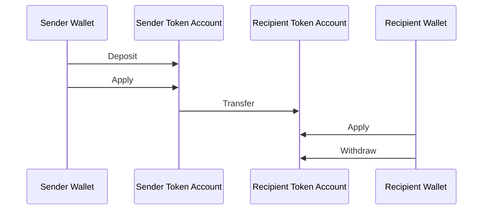
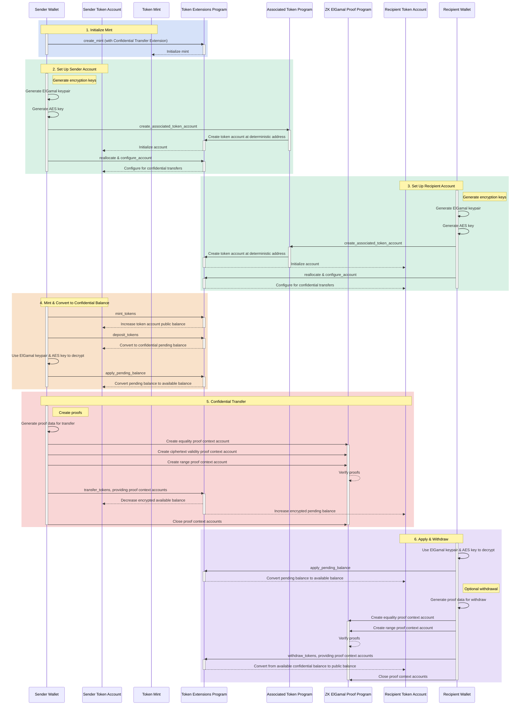

## Chuyển Khoản Bảo Mật là gì?

<Embed url="https://youtu.be/Bqs95tFcRIU" />

Chuyển khoản bảo mật cho phép bạn chuyển token giữa các token account mà không
tiết lộ số lượng giao dịch. Tính năng này hữu ích cho các giao dịch bảo vệ quyền
riêng tư. Chỉ có số lượng chuyển khoản và số dư token là được giữ bí mật. Địa
chỉ của các token account vẫn được công khai.

- [Tổng quan về Giao thức](https://www.solana-program.com/docs/confidential-balances/overview) -
  Chi tiết về giao thức mật mã cơ bản
- [Hướng dẫn Bắt đầu Nhanh](https://www.solana-program.com/docs/confidential-balances#setup) -
  Thiết lập và các lệnh CLI cơ bản
- [Confidential Balances Cookbook](https://github.com/solana-developers/Confidential-Balances-Sample) -
  Các đoạn mã hướng dẫn cách sử dụng tiện ích mở rộng Confidential Transfer

### Cơ chế hoạt động như thế nào?

Tiện ích mở rộng Confidential Transfer bổ sung
[các lệnh](https://github.com/solana-program/token-2022/blob/efd0c957fefbd79882d77df5fb2dac88c001249c/program/src/extension/confidential_transfer/instruction.rs#L29)
vào Token Extensions Program cho phép bạn chuyển token giữa các tài khoản mà
không tiết lộ số lượng giao dịch.

Quy trình cơ bản của chuyển khoản token bảo mật như sau:

1. Tạo một mint account với tiện ích mở rộng chuyển khoản bảo mật.
2. Tạo các token account có tiện ích mở rộng chuyển khoản bảo mật cho người gửi
   và người nhận.
3. Đúc token vào tài khoản người gửi.
4. **Nạp** số dư công khai của người gửi vào **số dư chờ xử lý bảo mật**.
5. **Áp dụng** số dư chờ xử lý của người gửi vào **số dư khả dụng bảo mật**.
6. **Chuyển** token một cách bảo mật từ token account của người gửi sang token
   account của người nhận.
7. **Áp dụng** số dư chờ xử lý của người nhận vào **số dư khả dụng bảo mật**.
8. **Rút** số dư khả dụng bảo mật của người nhận về **số dư công khai**.

Để biết thêm chi tiết về các bước trong quy trình chuyển khoản bảo mật, hãy xem
các trang tương ứng:

<Cards>
  <Card
    title="Tạo Mint Account"
    href="/docs/tokens/extensions/confidential-transfer/create-mint"
  >
    Cách tạo một mint account với tiện ích mở rộng Confidential Transfer
  </Card>
  <Card
    title="Tạo Token Account"
    href="/docs/tokens/extensions/confidential-transfer/create-token-account"
  >
    Cách cấu hình một token account với tiện ích mở rộng Confidential Transfer
  </Card>
  <Card
    title="Nạp Token"
    href="/docs/tokens/extensions/confidential-transfer/deposit-tokens"
  >
    Cách nạp token vào số dư chờ xử lý bảo mật
  </Card>
  <Card
    title="Áp dụng Số dư Chờ xử lý"
    href="/docs/tokens/extensions/confidential-transfer/apply-pending-balance"
  >
    Cách áp dụng số dư chờ xử lý vào số dư khả dụng bảo mật
  </Card>
  <Card
    title="Rút Token"
    href="/docs/tokens/extensions/confidential-transfer/withdraw-tokens"
  >
    Cách rút token từ số dư khả dụng bảo mật
  </Card>
  <Card
    title="Chuyển Token"
    href="/docs/tokens/extensions/confidential-transfer/transfer-tokens"
  >
    Cách chuyển token một cách bảo mật giữa các token account
  </Card>
  <Card
    title="Hướng dẫn Tích hợp"
    href="/docs/tokens/extensions/confidential-transfer/integration-guide"
  >
    Cách các ví, trình khám phá và sàn giao dịch có thể hỗ trợ token chuyển
    khoản bảo mật
  </Card>
  <Card
    title="Hướng dẫn cho Nhà phát hành"
    href="/docs/tokens/extensions/confidential-transfer/issuer-guide"
  >
    Cách phát hành và vận hành token chuyển khoản bảo mật (chính sách phê duyệt,
    kiểm toán viên, phí, đúc và đốt token)
  </Card>
</Cards>

Sơ đồ dưới đây hiển thị trình tự chi tiết của luồng cơ bản cho việc chuyển token
bảo mật:

## Hướng dẫn Chuyển Token Bảo Mật

Danh sách đầy đủ các
[hướng dẫn](https://github.com/solana-program/token-2022/blob/efd0c957fefbd79882d77df5fb2dac88c001249c/program/src/extension/confidential_transfer/instruction.rs#L29)
của tiện ích mở rộng Confidential Transfer như sau:

| Hướng dẫn                           | Mô tả                                                                                                                                                                           |
| ----------------------------------- | ------------------------------------------------------------------------------------------------------------------------------------------------------------------------------- |
| _rs`InitializeMint`_                | Thiết lập mint account cho các giao dịch chuyển token bảo mật. Hướng dẫn này phải được đưa vào cùng một giao dịch với hướng dẫn _rs`TokenInstruction::InitializeMint`_.         |
| _rs`UpdateMint`_                    | Cập nhật cài đặt chuyển token bảo mật cho một mint.                                                                                                                             |
| _rs`ConfigureAccount`_              | Thiết lập một token account cho các giao dịch chuyển token bảo mật.                                                                                                             |
| _rs`ApproveAccount`_                | Phê duyệt một token account cho các giao dịch chuyển token bảo mật nếu mint yêu cầu phê duyệt cho các token account mới.                                                        |
| _rs`EmptyAccount`_                  | Xóa số dư bảo mật đang chờ xử lý và khả dụng để cho phép đóng một token account.                                                                                                |
| _rs`Deposit`_                       | Chuyển đổi số dư token công khai thành số dư bảo mật đang chờ xử lý.                                                                                                            |
| _rs`Withdraw`_                      | Chuyển đổi số dư bảo mật khả dụng trở lại thành số dư công khai.                                                                                                                |
| _rs`Transfer`_                      | Chuyển token giữa các token account một cách bảo mật.                                                                                                                           |
| _rs`ApplyPendingBalance`_           | Chuyển đổi số dư đang chờ xử lý thành số dư khả dụng sau khi nạp tiền hoặc chuyển khoản.                                                                                        |
| _rs`EnableConfidentialCredits`_     | Cho phép một token account nhận các giao dịch chuyển token bảo mật.                                                                                                             |
| _rs`DisableConfidentialCredits`_    | Chặn các giao dịch chuyển token bảo mật đến trong khi vẫn cho phép các giao dịch công khai.                                                                                     |
| _rs`EnableNonConfidentialCredits`_  | Cho phép một token account nhận các giao dịch chuyển token công khai.                                                                                                           |
| _rs`DisableNonConfidentialCredits`_ | Chặn các giao dịch chuyển thông thường để tài khoản chỉ nhận các giao dịch chuyển token bảo mật.                                                                                |
| _rs`TransferWithFee`_               | Chuyển token giữa các token account một cách bảo mật kèm theo phí.                                                                                                              |
| _rs`ConfigureAccountWithRegistry`_  | Cách thay thế để cấu hình token account cho các giao dịch chuyển token bảo mật bằng cách sử dụng tài khoản _rs`ElGamalRegistry`_ thay vì bằng chứng _rs`VerifyPubkeyValidity`_. |
