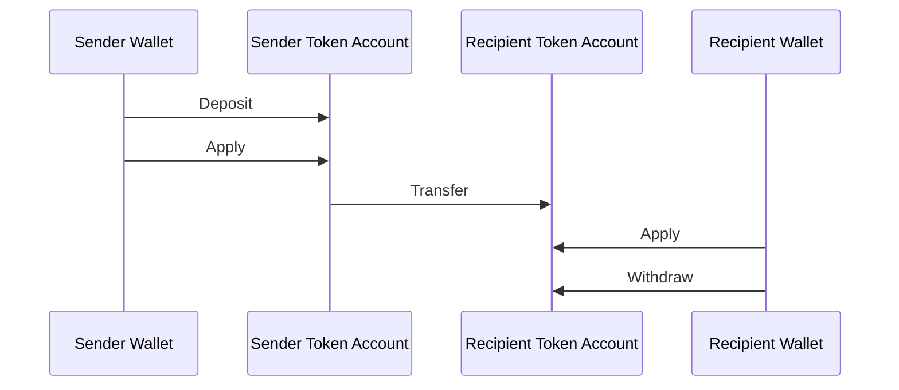
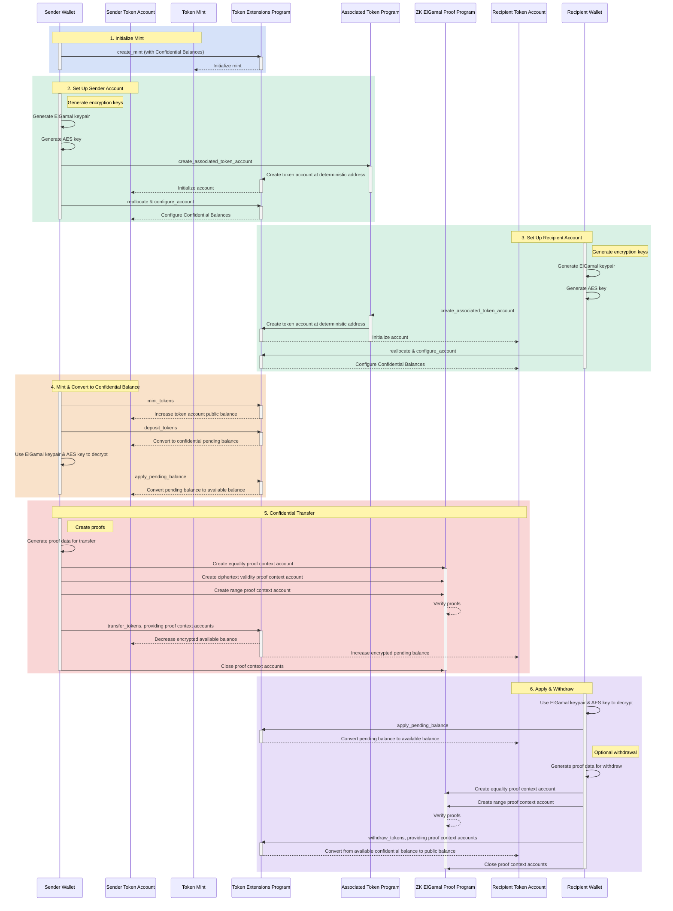

## Số Dư Bảo Mật là gì?

<Embed url="https://youtu.be/Bqs95tFcRIU" />

Số Dư Bảo Mật là một Token-2022 extension cho phép bạn chuyển token giữa các token account mà không tiết lộ số tiền giao dịch. Điều này hữu ích cho các giao dịch bảo toàn quyền riêng tư. Chỉ có số tiền chuyển khoản và số dư token là riêng tư. Địa chỉ token account vẫn công khai.

- [Tổng quan về Giao thức](https://www.solana-program.com/docs/confidential-balances/overview) -
  Chi tiết về giao thức mật mã cơ bản
- [Hướng dẫn Bắt đầu Nhanh](https://www.solana-program.com/docs/confidential-balances#setup) -
  Thiết lập và các lệnh CLI cơ bản
- [Confidential Balances Cookbook](https://github.com/solana-developers/Confidential-Balances-Sample) -
  Các đoạn mã minh họa cách sử dụng Số Dư Bảo Mật

### Cơ chế hoạt động như thế nào?

Extension Số Dư Bảo Mật bổ sung
[các lệnh](https://github.com/solana-program/token-2022/blob/efd0c957fefbd79882d77df5fb2dac88c001249c/program/src/extension/confidential_transfer/instruction.rs#L29)
vào Token Extension program cho phép bạn chuyển token giữa các tài khoản mà không tiết lộ số tiền giao dịch.

```mermaid title="Confidential Balances Basic Overview"
    sequenceDiagram

    participant A as Sender Wallet
    participant AA as Sender Token Account
    participant BB as Recipient Token Account
    participant B as Recipient Wallet

    A->>AA: Deposit
    A->>AA: Apply

    AA->>BB: Transfer
    B->>BB: Apply

    B->>BB: Withdraw

```

Quy trình cơ bản của chuyển khoản token bảo mật như sau:

1. Tạo một mint account với Số Dư Bảo Mật được bật.
2. Tạo các token account với Số Dư Bảo Mật được bật cho người gửi và người nhận.
3. Đúc token vào tài khoản người gửi.
4. **Nạp** số dư công khai của người gửi vào **số dư chờ xử lý bảo mật**.
5. **Áp dụng** số dư chờ xử lý của người gửi vào **số dư khả dụng bảo mật**.
6. **Chuyển** token một cách bảo mật từ token account của người gửi sang token
   account của người nhận.
7. **Áp dụng** số dư chờ xử lý của người nhận vào **số dư khả dụng bảo mật**.
8. **Rút** số dư khả dụng bảo mật của người nhận về **số dư công khai**.

### Khóa kiểm toán viên

Một mint account Số Dư Bảo Mật có thể lưu trữ một khóa công khai ElGamal kiểm toán viên toàn cục tùy chọn. Khi được cấu hình, mỗi lần chuyển khoản bảo mật đều bao gồm số tiền được mã hóa cho người gửi, người nhận và kiểm toán viên. Bằng chứng chuyển khoản xác minh rằng cả ba bản mã đều chứa cùng một số tiền. Công chúng vẫn không thể đọc được số tiền, nhưng người nắm giữ khóa bí mật kiểm toán viên có thể giải mã số tiền chuyển khoản cho mint đó.

Quyền Số Dư Bảo Mật đặt khóa kiểm toán viên khi khởi tạo extension hoặc thay đổi sau đó bằng _rs`UpdateMint`_. Quyền này có thể xoay vòng hoặc xóa khóa. Việc xoay vòng chỉ áp dụng cho các lần chuyển khoản trong tương lai, vì vậy hãy giữ lại các khóa bí mật cũ khi cần truy cập kiểm toán lịch sử. Khóa kiểm toán viên cung cấp quyền đọc; chúng không cấp quyền chuyển token hoặc tiết lộ số dư bảo mật đầy đủ của một tài khoản.

Để biết các ví dụ về thiết lập và xoay vòng, hãy xem
[Cấu hình kiểm toán viên](/docs/tokens/extensions/confidential-transfer/issuer-guide#configure-an-auditor).
Ví tiền, explorer, sàn giao dịch và các nhà cung cấp tuân thủ cũng nên xem xét
[hướng dẫn tích hợp kiểm toán viên](/docs/tokens/extensions/confidential-transfer/integration-guide#auditors-and-compliance).

Để biết thêm chi tiết về các bước trong quy trình chuyển khoản bảo mật, hãy xem
các trang tương ứng:

<Cards>
  <Card
    title="Tạo Mint Account"
    href="/docs/tokens/extensions/confidential-transfer/create-mint"
  >
    Cách tạo một mint account với Số Dư Bảo Mật được bật
  </Card>
  <Card
    title="Tạo Token Account"
    href="/docs/tokens/extensions/confidential-transfer/create-token-account"
  >
    Cách cấu hình một token account với Số Dư Bảo Mật được bật
  </Card>
  <Card
    title="Nạp Token"
    href="/docs/tokens/extensions/confidential-transfer/deposit-tokens"
  >
    Cách nạp token vào số dư chờ xử lý bảo mật
  </Card>
  <Card
    title="Áp dụng Số dư Chờ xử lý"
    href="/docs/tokens/extensions/confidential-transfer/apply-pending-balance"
  >
    Cách áp dụng số dư chờ xử lý vào số dư khả dụng bảo mật
  </Card>
  <Card
    title="Rút Token"
    href="/docs/tokens/extensions/confidential-transfer/withdraw-tokens"
  >
    Cách rút token từ số dư khả dụng bảo mật
  </Card>
  <Card
    title="Chuyển Token"
    href="/docs/tokens/extensions/confidential-transfer/transfer-tokens"
  >
    Cách chuyển token một cách bảo mật giữa các token account
  </Card>
  <Card
    title="Hướng dẫn Tích hợp"
    href="/docs/tokens/extensions/confidential-transfer/integration-guide"
  >
    Cách các ví tiền, explorer và sàn giao dịch có thể hỗ trợ token Số Dư Bảo Mật
  </Card>
  <Card
    title="Hướng dẫn cho Nhà phát hành"
    href="/docs/tokens/extensions/confidential-transfer/issuer-guide"
  >
    Cách phát hành và vận hành một token Số Dư Bảo Mật (chính sách phê duyệt, kiểm toán viên, phí, mint và burn)
  </Card>
</Cards>

Sơ đồ dưới đây hiển thị trình tự chi tiết của luồng cơ bản cho việc chuyển token
bảo mật:

```mermaid title="Confidential Balances Detailed Overview"
sequenceDiagram
    participant Sender as Sender Wallet
    participant SenderAccount as Sender Token Account
    participant Mint as Token Mint
    participant Token22 as Token Extensions Program
    participant ATAProgram as Associated Token Program
    participant ElGamal as ZK ElGamal Proof Program
    participant RecipientAccount as Recipient Token Account
    participant Recipient as Recipient Wallet

    rect rgba(120, 160, 235, 0.3)
    Note over Sender,Mint: 1. Initialize Mint

    activate Sender
    Sender->>Token22: create_mint (with Confidential Balances)
    activate Token22
    Token22-->>Mint: Initialize mint
    deactivate Token22
    deactivate Sender
    end

    rect rgba(130, 210, 170, 0.3)
    Note over Sender,SenderAccount: 2. Set Up Sender Account

    activate Sender
    Note right of Sender: Generate encryption keys
    Sender->>Sender: Generate ElGamal keypair
    Sender->>Sender: Generate AES key

    Sender->>ATAProgram: create_associated_token_account
    activate ATAProgram
    ATAProgram->>Token22: Create token account at deterministic address
    activate Token22
    Token22-->>SenderAccount: Initialize account
    deactivate Token22
    deactivate ATAProgram

    Sender->>Token22: reallocate & configure_account
    activate Token22
    Token22-->>SenderAccount: Configure Confidential Balances
    deactivate Token22
    deactivate Sender
    end

    rect rgba(130, 210, 170, 0.3)
    Note over Recipient,RecipientAccount: 3. Set Up Recipient Account

    activate Recipient
    Note right of Recipient: Generate encryption keys
    Recipient->>Recipient: Generate ElGamal keypair
    Recipient->>Recipient: Generate AES key

    Recipient->>ATAProgram: create_associated_token_account
    activate ATAProgram
    ATAProgram->>Token22: Create token account at deterministic address
    activate Token22
    Token22-->>RecipientAccount: Initialize account
    deactivate Token22
    deactivate ATAProgram

    Recipient->>Token22: reallocate & configure_account
    activate Token22
    Token22-->>RecipientAccount: Configure Confidential Balances
    deactivate Token22
    deactivate Recipient
    end

    rect rgba(235, 160, 80, 0.3)
    Note over Sender,SenderAccount: 4. Mint & Convert to Confidential Balance

    activate Sender
    Sender->>Token22: mint_tokens
    activate Token22
    Token22-->>SenderAccount: Increase token account public balance
    deactivate Token22

    Sender->>Token22: deposit_tokens
    activate Token22
    Token22-->>SenderAccount: Convert to confidential pending balance
    deactivate Token22

    Sender->>Sender: Use ElGamal keypair & AES key to decrypt
    Sender->>Token22: apply_pending_balance
    activate Token22
    Token22-->>SenderAccount: Convert pending balance to available balance
    deactivate Token22
    deactivate Sender
    end

    rect rgba(235, 120, 120, 0.3)
    Note over Sender,RecipientAccount: 5. Confidential Transfer

    activate Sender
    Note right of Sender: Create proofs
    Sender->>Sender: Generate proof data for transfer

    Sender->>ElGamal: Create equality proof context account
    activate ElGamal
    Sender->>ElGamal: Create ciphertext validity proof context account
    Sender->>ElGamal: Create range proof context account
    ElGamal-->>ElGamal: Verify proofs

    Sender->>Token22: transfer_tokens, providing proof context accounts
    activate Token22
    Token22-->>SenderAccount: Decrease encrypted available balance
    Token22-->>RecipientAccount: Increase encrypted pending balance
    deactivate Token22

    Sender->>ElGamal: Close proof context accounts
    deactivate ElGamal
    deactivate Sender
    end

    rect rgba(180, 150, 235, 0.3)
    Note over Recipient,RecipientAccount: 6. Apply & Withdraw

    activate Recipient
    Recipient->>Recipient: Use ElGamal keypair & AES key to decrypt
    Recipient->>Token22: apply_pending_balance
    activate Token22
    Token22-->>RecipientAccount: Convert pending balance to available balance
    deactivate Token22

    Note right of Recipient: Optional withdrawal
    Recipient->>Recipient: Generate proof data for withdraw

    Recipient->>ElGamal: Create equality proof context account
    activate ElGamal
    Recipient->>ElGamal: Create range proof context account
    ElGamal-->>ElGamal: Verify proofs

    Recipient->>Token22: withdraw_tokens, providing proof context accounts
    activate Token22
    Token22-->>RecipientAccount: Convert from available confidential balance to public balance
    deactivate Token22

    Recipient->>ElGamal: Close proof context accounts
    deactivate ElGamal
    deactivate Recipient
    end
```

## Các Lệnh Số Dư Bảo Mật

Danh sách đầy đủ các
[lệnh](https://github.com/solana-program/token-2022/blob/efd0c957fefbd79882d77df5fb2dac88c001249c/program/src/extension/confidential_transfer/instruction.rs#L29)
của extension Số Dư Bảo Mật như sau:

| Hướng dẫn                         | Mô tả                                                                                                                                                       |
| ----------------------------------- | ----------------------------------------------------------------------------------------------------------------------------------------------------------------- |
| _rs`InitializeMint`_                | Bật Số Dư Bảo Mật trên một mint account. Lệnh này phải được bao gồm trong cùng một giao dịch với lệnh _rs`TokenInstruction::InitializeMint`_. |
| _rs`UpdateMint`_                    | Cập nhật chính sách phê duyệt tài khoản của mint và khóa công khai ElGamal kiểm toán viên toàn cục tùy chọn.                                                                        |
| _rs`ConfigureAccount`_              | Bật Số Dư Bảo Mật trên một token account.                                                                                                                 |
| _rs`ApproveAccount`_                | Phê duyệt một token account cho Số Dư Bảo Mật nếu mint yêu cầu phê duyệt cho các token account mới.                                                          |
| _rs`EmptyAccount`_                  | Xóa số dư bảo mật đang chờ xử lý và khả dụng để cho phép đóng một token account.                                                                         |
| _rs`Deposit`_                       | Chuyển đổi số dư token công khai thành số dư bảo mật đang chờ xử lý.                                                                                                  |
| _rs`Withdraw`_                      | Chuyển đổi số dư bảo mật khả dụng trở lại thành số dư công khai.                                                                                                   |
| _rs`Transfer`_                      | Chuyển token giữa các token account một cách bảo mật.                                                                                                           |
| _rs`ApplyPendingBalance`_           | Chuyển đổi số dư đang chờ xử lý thành số dư khả dụng sau khi nạp tiền hoặc chuyển khoản.                                                                                      |
| _rs`EnableConfidentialCredits`_     | Cho phép một token account nhận các giao dịch chuyển token bảo mật.                                                                                                   |
| _rs`DisableConfidentialCredits`_    | Chặn các giao dịch chuyển token bảo mật đến trong khi vẫn cho phép các giao dịch công khai.                                                                                     |
| _rs`EnableNonConfidentialCredits`_  | Cho phép một token account nhận các giao dịch chuyển token công khai.                                                                                                         |
| _rs`DisableNonConfidentialCredits`_ | Chặn các giao dịch chuyển thông thường để tài khoản chỉ nhận các giao dịch chuyển token bảo mật.                                                                                     |
| _rs`TransferWithFee`_               | Chuyển token giữa các token account một cách bảo mật kèm theo phí.                                                                                                |
| _rs`ConfigureAccountWithRegistry`_  | Cách thay thế để cấu hình token account cho Số Dư Bảo Mật sử dụng tài khoản _rs`ElGamalRegistry`_ thay vì bằng chứng _rs`VerifyPubkeyValidity`_.         |
